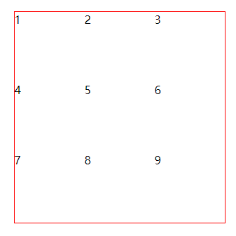

# grid

>网格布局（Grid）是最强大的 CSS 布局方案。Flex 布局是轴线布局，只能指定"项目"针对轴线的位置，可以看作是**一维布局**。Grid 布局则是将容器划分成"行"和"列"，产生单元格，然后指定"项目所在"的单元格，可以看作是**二维布局**。Grid 布局远比 Flex 布局强大
>
>参考资料：https://www.ruanyifeng.com/blog/2019/03/grid-layout-tutorial.html

## 基本概念

### 容器和项目

当一个容器被设置为 display: grid 的属性后，它的子元素就会自动成为项目（tip: 不包含除子元素的后代元素）

```html
<div class="grid">
	<div class="item"><p>1</p></div>
	<div class="item"><p>2</p></div>
	<div class="item"><p>2</p></div>
</div>
```

比如上述代码中，`<div class="grid">` 就是容器，`<div class="item">` 就是项目，但是 `<p>` 不是项目，因为它是
`<div class="item">` 的后代元素

### 行和列

行和列是网格布局中两个重要的概念，在容器中，行（row）是垂直方向，列（column）是水平方向，如图：


### 单元格

单元格是行和列的交叉区域，就是单元格（cell）。一般来说单元格等于 n 行和 m 列的乘积

### 网格线

划分网格的线，称为网格线（grid line）。水平网格线划分出行，垂直网格线划分出列。一般来说，n 行有 n + 1 根水平网格线，m 列
有 m + 1 根垂直网格线，比如三行就有四根水平网格线

## 容器属性

> Grid 布局的属性分成两类。一类定义在容器上面，称为容器属性；另一类定义在项目上面，称为项目属性。这部分先介绍容器属性。

### display

`display: grid` 设置一个容器为网格布局

```css
div {
	display: grid;
}
```

默认情况下，容器元素都是块级元素，但也可以设为行内元素

```css
div {
	display: inline-grid;
}
```

而这两种都有什么区别呢，我们可以采用一个例子来说明，html 结构如下

```html
<span>first</span>
<div class="grid-box">
  <div class="item item1" style="--c:#1abc9c">1</div>
  <div class="item item2" style="--c:#3498db">2</div>
  <div class="item item3" style="--c:#ff7f50">3</div>
  <div class="item item4" style="--c:#e84393">4</div>
  <div class="item item5" style="--c:#badc58">5</div>
  <div class="item item6" style="--c:#4a69bd">6</div>
  <div class="item item7" style="--c:#546de5">7</div>
  <div class="item item8" style="--c:#38ada9">8</div>
  <div class="item item9" style="--c:#1e90ff">9</div>
</div>
<span>last</span>
```

设置 grid 值时，效果如图：


设置 inline-grid 值时，效果如图：


### grid-template-columns 和 grid-template-rows

容器指定了网格布局以后，接着就要划分行和列，`grid-template-columns` 属性定义每一列的列宽，`grid-template-rows` 属性定义
每一行的行高

比如我们要实现一个 3 行 3 列的网格布局，html 如下：

```html
<div class="grid-box">
  <div class="item item1" style="--c:#1abc9c">1</div>
  <div class="item item2" style="--c:#3498db">2</div>
  <div class="item item3" style="--c:#ff7f50">3</div>
  <div class="item item4" style="--c:#e84393">4</div>
  <div class="item item5" style="--c:#badc58">5</div>
  <div class="item item6" style="--c:#4a69bd">6</div>
  <div class="item item7" style="--c:#546de5">7</div>
  <div class="item item8" style="--c:#38ada9">8</div>
  <div class="item item9" style="--c:#1e90ff">9</div>
</div>
```

css 如下：

~~~css
.grid-box {
	display: grid;
	grid-template-columns: 50px 50px 50px;
	grid-template-rows: 50px 50px 50px;
}
~~~

此代码指定 3 行 3 列的网格布局，且列宽和行高都是 50px，效果如图：


当然也可以使用相对单位，css如下：

~~~css
.grid-box {
	display: grid;
	width: 300px;
	height: 300px;
	grid-template-columns: 33.33% 33.33% 33.33%;
	grid-template-rows: 33.33% 33.33% 33.33%;
}
~~~

效果如图：


#### repeat()

有时候，重复写同样的值非常麻烦，尤其网格很多时。这时，可以使用`repeat()`函数，简化重复的值。上面的代码用`repeat()`改写如下:

~~~css
.grid-box {
	display: grid;
	width: 300px;
	height: 300px;
	grid-template-columns: repeat(3, 33.33%);
	grid-template-rows: repeat(3, 33.33%);
}
~~~

`repeat()`接受两个参数：

- 参数一：重复的次数
- 参数二：重复的值

`repeat()` 也可以是重复某种模式，比如：

~~~css
.grid-box {
	display: grid;
	grid-template-columns: repeat(2, 100px 20px 50px);
	grid-template-rows: repeat(3, 100px);
}
~~~

`grid-template-columns: repeat(2, 100px 20px 50px)` 这样表示定义了 6 列，第一列和第四列的宽度为 100px，而第二列和第五列的宽度为 20px，第三列和第六列的宽度为 50px，效果如图：


#### auto-fill 关键字

有时，单元格的大小是固定的，但是容器的大小不确定。如果希望每一行（或每一列）容纳尽可能多的单元格，这时可以使用`auto-fill`关键字表示自动填充。

代码如下：

~~~css
.grid-box {
	display: grid;
	border: 1px solid #000;
	width: 400px;
	height: 120px;
	grid-template-columns: repeat(auto-fill, 100px);
}
~~~

效果如图：


除了`auto-fill`，还有一个关键字`auto-fit`，两者的行为基本是相同的。只有当容器足够宽，可以在一行容纳所有单元格，并且单元格宽度不固定的时候，才会有[行为差异](https://css-tricks.com/auto-sizing-columns-css-grid-auto-fill-vs-auto-fit/)：`auto-fill`会用空格子填满剩余宽度，`auto-fit`则会尽量扩大单元格的宽度。

css 代码如下：

~~~css
.grid-box {
	display: grid;
	border: 1px solid #000;
	width: 1000px;
	height: 120px;
	grid-template-columns: repeat(auto-fill, minmax(100px, 1fr));
}

.grid-box2 {
	display: grid;
	border: 1px solid #000;
	width: 1000px;
	height: 120px;
	grid-template-columns: repeat(auto-fit, minmax(100px, 1fr));
}
~~~

效果如图：


#### fr 关键字

为了方便表示比例关系，网格布局提供了`fr`关键字（fraction 的缩写，意为"片段"）。如果两列的宽度分别为`1fr`和`2fr`，就表示后者是前者的两倍

比如我们希望每列的宽度均分容器时，但是如果设置绝对值就会比较死板，就可以使用 fr 关键字，css 代码如下：

~~~css
.grid-box {
	display: grid;
	border: 1px solid #000;
	width: 400px;
	height: 300px;
	grid-template-columns: 1fr 1fr 1fr;
}
~~~

效果如图：


我们再看一下下面这个写法，如下：

~~~css
.grid-box {
	display: grid;
	width: 400px;
	height: 300px;
	grid-template-columns: 150px 1fr 2fr;
}
~~~

这就表示 第一列是 150px，剩下的两列按照比例关系来分配剩余的宽度，这里是容器时 400px，那么减去 150px，剩余的宽度为 350px，那么第二列的宽度为 350 的 1/3，剩下的 2/3 就是第三列的宽度

效果如图：


#### minmax()

`minmax()`函数产生一个长度范围，表示长度就在这个范围之中。它接受两个参数，分别为最小值和最大值

代码对比如下：

~~~css
.grid-box {
	display: grid;
	border: 2px solid red;
	width: 600px;
	height: 300px;
	grid-template-columns: repeat(3, minmax(100px, 1fr));
}

.grid-box2 {
	display: grid;
	border: 2px solid red;
	width: 250px;
	height: 300px;
	grid-template-columns: repeat(3, minmax(100px, 1fr));
}
~~~


效果对比如图：


#### auto 关键字

`auto`关键字表示由浏览器自己决定长度，css 代码如下：

~~~css
.grid-box {
	display: grid;
	width: 400px;
	height: 100px;
	grid-template-columns: 100px auto 100px;
}
~~~

效果如图：


#### 网格线的名称

`grid-template-columns`属性和`grid-template-rows`属性里面，还可以使用方括号，指定每一根网格线的名字，方便以后的引用。

~~~css
.grid-box {
	display: grid;
	grid-template-columns: [c1] 100px [c2] 100px [c3] 100px [c4];
	grid-template-rows: [r1] 100px [r2] 100px [r3] 100px [r4];
}
~~~

上面代码指定网格布局为3行 x 3列，因此有4根垂直网格线和4根水平网格线。方括号里面依次是这八根线的名字。

网格布局允许同一根线有多个名字，比如`[fifth-line row-5]`，当然，也不是说必须每个网格线取名，可以按需

来看看这样布局的初始效果。如图：


但是如果我们需要这个 9 号格子移动 5 号的位置呢？可以怎么做呢？就可以使用 `grid-column` 和 `grid-row`，来设置，如下：

~~~css
.item9 {
	grid-column: 2 / 3;
	grid-row: 2 / 3;
}
~~~

这些数字就表示第几根网格线，效果如图：


同样，是可以把这些数字换成具体的网格线名称的，如下：

~~~css
.item9 {
	grid-column: c2 / c3;
	grid-row: r2 / r3;
}
~~~

效果也是一样的，如图：


#### 布局实例

`grid-template-columns`属性对于网页布局非常有用。两栏式布局只需要一行代码，如下：

~~~css
.grid-box {
	display: grid;
	width: 600px;
	height: 400px;
	border: 1px solid red;
    /* 设置左右栏宽度 */
	grid-template-columns: 70% 30%;
}
~~~

效果如图：


栅格布局，12 等份，也很容易，代码如下：

~~~css
.grid-box {
	display: grid;
	width: 600px;
	height: 400px;
	border: 1px solid red;
	grid-template-columns: repeat(12, 1fr);
}
~~~

效果如图：


### grid-row-gap、grid-column-gap、grid-gap

`grid-row-gap`属性设置行与行的间隔（行间距），`grid-column-gap`属性设置列与列的间隔（列间距）

代码如下：

~~~css
.grid-box {
	display: grid;
	border: 1px solid red;
	grid-row-gap: 20px;
	grid-column-gap: 20px;
	grid-template-columns: repeat(3, 100px);
	grid-template-rows: repeat(3, 100px);
}
~~~

效果如图：


`grid-gap`属性是`grid-column-gap`和`grid-row-gap`的合并简写形式，语法如下

~~~css
grid-gap: <grid-row-gap> <grid-column-gap>;
~~~

因此，上面一段 CSS 代码等同于下面的代码

~~~css
.grid-box {
	display: grid;
	border: 1px solid red;
	grid-gap: 20px 20px;
	grid-template-columns: repeat(3, 100px);
	grid-template-rows: repeat(3, 100px);
}
~~~

而如果两个值一样，则可以简写为 `grid-gap: 20px`

> 根据最新标准，上面三个属性名的`grid-`前缀已经删除，`grid-column-gap`和`grid-row-gap`写成`column-gap`和`row-gap`，`grid-gap`写成`gap`。

### grid-template-areas

网格布局允许指定"区域"（area），一个区域由单个或多个单元格组成。`grid-template-areas`属性用于定义区域

~~~css
.grid-box {
  display: grid;
  border: 1px solid red;
  grid-template-columns: 100px 100px 100px;
  grid-template-rows: 100px 100px 100px;
  grid-template-areas: 'a b c'
                       'd e f'
                       'g h i';
}
~~~

上面代码先划分出9个单元格，然后将其定名为`a`到`i`的九个区域，分别对应这九个单元格，而这种划分区域有什么用呢？先看看初始效果，如图：



那么划分的区域如何使用，代码如下：

~~~css

~~~

多个单元格合并成一个区域的写法如下：

~~~css
grid-template-areas: 'a a a'
                     'b b b'
                     'c c c';
~~~

上面代码将9个单元格分成`a`、`b`、`c`三个区域

