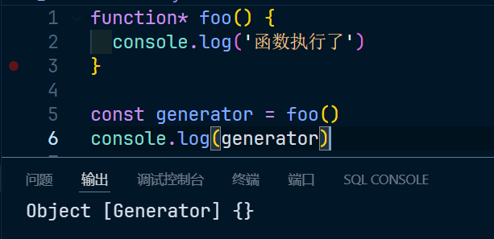
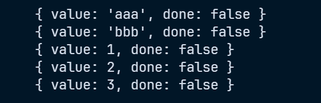

# 生成器 (Generator)

## 什么是生成器

生成器是一个通过构造函数 Generator`(这个构造函数只能js内部去调用，开发者无法使用new调用)` 创建的对象，生成器即是一个迭代器，同时又是一个可迭代对象

## 如何创建生成器

生成器的创建，必须使用生成器函数 (Generator Function)

书写生成器函数语法如下：

~~~js
// 在函数的关键词后面或者名称前面加上一个 * 号
function* foo(){}

function *bar(){}

const obj = {
    *foo(){}
}
~~~

## 生成器函数内部是如何执行的

> 1. 生成器函数内部是为了给生成器的每次迭代提供数据的
> 2. 每次调用生成器的 next 方法，将导致生成器函数运行到下一个 `yield` 关键字位置
> 3. yield 是一个关键字，该关键字只能在生成器函数内部使用，表达“产生”一个迭代数据

看一下第一个例子，如图：



函数内部的语句没有输出，就表示没有执行，这是一个生成器函数，直接调用只是得到一个生成器而已，如果要执行，需要调用 next 方法，如图：


这里没有返回特定的值，默认返回 undefined。而且当执行 return 返回的时候，done 会变为 true

使用 yield 关键字，如图：


## 使用生成器函数、for-of 来简化迭代器

代码如下：

```js
const arr = [1, 2, 3, 4, 5]

function* foo(arr) {
	for (const item of arr) {
		yield item
	}
}

const generator = foo(arr)
console.log(generator.next())
console.log(generator.next())
console.log(generator.next())
console.log(generator.next())
console.log(generator.next())
console.log(generator.next())
```

结果如图：


同理可以简化斐波拉契数列的方法，如下：

~~~js
function* createFeiboInterator() {
	let prev1 = 1,
		prev2 = 1, // 前面两位的值
		n = 1 // 取到了第几位
	while (true) {
		let value
		if (n <= 2) {
			value = 1
		} else {
			value = prev1 + prev2
			prev1 = prev2
			prev2 = value
		}
		n++
		yield value
	}
}

const fb = createFeiboInterator()
console.log(fb.next())
console.log(fb.next())
console.log(fb.next())
console.log(fb.next())
console.log(fb.next())
console.log(fb.next())
console.log(fb.next())
~~~

结果如图：


## 细节补充

1. 生成器函数可以有返回值，返回值出现在第一次done为true时的value属性中

2. 调用生成器的 next 方法时，可以传递参数，传递的参数会交给 yield 表达式的返回值，如图：

   

3. 第一次调用 next 时，传参没有意义

4. 在生成器函数内部，可以调用其他生成器函数，但是要注意加上 * 号

   1. 代码如下：

      ~~~js
      function* bar() {
      	yield 'aaa'
      	yield 'bbb'
      }
      
      function* foo() {
      	// 情况一：直接调用，但是只会生成一个生成器对象，而不会执行 bar
      	// bar()
      
      	// 情况二：使用 yield 关键字，这样返回的就是一个生成器对象
      	// yield bar()
      
      	// 情况三：使用 yiel 关键字，并加上 * 号，表示这个生成器函数也参与当前生成器函数
      	yield* bar()
      	yield 1
      	yield 2
      	yield 3
      }
      
      const generator = foo()
      
      console.log(generator.next())
      console.log(generator.next())
      console.log(generator.next())
      console.log(generator.next())
      console.log(generator.next())
      ~~~

   2. 结果如图：

      

## 生成器的其他 api

### return

> 调用此方法可以提前结束生成器函数，从而提前让整个迭代过程结束


### throw

> 调用此方法可以在生成器中产生一个错误

代码如下：

```js
function* foo() {
	yield 1
	yield 2
	yield 3
}

const generator = foo()

console.log(generator.next())
console.log(generator.throw('aaaaassss'))
console.log(generator.next())
```

结果如图：


