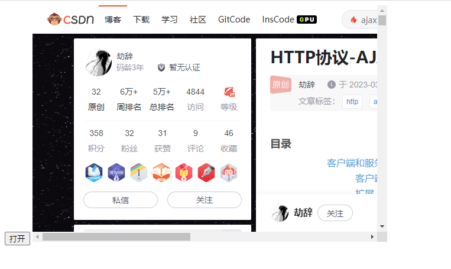
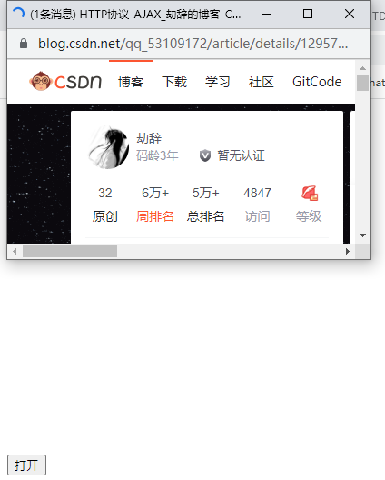
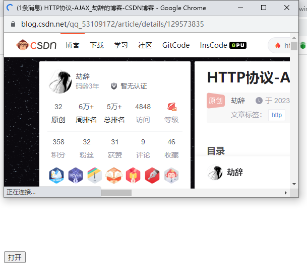
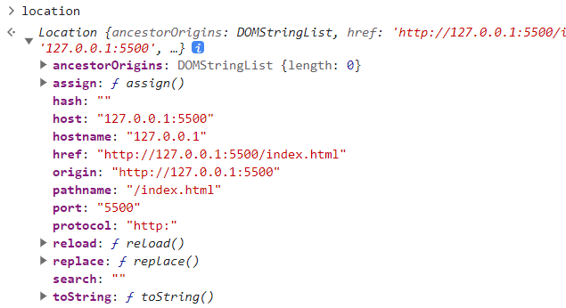

# window 对象

## 自身方法

### open

> 打开一个新窗口
>
> - open(页面路径, 打开目标(类似于 a 元素的 target), 配置)

1. 代码如下：
   ```html
   <body>
     <button class="btn">打开</button>
   
     <script>
       const btn = document.querySelector('.btn')
   
       btn.addEventListener('click', function () {
         window.open('https://www.baidu.com')
       })
     </script>
   </body>
   ```

2. 比如指定 iframe打开，如下：

   ~~~html
   <body>
     <button class="btn">打开</button>
   
   
     <iframe src="" name="jcframe" frameborder="0"></iframe>
     <script>
       const btn = document.querySelector('.btn')
   
       btn.addEventListener('click', function () {
         window.open('https://blog.csdn.net/qq_53109172/article/details/129573835', 'jcframe')
       })
     </script>
   </body>
   ~~~

3. 结果如图：

   

4. 当你需要打开的窗口是弹出来的，而不是新开的标签页时，可以使用第三个参数进行配置，第二个参数留空，如下：

   ~~~js
   btn.addEventListener('click', function () {
         window.open('https://blog.csdn.net/qq_53109172/article/details/129573835', null, "width=400,height=220")
   })
   ~~~

5. 结果如图：

   

6. 当然还有更多配置，可以自行查看 mdn 文档，[window.open](https://developer.mozilla.org/zh-CN/docs/Web/API/Window/open)

7. 这个方法会返回一个 window 对象，通过这个 window 对象的 resizeTo 或者 resizeBy 方法就可以控制窗口的尺寸，代码如下：

   ~~~js
   btn.addEventListener('click', function () {
         const w = window.open('https://blog.csdn.net/qq_53109172/article/details/129573835', null, "width=400,height=220")
         w.resizeTo(600, 400)
   })
   ~~~

8. 结果如图：

   

### alert

> 弹出一个提示弹窗，样式和浏览器有关

1. 代码如下：

   ~~~js
   alert('hello world')
   ~~~

2. 效果自行测试即可

### confirm

> 也是弹出一个弹窗，但是具备返回值，点击确认返回 true 点击取消返回 false

### prmpt

> 提示输入弹窗，可以记录一些用户输入的值，点击确认返回用户输入的值，没有输入返回空字符串，点击取消返回 null

## 对象属性

### location

> 地址栏对象

1. 属性输出如图：

   

2. herf 属性：目前的地址

3. reload 方法：`刷新当前页面-重载`

### navigator

> 记录浏览器的一些信息
>
> 详细属性查看：[navigator](https://developer.mozilla.org/zh-CN/docs/Web/API/Navigator)

### history

> 表示历史记录，只能获取当前网站访问了那些网页，但是权限也很低
>
> 详细属性查看：[History](https://developer.mozilla.org/zh-CN/docs/Web/API/history)

1. go 方法：前进/后退方法，正数就是前进，负数就是后退
2. back 方法：后退方法
3. forword 方法：前进方法

