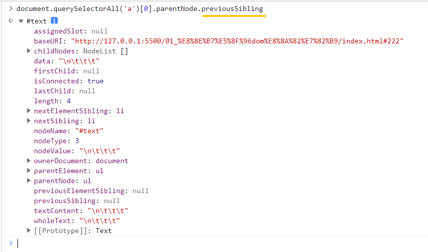

# 获取 dom 节点

获取 dom 对象

> 全局对象 window 中有属性 document，代表的是整个文档节点

## 旧的获取元素节点的方式

1. document.body(获取 body 节点)，如图

   

2. document.head 获取 head 元素

3. document.links 获取页面上所有的超链接元素，如图：

   

4. document.anchors 获取页面上所有锚链接(具有 name 属性)元素节点-早期的锚链接是 name 属性

5. document.forms 获取页面上的表单元素

## 新的获取元素节点的方式

### 通过方法获取

示例代码：

~~~html

id1

id2

class1

class1

class2

name1

	文本

~~~

1. `document.getElementById`：

   1. 通过元素的 id 名称获取
   2. id 唯一所以每次获取一定是单个元素，如图：

   

2. `document.getElementsByTagName`：

   1. 通过元素(标签)的名称获取元素
   2. 获取的是类数组，全部的改标签
   3. 可以通过下标获取对应的单个元素

   

3. `document.getElementsByClassName`：

   1. 通元素的类样式名称获取元素
   2. 获取的也是一个类数组
   3. IE9 以下无效

   

4. `document.getElementsByName`：

   1. 通过元素的 name 属性获取元素

   

5. `document.querySelector`：

   1. 通过 css 选择器获取元素
   2. 获取的是页面符合选择器的第一个元素，是单个元素
   3. IE8 以下无效 

   

6. `document.querySelectorAll`：

   1. 通过 css 选择器获取元素
   2. 获取的是全部符合选择器的元素
   3. IE8 以下无效 

   

7. `document.documentElement`：

   1. 获取 HTML 根元素
   2. dom 1 的标准

   

### 细节

1. 在上述获取元素的方法中，除了 document.querySelectorAll ，其余方法获取元素结果为类数组的获取的结果都是实时的，如图：

   

2. 在上面的获取中，我们删除元素之后并没有重新使用方法获取，只是打印了一下保存结果的变量，可以发现结果时实时更新的

3. document.getElementById 执行效率最高

4. 书写了 id 的元素，会自动成为 window 的属性，而且这个也是实时的单对象，(不推荐使用)如图：

   

5. 因为这种实时性，如果后续给这个属性重新赋值了，就会导致代码的错误

6. 、document.getElementsByClassName、document.querySelector、document.querySelectorAll 这个四个函数可以作为其他元素对象的节点，如图：

   

### 根据节点关系获取节点

代码案例：

~~~html

	
box1-top

	
box1-bottom

	
box2-content

<ul>
	<li>
		<a href="">Lorem.</a>
	</li>
	<li>
		<a href="">Architecto.</a>
	</li>
	<li>
		<a href="http://www.baidu.com" title="百度一下">Architecto!</a>
	</li>
</ul>
~~~

1. parentNode：获取父节点，即父元素节点，现在获取 .box1-top 元素，然后通过 parentNode 获取 .box1-top 元素的父节点 .box。如图：

   

2. 父级的父级是可以链式调用获取的，如图：

   

3. previousSibling：获取同一层级中前一个兄弟节点（即前一个相邻节点），现在获取第一个 a 元素的父元素的文本节点，如图：

   

4. 这种空白和换行符也是属于文本节点，如图：

   

5. 而注释也是属于一个文本节点，只是文本类型不同，所以我们使用注释隔断看一下，如图：

   

6. 所以我们在调用一次节点就可以获取到这个注释的文本节点，如图：

   

7. 而当文本节点没有之后，我们获取的节点是什么，现在我们来获取一下，如图：

   

8. 所以访问的是兄弟节点都完成之后就返回 null，如图：

   

9. nextSibling 访问同一层级中的下一个兄弟节点（即后一个相邻节点），其他与 previousSibling 一致

10. childNodes 获取所有的子节点(包含文本节点和元素节点)

11. firstChild 获取第一个子节点(包含文本节点和元素节点)

12. lastChild 获取最后一个子节点(包含文本节点和元素节点)

13. attributes 获取某个元素的**属性节点**，如图：

    

### 只获取元素节点

> 其实关系和上述的节点关系获取节点一样，只是获取的节点只包含元素节点

1. previousElementSibling 获取兄弟的前一个**元素节点**，如图：

   

2. nextElementSibling 获取兄弟的后一个**元素节点**

3. children 获取所有子元素节点

4. firstElementChild 获取第一个子元素节点

5. lastElementChild 获取最后一个子元素节点

## 获取节点信息

1. nodeName 获取节点名称，元素节点名称都是大写，如图：

   

2. nodeValue 获取节点的值，如图：

   

3. nodeType 获取节点类型，使用数字标识节点类型，如图：

   

4. 具体的节点类型如下：

   | 节点名称         | 对应数据                            |
   | ---------------- | ----------------------------------- |
   | 元素节点         | **Node.ELEMENT_NODE(1)**            |
   | 属性节点         | **Node.ATTRIBUTE_NODE(2)**          |
   | 文本节点         | **Node.TEXT_NODE(3)**               |
   | CDATA节点        | Node.CDATA_SECTION_NODE(4)          |
   | 实体引用名称节点 | Node.ENTRY_REFERENCE_NODE(5)        |
   | 实体名称节点     | Node.ENTITY_NODE(6)                 |
   | 处理指令节点     | Node.PROCESSING_INSTRUCTION_NODE(7) |
   | 注释节点         | Node.COMMENT_NODE(8)                |
   | 文档节点         | **Node.DOCUMENT_NODE(9)**           |
   | 文档类型节点     | Node.DOCUMENT_TYPE_NODE(10)         |
   | 文档片段节点     | Node.DOCUMENT_FRAGMENT_NODE(11)     |
   | DTD声明节点      | Node.NOTATION_NODE(12)              |

5. 

