# dom 元素操作

## 初识元素事件

> 为什么说是初始呢？因为这块的知识比较多，但是本文需要大概知道一些这块的知识，所以这里大概讲一下，后续会又单独的文章讲解这块
>
> 元素事件：顾名思义，即某个元素发生了一件事
>
> 事件处理程序：指发生了一件事之后，应该做什么事件，即一个函数
>
> 注册事件：将事件处理程序和某个元素的事件进行关联

我们看一段示例代码，如下：

~~~html
<button class="btn1">点击</button>

<script>
	const btn1 = document.querySelector('.btn1')
	// onclick 表示点击事件
	btn1.onclick = function () {
		console.log('我被点击了')
	}
</script>
~~~

这段代码的释义为，给 btn1 绑定了一个点击事件(`元素事件`)，当 btn1 这个元素被点击时，就会触发这个事件所绑定的函数(`事件处理程序`)，这样的操作就被称之为`注册事件`

## 获取和设置元素属性

**通用的获取设置属性方式**：getAttribute、setAttribute，例如：

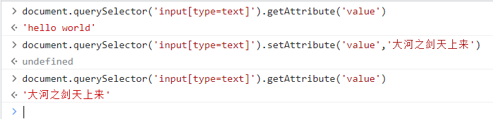

删除属性：removeAttribute

### 可识别属性

> 什么是可识别属性呢？即一个元素的正常的 HTML 属性，如一个 div 元素是没有 value 属性的，一个 input 元素是存在 value 属性的，那么 value 属性对于 div 元素来说就叫自定义属性，对于 input 来说就是可识别属性
>
> ```html
> <div value="test"></div>
> 
> 
> <input type="text" value="hello" />
> ```

**获取可识别属性的值**：只需要通过 dom对象.属性名即可获取，如下：

```html
<input type="text" value="hello world" />
<button class="btn1">获取 input 元素的内容</button>

<script>
    const btn1 = document.querySelector('.btn1')
    const inp = document.querySelector('input')

    btn1.onclick = function () {
      console.log(inp.value) // hello world
	}
</script>
```

**设置可识别属性的值**：给这个属性重新赋值即可，如下：

~~~html
<input type="text" value="hello world" />
<button class="btn1">获取 input 元素的内容</button>
<button class="btn2">设置 input 元素的内容</button>

<script>
    const btn1 = document.querySelector('.btn1')
    const btn2 = document.querySelector('.btn2')
    const inp = document.querySelector('input')

    btn1.onclick = function () {
      console.log(inp.value) // hello world
	}
    
    btn2.onclick = function () {
      inp.value = '大河之剑天上来'
    }
</script>
~~~

结果如图：

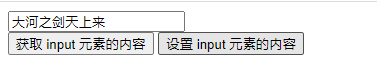

### 自定义属性

> 为什么需要自定义属性呢？因为有的时候本身定义的 HTML 属性可能并不能够满足我们的使用，这时候就可以自定义属性来实现我们的需求，按照规范来说，自定义属性我们一般以 data- 做为前缀，但是这不是必须的，只是一种规范

**获取元素的自定义属性**：getAttribute，代码如下：

~~~html
<div class="div1" value="111"></div>
<div class="div2" test="222"></div>

<script>
    const div1 = document.querySelector('.div1')
    const div2 = document.querySelector('.div2')
</script>
~~~

结果如图：

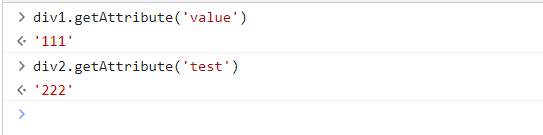

**设置元素的自定义属性**：setAttribute，如图：

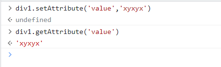

同理我们可以使用这个方法给元素设置一些新的属性和值，如图：

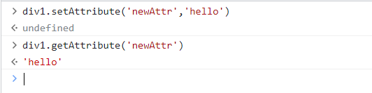

前面讲到，HTML5 规范中，建议自定义属性使用 `data-` 做为前缀，如果是遵循这种规范，我们可以选择更加简便的方法来获取和设置，语法为 `dom对象.dataset.属性名`

通过这个语法可以对自定义属性进行获取和设置，如图：

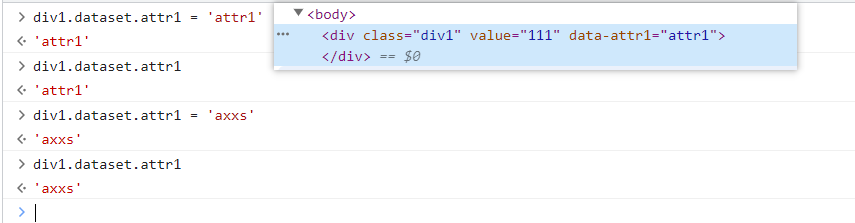

## 获取和设置元素内容

**innerHTML**：获取和设置元素的内部 HTML 文本

**innerText**：获取和设置元素的内部的文本

两者之间的区别其实也比较好分别，我们来看一下示例代码即可分辨，如下：

~~~html
<div class="box">
    <span>hello world</span>
</div>
~~~

结果如图：

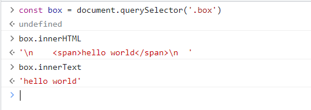

这样对比的结果应该就很明显了，inn二HTML 不仅可以获取文本节点还可以获取元素节点，而 innerText 只会获取文本节点

通过这样的特性我们可以完成一些对于元素的操作，比如给 box 下添加一个 ul 列表，如图：

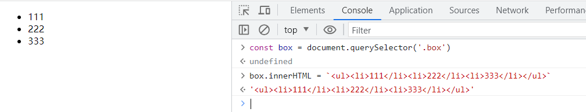

也基于此，我们可以使用 innerHTML 来达到快速清空某一个元素下的所有元素内容，或者直接替换

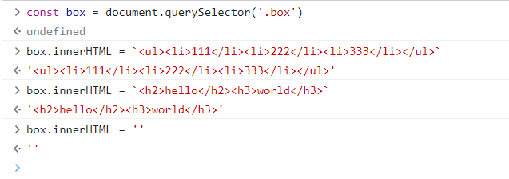

**textContent**：这个不仅会获取文本还会获取换行等所有文本，如图：

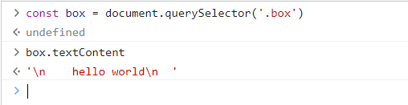

## 元素结构重构

> 比如将一个元素移入到另外一个 div，这种改变原来的元素结构就叫元素结构重构

**appendChild**：【父元素.appendChild】在某一个元素末尾加入一个元素，代码示例：

~~~html
<ul>
    <li>Lorem.</li>
    <li>Cumque.</li>
	<li>Suscipit.</li>
</ul>
~~~

现在我们给这个 ul 元素在加一个 li，如图：

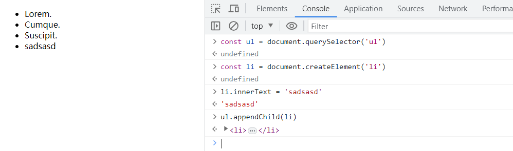


**inserBefore**：【父元素.inserBefore】 接收两个参数，第一个参数待插入的元素，第二个参数表示那个元素之前，如图：

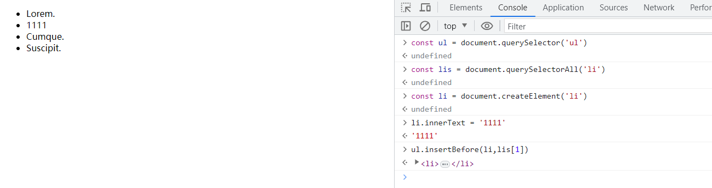

**replaceChild**：【父元素.replaceChild】 接收两个参数，第一个参数替换的元素，被替换的元素，使用方法大致都一样，就不做演示了

## 创建和删除元素

> 创建和删除元素也会导致元素结构重构，会导致浏览器的重新渲染

### 创建元素

**document.createElement("元素名")**：输入元素的名称即可创建，在上面的例子种也有使用的到这种方法

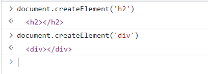

这样创建的元素是存在鱼内存中，并不会对页面进行影响，配合前面的插入元素即可

**document.createTextNode("文本内容")**：创建一个文本节点

**document.createDocumentFragment()**：创建文档片段，一般使用创建多个元素，可以将多个元素放入文本片段，然后再将文本片段加入到页面中，只会触发一次页面的渲染，代码如下：

~~~html
<ul>
    <li>Lorem.</li>
    <li>Cumque.</li>
    <li>Suscipit.</li>
</ul>
<script>
    const ul = document.querySelector('ul')
    const frag = document.createDocumentFragment()
    for (let i = 0; i <= 100; i++) {
      const li = document.createElement('li')
      li.innerText = `我是第${i}个li`
      frag.appendChild(li)
    }
    // 在将片段一次性插入页面
    ul.appendChild(frag)
</script>
~~~

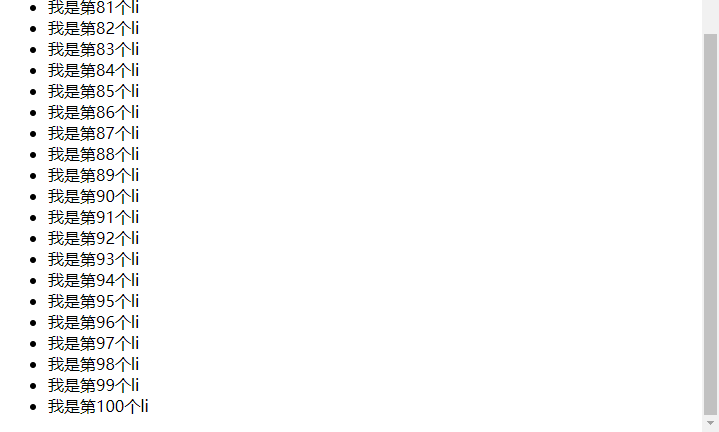

### 克隆元素

**dom对象.cloneNode(是否深度克隆)**：赋值一个新的dom对象并返回
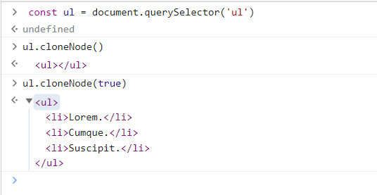

### 删除元素

实例代码：

~~~html
 <ul id="ul1" data-test="111">
    <li>Lorem.</li>
    <li>Cumque.</li>
    <li>Suscipit.</li>
  </ul>
~~~

**removeChild**：删除元素，如图：

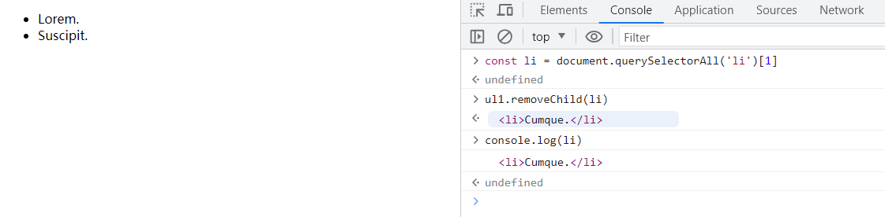

虽然元素在页面上消失了，但是这个元素对象还是存在的，因为还有存在引用，不会被垃圾回收机制回收掉

**remove**：自杀，将自己删除，如图：

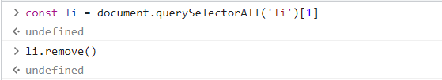
