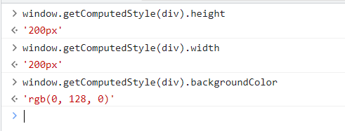

# dom 元素样式

## 控制 dom 元素的类样式

### className

> 这个属性可以获取或者设置元素的类样式 dom.className

1. 重新设置类名，代码如下：

   ```html
   <style>
   	.box {
   		width: 200px;
   		height: 200px;
   		background-color: blue;
   	}

   	.box1 {
   		width: 100px;
   		height: 100px;
   		background-color: red;
   	}
   </style>
   <body>
   	<div class="box"></div>

   	<button>切换类样式</button>
   	<script>
   		const div = document.querySelector('div')
   		const btn = document.querySelector('button')

   		btn.onclick = function () {
   			div.className = 'box1'
   		}
   	</script>
   </body>
   ```

2. 结果如图：

   .gif)

3. 在这里我们是直接把类名进行了替换，如果还需要保留原来的类名可以按照如下的方式设置，如下：

   ```js
   div.className = 'box box1'
   ```

4. 也可以在创建元素的时候绑定类名，如下：

   ```js
   const div = document.querySelector('div')
   div.className = 'box'
   ```

### classList

> dom4 新属性 是一个用于控制元素类名的对象

classList 这个对象提供了一些方法可以让我们控制类名

1. add 添加类名

   

   而且通过 classList 直接添加类名，并不会将原来的类名直接替换掉，而是添加进去，如图：

   

2. remove 移除类名

   

3. contain 判断类名是否存在

   

4. toggle 添加或移除类名

   

5. toggle 可以帮助我们实现一些需要是否添加类名的案例，例如开关灯

6. toggle 还可以加入第二个参数，为 true 表示强制添加，不会移除，而为 false 表示轻质移除而不会添加

   

## 获取样式

### dom.style

> dom.style 获取一个行内样式对象

1. 我们可以将一个盒子设置一些行内样式，如下：

   ~~~html
    <div class="box" style="background-color: green;"></div>
   ~~~

2. 获取如图：

   

3. 注意，在 css 中使用短横线链接的属性，在 js 中需要使用小驼峰，且这个只能获取行内样式

4. 所以如果我们通过这个获取宽度，是无法获得的，除非在行内样式里面定义了宽度

5. 但是在开发中我们一般获取的是最终计算出来的高度或者宽度，所以这种方式就不合适了

6. 我们可以使用 **getComputedStyle** 方法即可获取最终计算后的样式，方法接收一个参数，传入需要获取样式的 dom，如图：

   

7. 而这种最终计算出来的结果是什么意思了，我们来看一下代码，如下：

   ~~~html
   <style>
   	.box {
         width: 200px;
         height: 200px;
         background-color: blue !important;
       }
   </style>
   <body>
        <div class="box" style="background-color: green;"></div>
   </body>
   ~~~

8. 通过上面的代码我们可知背景颜色会是蓝色，看一下分别获取的结果值，如图：

   

9. 计算后的值是绝对值，也就是这些像素值，这种英文名称的颜色单词计算完成就会是这种绝对值，也包括在页面中使用 % vw vh 等单位 最后也会被计算成绝对的像素值，如图：

   

10. 而 getComputedStyle 还可以设置第二个参数，第二个参数可以得到元素的**伪元素**样式，我们给当前的 box 添加一个伪元素样式，如下：

    ~~~js
    .box::before {
          content: '123';
          color: #fff;
          padding: 5px;
          background-color: skyblue;
    }
    ~~~

11. 如图：

    

## 设置样式

设置样式比较简单，只有一种方式 dom.style.样式名 = '值'
