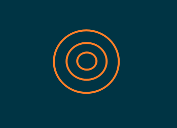
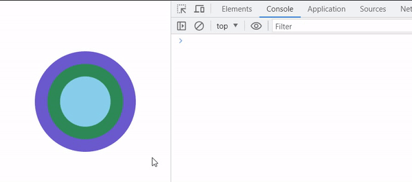
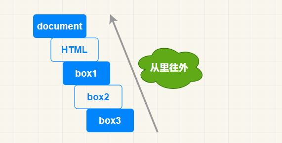
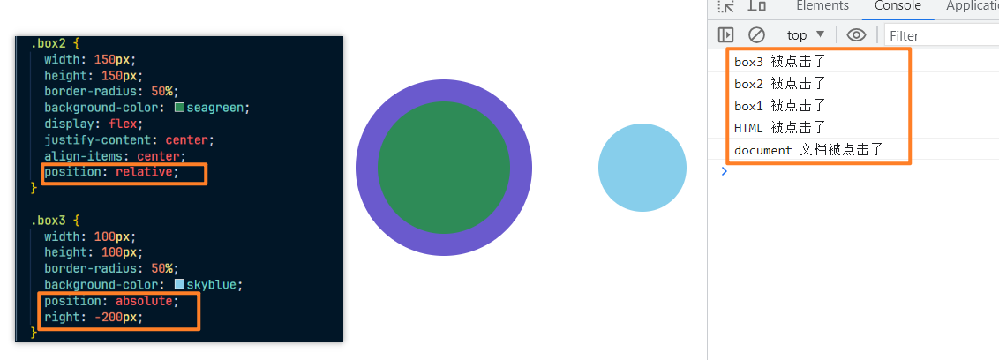
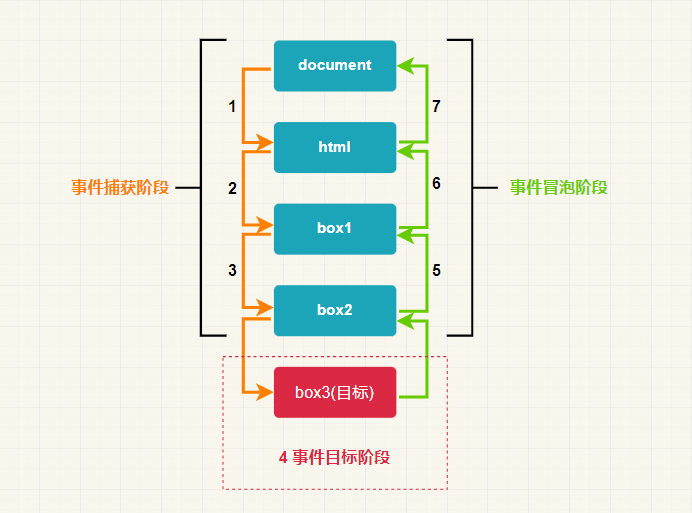

# dom 事件之基础概念

## 名词解析

1. 事件：发生了一件事情

2. 事件类型：发生了事情的类型，这个事情属于什么类型，如：点击、鼠标按下、键盘抬起等等

3. 事件处理程序：即一个函数，当某件事情发生时运行的一个函数

4. 事件注册：将一个事件处理程序，挂载到某个事件上

5. 我们可以看一段代码示例来更加深刻的认识一些这些名词

   ~~~html
   

   
   
   ~~~

## 事件流

### 事件冒泡

> 事件流表示的意思是：当一件事情发生的时候，页面上的元素会发生什么反应，都有那些元素会监听到这个事件发生，这些元素发生这个事件的顺序，就叫做事件流

现在我们可以设想一下，如果页面上存在多个圆圈元素，且都为同心圆，当我们点击最中心的圆圈的时候，那么应该是触发那个的元素呢，如图：

1. 当一个元素发生了某个事件的时候，那该的元素的`所有祖先元素(外层元素)都会发生该事件`，根据这个理论我们可以来写一些代码进行测试，如下：

   ~~~html
   

       

         

       

   

   
   ~~~

2. 结果如图所示：

   

3. 而且可以发现这个执行顺序是从里往外的顺序执行的，如果换成平常示意图，那么发生的顺序就从下往上，如图：

   

4. 那这个层级不改变，但是我们改变他们的定位，改变在页面上显示的样式，我们增加一个子绝父相的样式在测试一下，如下：

   

5. 可以看到，哪怕定位改变页面的显示，也是不会影响层级触发事件的顺序，这个现象也不会被改变

6. 而这种从里往外的触发事件顺序也被称之为`事件冒泡`

### 事件捕获

> 而事件捕获触发顺序则与事件冒泡相反，事件捕获是从外到里依次触发

### 总结

1. 因此事件触发的顺序不以注册的顺序为基准，而是以事件流的顺序

2. 事件冒泡是 ie 所提出的，事件捕获则是由网景公司提出，并没有统一的规定

3. 后续规范退出之后，两种事件流都支持，但是默认情况下，事件是以冒泡的方式触发

4. 这个事件流如何修改我们在后续文章中会提到

5. 事件源即事件目标，总体如图：

   

6. 事件捕获和事件冒泡会涉及多个元素，但是事件源只会存在一个
