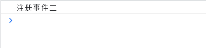
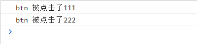
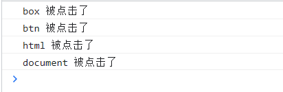
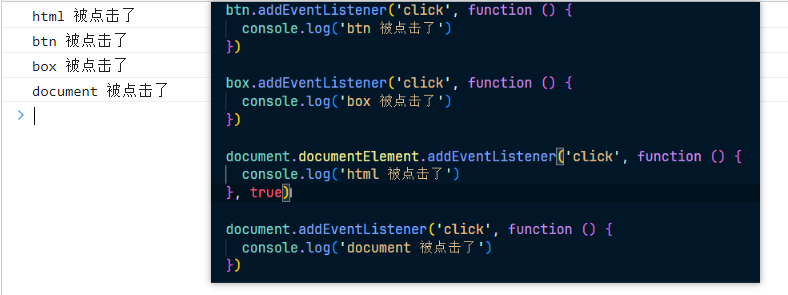
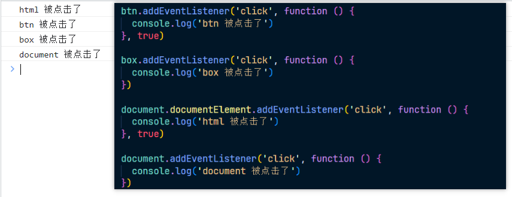
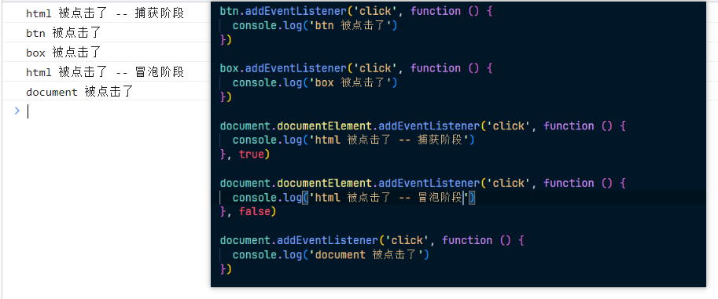
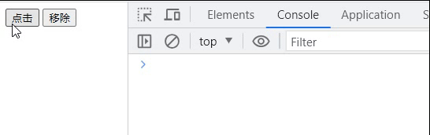

# 事件注册

## dom0 时代

### dom0 注册事件

1. 在 dom0 的时候将事件名称前面加上 on，作为 dom 属性名，给该属性赋值为一个函数
   ，即为事件注册，如下：

   ~~~html
   <button class="btn1">点击1</button>
   
   
   ~~~

2. 当然还可以直接在标签上注册事件，如下：

   ~~~html
   <!-- 也可以直接在标签上使用 -->
   <!-- onclick 双引号内部就可以直接运行 js 代码 -->
   <!-- 这种情况下，默认就是一个函数环境，不用自己额外编写函数 -->
   <button class="btn2" onclick="alert('btn2被点击')">点击二</button>
   ~~~

3. 也可以是一个函数，如下：

   ~~~html
   <button class="btn3" onclick="foo()">调用函数</button>
   
   
   ~~~

4. 但是不是很推荐在 html 元素中直接绑定事件，这样的代码后期难以维护，且容易发生错误

### dom0 移除事件

1. 移除也很简单，将属性重新赋值为 undefined / null 即可，如下：

   ~~~js
   btn1.onclick = null
   ~~~

2. 而这种现象表明，这种注册事件的方式只能注册一次。看一下示例代码，如下：

   ~~~html
   <body>
     <button class="btn1">点击1</button>
   </body>
   
   ~~~

3. 最终我们看一下输出结果，如图：

   

## dom2 时代

> dom1 中的规范没有涉及到事件，所以是从 dom2 开始

### dom2 注册事件

1. 语法：`dom对象.addEventListener`

2. 这中方式与 dom0 的区别是什么？

   1. dom2 可以为某个元素的同一个事件，添加多个处理程序
   2. dom2 允许开发者控制事件的处理阶段，即事件流的执行顺序

3. addEventListener 方法参数：

   1. 参数一：事件类型/事件名('省略 on')
   2. 参数二：处理函数
   3. 参数三：布尔值(控制是否在捕获阶段，默认 false)

4. 我们可以来看一下注册方法的具体使用，如下：

   ~~~js
   <body>
     <button class="btn">点击</button>
   </body>
   
   
   ~~~

5. 输出很简单，就不在展示了

6. 我们在多注册一个事件处理程序，看看是否可以生效，如下：

   ~~~html
   <body>
     <button class="btn">点击</button>
   </body>
   
   ~~~

7. 输出如图：

   

8. `对于同一个元素来说，谁先注册谁先处理`

9. 前面有讲到，dom2 的方式是可以让开发者控制事件处理阶段的，默认为冒泡，而要实现这个操作，我们需要使用`第三个参数`，修改为 true 即可，我们修改为捕获阶段看一下，如下：

   ~~~js
   <body>
     

       <button class="btn">点击</button>
     

   </body>
   
   ~~~

10. 比如我们这里将 box 设置为 true，那么按照事件流的方式，输出顺序应该是 box --> btn --> html --> document，其中 box 到 btn 属于事件捕获，而 btn 到 document 属于事件冒泡，至于为什么会是这样的顺序，可以查看我的另外一篇文章[DOM - 事件之基础概念](https://blog.csdn.net/qq_53109172/article/details/131802303)

11. 那我们查看一下输出，是否是我们设想的结果，如图：

    

12. 那按照这个猜测，我们可以将 html 修改为事件捕获，输出如图：

    

13. 基于此，我们可以进行错开，给 html 和 btn 设置为事件捕获，那么根据触发顺序就是 html --> btn --> box --> document，如图：

    

14. 同理我们也可以给一个元素注册两个事件，但是运行阶段不一样，也可以改变顺序，如图：

    

15. `注意：如果这个绑定事件的元素属于目标阶段，那么就不会区分冒泡和捕获阶段，所以第三个参数就会无效`

### dom2 移除事件

1. 语法：dom对象.removeEventListener，removeEventListener接收两个参数：

   1. 参数一：事件名
   2. 参数二：移除那个时间处理函数(一个元素可能绑定多个事件处理程序)

2. 代码如下：

   ~~~html
   <body>
     <button class="btn">点击</button>
     <button class="removeBtn">移除</button>
   </body>
   
   ~~~

3. 结果如图：

   

4. 所以在 dom2 中移除事件需要具名函数

## 补充

1. dom2 在 ie8 及以下不兼容，ie8 中需要使用 attachEvent, detachEvent 进行添加和移除事件，即把 addEventListener 和 removeEventListener 对应替换即可，且不知修改捕获阶段和冒泡阶段

2. 添加和移除事件时，可以将第三个参数写成一个对象，进行配置，如下：

   ~~~html
   
   ~~~

3. 当然还有一个配置项，passive，当 passive 设置为 true 时，表示事件处理程序不会调用 preventDefault() 来阻止默认行为，这样可以提高滚动性能。相反，当 passive 设置为 false 或未指定时，事件处理程序可以调用 preventDefault() 来阻止默认行为。

4. passive 配置项的引入是为了解决滚动性能问题。在过去，滚动事件的处理程序通常会调用 preventDefault() 来阻止默认的滚动行为，以实现自定义的滚动效果。然而，这会导致浏览器在滚动期间等待事件处理程序完成，从而降低滚动的流畅性。通过将 passive 设置为 true，浏览器可以知道事件处理程序不会调用 preventDefault()，从而优化滚动性能。这对于处理大量滚动事件的情况特别有用，例如在滚动容器中处理大型列表或表格时。需要注意的是，并非所有的事件都支持 passive 配置项。通常，只有滚动事件（如 touchstart、touchmove、wheel）才支持该配置项。对于其他事件，将 passive 设置为 true 或 false 不会产生任何影响。

5. `前面使用 removeEventListener 移除事件都是默认冒泡的，如果绑定的事件程序是捕获阶段的，移除事件时需要加入第三个参数，设置为 true `
