# 事件对象

> 事件对象也是一个对象，指的是这件事情发生后的一些相关信息，如鼠标点击了一下，这
> 此点击的位置在哪里，是哪个元素触发的等等

## 获取事件对象

1. 通过事件处理函数的参数获取，如下：

   ~~~html
   <body>
     

   
     
   </body>
   ~~~

2. 如图：

   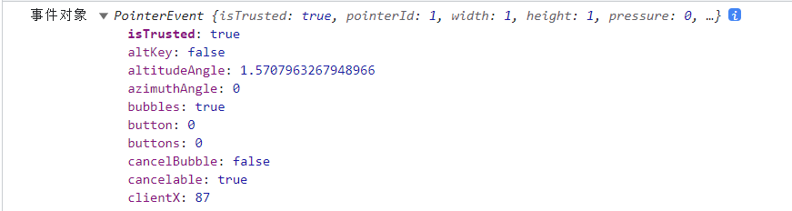

3. 当然，这里远不止截图中所展示的事件对象，里面还有很多很多，大家可以自行测试一下，event 一般情况下我们也会简写为 e，当然这只是一个形参名称，可以自己定义

4. 还有一种方法，使用 window.event 获取，在 ie8 及以下时可以用这种方法获取，如下：

   ~~~html
   <body>
     

   
     
   </body>
   ~~~

5. 输出如图：

   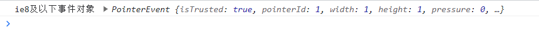

6. 也因此我们可以写出一种兼容性写法，如下：

   ~~~js
   box.addEventListener('click', function (e) {
   	// 如果 e 不存在表示不支持，则使用 window.event 获取
   	 e = e || window.event
   })
   ~~~

## 事件对象的通用成员

> 不同的事件类型所获得的事件对象也不完全一样，所以我们先不考虑差异之处，只看所有事件对象都具备的属性

### target && srcElement

> target 获取事件源 

1. target：事件源(事件目标)，这个表示触发本次事件的源，也是在事件流中本次最底层的元素，如下：

   ~~~html
   <body>
     

       <button class="btn">点击</button>
     

   
     
   </body>
   ~~~

2. 输出如图：

   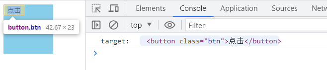

3. 而这里我们始终得到的都是事件目标阶段的元素，所以如果我们给 box 增加点击事件，而不给按钮增加点击事件，但是也点击按钮 e.target 获得的是什么呢，代码如下：

   ~~~html
   <body>
     

       <button class="btn">点击</button>
     

   
     
   </body>
   ~~~

4. 输出如图：

   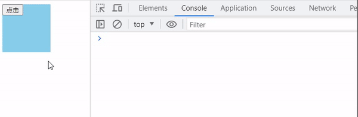

5. 通过这个结果我们可以证明，`哪怕没有给按钮注册点击事件，点击时，e.target 获取的也是点击的目标源对象`，为什么点击按钮会触发这个事件处理程序那就是因为冒泡了，后续点击 box 获取的就是 box，也再一次印证了 e.target 获取的是事件目标阶段的事件源

6. 我们也可以利用这个现象，完成`事件委托`的功能，什么是事件委托呢，假设一个父元素存在100个子元素，但是这100个子元素他们都是一个处理程序时，我们就可以给子元素的父元素绑定事件，添加处理程序，然后利用 e.target 执行事件源的特性获取是那个子元素触发事件，而且这样动态添加的子元素也无需再次绑定事件，这种不需要绑定到每个子元素身上可以减少内存消耗、减少代码量、提高性能的好处

7. `srcElement 则是一种兼容的写法`，如果不支持 e.target 则使用 srcElement，代码也可以和之前获取事件对象一样，利用或运算符完成

### 事件委托演练

1. 上述提到了事件委托，单纯的文字表达可能不是那么的清晰，所以我们使用一个实际案例演练一下，初始代码如下：

   ~~~html
   <body>
     

       <ul id="uls">
         <li>Lorem, ipsum.</li>
         <li>Nihil, qui.</li>
         <li>Quam, inventore!</li>
         <li>Sunt, soluta!</li>
         <li>Dignissimos, nobis.</li>
       </ul>
     

   
     
   </body>
   ~~~

2. 结果如图：

   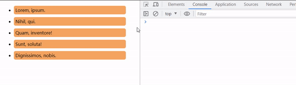

3. 可以看到我们绑定一次事件就可以处理所有的子元素点击事件，而且基于事件委托，后续给 ul 添加子元素无需再次绑定事件

4. 而当我们的子元素类型不止一种的时候，我们还需要判断一下当前触发时，触发的元素是否是我需要处理的元素，因为所有的子元素都会触发，我们可以利用 target 里面的 tagName 来实现，如下：

   ~~~js
   <body>
     

       <ul id="uls">
         <li>Lorem, ipsum. <button>删除</button></li>
         <li>Nihil, qui. <button>删除</button></li>
         <li>Quam, inventore! <button>删除</button></li>
         <li>Sunt, soluta! <button>删除</button></li>
         <li>Dignissimos, nobis. <button>删除</button></li>
       </ul>
     

   
     
   </body>
   ~~~

5. 结果如图：

   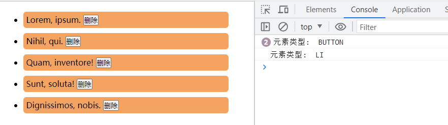

6. 那我们把这个功能完善一下，如下：

   ~~~html
   <body>
     

       <ul id="uls">
         <li>Lorem, ipsum. <button>删除</button></li>
         <li>Nihil, qui. <button>删除</button></li>
         <li>Quam, inventore! <button>删除</button></li>
         <li>Sunt, soluta! <button>删除</button></li>
         <li>Dignissimos, nobis. <button>删除</button></li>
       </ul>
     

   
     
   </body>
   ~~~

7. 结果如图：

   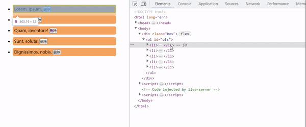

8. 可以看到就算是动态添加的元素之后，依然可以实现删除，而无需绑定事件，关于这些元素的操作，如果不了解的可以查看本专栏的前面的文章，[dom元素操作](https://blog.csdn.net/qq_53109172/article/details/131657075)

### currentTarget

> currentTarget 获取的是当前目标，当前目标就是绑定事件的元素

1. currentTarget 获取的是绑定事件的元素，等效于 this，代码如下：

   ~~~html
   <body>
     

       <ul id="uls">
         <li>Lorem, ipsum. <button>删除</button></li>
         <li>Nihil, qui. <button>删除</button></li>
         <li>Quam, inventore! <button>删除</button></li>
         <li>Sunt, soluta! <button>删除</button></li>
         <li>Dignissimos, nobis. <button>删除</button></li>
       </ul>
     

   
     
   </body>
   ~~~

2. 结果如图：

   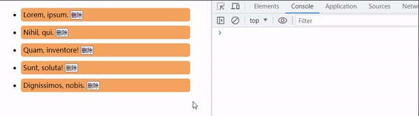

3. 可以看到，此时获取的元素总是绑定了事件的元素，所以 this 也表示是绑定了事件的元素

### type

> type 可以得到事件的类型

1. 代码如下：

   ~~~html
   <body>
     

   
     <button class="btn">点击</button>
   
     
   </body>
   ~~~

2. 结果如图：

   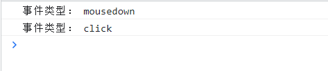

3. 这个属性一般用于一个些通用的方法里面，比如点击时执行的逻辑，鼠标按下时执行的逻辑

### preventDefault && returnValue

> 阻止浏览器默认行为

1. 这个默认行为是什么呢？示例代码如下：

   ~~~html
   <body>
     <a href="http://www.baidu.com">百度一下</a>
   
     
   </body>
   ~~~

2. 当我们点击 a 链接时，肯定会跳转页面，而为什么会跳转呢，这就是浏览器赋予 a 标签的默认行为，如果我们阻止了这默认行为就无法跳转了，如图：

   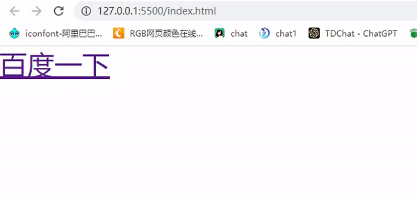

3. 除了 a 标签还有 form 表单元素也是具备默认的提交行为，如果需要阻止也可以使用 preventDefault 方法，当然 ie8及以下不止，可以使用 returnValue， returnValue 是一个属性，通过 `e.returnValue = false` 设置为 false 即可

4. 而在 dom0 的时候还有其他处理方式，在事件处理程序中返回为 false 且必须为 false 也可以阻止默认行为，代码如下：

   ~~~js
   a.onclick = function (e) {
       // e.preventDefault() // dom2 推荐
       // e.returnValue= false // 兼容 ie8及以下(非标准，不推荐)
   	return false // dom0 时代的做法
   }
   ~~~

5. 而返回 false 就可以阻止时，我们可以直接在标签上绑定事件，返回 false 也可以实现阻止默认行为，如下：

   ~~~html
   <a href="http://www.baidu.com" onclick="return false">百度一下</a>
   ~~~

6. 而且针对于 a 元素，可以设置为`功能性链接`，也可以解决这种跳转的问题，如下：

   ~~~html
   <!-- javascript: 开头，冒号后面可以写 js 代码 -->
   <!-- 但是我们通常会加一个分号，空代码，什么都不操作 -->
   <!-- 也会写成 void 0, void 计算完成表达式后返回 undefined -->
   <a href="javascript:void 0;">百度一下</a>
   <a href="javascript:;">百度一下</a>
   ~~~

7. 当然我们可以测试一下 js 代码是否生效，如下：

   ~~~html
   <a href="javascript:alert('hello world')">执行js代码</a>
   ~~~

8. 结果如图：

   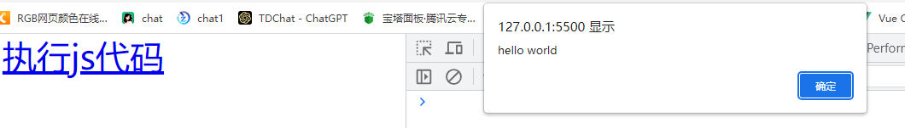

9. 同样，可以去调用函数执行操作等等

### stopPropagation

> 阻止事件冒泡

1. 示例代码如下：

   ~~~html
   <body>
     

       <button class="btn">点击</button>
     

   
     
   </body>
   ~~~

2. 看一下正常的输出，如图：

   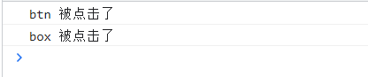

3. 虽然冒泡的存在有时候很好用，但是有时候我们的处理程序并不相同，例如点父元素可能是展开详情，但是点击内部的按钮可能是删除此项内容，此时我们就希望可以阻止冒泡而导致触发双重事件，stopPropagation 就可以实现，代码如下：

   ~~~js
   btn.onclick = function (e) {
       console.log('btn 被点击了')
       // 阻止冒泡
       e.stopPropagation()
   }
   ~~~

4. 输出如图：

   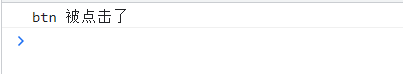

### eventPhase

> 得到当前事件所处的事件阶段，是捕获还是冒泡
>
> 此属性得到的是一个数字：
>
> - 1 表示事件捕获
> - 2 表示事件目标
> - 3 表示事件冒泡

1. 示例代码如下：

   ~~~html
   <body>
     

       

         

           <button class="btn">点击</button>
         

       

     

   
     
   </body>
   ~~~

2. 现在都是冒泡阶段，我们看一下正常的输出，如图：

   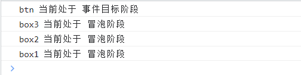

3. 现在我们将 box2 调整为 捕获阶段，如下：

   ~~~js
   box2.addEventListener('click', foo, true)
   ~~~

4. 输出如图：

   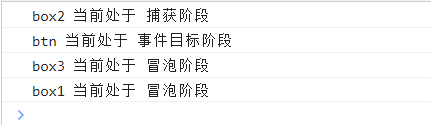
