# 鼠标事件

## 鼠标事件类型概览

| 事件类型   | 描述信息                                                     |
| ---------- | ------------------------------------------------------------ |
| click      | 用户单击鼠标按钮（通常为鼠标左键）或者按下在聚焦时按下回车键触发，这个事件在前面的章节其实也多次被使用，但是并没有详细的介绍，这里可以说一下触发的时机，点击元素时鼠标按下抬起之后才会触发，且如果按下此时并不抬起而是拖动鼠标离开点击的元素也不会触发，还有当按下 tab 键处于聚焦状态时，在按下回车也会触发 |
| dblclick   | 用户双击主鼠标按键触发（频率取决于系统配置，即双击两下间隔的时间） |
| mousedown  | 鼠标按下的时候就会触发                                       |
| mouseup    | 鼠标按下抬起之后触发                                         |
| mousemove  | 鼠标进入元素区域内`移动时`触发                               |
| mouseover  | 鼠标`移入`元素区域时触发                                     |
| mouseout   | 鼠标`移出`元素区域时触发                                     |
| mouseenter | 鼠标移入元素区域内触发，`此事件不会触发冒泡`                 |
| mouseleave | 鼠标移入元素区域内触发，`此事件不会触发冒泡`                 |

## 区别

1. 我们先来看一下 mouseover 和 mouseout 事件，示例代码如下：

   ~~~html
   <body>
     

       <button>点击</button>
     

   
     
   </body>
   ~~~

2. 此时 button 按钮在 box 的盒子里面，我们通过注册的事件查看一下现象，如图：

   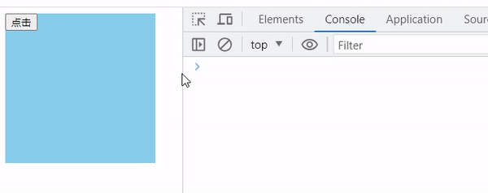

3. 为什么鼠标从 box 移入到 button 按钮时会触发这两个事件呢，我们也没有给 button 绑定啊，这是因为 button 虽然没有绑定这两个事件程序，但是确实触发这两个事件，所以进行冒泡处理，冒泡到父元素时就会触发父元素的执行程序，导致触发我们设定的事件程序

4. 怎么验证呢，我们手动阻止一下这个 btn 的冒泡即可测试，代码如下：

   ~~~html
   <body>
     

       <button>点击</button>
     

   
     
   </body>
   ~~~

5. 我们现在在再来测试一下，如图：

   .gif)

6. 这次的触发就可以很清晰的看见了，虽然进入 btn 区域时，也触发了离开的时候，但是没有像禁止冒泡前面的时候不仅触发离开还触发进入的事件，只是因为从 box 移入到了 btn ，且 btn 属于上层元素，所以是真的离开了 box 的区域，是一种正常的事件触发

7. 那我们在来看一下 mouseenter 和 mouseleave，代码如下：

   ~~~html
   <body>
     

       <button>点击</button>
     

   
     
   </body>
   ~~~

8. 输出如图：

   .gif)

9. 可以发现就算是移入 btn 元素，也不会冒泡也不会认为是离开了 box，这是因为对于 mouseleave 和 mouseenter`这两个事件来说从父元素移入到子元素并不算是离开，会认为子元素也是其中的一部分`

10. 而对于 mouseover 和 mouseout `就不会考虑子元素，从父元素移入到子元素而言，就是离开`

11. 如果想知道一个事件是否会冒泡，可以通过 bubbles 这个属性知道，true 表示会冒泡，反之则不会，如下：

    ~~~js
    box.addEventListener('mouseenter', function (e) {
    	console.log('mouseenter', e.bubbles)
    })
    
    box.addEventListener('mouseover', function (e) {
    	console.log('mouseover', e.bubbles)
    })
    ~~~

12. 输出如图：

    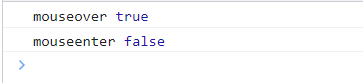

## 事件对象

> 所有的鼠标事件，事件处理程序中的事件对象，都为 MouseEvent，MouseEvent 是一个构造函数

### altKey、ctrlKey、shiftKey

1. `altKey`：触发事件时，会检测是否按下了 alt 键盘，比如给按钮注册一个点击事件，点击的时候会检测是否按下了 alt 键盘，如果按下返回 true 否则返回 false，如下：

   ~~~js
   btn.onclick = function (e) {
         console.log('altKey', e.altKey)
   }
   ~~~

2. 输出如图：

   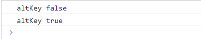

3. 与之对应的还有 `ctrlKey` `shiftKey`功能键，在写一些需要功能键搭配的时候可以使用

### 鼠标按键类型 button

1. 通过这个属性，可以得到鼠标按键类型，比如鼠标按下事件 mousedown 触发时，可以通过 e.button 获取，

   1. 0：左键
   2. 1：中键
   3. 2：右键

2. 代码如下：

   ~~~js
   <body>
     <button>点击</button>
   
     
   </body>
   ~~~

3. 输出如图：

   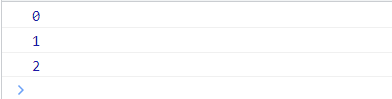

4. 注意：只有 mousedown 和 mouseup 有效

### 鼠标位置相关的属性

#### 页面位置相关的属性：pageX pageY

1. pageX 表示距离页面的横坐标
2. pageY 表示距离页面的纵坐标

1. 我们先看一下基础的代码，如下：

   ~~~html
   <body>
     

   
     

       

     

   
     
   </body>
   ~~~

2. 其中样式如下：

   ~~~css
   
   ~~~

3. 页面效果如下：

   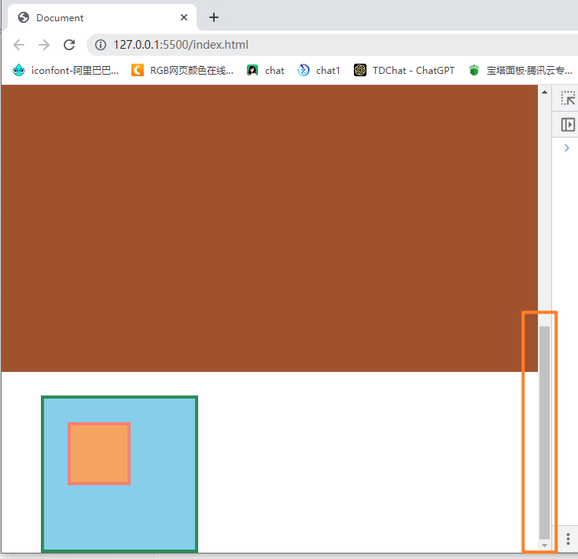

4. 注意了这部分滚动条，表示页面又很长，我们来输出一下 wrap 的 pageX 和 pageY 的值，如下：

   .gif)

5. 可以发现这个 pageY 的值非常的大，也就表示 pageY 的值是距离页面最顶部的，即滚动条到顶部，如图：

   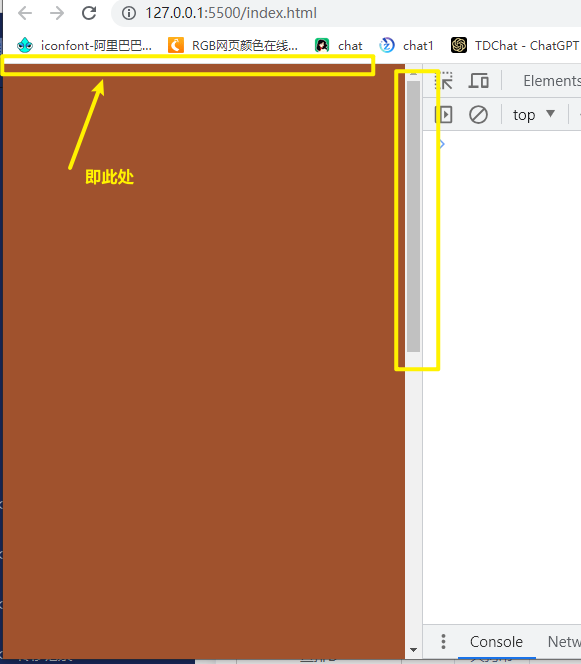

6. 同理 pageX 也是距离页面左边的距离

#### 视口位置相关的属性：clientX clientY

1. clientY 和 clientX 与 pageX、pageY 的区别就在于前者是鼠标针对于视口的位置，而后者是鼠标对于整个页面文档而言，如图：

   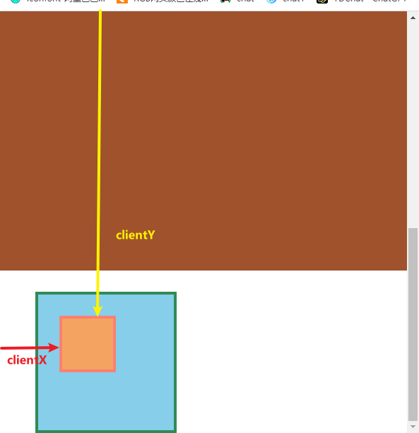

2. 我们可以看一下具体的输出，如图：

   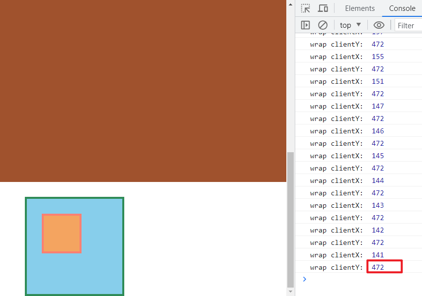

3. 可以看到此时的 Y 轴数值就小了很多，而视口即浏览器窗口的可视区域，可以看的见的区域，不包含被卷曲的面积

#### 事件源位置相关的属性：offsetX offsetY

1. 这个属性包含事件源的内边距但是不包含边框，什么意思呢，就是一个鼠标在一个页面上的位置属性是针对于事件源的区域的，如图：

   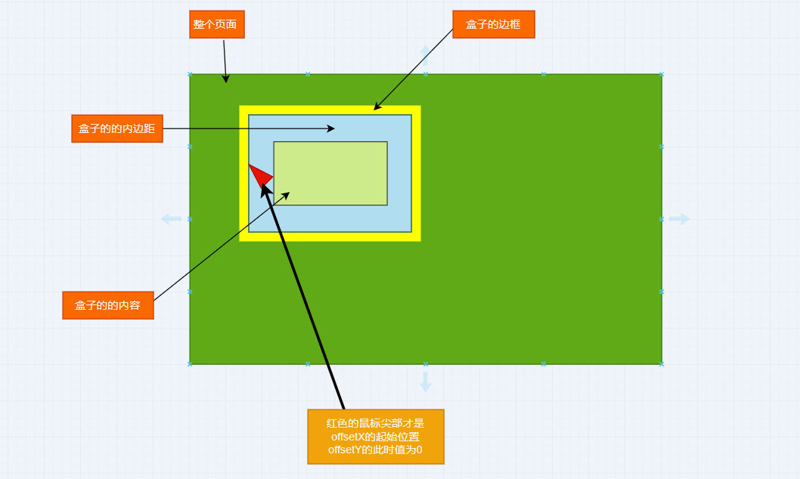

2. 所以超出内边距之外开始，值就会从复数开始，offsetX 知道之后， offsetY 也是呼之欲出了，急于这个我们可以看一下现在的案例代码，如下：

   ~~~html
     
   
   <body>
     

       

     

   
     
   </body>
   ~~~

3. 然后我们看一下实际的输出值的变化，如图：

   .gif)

4. 可以看到，这个输出只有当前事件源才会有效，而事件源的边框就为复数，也因此证明此属性只会计算内边距加内容区域，但是我们在经过右下角边框的时候没有出现复数的值，而是也在增加，这表明什么，表明这个坐标系的原点在于右上角，从右上角的位置开始，往右和向下移动鼠标值就会增加，所以严谨一点是事件源内边距和内容区域这一块开始的左上角，如图：

   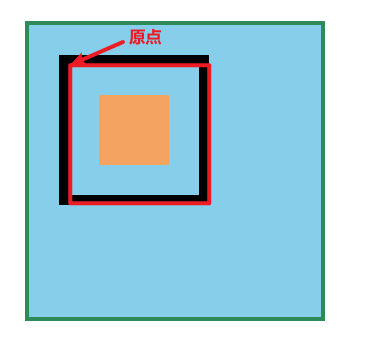

5. 那如果我们把注册的事件的 dom 换成外层的 box 而非 wrap 呢，我们来看一下会输出什么样的结果，代码替换如下：

   ~~~js
   box.onmousemove = function (e) {
   	console.log('box offsetX: ', e.offsetX)
   	console.log('box offsetY: ', e.offsetY)
   }
   ~~~

6. 输出的值如图：

   .gif)

7. 这里值得说一下的地方就是，我们给 box 注册的事件，但是当鼠标经过 wrap 的边框的时候，值变为了负数，这是不是表明 wrap 的是经过冒泡使用了父元素 box 的事件处理程序，而这一点也充分的验证了 offsetX 和 offsetY 是鼠标针对于事件源的位置而言的

#### 屏幕位置相关的属性：screenX screenY

1. 这个属性表明的是鼠标相对于屏幕的位置，屏幕和视口还是有区别的，视口是浏览器的可视窗口，而屏幕则是你的电脑或者手机等设备的屏幕，经过前面几个属性的解析，相信已经可以理解了，如图：

   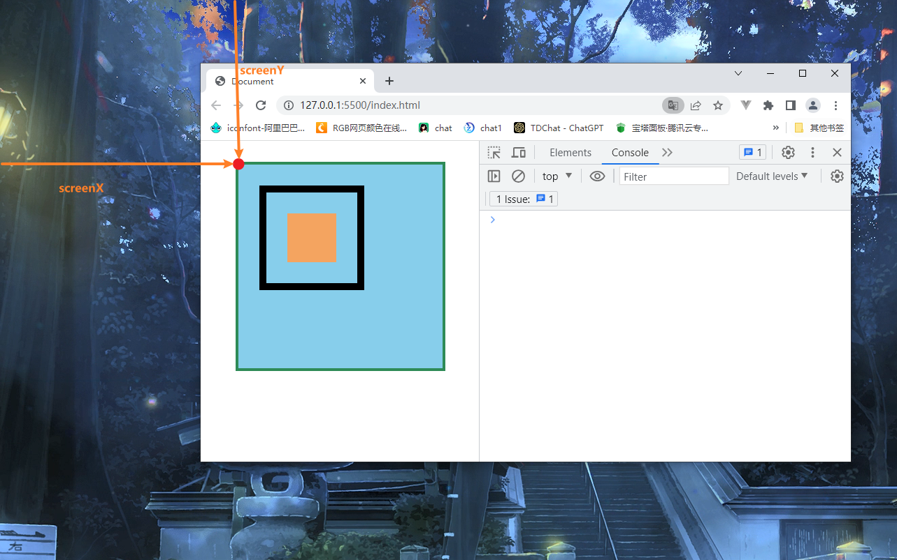

2. 更换一下代码，如下：

   ~~~js
   box.onmousemove = function (e) {
   	console.log('box offsetX: ', e.offsetX)
   	.log('box offsetY: ', e.offsetY)
   }
   ~~~

3. 输出如图：

   .gif)

4. 通过这个输出我们可以发现 Y 值偏大，也可也验证时针对于屏幕的距离，不过这个属性用的很少，了解即可

#### x y

> 这两个属性等效于 clientX 和 clientY

#### 鼠标移动时位置相关的属性：movementX movementY

> tips：这两个属性只有鼠标移动事件中有效

1. 这两个属性是相对于鼠标上一次移动位置，一个移动事件的触发时持续的，所以这两个属性的值，是`相对于上一次鼠标的位置偏移的距离`，这个触发频率和设备的配置已经浏览器的版本都有关系

2. 代码如下：

   ~~~js
   box.onmousemove = function (e) {
         console.log('box movementX: ', e.movementX)
         console.log('box movementY: ', e.movementY)
   }
   ~~~

3. 输出如图：

   .gif)

4. 通过上图可以看到，输出的值幅度变化都比较固定，而不是出现一些较大的数值，所以可以证明是相对于上一次鼠标的位置偏移的距离，而且这种触发的频率也不是移动 1px 就触发一次，而是按照固定的频率触发
