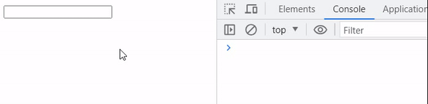
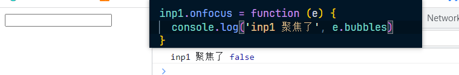

## 表单事件

### focus

> 元素聚焦时触发（能与用户发生交互的元素都可以聚焦）

1. 代码如下：

   ~~~html
   <body>
     <input class="inp1" type="text">
   
     
   </body>
   ~~~

2. 输出如图：

   

3. 焦点事件是无法冒泡的，如图：

   

### blur

> 元素失去焦点时触发，也不会冒泡

### submit

> 提交表单事件，仅在 form 元素身上有效，点击按钮时会触发整个表单的提交事件，可以冒泡

1. 代码如下：

   ~~~html
   <body>
     <form action="">
       

         <input type="text" placeholder="请输入账号">
       

       <button>按钮1</button>
       <button>按钮2</button>
     </form>
   </body>
   ~~~

2. 结果如图：

   .gif)

3. 在点击按钮的时候就触发 form 表单的提交事件，页面也出现了刷新

4. 而阻止的方式也有很多，可以通过给 button 注册点击事件阻止，也可以给表单的提交事件返回 false，或者阻止默认行为，如下：

   ~~~js
   form.onsubmit = function (e) {
   	console.log('提交')
       e.preventDefault()
   	return false
   }
   ~~~

### change

> 文本改变事件

1. 代码如下：

   ~~~html
   <body>
     <select name="" id="sel">
       <option value="1">AAA</option>
       <option value="2">BBB</option>
       <option value="3">CCC</option>
     </select>
   
     

   
     <input type="text" id="text1">
   
     

   
     <textarea name="" id="text2" cols="30" rows="5"></textarea>
   
     
   </body>
   ~~~

2. 结果如图：

   .gif)

3. 我们不难发现这个 change 事件，在输入的时候不会触发，当离开的时候才会触发，且如果两次的值一样也不会触发

### input

> 文本改变事件(实时触发)，这点就与 change 有些区别了，input 的触发是实时的

1. 代码如下：

   ~~~html
   <body>
     <input type="text" id="text1">
   
     
   </body>
   ~~~

2. 结果如图：

   .gif)
