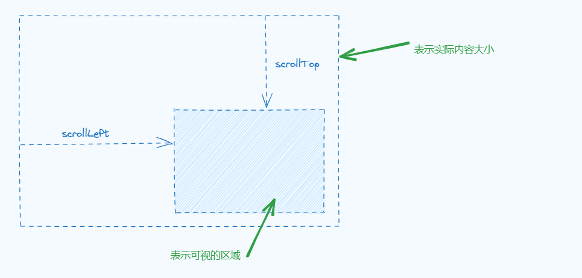
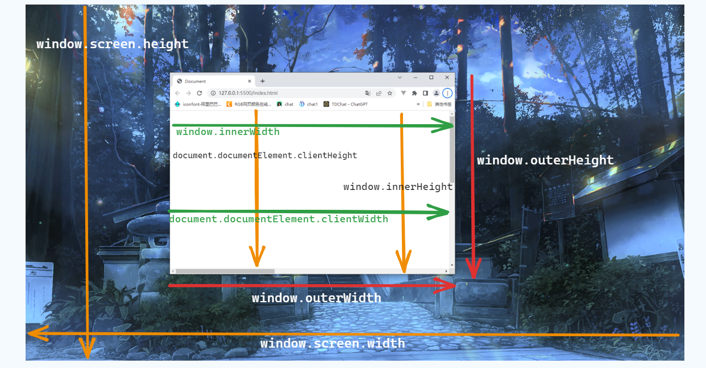
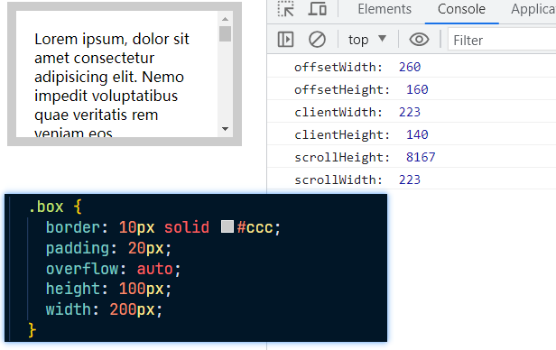

# 其他事件

## load、DOMContentLoaded、readystatechange

1. load（window） 指的是页面中所有资源加载完毕的事件
2. DOMContentLoaded（document） DOM 树构建完成后发生，这个事件不能使用 dom0 的方
   法注册
3. readystatechange（document） 页面有三种状态 loading(加载中)、 interactive(DOM
   树加载完成，此时就会触发 DOMContentLoaded 事件)、complete(完成触发 load 事件)

## unload、beforeunload

1. beforeunload（window） 关闭窗口时运行，理论上可以允许阻止关闭窗口(返回一个字
   符串即可)，但是现在新版的浏览器不支持了，事件会触发
2. unload（） 关闭窗口时运行，beforeunload 顺序在 unload 之前，unload 无法阻止浏
   览器关闭

## scroll

1. scroll 窗口发生滚动时运行的事件

2. 这个事件触发的频率也和设备以及浏览器版本有关

3. 此事件可以给元素使用也可给 window 使用

4. 通过 scrollLeft 和 scrollTop 获取滚动的距离，如图：

   

5. 实际内容高度可能是 1000px，但是可视区域只有 500px ，此时通过可视区域的滚动条，将上部分移开，将下半部分展示出来，而这部分不在可视区域的上半部分就表示为 scrollTop，也就是被卷去掉部分高度。scrollLeft 同理

## size

1. 窗口尺寸发生变化运行的事件，window 使用

2. 当我们调整浏览器窗口大小时就会发生变化，监听的是视口尺寸

3. 详细的尺寸如图：

   

4. 如图：

   

5. 通过这个图解，我们可以得知，offsetHeight 和 offsetWidth 是包含边框的，而 clientHeight 和 clienWidth 只是容器的可视区域，只有内容区域和内边距，而 scrollHeight 和 scrollWidth 是实际内容的宽高

## cintextmenu

1. 右键菜单，可以给 window 使用也可以给 dom 元素使用
2. 一般是在进行自定义右键菜单的时候会使用

## paste、copy、cut

1. paste：粘贴事件，例如在按下 ctrl + v 时就会触发
2. copy：复制事件，按下 ctrl + c 时触发
3. cut：剪切事件，按下 ctrl + x 时触发
4. 这三个事件也可以阻止默认行为，使其无法粘贴、复制和剪切

