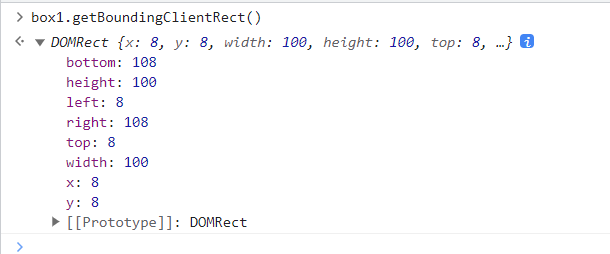

# 补充

## 元素位置

### offsetParent

> 获取某个元素的第一个定位的祖先元素，如果没有，则得到 body，body 的 offsetParent 为 null

1. 代码如下：

   ~~~html
     
   
   <body>
     

       

         

       

     

   </body>
   ~~~

2. 结果如图：

   

3. 

### offsetLeft、offsetTop

> 相对于该元素的 offsetParent 的坐标
>
> 如果是 offsetParent 是 body，则会将其当作是整个网页

### getBoundingClientRect 方法

> 该方法得到一个对象，该对象记录了该元素相对于视口的距离

1. 如图：

   

2. 属性具体的函数，可以参考 mdn 给出的一张官方图示，如下：

   

## 事件模拟

1. click：使用代码的方式调用一下元素的点击事件即可，如下：

   ~~~html
   <body>
     <button id="btn1">按钮1</button>
     <button id="btn2">按钮2</button>
     
   </body>
   ~~~

2. 这个很简单，自行测试即可

3. submit：即 form 表单的事件，如下：

   ~~~html
   <body>
     <form id="form" action="">
       

     </form>
   
     
   </body>
   ~~~

4. dispatchEvent：分发事件，用于触发一个指定的事件，一般可以用这个来进行模拟，代码如下：

   ~~~html
   <body>
     

   
     <button id="btn1">按钮1</button>
     <button id="btn2">按钮2</button>
   
     
   </body>
   ~~~

5. 结果如图：

   

## 其他

1. `window.scrollX` 和 `window.pageXOffset`：相当于根元素的 scrollLeft
2. `window.scrollY` 和 `window.pageYOffset`：相当于根元素的 scrollTop
3. 之前设置滚动条可以通过 scrollTop 和 scrollLeft 实现，也可以使用 `scrollTo` 和 `scrollBy` 两个函数实现
   1. scollTo 设置滚动条位置，接收两个参数 scrollTo(x, y)
   2. scrollBy 也是设置滚动调位置，也是接收两个参数 scrollBy(x, y)，但是他是在原来的位置上增加或者减少，正数就是增加，负数就是减少
4. resizeTo 和 resizeBy 设置窗口尺寸，这个和上述的 scollTo 和 scrollBy  使用方法差不多，只不过参数一是宽度，参数二是高度，同时设置的是窗口的尺寸，(`只能是通过代码打开的窗口，才能使用这两个方法`)

