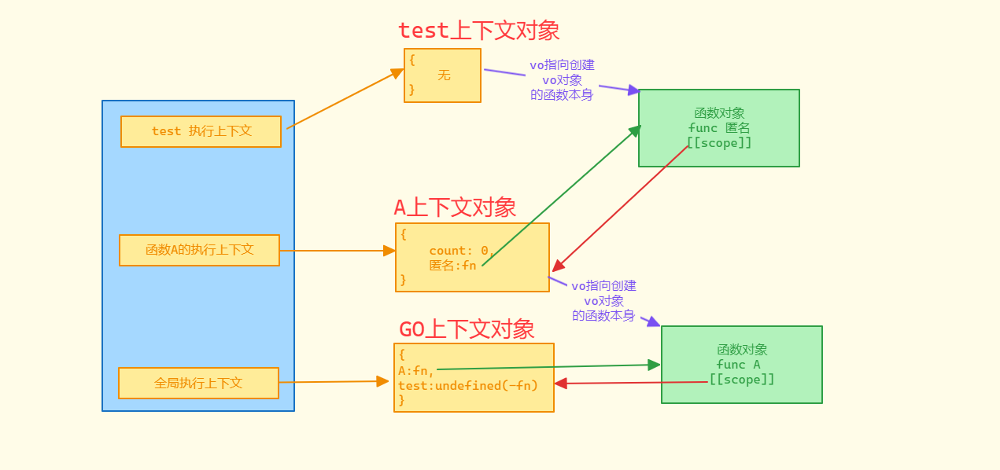

# 作用域链

## 什么是作用域链

1. VO 中包含一个额外的属性，该属性指向创建该 VO 的函数本身，全局上下文没有此属性

2. 每个函数在创建时，都会有一个隐藏属性`[[scope]]`，这个隐藏属性是存储一个地址，它指向创建该函数时所产生的执行上下文对象，也就是 VO，即那个上下文创建了这个函数对象，这个函数对象的 `[[scope]]` 属性一定指向这个上下文

3. 当访问一个变量时，会先查找自身的 VO 中是否存在，如果不存在，则依次查找`[[scope]]`属性。scope 属性表示作用域的意思

4. 代码如下：

   ~~~js
   var g = 0
   
   function A() {
   	var a = 1
   	function B() {
   		var b = 2
   		var C = function () {
   			var c = 3
   			console.log(a, b, c, g)
   		}
   		C()
   	}
   	B()
   }
   A()
   ~~~

5. 根据上述代码和释义，可以得出关系图，如图：

   

6. 打印 a 的时候，在 函数C的执行上下文中的 VO 没有 a 属性，就会通过函数C的函数对象中的 scope 属性去查找，而 scope 属性指向创建这个函数对象的执行上下文对象，所以这种通过 scope 属性一次向上查找的规则形成的一条查找联调，就被我们称之为作用域链

## 补充

### 案例

1. 我们可以看一段案例，如下：

   ~~~js
   function A() {
   	var count = 0
   	return function () {
   		count++
   		console.log(count)
   	}
   }
   var test = A()
   
   test()
   test()
   test()
   
   console.log(count)
   ~~~

2. 关系图如下：

   

3. 当然这个关系图没有完全展示出这个案例代码的执行变化，缺漏的地方就是当第一次 test 函数调用完成之后，就会执行 count++，然后打印 count，输出 1，此时第一次 test 函数执行完成，那么执行上下文和 test 上下文对象就会被销毁，不过此时 count 的值已经被改变为了 1，但是 匿名函数对象 还和 A 的上下文对象存在引用，所以不会被垃圾回收机制回收，当第二次执行 test 函数的时候，又会创建 test 的函数执行上下文，重复执行 test 函数的代码，依次类推，三次 test 执行完成，分别打印 1 2 3

4. 最后在全局执行 console.log(count) 时，在全局执行上下文对象的 GO 中，无法找到 count 属性，就会报错

5. 这也印证了闭包的原理，从广义上来说，只要一个函数引用了外部的变量，就是闭包

6. 可以在看一段代码案例，如下：

   ~~~js
   var a = 1
   function A() {
   	console.log(a)
   }
   
   function S() {
   	var a = 5
   	var B = A
   	B()
   }
   
   S()
   ~~~

7. 如图：

   

8. `闭包是在函数创建时形成，而非运行时`

### 浏览器差异

> 某些浏览器会优化作用域链，函数的`[[scope]]`属性中仅保留需要会用到的数据

## 面试题

### 题一

题目：

~~~js
var foo = { n: 1 }
;(function (foo) {
	console.log(foo.n)
	foo.n = 3
	var foo = { n: 2 }
	console.log(foo.n)
})(foo)
console.log(foo.n)
~~~

1. 第一步：初始化 GO，此时 GO 中 foo 是变量，默认的值为 undefined， 并存在一个字面量形式的匿名函数，函数就会有函数对象，函数对象存在一个隐藏的 scope 属性，如图：

   

2. 第二步：执行 var foo = {n:1}，此时 foo 的 undefined 值会被赋值为 {n:1} 对象的内存地址，如图：

   

3. 第三步：使用执行行的方式调用匿名函数，创建匿名函数的执行上下文对象，并放入栈中，形参foo 和 var定义的变量foo 同名，变量foo忽略，形参的值为 {n:1} 对象的引用地址，`匿名函数的 VO 会指向匿名函数对象，但是这里没有用到就不在图中表示，尽量避免混淆`,如图：

   

4. 第四步：执行函数内部的 console.log(foo.n) 语句，此时 foo 是 {n:1} 对象的引用地址，所以输出 1

5. 第五步：执行代码 foo.n = 3，foo 的引用地址还是没有改变，所以会将 {n:1} 对象的 n 值修改为 3，如图：

   

6. 第六步：执行代码 var foo = { n: 2 }，因为在初始化上下文的时候。上下文中的 VO 已经把变量的 foo 忽略掉了，所以我们这里可以看做事 foo = { n: 2 }，而这个 foo 实际是形参，所以这里会把 形参foo 原来存储的 {n:(1)3}`(表示原来是1，后面赋值为3)`对象的内存地址修改为 {n:2} 对象的内存地址，如图：

   

7. 第七步：执行代码 console.log(foo.n)，此时的 foo 的引用的对象内存地址已经改变为 {n:2}，所以这里输出的值为 2

8. 第八步：执行全局上下文的 console.log(foo.n)，全局上下文中的 foo 引用的对象内存地址是 {n:(1)3} 对象的内存地址，所以这里输出 3

9. 最后结果 1 2 3，如图：

   

### 题二

题目：

~~~js
var food = 'rice'
var eat = function () {
	console.log(`eat ${food}`)
}
;(function () {
	var food = 'noodle'
	eat()
})()
~~~

1. 第一步：定义 GO，food 和 eat 变量会被首先提取，其次就是匿名函数，初始化如图：

   

2. 第二步：依次对 food 和 eat 赋值，如图：

   

3. 第三步：执行匿名函数，创建匿名函数的执行上下文，匿名函数不接受形参，只有一个 food 变量，所以 VO 只有 food，且这个 VO 指向创建该 VO 的函数本身，也就匿名函数对象，如图：

   

4. 第四步：随后开始执行匿名函数内部的代码，food 被赋值为 noodle，然后调用 eat 函数，eat 函数创建执行上下文，且 eat 的执行上下文对象中的 VO 会指向 eat 函数对象，而 eat 函数内部无形参、var 定义的变量、无字面量函数，所以 VO 为空，关系如图：

   

5. 第五步：指向 eat 函数内部的 console.log(`eat ${food}`)，eat 的 VO 中不存在 food，所以会通过 eat 函数对象的 scope 属性关联的上一层 VO 里面找，这个例子中上一层的 VO 也就是 GO，而 GO 中的 food 为 rice，所以输出字符串 eat rice，如图：

   

6. 函数的执行上下文实在创建时定义的，而非运行时

### 题三

题目：

~~~js
var food = 'rice'
;(function () {
	var food = 'noodle'
	var eat = function () {
		console.log(`eat ${food}`)
	}
	eat()
})()
~~~

1. 和前面都是类似的步骤解析，所以这里直接给出最后的关系图：

   

2. 通过这个关系图 eat 函数打印 console.log(`eat ${food}`) 时，eat 函数的 VO 中没有任何属性值，所以只能去上一层的 VO 查找，VO 指向创建该 VO 对象的函数对象，所以执行 eat函数对象，eat函数对象的 scoped 指向匿名函数的 VO，匿名函数的 VO 对象就存在 food ，值为 noodle，最后打印 'eat noodle'

3. 而这种关系也是闭包的表现，内部函数可以访问外部环境的变量

