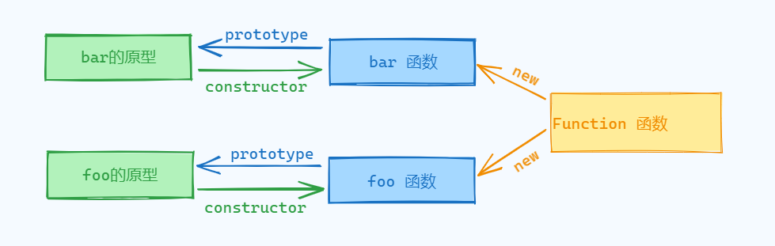
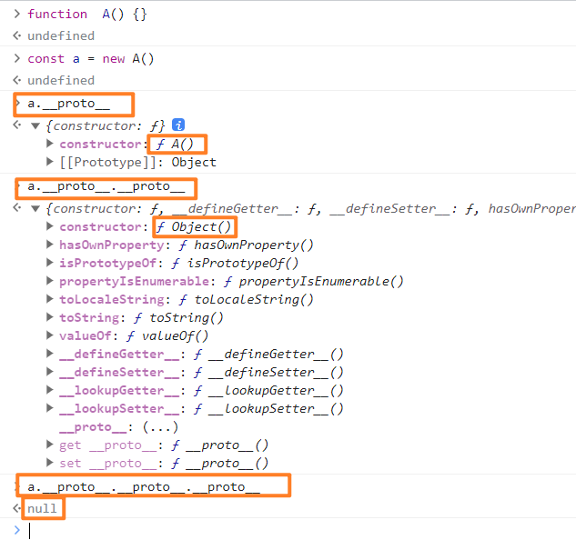
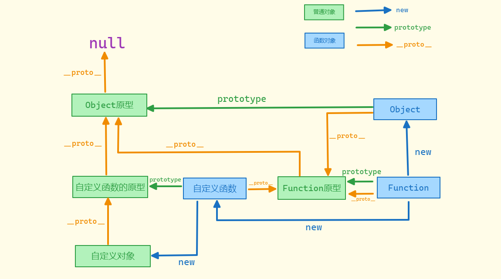

# 原型和原型链

1. 所有对象都是通过`new 函数`创建

2. 所有的函数也是对象，为什么这么说呢？因为函数实际上是通过`Function`构造函数创建的对象，这个构造函数是JavaScript内置的一个函数对象，它具有创建新函数对象的能力
3. 函数也可有属性
4. 所有对象都是引用类型

```js
function foo() {}

// 可以理解为如下这种形式创建的
var test = new Function()
```

## 原型 prototype

1. 所有函数都有 prototype 属性，称之为`函数原型`

2. prototype 在默认情况下是一个普通的 object 对象

3. 默认情况下 prototype 有一个默认属性 `constructor`， constructor 也是一个对象，这个对象指向构造函数本身，这种关系如图：

   

4. 根据这个关系我们也可以测试一下

## 隐式原型 `__proto__`

1. 原型本身的用处不大，配合隐式原型 `__proto__` 才能看出作用，一般 `__` 开头的都表示是系统变量，轻易不要使用

2. 所有的对象都有一个属性 `__proto__`，称之为隐式原型

3. 函数也是对象，所以函数也存在 `__proto__`

4. `__proto__` 默认情况下，**隐式原型指向创建该对象的函数的原型对象**，一个对象或者一个函数一定是 new 出来的，如下：

   ~~~js
   // 创建函数
   const func = new Function()
   
   // 创建对象
   const obj = new Object()
   // 创建对象字面量写法
   const obj1 = {}
   // 字面量写法等同于通过 new 创建对象的语法糖
   ~~~

5. 根据上面代码的演示还可以进一步的得出，一个对象一定是通过 new 一个函数创建的，Object 本身就是一个函数

   ~~~js
   console.log(typeof Object) // function

6. 隐式原型指向创建该对象的函数的原型，根据这个结论，我们可以得出下面这个等式，obj 的隐式原型等于 oo 函数的原型对象，如下：

   ~~~js
   function foo() {}
   
   const obj = new foo()
   
   console.log(obj.__proto__ === foo.prototype) // true
   ~~~

7. 我们可以看一个示例题目，如何得到创建 obj 的构造函数名称，如下：

   ~~~js
   function create() {
   	if (Math.random() < 0.5) {
   		return {}
   	} else {
   		return []
   	}
   }
   
   var obj = create()
   // 答：
   console.log(obj.__proto__.constructor.name)
   ~~~

8. 为什么这样可以呢？因为我们得到的是一个函数已经调用后的结果了，这个函数不是返回一个对象就是一个函数，而这种字面量写法等同于 new 创建的方法，那么通过 new 一个函数得到的就是一个对象，是对象那就具备隐式原型对象，而隐式原型对象会指向创建该对象的函数原型，而函数的原型对象默认情况下存在一个属性 constructor，constructor 又会指向构造函数本身，而 constructor 存在一个 name 属性，此属性记录了构造函数的名称

9. 在接着看下一题，如下：

   ~~~js
   function A() {}
   var obj1 = new A()
   var obj2 = new A()
   
   obj1.abc = 123
   obj1.__proto__.bcd = 123 
   console.log(obj1.abc, obj2.abc) // 123 undefined
   console.log(obj1.__proto__.bcd, obj2.__proto__.bcd) // 123 123
   ~~~

10. 这个其实不难理解 obj1.abc 修改的是 obj1，和 obj2 没有关系，所以输出 123 和 undefined，obj1.__proto__.bcd = 123 其中 obj1.`__proto__` 等于 A.prototype，所以等于是 A.prototype.bcd = 123，而 obj1 和 obj2 都是同一个构造函数创建的，所以 obj1 和 obj2 的隐式原型对象都是指向 A 的原型对象，所以都会输出 123

11. 当访问一个对象的成员时：

    1. 这个成员无论是属性还是方法，先查看对象自身是否拥有该成员，如果有就直接使用
    2. 如果没有则会通过隐式原型查看是否拥有该成员，如果有直接使用

## 原型链

1. 什么是原型链呢？一个对象具备隐式原型，且这个隐式原型指向函数的原型对象，函数的原型对象也是一个普通对象，那么也具备隐式原型对象，通过这个关系我们就可以得出一个类似链条的关系，称之为原型链，如图：

   

2. 当然，这样的观察可能并不是很明显，详情如图：

   

3. 这幅图中绿色的线条表示原型对象，我们可以先看一下，Function 的原型指向、Object 的原型指向、自定义函数的原型指向，都没有什么好疑惑的

4. 然后我们看一下蓝色的线条，表示 new，自定义函数可以通过 new Function 产生，而自定义的对象也可以通过 new 自定义函数产生，Object 也是一个函数，所以也是通过 new Function 产生的，所有的函数都是通过 new 一个 Function 产生的

5. 可能特殊的点就在于 `__proto__`，橙色的线条，隐式原型谁创建的就指向谁，所以自定义对象会指向自定义函数的原型，而函数的原型也是一个普通对象，一个普通对象是通过 new Object() 产生的，所以函数的原型对象的隐式原型对象就指向 Object 的函数原型，

6. 自定义函数和 Object 都是通过 new 一个 Function 产生的，函数也是一个对象，所以函数也会有 `__proto__`，因此自定义函数和 Object 函数的隐式原型对象都会指向 Function 的原型对象，Function 的原型对象也是一个普通对象，普通对象的 `__proto__` 一定指向 Object 的函数原型对象

7. 特殊点：

   1. Function 的 `__proto__`指向 Function 自身的原型
   2. Object的原型对象的 `__proto__`指向 null

## 题目

~~~js
function User() {}
User.prototype.sayHello = function () {}

const u1 = new User()
const u2 = new User()

console.log(u1.sayHello === u2.sayHello) // true
console.log(User.prototype.constructor) // User
console.log(User.prototype === Function.prototype) // false
console.log(User.__proto__ === Function.prototype) // true
console.log(User.__proto__ === Function.__proto__) // true
console.log(u1.__proto__ === u2.__proto__) // true
console.log(u1.__proto__ === User.__proto__) // false
console.log(Function.__proto__ === Object.__proto__) // true
console.log(Function.prototype.__proto__ === Object.prototype.__proto__) // false
console.log(Function.prototype.__proto__ === Object.prototype) // true
~~~

1. u1.sayHello === u2.sayHello：

   1. 因为 u1 和 u2 的 sayHello 方法都是使用的 User 函数的原型上的

2. User.prototype.constructor：

   1. User 的原型对象存在一个 constructor 属性，这个属性指向的是构造函数本身

3. User.prototype === Function.prototype：

   1. 每个函数创建都会拥有属于自己的原型对象，所以 User 的原型对象不等于 Function 的原型对象

4. User.`__proto__` === Function.prototype：

   1. 每个对象的 `__proto__` 默认情况下都指向创建该对象的函数的原型对象，函数也是一个对象，所以函数的 `__proto__`指向 Function的原型对象

5. User.`__proto__` === Function.`__proto__`：

   1. Function 的 `__proto__`指向 Function 自身的原型对象
   2. User 的 `__proto__` 指向创建对象函数的原型对象

6. u1.`__proto__` === u2.`__proto__`：

   1. u1 和 u2 的隐式原型对象都指向 User 的原型对象
   2. 关键就在于理解：对象的 `__proto__` 都指向创建对象的函数的原型对象

7. u1.`__proto__` === User.`__proto__`：

   1. 创建 u1 的函数是 User，所以 u1 的隐式对象指向 User 的原型对象
   2. User 是通过 new Function 创建的，所以 User 的隐式原型对象指向 Function 的原型对象

8. Function.`__proto__` === Object.`__proto__`：

   1. Function 的隐式对象指向 Function 自身的原型对象
   2. 而 Object 是通过 new Function 创建的，所以 Object 函数的隐式原型对象指向 Funciton 的原型对象

9. Function.prototype.`__proto__` === Object.prototype.`__proto__`：

   1. Function 的原型对象是一个普通对象，普通对象的隐式原型指向 Object 函数的原型对象
   2. Object 的原型对象也是一个普通对象，而 Object 原型对象的隐式原型指向 null

10. Function.prototype.`__proto__` === Object.prototype：

    1. Function 的原型对象是一个普通对象，普通对象的隐式原型指向 Object 函数的原型对象

    

