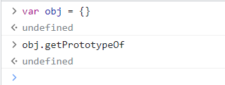
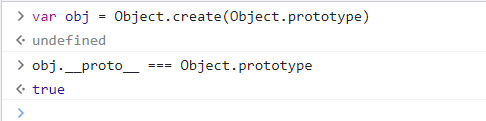

# 原型链的应用

## 基础方法

### Object.getPrototypeOf(对象)

> W3C 不推荐直接使用系统成员 `__proto__`，所以获取对象的隐式原型一般使用此方法

1. getPrototypeOf 是 Object 函数的静态方法，所以创建的对象是没有这个方法的，如图：

   

2. 看一下使用，如图：

   

3. 更多测试结果如下：

   

### 调用者.isPrototypeOf(对象)

> 用于调用者(`this`)是否存在于另一个对象的原型链中
>
> 返回值：一个布尔值，指示调用 `isPrototypeOf()` 方法的对象（即 `this`）是否位于 `object` 的原型链中。当 `object` 不是一个对象（即基本类型）时，直接返回 `false`

1. 其实关键就在于理解对象的原型链，要清楚对象的原型链才能判断调用者是否处于这条原型链上，this 指本身，示例代码代码如下：

   ```js
   function A() {}
   
   const o1 = new A()
   const o2 = new A()
   
   console.log(Object.prototype.isPrototypeOf(o1)) // true
   console.log('sss'.isPrototypeOf(o1)) // false
   console.log(Object.isPrototypeOf(o1)) // false
   console.log(Object.getPrototypeOf(o2).isPrototypeOf(o1)) // true
   ```

2. 如果不太明白上述的结果，我们先看一下关系图：

   

3. 问：Object.prototype.isPrototypeOf(o1) 为什么为 true？

   > 答：在上面的关系图，我们可以先看一下 O1 这个用作判断基准的对象的原型链，`函数A --> o1对象 --> 函数A的原型对象 --> Object原型对象`，我们在看一下 Object.prototype 这个对象是否处于这个 o1 的原型链中呢，很明显是处于的，所以返回 true

4. 问：'sss'.isPrototypeOf(o1) 为什么为 false？

   > 答：字符串是基本类型(原始类型)返回 false

5. 问：Object.isPrototypeOf(o1) 为什么为 false？

   > 答：Object 不处于 o1 对象的原型链上，`函数A --> o1对象 --> 函数A的原型对象 --> Object原型对象` 

6. 问：Object.getPrototypeOf(o2).isPrototypeOf(o1) 为什么为 true？

   > 答：Object.getPrototypeOf(o2) 获取的是 o2 的隐式原型对象，`o2 的隐式原型对象`指向`函数A的原型对象`，而函数A的原型对象处于 o1 的原型链上，所以为 true

7. 根据上面的案例我们还可以得出一下结果。如下：

   ~~~js
   console.log(A.prototype.isPrototypeOf(o1)) // true
   console.log(A.prototype.isPrototypeOf(o2)) // true
   console.log(o2.isPrototypeOf(o1)) // false
   console.log(Function.prototype.isPrototypeOf(o1)) // false
   console.log(Object.getPrototypeOf({}).isPrototypeOf(o1)) // true
   ~~~

8. 利用这种方式，我们只需要判断 数组的原型对象是否存在一个对象上，就可以判断是否是一个真数组，如图：

   

9. 当然现在一般都是使用 Array.isArray()

### 对象 instanceof 函数

> 判断函数的原型是否在对象的原型链上

1. 这个其实和上面的 isPrototypeOf 有着一点区别，isPrototypeOf 是判断一个对象本身是否在一个对象的原型链上

2. 而 instanceof 是判断一个函数的原型对象是否在一个对象的原型链上，所以他的右侧比较值只能写函数

3. 我们来看一段例子，如下：

   ~~~js
   const obj = {}
   const arr = []
   
   console.log(obj instanceof Object) // true
   console.log(arr instanceof Array) // true
   ~~~

4. 关系如图：

   

5. 这里可以看到 Object 的原型对象存在于 obj 的原型链上，所以为真，数组判断同理

6. `[] instanceof Array`也是判断数组的一种方式，但是页面中如果有 iframe 会出现问题，有 iframe 不推荐使用，iframe 跨越窗口之后，会改变数组的指向

### Object.create(对象)

> 创建一个新对象，这个新对象的隐式原型指向指定的对象

1. 例如我们之前使用 var obj = {}，就可以看做是 var obj = Object.create(Object.prototype)，这段代码的意思就是创建一个 obj 对象，将 Object 的原型对象作为 obj 对象的隐式原型，所以我们可以得出等式 obj.`__proto__` === Object.prototype，如下：

   

2. 我们还可以看一下普通对象之间使用这个方法会发生什么，如下：

   

3. 可以看到创建的 b 对象本身没有什么，但是他的隐式原型指向了 a，我们先来看一下关系图，如图：

   

4. 我们知道，原型链是通过隐式原型(`__proto__`)进行连接形成的，那么 b 对象不仅可以使用 Object 身上的方法，还可以使用 a 对象身上的方法

5. 但是这样操作之后，b 隐式原型对象指向的原型对象就没有 constructor 那些属性了，而正常的一个对象指向的隐式原型对象都会有这些属性，为什么呢？因为我们使用一个普通对象 a 作为 b 的原型对象，但是普通对象身上没有这些属性，所以不存在，如图：

   

6. 这个方法必须要写一个对象参数或者为 null，如果传入一个 null 那么这个新对象的隐式原型就直接指向 null 了，新对象的`__proto__` --> null

### Object.prototype.hasOwnProperty(属性名)

> 判断一个对象`自身`是否拥有某个属性

1. `这个自身表示不包含通过原型链查上的属性`，必须是完全自己所有的，通俗一点说，父亲有个房子你可以住，但是不属于你，代码如下：

   ~~~js
   const a = { name: 'zhangsan' }
   
   const b = Object.create(a)
   ~~~

2. 根据之前所讲到的，我们打印 b.name 会输出 'zhangsan'，因为 b 的隐式原型是 a，a 具有 name 属性，但是这是 a 具有的，如果我们使用 hasOwnProperty 方法判断 b 是否有 name 属性会输出 false，如图：

   

3. 我们使用 for in 遍历的时候，其实会把原型链上的属性也遍历出来，所以当我们不希望遍历到一个对象身上原型链身上的属性的时候，就可以使用这个方法，如图：

   

4. 那为什么平常遍历一个对象的时候不会把 Object 上面那么多属性遍历出来呢，这是因为这些属性通过`属性描述符禁止遍历了`

## 应用

### 类数组转为真数组

1. 一个真数组的原型链上一定会有 Array.prototype ，如果没有就不是真数组

2. 我们知道数组中有一个方法 slice，这个方法可以通过传入参数对数组的指定位置进行剪截，然后返回一个新的数组，但是如果不传入参数，就会对整个数组进行剪截，例如：

   ~~~js
   const arr1 = [1, 2, 3, 4, 5]
   const arr2 = arr1.slice()
   console.log(arr2) // [ 1, 2, 3, 4, 5 ]
   console.log(arr2 === arr1) // false
   ~~~

3. 所以我们如果使用 call 方法，让 类数组调用 slice 方法，并且不传入参数，是否就可以达到我们需要的效果呢？如图：

   

4. 我们最后经过判断 Array.prototype 在 arr 的原型链上，是为真数组，当然也可以使用其他方式检测

5. tips：类数组可以是具备 length，所以准确一点说 `Array.prototype.slice.call(arguments)能将具有length属性的对象(key值为数字)转成数组`，如下：

   ~~~js
   const obj1 = { 0: 'aaa', 1: 'bbb', 2: 'ccc', length: 3 }
   const obj2 = { 0: 'aaa', 1: 'bbb', 2: 'ccc' }
   
   console.log(Array.prototype.slice.call(obj1)) // [ 'aaa', 'bbb', 'ccc' ]
   console.log(Array.prototype.slice.call(obj2)) // []
   ~~~

### 实现继承

> 继承即一个父类构造函数所有的，子类构造函数也需要有，比如下个自定义函数的原型对象指向 Object 函数的原型对象，那么我们就可以说 Object 是 自定义函数 的父类，也可以说是 自定义函数 继承自 Object

1. 默认情况下有的构造函数父类都是 Object，Object 没有父类，属于根
2. 
