# 执行上下文

## 什么是函数执行上下文

> 一个函数启动运行之前，创建的一块内存空间，空间中包含有函数执行所需要的数据，为该函数执行提供支持

## 执行上下文栈(call stack)

> 所有执行上下文组成的内存空间

### 什么是栈

1. 栈是一种数据结构，特点是：先进后出，后进先出，就像是往一个桶里面加东西一样，先加进去的后出，而加数据的过程被我们称之为入栈(push)，反之移除一个数据则叫为出栈(pop)，如图：

   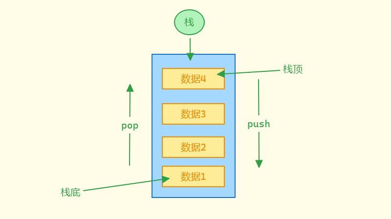

2. 栈中最后加入即最上面的数据叫做栈顶，而最先加入即最下面的数据叫做栈底

3. 而我们所熟知栈溢出就时执行上下文栈这块空间内存占满溢出了，即会出现爆栈、栈溢出的等操作

### 全局执行上下文

1. 任何 js 代码运行之前，都会有一个`环境`，这个环境也被我们叫做`执行上下文`，而在运行的时候，一开始看到的是全局代码。所以存在一个`全局环境`，这个全局环境也被叫做`全局执行上下文`

2. 全局上下文：所有 js 代码执行之前，都必须有这个环境

3. 所以在这个栈的结构中，一开始就会在栈底加入一个数据，这个数据就是`全局执行上下文`，然后才会开始执行后续的代码

4. 为了更好的观察，我们可以写一段 js 代码来当作案例解析，如下：

   ~~~js
   
   ~~~

5. 在执行的过程中，每一次`调用函数`(而非定义函数)，都会创建一块空间，叫做函数执行上下文，全局上下文只有一个，但是函数执行上下文可以有无数个，console.log('数据1') 就是在调用函数 log 本身就是一个函数，所以在调用的时候就会创建`新的函数执行上下文`放入栈中，创建好函数执行上下文之后，才会去执行函数，如图：

   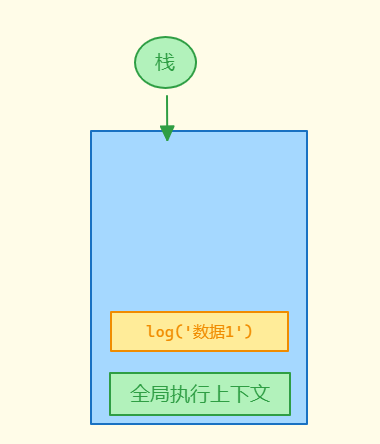

6. 而当这个 log 函数执行完成之后，又会从栈中移出，然后又继续回到全局执行上下文，继续执行代码，此时看到的代码时定义函数 A，但是 函数A 没有调用，所以不会执行，直接忽略，继续往下走，此时执行代码 `A()`, 函数 A 被调用，开始创建 函数A 的执行上下文，如图：

   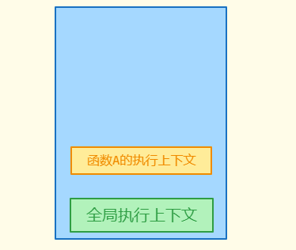

7. 此时我们可以看到栈中的栈顶时 函数A 的环境，所以JS引擎中执行的上下文始终是栈顶的上下文，然后执行 函数A 发现第一句代码就是在调用函数 console.log('A1')，然后调用函数又会创建一个 函数的上下文，又将这个环境加入到栈中，如图：

   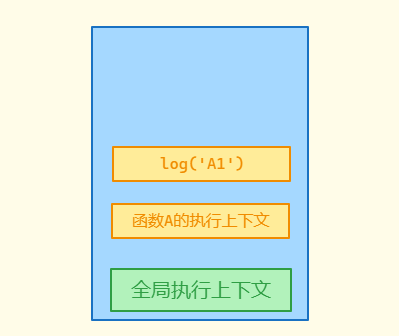

8. 此时栈顶的函数上下文为 console.log('A1')，开始执行 console.log('A1')，执行完成后从栈中移出，然后转回全局执行上下文，忽略定义 函数B 的代码语句，来到 B() 语句，创建 函数B 的执行上下文，如图：

   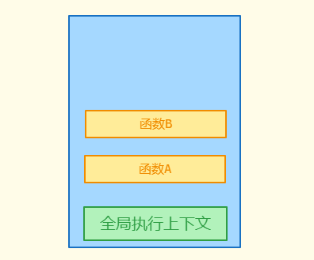

9. 根据这样的执行顺序，会顺利执行后面的所有代码，后续执行顺序如图：

   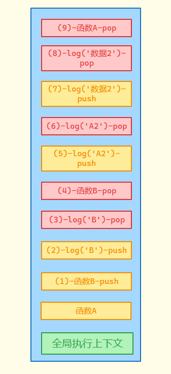

10. 最后执行完成所有的代码之后，全局上下文也会消失，栈清空

## 执行上下文中的内容

### this 指向

1. this 指向一般有三种情况：

   1. 直接调用函数，this 指向全局对象

   2. 在函数外使用，this 指向全局对象

   3. 通过对象或者 new 一个函数，this 指向调用的对象或者新创建的对象

2. 代码中可以使用 this，就是上下文中提供了 this，前面提到，会在栈顶加入一个全局执行上下文，全局上下文是一个对象，而栈中就说存储着全局执行上下文对象的`地址`，仅仅只是地址，实际是在`堆(heap)中开劈了一块内存空间`，如图：

   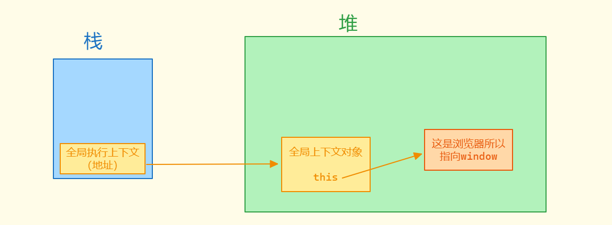

3. 我们一样使用一段代码，逐步解析，如下：

   ~~~js
   
   ~~~

4. 解析如图：

   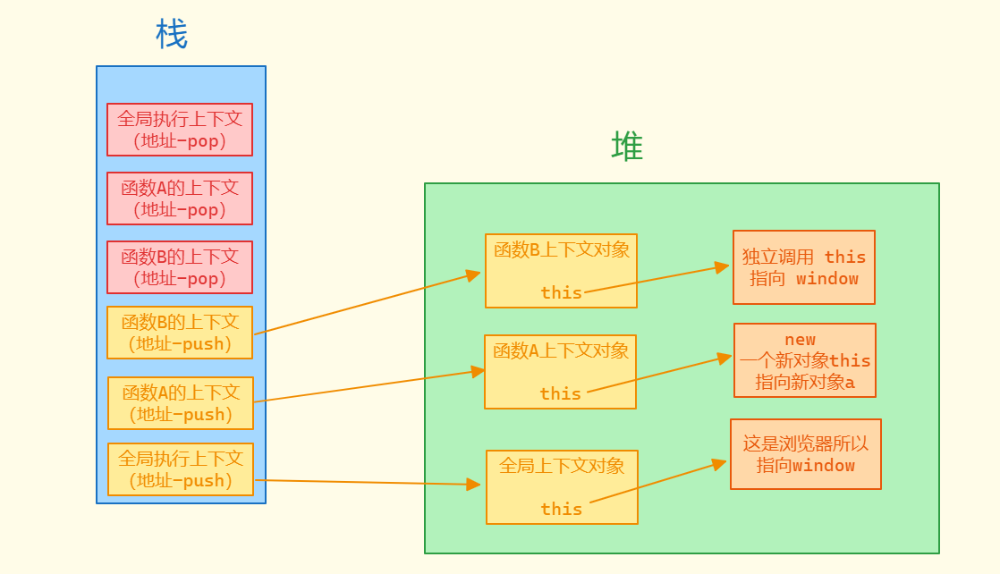

5. 文字解析

   1. 最开始肯定是一个全局的上下文放入栈中，但是这里栈中存储的是一个地址，并不是实际的全局上下文对象，全局上下文对象中保存着 this 和 vo，vo 暂且不谈，根据 this 的规则这里指向全局对象，全局对象和环境有关，浏览器中指向 window
   2. a = new A()，这里通过 new 调用函数，而函数调用就会创建执行上下文，所以会在栈中放入一个 函数A 的执行上下文，创建上下文的时候会有很多事情会去处理，但是第一件事情就是确定 this 指向，所以只有函数在被调用的时候才会确定 this 指向，因为在函数运行的时候可能会使用到 this，因此会在函数调用时，运行前确定 this 指向，这点在最开始解释什么是函数执行上下文就有解释，为`函数的执行提供支持`
   3. 将 函数B 的执行上下文放入栈中，而 函数B 的调用方式属于直接调用函数，也称之为独立调用函数，这种情况下 this 指向为全局对象

### VO 变量对象

1. 在执行上下文中，除了存在 this，还有一个 VO(Variable Object)

   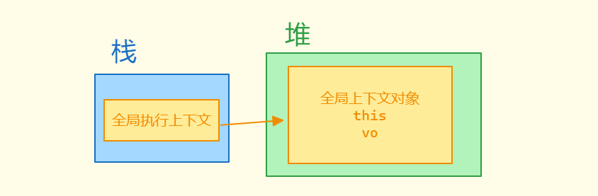

2. VO 称之为变量对象，VO 中记录了该环境中所有`声明的参数、变量和函数`

3. 在全局执行上下文中，VO 不是函数，所以不存在参数，只有声明的变量和函数，除了用户声明的变量和函数之外，全局对象里面所有的东西都属于 VO 里面的东西，比如浏览器环境中的 window，所以我们可以理解为全局执行上下文对象里面的 VO 和 this 一样，指向的也是 window，不过这是因为全局上下文对象比较特殊

4. 前面我们提到 VO 记录环境中所有的参数、变量和函数，而全局执行上下文对象中 VO 指向 window，所以 window 里面的属性才可以直接使用，执行一个函数或者全局代码，能够直接使用某个东西，肯定是在执行上下文中可以找到，也就是去 VO 里面找，比如我们可以直接使用 console.log ，这就是因为 VO 指向 window，window 中存在 console.log

5. 通过 var 关键字定义的变量，也会附着在全局对象上，等同于在 VO 中加入了一个属性

6. 而全局上下文对象这种特殊性，我们也有另外一个区分，GO(Global Object)，GO 就是全局执行上下文中的 VO，实际上是一样的，只是因为这种特殊性，方便区分，称为 GO

7. 我们还是使用一段示例代码解析，如下：

   ~~~js
   function A(a, b) {
   	console.log(a, b, c, '前')
   	var c = 123
   	console.log(a, b, c, '后')
   	function B() {
           var abc = 111
   	}
   }
   A(1, 2)
   ~~~

8. 当全局代码执行到 函数A 调用的时候，创建一个 函数A 的执行上下文，先确定 this，而 VO 指向的也是一个对象，`但是这个对象是一个新创建的对象，而不是 GO 中那样指向了全局对象`，而这个对象会有很多属性，具体有哪些呢？总共分为三步：

   1. 确定所有形参值，即 a = 1，b = 2，还有一个特殊变量 arguments，所以在函数可以直接使用 a 和 b 这两个变量，因为他们被挂载到了 VO 中
   2. 确定函数中所有通过 var 声明的变量，并将它们的值设置为 undefined，也就是我说经常说到通过 var 声明的变量会进行变量提升，此时 c 加入到 VO 中，值为 undefined
   3. 确定函数中通过字面量声明的函数，将它们的值设置为指向函数对象，必须是字面量，即通过 function(){} 创建函数，而非通过变量声明 const fn = function(){}，所以在函数正式开始执行前，VO 里面就已经挂载了函数 B，所以才有了函数提升，可以在函数声明前调用，提升的地方就是函数执行上下文的 VO 中

9. 通过上述的解析，我们可以得出以下的示例图：

   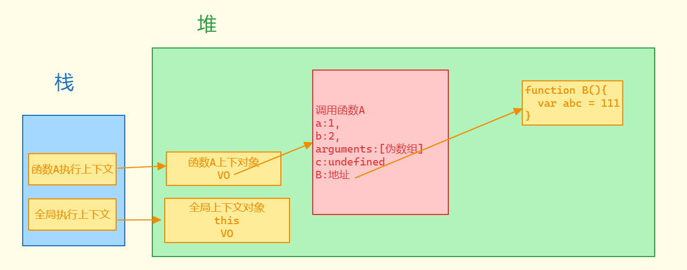

10. 如果出现重名的情况呢？

11. 变量名和参数名重复：

    1. 例如形参是 b，传入的形参值为 123，那么此时函数中定义的 var b = 101，在 VO 解析的时候，先确定形参 b:123，准备给 var b = 101 的 b 加入到 VO 的时候，正常来说是 b: undefined，但是此时发现前面形参已经定义过 b 了，就会吧这个 var b = 101 的提升忽略掉，就不会给 b 赋值为 undefined 了，不做处理，测试如下：

       ~~~js
       function A(a, b) {
             console.log(a, b) // 1, 123
             var b = 101
             // 这个 101 是将在 VO 中的 b:123 重新赋值为了 101，实际不是声明的变量 b
             console.log(a, b) // 1, 101
       }
       A(1, 123)
       ~~~

    2. 我们也可以进一步的通过 arguments 来验证，如下：

       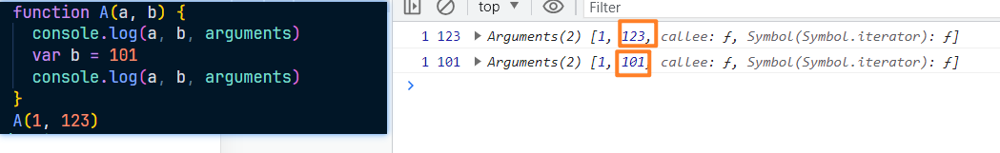

    3. 可以看到参数的值发生了变化，这也要验证出 var b = 101 实际修改的是形参定义在 VO 中的属性 b

12. 变量名和函数名重复：

    1. 如果 VO 中已经存在该名称，则函数的名称会进行覆盖，即会将 b:101 赋值为 函数对象地址，示例代码如下：

       ~~~js
       function A(a, b) {
       	console.log(b)
       	var b = 101
       	function b() {
       	console.log('bbb')
       	}
       	console.log(b)
       }
       A(1, 123)
       ~~~

    2. 测试结果如图：

       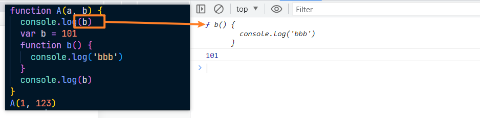

    3. 后面 101 赋值是因为执行了 b = 101

13. 示例题：

    ~~~js
    function A(a, b) {
    	console.log(b, b) // 1 f
    
    	var b = 123
    
    	function b() {}
    
    	var a = function () {}
    
    	console.log(a, b) // f 123
    }
    A(1, 2)
    ~~~

14. 所以在 GO 上也会存在类似的操作，比如定义 var g1 = 1; var g2 = 2; var g3 = 3，又因为 GO 指向 window，所以这些就会挂载到 window 上

## 补充

1. AO(Active Object)：当前正在执行的上下文中的 VO，就叫做 AO
2. 当一个上下文中代码执行的时候，如果上下文中 VO 不存在某个属性，就会从之前的上下文的中寻找，即外层的上下文，这个叫做作用域链，这里不做过多解析

## 题目

### 题一：

~~~js
var foo = 1
function bar(){
    console.log(foo)
    if(!foo){
        var foo = 10
    }
    console.log(foo)
}
bar()
/* 
	GO:{
		foo:undefined,
		bar:fn
	}
	执行 foo = 1
	bar VO:{
		foo:undefined // 无论在哪里，var 定义了就会被提出
	}
	输出第一个 foo 的时候 VO 中 foo 为 undefined，所以是 undefined
	进行判断 foo 为 undefined，取反，执行 foo = 10，此时 VO 找那个的 foo 为 10
	所以输出第二个 foo 为 10
*/
~~~

### 题二：

~~~js
var a = 1
function b() {
	console.log(a) // fn
	a = 10
	return
	function a() {}
}
b()
console.log(a) // 1
/* 
GO:{
  a:undefined,
  b:fn
}
a = 1
b的VO:{
  a:undefined (变量 a 提取 赋值为 undefined)
  // 存在 function a() {} 字面量写法，
  a ---> 被覆盖为 fn（此时函数都没有执行，处于确定上下文阶段，return 无效）
}
console.log(a) ---> fn
a = 10 ---> b的 VO 中的 a 修改为 10
console.log(a) ---> 输出 GO 中的 a，为 1
*/
~~~

### 题三：

~~~js
console.log(foo)
var foo = 'A'
console.log(foo)
var foo = function () {
	console.log('B')
}
console.log(foo)
foo()
function foo() {
	console.log('C')
}
console.log(foo)
foo()
/* 
GO:{
  foo: undefiend, (var foo = 'A', 提取变量 foo 赋值为 undefined)
  foo ---> undefiend, (var foo = func, 提取变量 foo 赋值为 undefined)
  foo ---> fn, (foo 字面量方法创建函数，覆盖 undefined 为 fn)
}
// 确定上下文阶段结束，开始执行
1、console.log(foo) ---》 内部输出C的fn
foo = 'A'
2、console.log(foo) ---》 A
foo = fn(console.log(B))
3、console.log(foo) ---》 内部输出B的fn
4、调用 foo，创建函数执行上下文，但是函数没有形参-变量-字面量函数，直接执行 ---》 B
5、foo 没有被重新赋值，因为字面量方法创建一开始就提出去了，console.log(foo) ---》 内部输出B的fn
6、调用 foo，创建函数执行上下文，但是函数没有形参-变量-字面量函数，直接执行 ---》 B
*/
~~~

### 题四：

~~~js
var foo = 1
function bar(a) {
	var a1 = a
	var a = foo
	function a() {
		console.log(a)
	}
	a1()
}
bar(3)
/* 
GO:{
   foo:  undefined,
   bar: fn
}
foo = 1

bar 的 VO:{
   a:3,（形参）
   a1: undefined, （变量）
   a: undefined (变量和形参同名忽略) 
   a:fn (字面量函数和形参同名，覆盖形参)
}
// 确定完成的 bar 函数的 V0
VO:{
   a1: undefined,
   a: fn
}

a1 = a ，(a1被赋值为 fn)
a = foo，(bar中的VO没有 foo，去GO获取，foo 为 1，a 被赋值为 1)
a1()调用了
创建 a1 函数的执行上下文
a1的VO:{
  // 没有形参-变量-字面量
}
执行 console.log(a) 此时 a1 函数的 VO 没有 a，往外层查找 a = 1
最后 console.log(a) 打印 1
*/
~~~

