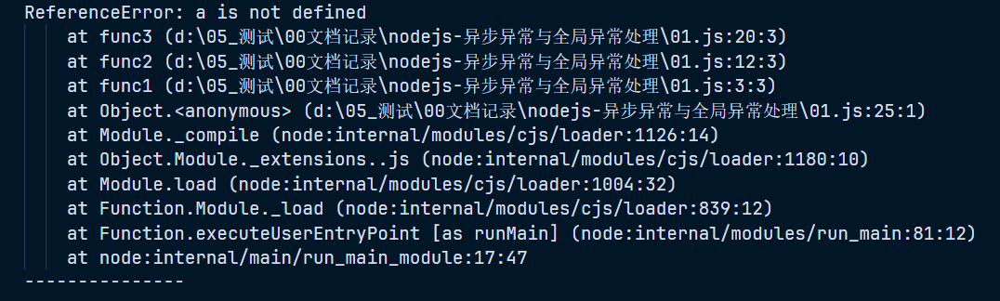
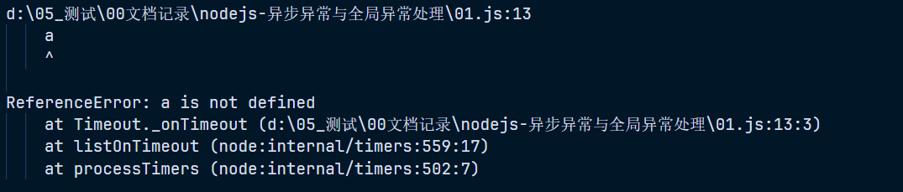
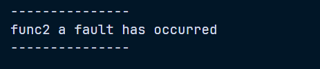
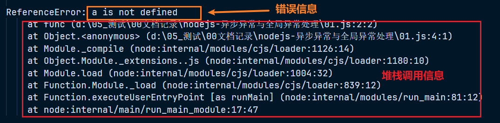
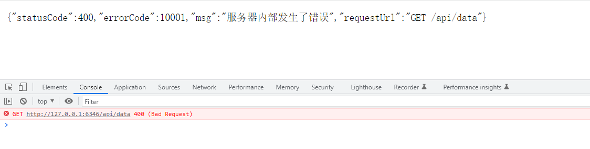
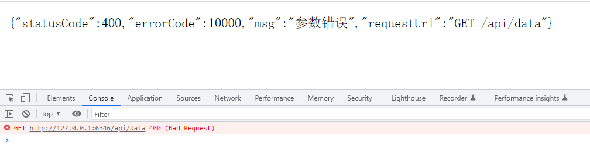

# nodejs-异常与全局异常处理

> 这篇文章算是结合自己所学的知识来做一个关于异常的阶段性的总结，不能保证自己理解的没有问题，如果有说的不对的地方还请指出
>
> 观看本文需要了解 promise、async awai、nodejs、koa、js异步 等知识，这些额外的知识本文不在进行额外的讲解

## 异常理论与异常链

1. 异常处理的方法相信大家并不陌生了，语法也就是一段 trycatch ，但是在编程中，语法只是解决问题的一种手段，如何用这种手段更好、更合理的解决问题，那就是需要一些心思去设计了

2. 函数执行的过程中，一般是有着两种情况，第一种就是没有发生异常，第二种就是发生了异常

3. 通常我们在使用函数编写代码的时候，针对一些可能觉得会发生错误的函数会作出一些处理，比如通过返回 false 或 undefined 来做出一些发生异常后的处理，但是如果遵循一个编程规范的话，发生一个错误我们是应该使用 throw 抛出异常，然后使用 trycatch 在会抛出异常的位置进行捕获，比如如下代码：

   ~~~js
   function func1() {
   	try {
   		func2()
   	} catch (error) {
   		console.log(error) // func2 error
   	}
   }
   
   function func2() {
   	throw 'func2 error'
   }
   
   func1()
   ~~~

4. 那我们在来说一下为什么不建议使用返回一个 false 或者 null 来代替一个 throw 抛出一个异常，因为在很多时候我们是需要通过一个异常的信息来进行一个代码的调试的，如果没有这个异常的信息，那么会给我们的调试带来很多的负担，我们来看一下下面这段案例，如下：

   ~~~js
   function func1() {
   	try {
   		func2()
   	} catch (error) {
   		console.log(error)
   		console.log('---------------')
   	}
   }
   
   function func2() {
   	try {
   		func3()
   	} catch (error) {
   		throw error
   	}
   }
   
   function func3() {
   	a
   }
   func1()
   ~~~

5. a 是一个未经定义就使用的属性，在代码的执行来说是一定会报一个错误的，如果此时我们只是单纯的返回一个 false，那么在 func1 中我们就很难清除发生了什么错误，我们在来看一下使用 throw 的结果，如图：

   

6. 类似这种错误信息就可以明确的指出错误所在从而降低我们的调试成本，不过这又回到了最开始的问题，这种方法可以解决，但是不够好，这种每一个函数都写一个 trycatch 来捕获异常固然可以解决我们的需求，如果函数与函数之间调用数量的增加时，每一个函数都写一段 trycatch 麻烦程度可想而知，实际编码中我们连一段重复的赋值语句都觉得麻烦，又怎么会写这种捕获异常的代码呢

7. 也有可能说我只在可能会发生异常的地方进行捕获就好了，且不提我们觉得不会出现异常的地方会不会一定不会出现，只说我们在使用一些第三方的库的时候，我们是无法能像把握自己写的代码那样去把握这些代码的，因此一个能够`全局捕获异常的处理就显得尤为重要`

8. 什么是全局捕获呢，就如我们上面的案例，func3 函数抛出的异常，我们不需要再 func1 和 func2 中捕获，只需要使用这个全局异常处理来捕获即可，这样就可以降低我们的开发成本和提升代码的安全性

9. 那为什么需要这个异常，相信大家在进行 web 开发的时候，会经常和一些状态码相爱相杀，比如常见的 404、403 等等，但是这些常见的状态码定义的错误他比较宽泛，很多时候是无法表达处一些细致的错误，这时候我们就需要获取这些异常来定义一些我们自己设计的错误信息和错误码，这种错误码是非常有必要的，他可以让我们的开发变得更加的顺利，也可也减少前后端的沟通成本，以及我们在使用一些第三方库的时候，也是只有将这种细致的错误提供给使用者才能让使用者知道是什么样的错误

## 异步异常的处理方案

### 异步异常案例

1. 上面我们举例了一下异常的处理，但是上面的方式并不能捕获异步的异常，我们可以测试一下，如下：

   ~~~js
   function func1() {
   	try {
   		func2()
   	} catch (error) {
   		console.log('---------------')
   		console.log(error)
   		console.log('---------------')
   	}
   }
   
   function func2() {
   	setTimeout(() => {
   		a
   	}, 1000)
   }
   
   func1()
   ~~~

2. 如果按照异常的捕获处理的话，出现异常之后我们应该会在 func1 中的打印这个异常的错误，结果如图：

   

3. 异常当然是抛出了，但是并不是在我们所期望的位置进行抛出的，为什么呢？这个其实是很好理解的，setTimeout 会将所执行的任务加入到宏任务队列，宏任务是一个异步队列，异步队列的执行需要等到同步任务执行完毕，而在 func2 执行的时候，这个 setTimeout 的回调都没有执行， func2 返回的是一个 undefind，所以捕获不到也是很正常的事情

### 异步异常处理方案

1. 处理异步异常怎么能少的了我们的老伙计 promise 和 async await，这里就不使用回调的方式来处理了，会调处理是非常麻烦的，至少对比 promise 来说在写法上要麻烦不少

2. 这里就不在介绍 promise 了，我们直接看一下使用 promise 来处理上面的异常抛出，如下：

   ~~~js
   async function func1() {
   	try {
   		await func2()
   	} catch (error) {
   		console.log('---------------')
   		console.log(error)
   		console.log('---------------')
   	}
   }
   
   async function func2() {
   	return new Promise((resolve, reject) => {
   		setTimeout(() => {
   			reject('func2 a fault has occurred')
   		}, 1000)
   	})
   }
   
   func1()
   ~~~

3. 结果如图：

   

## 全局异常处理中间件的实现

### 基础实现

1. 这里的话我使用的是 nodejs 的 koa 框架在做演示，在 koa 中，中间件就是一个函数，下面是一个基本的 koa 代码，如下：

   ~~~js
   const Koa = require('koa')
   const Router = require('koa-router')
   const bodyparser = require('koa-bodyparser')
   
   const app = new Koa()
   const router = new Router({ prefix: '/api' })
   
   app.use(bodyparser())
   
   router.get('/data', (ctx, next) => {
   	ctx.body = 'hello world'
   })
   
   app.use(router.routes())
   app.use(router.allowedMethods())
   
   app.listen(6346, () => {
   	console.log('service start success~')
   })
   ~~~

2. 至于这些的意思这里就不做讲解了，源码会在最后提供链接下载，在 koa 中一个中间件实际上就是一个函数，且可以接受两个参数，一个 ctx 一个 next，既然是异常处理，那么我们就不可避免的回使用到 trycatch，且 koa 中的中间件都是默认是 promise 的，因此我们可以搭配 async 和 await，于是我们可以得出一个基本的函数签名，如下：

   ~~~js
   const handleError = async (ctx, next) => {
   	try {
   		// 无错误继续下一步
   		await next()
     	} catch (error) {
       	// 返回一个基本的错误
           ctx.body = '服务器内部发生了错误, 请稍后'
     	}
   }
   ~~~

3. 现在我们将这个中间件进行使用一下，如下：

   ~~~js
   const Koa = require('koa')
   const Router = require('koa-router')
   const bodyparser = require('koa-bodyparser')
   
   const app = new Koa()
   const router = new Router({ prefix: '/api' })
   
   app.use(bodyparser())
   
   // 异常处理
   const handleError = async (ctx, next) => {
   	try {
   		// 无错误继续下一步
   		await next()
   	} catch (error) {
   		ctx.body = '服务器内部发生了错误, 请稍候'
   	}
   }
   
   // 也可以写在路由执行之前
   // app.use(handleError)
   
   router.get('/data', handleError, (ctx, next) => {
   	throw 'error'
   })
   
   app.use(router.routes())
   app.use(router.allowedMethods())
   
   app.listen(6346, () => {
   	console.log('service start success~')
   })
   ~~~

4. 这里我定义的是 get 请求，就使用浏览器发送请求测试，当然也可以使用 postman 等测试工具，测试结果如图：

   

5. 像这种我们可以明确定义出一个错误，比起那种宽泛的错误定义，明显是要好上很多，而且有了这个全局异常处理的中间件之后，函数调用链的增加也不会再给我们增加额外的开发负担

### 已知型错误与未知型错误

1. 正常来说一个错误信息，除了错误本身的信息还存在堆栈的调用信息，如图：

   

2. 而这些错误不应该全部返回给前端，所以这些错误信息，我们应该进行简化和规范，而这种规范在 web 开发中非常常见

3. 一般会返回给前端 HTTP status code(状态码)，[完整的状态码说明](https://koa.bootcss.com/index.html#request)、附带文字说明的错误信息，自定义的错误码，一般情况下就会返回这三个错误字段，当然根据规范和业务的区别，所携带的字段也会有所区别，比如我们可以在额外携带一个请求路径，这个字段包含本次错误请求的请求方法，即 get、post... 和本次请求的路径

4. 什么是已知错误，比如参数类型不符合要求，参数不匹配，这种能够判断出来的错误都属于已知错误，而未知错误程序潜在的错误，这种情况开发着是不知道的，比如链接数据的账号密码错误就是未知，如果是已知的话那肯定就是吧账号密码换成正确的了

5. 而已知型的错误我们可以正确抛出，而未知型的错误也会被全局异常处理捕获，所以这也是要区分已知和未知的所在，我们需要再全局异常处理时根据错误是已知类型还是未知类型来进行不同的错误处理

### 定义异常返回格式

1. 前面我们已经谈到过了返回错误类型的格式：HTTP status code、message、errorCode、requestUrl，这些我们可以包裹到一个对象里面

2. 格式如下：

   ~~~js
   ctx.body = {
       msg: 错误信息,
       errorCdoe: xxxxx,
       requestUrl: 'POST /api/data'
   }
   // 在 koa 指定本次返回请求结果的 HTTP status code 可以通过 ctx.status 实现
   ctx.status = 状态码
   ~~~

### 定义异常基类

1. 前面定义好返回的错误格式之后，我们现在就可以来定义需要返回的异常类，类这种方式具备很强的封装性，所以用在这里是比较合适的

2. 实现这个思路我们可以让这个异常基类继承自 Error 这个错误类，这里我就不在说项目的设计了，只是单独创建一个文件(error-tyoe.js)来实现这个错误基类

3. 我们根据需要传递的参数可以写出如下构造函数，如下：

   ~~~js
   class ErrorTypeModule extends Error {
   	constructor(status, errorCode, msg) {
   		// 使用父类的构造函数
   		super()
   		// 状态码
   		this.statusCode = status
   		// 错误码
   		this.errorCode = errorCode
   		// 错误信息
   		this.msg = msg
   	}
   }
   
   module.exports = {
   	ErrorTypeModule
   }
   ~~~

4. 这里可能有两个疑惑，requestUrl 没有定义，这个待会就知道了，主要说一下为什么需要继承 nodejs 的 Error 类，我们在编写业务接口的时候，发现错误的时候需要抛出一个错误，而使用 throw 抛出错误时，需要是一个 Error 类型的数据，所以需要继承自 Error 类

5. 下面我们就将这些实际引入到代码中，测试一下，如下：

   ~~~js
   const Koa = require('koa')
   const Router = require('koa-router')
   const bodyparser = require('koa-bodyparser')
   // 引入异常基类
   const { ErrorTypeModule } = require('./error-type')
   
   const app = new Koa()
   const router = new Router({ prefix: '/api' })
   
   app.use(bodyparser())
   
   // 异常处理
   const handleError = async (ctx, next) => {
   	try {
   		// 无错误继续下一步
   		await next()
   	} catch (error) {
   		// 此处就可以判断是否是异常基类，如果是表示就是一个已知型的错误
   		if (error instanceof ErrorTypeModule) {
   			// 错误路径可以在这里获取添加
   			error.requestUrl = `${ctx.request.method} ${ctx.request.url}`
   			// 设置 http 状态码
   			ctx.status = error.statusCode
               // 返回整个错误信息
   			ctx.body = error
   		}
   	}
   }
   
   // 也可以写在路由执行之前
   // app.use(handleError)
   
   router.get('/data', handleError, (ctx, next) => {
   	// 更换抛出错误的方式
   	// 继承 Error
   	//  - 为什么非要继承 nodejs 的 Error 类
   	//  - 因为我们需要将这个自定义的错误信息抛出
   	//  - 而抛出就需要是一个 Error 错误类型
   	const error = new ErrorTypeModule(400, 10001, '服务器内部发生了错误')
   	throw error
   })
   
   app.use(router.routes())
   app.use(router.allowedMethods())
   
   app.listen(6346, () => {
   	console.log('service start success~')
   })
   ~~~

6. 来看一下输出的结果，如图：

   

### 定义特定异常类

1. 现在我们在抛出错误的时候还是存在一个问题，我们需要传入三个参数值，而且在实际业务开发中，不可避免的会出现相同的错误，所以我们可以将每一个错误类型也选择定义成一个特定的类，如下：

   ~~~js
   class ErrorTypeModule extends Error {
   	constructor(status, errorCode, msg) {
   		super()
   		this.statusCode = status
   		this.errorCode = errorCode
   		this.msg = msg
   	}
   }
   
   // ----------------- 定义特定异常类 -----------------
   
   // 参数类型错误
   class ParamsError extends ErrorTypeModule {
   	// 对于这种我们直接定义的一些特定异常类可以设置一些默认参数
   	//  - 可以让我们在使用的时候如果不是有特殊的信息时不需要传递参数
   	constructor(errorCode, msg) {
   		super()
   		// 参数类型错误的 http 状态码比较固定为 400，这种情况下就可以直接使用固定的值
   		this.statusCode = 400
   		this.errorCode = errorCode || 10000
   		this.msg = msg || '参数错误'
   	}
   }
   
   module.exports = {
   	ErrorTypeModule,
   	ParamsError
   }
   ~~~

2. 将其放入到代码中测试，如下：

   ~~~js
   const Koa = require('koa')
   const Router = require('koa-router')
   const bodyparser = require('koa-bodyparser')
   // 引入异常基类
   const { ErrorTypeModule, ParamsError } = require('./error-type')
   
   const app = new Koa()
   const router = new Router({ prefix: '/api' })
   
   app.use(bodyparser())
   
   // 异常处理
   const handleError = async (ctx, next) => {
   	try {
   		await next()
   	} catch (error) {
   		if (error instanceof ErrorTypeModule) {
   			error.requestUrl = `${ctx.request.method} ${ctx.request.url}`
   			ctx.status = error.statusCode
   			ctx.body = error
   		}
   	}
   }
   
   router.get('/data', handleError, (ctx, next) => {
   	// 使用的时候我们可以直接抛出这个特定异常类即可
   	throw new ParamsError()
   })
   
   app.use(router.routes())
   app.use(router.allowedMethods())
   
   app.listen(6346, () => {
   	console.log('service start success~')
   })
   ~~~

3. 输出结果如图：

   

### 挂载全局

1. 封装好异常类之后，不可避免的需要再每一个接口文件里面都单独引入这个文件，可能也会觉得麻烦，所以可以将这些异常类挂载到全局变量 global 上，这是 nodejs 提供的全局变量

2. 改造后代码如下：

   ~~~js
   const Koa = require('koa')
   const Router = require('koa-router')
   const bodyparser = require('koa-bodyparser')
   // 引入异常基类
   // const { ErrorTypeModule, ParamsError } = require('./error-type')
   // 将异常类在入口文件启动时就挂在在 global 上
   const error = require('./error-type')
   global.errors = error
   
   const app = new Koa()
   const router = new Router({ prefix: '/api' })
   
   app.use(bodyparser())
   
   // 异常处理
   const handleError = async (ctx, next) => {
   	try {
   		await next()
   	} catch (error) {
   		// if (error instanceof ErrorTypeModule) {
   		if (error instanceof global.errors.ErrorTypeModule) {
   			error.requestUrl = `${ctx.request.method} ${ctx.request.url}`
   			ctx.status = error.statusCode
   			ctx.body = error
   		}
   	}
   }
   
   router.get('/data', handleError, (ctx, next) => {
   	// throw new ParamsError()
   	// 在全局变量上使用异常类
   	throw new global.errors.ParamsError()
   })
   
   app.use(router.routes())
   app.use(router.allowedMethods())
   
   app.listen(6346, () => {
   	console.log('service start success~')
   })
   ~~~

3. 测试大家就自行测试即可，这里就不在展示了，具体使用那种方法导入就看自己的习惯而定了