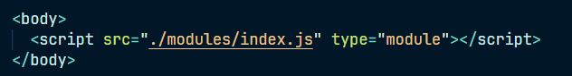
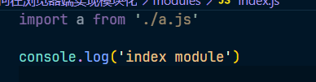
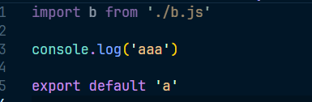
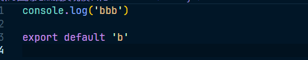
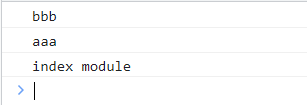
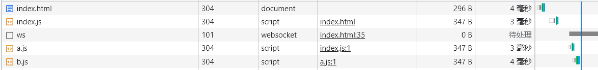
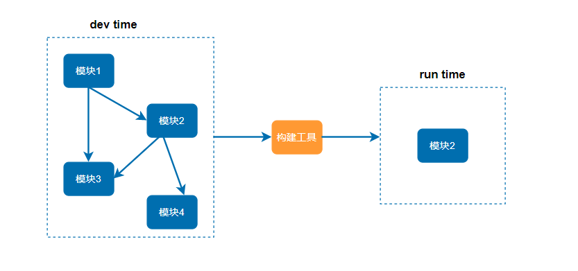

# 如何在浏览器端实现模块化

## 浏览器端的模块化

### 效率问题

- 效率问题：精细的模块划分带来了更多的 JS 文件，更多的 JS 文件带来了更多的请求，降低了页面访问效率

  - 比如现在我们有三个文件，index.js a.js b.js ，index 引用 a，a 引用 b

    

    

    

    

  - 输出如图

    

  - 此时的使用看起来没有什么问题，但是我们可以看一下网络选项卡中的请求资源，如图：

    

  - 那么如果访问一个页面，就会将每一个依赖的文件都请求一次，那么当开发项目的时候，模块的精细划分，所依赖的文件更是一个巨大的数量，那么这些 js 请求就会降低页面的访问效率

### 兼容性问题

- 兼容性问题：浏览器目前仅支持 ES6 的模块化标准，并且还存在兼容性问题
  - 现在的浏览器是不支持 **CommonJS** 模块规范的，但是一些第三方的库可能就是使用 CommonJS 书写的，那么就需要解决这个兼容的问题
  - 并且有些模块需要支持浏览器环境和 node 环境的时候，比如 axios，就需要同时支持 ES6 和 CommonJS 

### 工具问题

- 工具问题：浏览器不支持 npm 下载的第三方包
  - 这是浏览器无法直接支持的，但是我们开发的过程中，不可避免会使用第三方的包
- 而这些问题仅仅是前端工程化的一个缩影
- 当开一个具有规模的程序，将遇到非常多的非业务问题，这些问题包括：执行效率、兼容性、代码的可维护性可扩展性、团队协作、测试等等，这些问题我们统称为工程问题，工程问题和业务无关，但它深刻的影响到开发进度，如果没有一个好的工具解决这些问题，开发进度救护变得极其的缓慢

## 根本原因

问：上面提到的三个问题，为什么在 node 端没有那么明显，反而到了浏览器端变得如此严重？

答：在 node 端，运行的 js 文件在本地运行，可以读取本地文件，所以它的效率比在浏览器中远程传输高的多，所以就算存在大量的文件引用读取，也不会产生什么影响

> **根本原因**：在浏览器端，开发时态(dev time) 和运行时态(run time) 的侧重点不一样

### 开发时态

1. 模块划分越细越好
2. 支持多种模块化标准
3. 支持 npm 或其他包管理下载的模块
4. 能够解决其他工程化的问题

### 运行时态

1. 文件越少越好
2. 文件提交越小越好
3. 代码内容越乱越好（因为在运行时，可以被人家通过请求获取js文件，查看代码，文件越乱人家copy的成本越高）
4. 所有浏览器都要可以兼容
5. 能够解决其他运行时的问题，主要是执行效率问题

> **Tips**：这中差异在小项目中并不明显，可是一旦形成规模，就越来越明显，如果不解决这些问题，前端项目形成规模只能是空谈

## 解决方法

1. 既然开发时态和运行时态面临的局面有巨大的差异，因此，就需要一个工具，这个工具能够让开发者在开发时专心的写开发时态的代码，然后利用这个工具将开发时态编写的代码转换为运行时态的需要的东西

2. 这个工具，就叫做构建工具

   

3. 这样就可以让开发者专注于开发时态的代码结构，而不用担心运行时态遇到的问题了

## 常见的构建工具

- **`webpack`**
- grunt
- gulp
- browserify
- fis
- 其他

