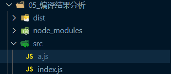
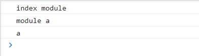
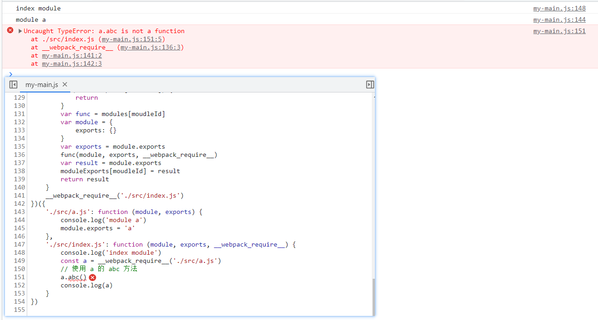
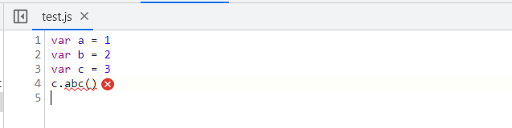
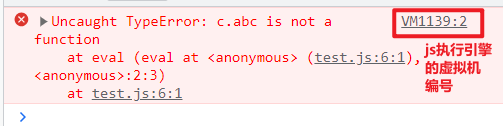
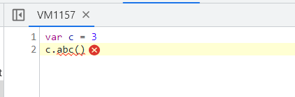
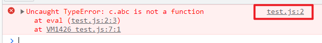
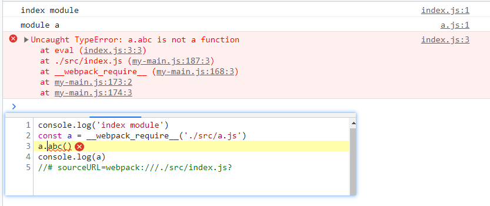

# 编译结果分析

## webpack 编译

### 代码展示

- `./src/index.js`

  ~~~js
  console.log('index module')
  const a = require('./a')
  console.log(a)
  ~~~

- `./src/a.js`

  ~~~js
  console.log('module a')
  module.exports = 'a'
  ~~~

- 文件目录

  

### 打包与结果

- 打包后 `dist/main.js` 文件如下：

  ~~~js
  /*
   * ATTENTION: The "eval" devtool has been used (maybe by default in mode: "development").
   * This devtool is neither made for production nor for readable output files.
   * It uses "eval()" calls to create a separate source file in the browser devtools.
   * If you are trying to read the output file, select a different devtool (https://webpack.js.org/configuration/devtool/)
   * or disable the default devtool with "devtool: false".
   * If you are looking for production-ready output files, see mode: "production" (https://webpack.js.org/configuration/mode/).
   */
  /******/ (() => { // webpackBootstrap
  /******/ 	var __webpack_modules__ = ({
  
  /***/ "./src/a.js":
  /*!******************!*\
    !*** ./src/a.js ***!
    \******************/
  /***/ ((module) => {
  
  eval("console.log('module a')\r\nmodule.exports = 'a'\r\n\n\n//# sourceURL=webpack:///./src/a.js?");
  
  /***/ }),
  
  /***/ "./src/index.js":
  /*!**********************!*\
    !*** ./src/index.js ***!
    \**********************/
  /***/ ((__unused_webpack_module, __unused_webpack_exports, __webpack_require__) => {
  
  eval("console.log('index module')\r\nconst a = __webpack_require__(/*! ./a */ \"./src/a.js\")\r\nconsole.log(a)\r\n\n\n//# sourceURL=webpack:///./src/index.js?");
  
  /***/ })
  
  /******/ 	});
  /************************************************************************/
  /******/ 	// The module cache
  /******/ 	var __webpack_module_cache__ = {};
  /******/ 	
  /******/ 	// The require function
  /******/ 	function __webpack_require__(moduleId) {
  /******/ 		// Check if module is in cache
  /******/ 		var cachedModule = __webpack_module_cache__[moduleId];
  /******/ 		if (cachedModule !== undefined) {
  /******/ 			return cachedModule.exports;
  /******/ 		}
  /******/ 		// Create a new module (and put it into the cache)
  /******/ 		var module = __webpack_module_cache__[moduleId] = {
  /******/ 			// no module.id needed
  /******/ 			// no module.loaded needed
  /******/ 			exports: {}
  /******/ 		};
  /******/ 	
  /******/ 		// Execute the module function
  /******/ 		__webpack_modules__[moduleId](module, module.exports, __webpack_require__);
  /******/ 	
  /******/ 		// Return the exports of the module
  /******/ 		return module.exports;
  /******/ 	}
  /******/ 	
  /************************************************************************/
  /******/ 	
  /******/ 	// startup
  /******/ 	// Load entry module and return exports
  /******/ 	// This entry module can't be inlined because the eval devtool is used.
  /******/ 	var __webpack_exports__ = __webpack_require__("./src/index.js");
  /******/ 	
  /******/ })()
  ;
  ~~~

- 运行结果如图：

  

## 手写打包结果

> 要完成这个打包结果，我们的先决要素就是要获取每个模块的代码，只有获取都代码才有后续的打包生产的结果，所以我们要做的事情首先就是要将所有的模块的合并到一起(这里是两个模块)
>
> 有了所有的代码之后，要做的事情不就是运行代码获得结果吗，且打包后的结果是不存在任何模块化的东西，那些 commonjs 和 es6 这些都不会存在，就是一个普普通通的函数
>
> 确定了开头需要完成的事情，我们就可以创建一个 my-main.js 文件来手写一下

### 创建保存全部模块的对象

1. 保存全部模块的代码，使用对象来保存是一个不错的选择，所以我们可以写出一个这样的对象，如下：

   ~~~js
   var modules = {}
   ~~~

2. 而使用对象，那么就要保证每个模块都有一个唯一的 key，而一个模块什么是唯一的？路径，每个模块的路径都是唯一的，所以我们可以将这个模块的路径，作为一个唯一的 key，这里我们两个模块的路径为 ./src/index.js 和 ./src/main.js，所以可以完善一下对象，如下：

   ~~~js
   var modules = {
       "./src/index.js": null,
       "./src/main.js": null
   }
   ~~~

3. 既然属性名有了，那么属性值也要确定，这个属性值就是每个模块文件里面所编写的代码，通过这种结构，要获取一个模块的代码，只需要使用模块的路径就可以获取到

4. 要完成这个对象属性的值，我们要保证的就是每个模块都是独立的，模块的代码不会污染全局变量，影响其他模块的代码。所以我们就可以确定是需要一个作用域，说到作用域，那么我们常见的手段就是创建一个函数，所以只要将每个模块的代码都放在一个单独的函数内部，那么各个模块的代码就不会造成变量污染，代码如下：

   ~~~js
   var modules = {
   	// - 但是普通的js里面就没有 module 这个东西，所以需要用参数传递进去，也会存在直接使用 exports 导出，所以还要传入一个 exports
   	'./src/a.js': function (module, exports) {
   		console.log('module a')
   		module.exports = 'a'
   	},
   	// - 还会存在使用 require 函数，所以也需要传入
   	'./src/index.js': function (module, exports, require) {
   		console.log('index module')
   		// originCode: const a = require('./a')
   		// 上面的代码会被 webpack 处理，变成唯一的路径，所以这里可以手写替换
   		const a = require('./src/a.js')
   		console.log(a)
   	}
   }
   ~~~

5. 现在我们就已经得到了一个包含全部模块代码的对象，但是这里 modules 这个对象本身也会污染全局变量对象，这个后续解决

### 创建执行模块代码的函数 require

1. 上面确保模块之间不会造成变量污染之后，也保存了模块之间的代码，所以我们还需要一个函数来执行这些代码，可以使用自执行函数避免全局变量污染，这个函数既然是执行模块的代码，那么就要接受一个参数，这个参数代表保存了模块代码的对象，如下：

   ~~~js
   ;(function (modules){
       
   })()
   ~~~

2. 这个函数，当写出一个这个执行函数的基础结构之后，我们就可以传入参数，这里我们之间可以把这个保存全部模块代码的对象使用自变量的方式当做参数直接传入，就可以避免这个保存全局代码的对象会造成变量污染，如下：

   ~~~js
   ;(function (modules){
       
   })({
   	'./src/a.js': function (module, exports) {
   		console.log('module a')
   		module.exports = 'a'
   	},
   	'./src/index.js': function (module, exports, require) {
   		console.log('index module')
   		const a = require('./src/a.js')
   		console.log(a)
   	}
   })
   ~~~

3. 而这个函数第一步就是会运行入口文件的代码，运行这个文件就可以根据依赖依次执行完本项目所有依赖的模块，而运行一个模块的代码，我们在学习模块化的时候就知道，引入一个模块其实就是执行一个模块的代码，所以我们其实就是完成这个 require 方法，这个方法接受一个参数，模块ID，这里模块ID即一个模块唯一的东西，这里就是模块的路径，代码如下：

   ~~~js
   ;(function (modules){
       function require(moudleId) {}
       // 执行入口文件
       require('./src/index.js')
   })({
   	'./src/a.js': function (module, exports) {
   		console.log('module a')
   		module.exports = 'a'
   	},
   	'./src/index.js': function (module, exports, require) {
   		console.log('index module')
   		const a = require('./src/a.js')
   		console.log(a)
   	}
   })
   ~~~

4. 得到这个模块 id 之后，就可以从保存全部模块的 modules 对象里面获取到这个模块的对应的函数，得到这个函数之后无非就是运行这个函数，因为这个函数里面本来就包含了对应模块的代码，所以运行这个函数就等于是把引入的模块执行了一次，如下：

   ~~~js
   ;(function (modules){
       function require(moudleId) {
           // 根据模块id在 modules 对象里面获取
           var func = modules[moudleId]
           // 然后执行这个函数，但是这个函数执行起来还少了一些参数
           func()
       }
       // 执行入口文件
       require('./src/index.js')
   })({
   	'./src/a.js': function (module, exports) {
   		console.log('module a')
   		module.exports = 'a'
   	},
   	'./src/index.js': function (module, exports, require) {
   		console.log('index module')
   		const a = require('./src/a.js')
   		console.log(a)
   	}
   })
   ~~~

5. 我们在运行这个模块代码的时候，还缺少了三个参数，module, exports, require，目前还有 module, exports 是未定义的，所以我们需要解决这两个参数，而 module 本身就是一个对象，但是这个对象里面会存在一个属性，exports ，我们在模块中一般有两种导出方式， module 和 exports ，所以我们可以得出这两个参数如下：

   ~~~js
   ;(function (modules){
       function require(moudleId) {
           var func = modules[moudleId]
           // module 是一个普通对象
   		var module = {
   			// module 里面存在一个 exports 对象
   			exports: {}
   		}
           // exports 就是 module里面的 exports 属性
           var exports = module.exports
           // 传入参数开始运行，现在就要获取运行这个模块之后得到的导出结果
           func(module, exports, require) // 执行模块
       }
       // 执行入口文件
       require('./src/index.js')
   })({
   	'./src/a.js': function (module, exports) {
   		console.log('module a')
   		module.exports = 'a'
   	},
   	'./src/index.js': function (module, exports, require) {
   		console.log('index module')
   		const a = require('./src/a.js')
   		console.log(a)
   	}
   })
   ~~~

6. 而在执行一个模块代码的时候，执行到最后的导出时，就是对对象 module 或者 exports 对象的重新赋值而已，如果不太理解，我们可以写一段测试代码，如下：

   ~~~js
   // 模拟传入的 module 和 exports
   var _module = {
   	_exports: {}
   }
   
   function fn(__module, __exports) {
   	// 这是模块内部的代码
   	const aaa = 'aaa'
   	const bbb = 'bbb'
   	// 模拟导出
   	__module._exports = aaa + bbb
   }
   
   fn(_module, _module._exports)
   
   // 打印结果查看-这里就是模块代码执行后获取的导出结果
   console.log(_module) // { _exports: 'aaabbb' }
   ~~~

7. 所以同理当模块内部使用 module.exports 导出对象的时候，会改变外部的这个 module.exports 的值，在外部就可以获取，如下：

   ~~~js
   ;(function (modules){
       function require(moudleId) {
           var func = modules[moudleId]
           // module 是一个普通对象
   		var module = {
   			// module 里面存在一个 exports 对象
   			exports: {}
   		}
           // exports 就是 module里面的 exports 属性
           var exports = module.exports
           // 传入参数开始运行，现在就要获取运行这个模块之后得到的导出结果
           func(module, exports, require) // 执行模块
           var result = module.exports
           // 最后把这个结果返回
           return result
       }
       // 执行入口文件
       require('./src/index.js')
   })({
   	'./src/a.js': function (module, exports) {
   		console.log('module a')
   		module.exports = 'a'
   	},
   	'./src/index.js': function (module, exports, require) {
   		console.log('index module')
   		const a = require('./src/a.js')
   		console.log(a)
   	}
   })
   ~~~

### 实现 commonJS 的缓存效果

1. commonJS 具有缓存，同一个模块不会一直重复的反复导入，缓存之后，如果出现多个模块都引入了同一个模块的时候，就不会去重复的导入和执行了

2. 实现这个也很简单，只需要定义一个对象，保存已经执行的模块和其结果，如下：

   ~~~js
   ;(function (modules){
       function require(moudleId) {
   		// 在执行前先查看有没有缓存
   		if (moduleExports[moudleId]) {
   			// 如果有缓存就不在导入并执行，直接返回
   			return
   		}
           var func = modules[moudleId]
   		var module = {
   			exports: {}
   		}
           var exports = module.exports
           func(module, exports, require) 
           var result = module.exports
           // 把模块的导出结果缓存起来
           moduleExports[moudleId] = result
           return result
       }
       // 执行入口文件
       require('./src/index.js')
   })({
   	'./src/a.js': function (module, exports) {
   		console.log('module a')
   		module.exports = 'a'
   	},
   	'./src/index.js': function (module, exports, require) {
   		console.log('index module')
   		const a = require('./src/a.js')
   		console.log(a)
   	}
   })
   ~~~

### webpack 细节处理

- webpack中为了避免和 node 环境中 require函数 重名，把函数重命名为了 `__webpack_require__`

  ~~~js
  ;(function (modules) {
  	var moduleExports = {}
  
  	function __webpack_require__(moudleId) {
  		if (moduleExports[moudleId]) {
  			return
  		}
  		var func = modules[moudleId]
  		var module = {
  			exports: {}
  		}
  		var exports = module.exports
  		func(module, exports, __webpack_require__)
  		var result = module.exports
  		moduleExports[moudleId] = result
  		return result
  	}
  	__webpack_require__('./src/index.js')
  })({
  	'./src/a.js': function (module, exports) {
  		console.log('module a')
  		module.exports = 'a'
  	},
  	'./src/index.js': function (module, exports, __webpack_require__) {
  		console.log('index module')
  		const a = __webpack_require__('./src/a.js')
  		console.log(a)
  	}
  })
  ~~~

## 对比 webpack 打包结果

- 这里我删掉了多余的注释部分，并打上部分注释对比，如下：

  ~~~js
  ;(() => {
  	// 这里就相当于我们自己写的 modules 对象，存储所有模块的的代码
  	//  - 并且函数也会接收三个参数
  	var __webpack_modules__ = {
  		'./src/a.js': module => {
  			eval(
  				"console.log('module a')\r\nmodule.exports = 'a'\r\n\n\n//# sourceURL=webpack:///./src/a.js?"
  			)
  		},
  
  		'./src/index.js': (
  			__unused_webpack_module,
  			__unused_webpack_exports,
  			__webpack_require__
  		) => {
  			eval(
  				'console.log(\'index module\')\r\nconst a = __webpack_require__(/*! ./a */ "./src/a.js")\r\nconsole.log(a)\r\n\n\n//# sourceURL=webpack:///./src/index.js?'
  			)
  		}
  	}
  
  	// 这里就是定义保存模块导出结构的变量-实现缓存
  	var __webpack_module_cache__ = {}
  
  	// 这个就是相当于 require 的导入函数
  	//  - 接收一个模块id
  	function __webpack_require__(moduleId) {
  		// 获取当前这个模块是否在缓存中
  		var cachedModule = __webpack_module_cache__[moduleId]
  		// 如果在就直接返回
  		if (cachedModule !== undefined) {
  			return cachedModule.exports
  		}
  		// 定义 module，但是这里没有直接给 module 定义一个属性 exports
  		//  - 而是先缓存导出结果的变量先赋值，在赋值给 module 可以省略后续重复赋值的过程
  		var module = (__webpack_module_cache__[moduleId] = {
  			exports: {}
  		})
  
  		// 通过模块id，在保存所有模块对象中找到对应的模块函数并传入参数执行
  		__webpack_modules__[moduleId](module, module.exports, __webpack_require__)
  
  		// 因为在内部会 module.exports 重新赋值，所以外部就会改变，这里可以直接返回导出的结果
  		return module.exports
  	}
  
  	// 执行入口文件
  	var __webpack_exports__ = __webpack_require__('./src/index.js')
  })()
  ~~~

## 为什么使用 eval

- 使用 eval 可以方便调试，我们先看一下我们使用正常函数编写的情况，手动编造一个错误，错误输出显示，如下：

  ~~~js
  ;(function (modules) {
  	var moduleExports = {}
  
  	function __webpack_require__(moudleId) {
  		if (moduleExports[moudleId]) {
  			return
  		}
  		var func = modules[moudleId]
  		var module = {
  			exports: {}
  		}
  		var exports = module.exports
  		func(module, exports, __webpack_require__)
  		var result = module.exports
  		moduleExports[moudleId] = result
  		return result
  	}
  	__webpack_require__('./src/index.js')
  })({
  	'./src/a.js': function (module, exports) {
  		console.log('module a')
  		module.exports = 'a'
  	},
  	'./src/index.js': function (module, exports, __webpack_require__) {
  		console.log('index module')
  		const a = __webpack_require__('./src/a.js')
          // 使用 a 的 abc 方法
  		a.abc()
  		console.log(a)
  	}
  })
  ~~~

- 我们看一下报错信息，如图：

  

- 可以看到源代码里面提供的报错代码被还可以看到除开本模块以外的其余模块，如果是一个开发中的项目，那么这个代码量就很大了，调试也会相对的麻烦不少

- 我们先自己写一个测试文件，test.js，代码如下：

  ~~~js
  var a = 1
  var b = 2
  var c = 3
  c.abc()
  ~~~

- 报错如图：

  

- 但是如果换成 eval 方式拿，代码如下：

  ~~~js
  var a = 1
  var b = 2
  // var c = 3
  // c.abc()
  
  eval('var c = 3\nc.abc()')
  ~~~

- 报错如图：

  

- 看一下源代码里面报错，如图：

  

- 现在代码只有简单的两行了，因为 eval 里面的代码是放入另一个环境执行，所以浏览器会认为这是一个单独执行环境，形成了类型模块的结构，就不会看到其他所有的代码了，对我们调试的时候，会有一定的帮助

- 而且为了我们看到更加的清楚，VM1139:2 这个虚拟机编号也是可以替换的，如下：

  ~~~js
  var a = 1
  var b = 2
  // var c = 3
  // c.abc()
  // 写上注释即可，格式为： //# sourceURL=xxx
  // - xxx 就是提示的信息
  eval('var c = 3\nc.abc()//# sourceURL= test.js')
  ~~~

- 如图：

  

- 所以我们可以把手写的函数式改为使用 eval 执行，如下：

  ~~~js
  ;(function (modules) {
  	var moduleExports = {}
  
  	function __webpack_require__(moudleId) {
  		// 在执行前先查看有没有缓存
  		if (moduleExports[moudleId]) {
  			return
  		}
  		var func = modules[moudleId]
  		var module = {
  			exports: {}
  		}
  		var exports = module.exports
  		func(module, exports, __webpack_require__)
  		var result = module.exports
  		moduleExports[moudleId] = result
  		return result
  	}
  	__webpack_require__('./src/index.js')
  })({
  	'./src/a.js': function (module, exports) {
  		// console.log('module a')
  		// module.exports = 'a'
  		eval(
  			"console.log('module a')\nmodule.exports = 'a'\n //# sourceURL=webpack:///./src/a.js?"
  		)
  	},
  	'./src/index.js': function (module, exports, __webpack_require__) {
  		// console.log('index module')
  		// const a = __webpack_require__('./src/a.js')
  		// a.abc()
  		// console.log(a)
  		eval(
  			"console.log('index module')\nconst a = __webpack_require__('./src/a.js')\na.abc()\nconsole.log(a)\n//# sourceURL=webpack:///./src/index.js?"
  		)
  	}
  })
  ~~~

- 报错如图：

  

