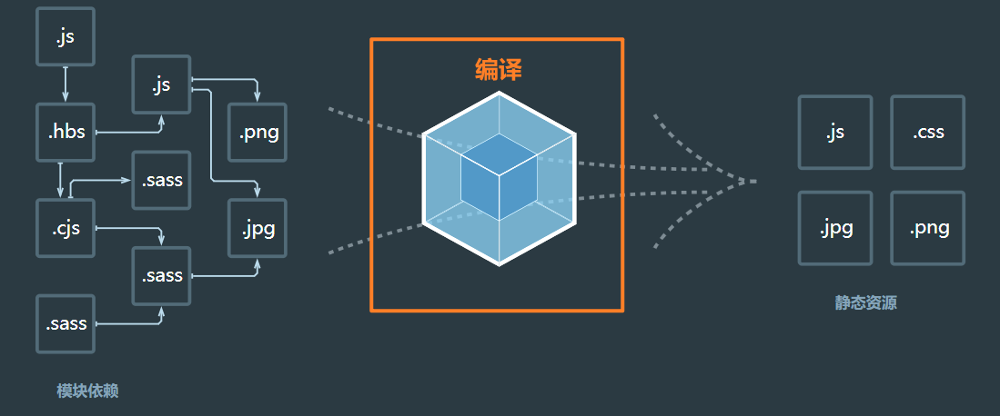
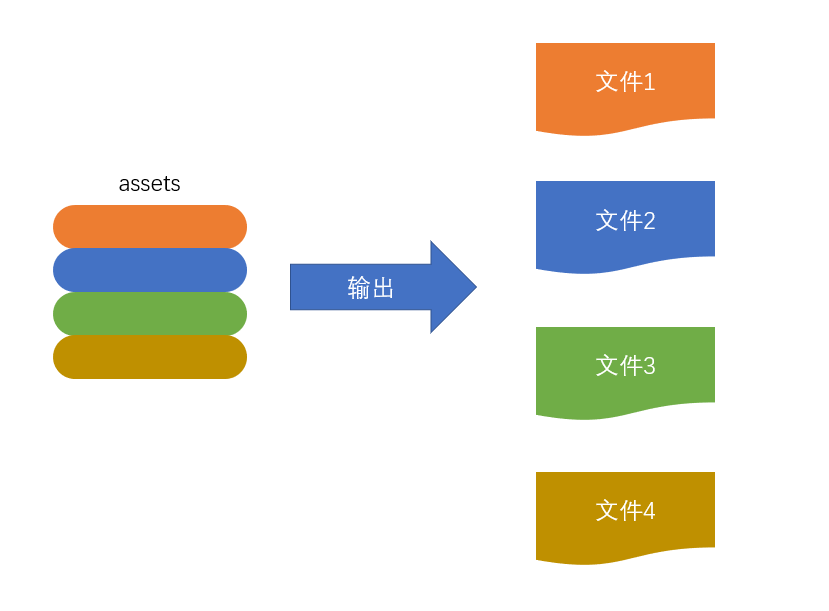

# webpack 编译过程

webpack 的作用是将源代码编译（构建、打包）的过程

整个过程大致分为三个步骤：

~~~
初始化 --> 编译 --> 输出
~~~

## 初始化

1. 此阶段，webpack 会将**CLI参数、配置文、默认配置**进行融合，形成一个最终的配置对象
2. 对配置的处理过程是依托一个第三方库`yargs`完成的
3. 此阶段相对比较简单，主要是为接下来的编译阶段做必要的准备
4. 目前，可以简单的理解为，初始化阶段主要用于产生一个最终的配置

## 编译

### 创建 chunk

- chunk是 webpack 在内部构建过程中的一个概念，译为`块`，它表示通过某个入口找到的所有依赖的统称。根据入口模块（默认为`./src/index.js`）创建一个chunk

  

- 每个chunk都有至少两个属性：

  - name：默认为 main
  - id：唯一编号，开发环境和 name 相同，生产环境是一个数字，从0开始

### 构建所有依赖模块

> AST在线测试工具：[https://astexplorer.net/](https://gitee.com/link?target=https%3A%2F%2Fastexplorer.net%2F)

### 产生chunk assets

- 在第二步完成后，chunk中会产生一个模块列表，列表中包含了**模块id**和**模块转换后的代码**

- 接下来，webpack会根据配置为chunk生成一个资源列表，即`chunk assets`，资源列表可以理解为是生成到最终文件的文件名和文件容

  

  > chunk hash是根据所有chunk assets的内容生成的一个hash字符串 hash：一种算法，具体有很多分类，特点是将一个任意长度的字符串转换为一个固定长度的字符串，而且可以保证原始内容不变，产生的hash字符串就不变

- 简图

  

### 合并 chunk assets

- 将多个chunk的assets合并到一起，并产生一个总的hash

  

## 输出

- 此步骤非常简单，webpack将利用node中的fs模块（文件处理模块），根据编译产生的总的assets，生成相应的文件

  

## 总过程

.png)

## 涉及术语

1. module：模块，分割的代码单元，webpack中的模块可以是任何内容的文件，不仅限于JS
2. chunk：webpack内部构建模块的块，一个chunk中包含多个模块，这些模块是从入口模块通过依赖分析得来的
3. bundle：chunk构建好模块后会生成chunk的资源清单，清单中的每一项就是一个bundle，可以认为bundle就是最终生成的文件
4. hash：最终的资源清单所有内容联合生成的hash值
5. chunkhash：chunk生成的资源清单内容联合生成的hash值
6. chunkname：chunk的名称，如果没有配置则使用main
7. id：通常指chunk的唯一编号，如果在开发环境下构建，和chunkname相同；如果是生产环境下构建，则使用一个从0开始的数字进行编号