# 自动生成目录

> html-webpack-plugin

当我们使用 npx webpack 进行打包之后，会发现只会生成一些js文件，没有一个html这种页面文件，但是我们的代码是要运行在页面上的，此时就需要这个插件来帮助我们生成一个 html 页面的文件

如果在打包之后手动的添加一个 index.html 文件，然后引用打包后的js文件也可以，但是当命名规则是 filename: '[name].[chunkhash:5].js' 时，此时每次改动内容就会改变生成 js 文件的名称，所以我们需要一个插件，可以帮助我们来自动生成这个 html 文件，并匹配每次重新打包后的 js 文件，如图：

安装，使用：

~~~js
const { CleanWebpackPlugin } = require('clean-webpack-plugin')
const HtmlWebpackPlugin = require('html-webpack-plugin')

module.exports = {
	mode: 'production',
	output: {
		path: __dirname + '/dist',
		filename: '[name].[chunkhash:5].js'
	},
	plugins: [new CleanWebpackPlugin(), new HtmlWebpackPlugin()]
}
~~~

重新运行 npx webpack 进行打包，如图：

此时打包后的结果就会存在 index.html 文件了，且引用的就是这个js文件，如图：

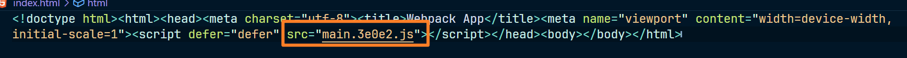

这个是插件自带的默认模板内容，如果需要使用我们自己定义的模板，可以通过传入一个对象，设置 **`template`** 属性，比如我们希望我们的模板会在页面上显示一个 h1 标题的 hello world 和一个p标签，里面包含一段描述，我们就可以先自己定义一个这样的模板，一般是建立在 public 文件夹的，如图：

index.html 模板内容如图：

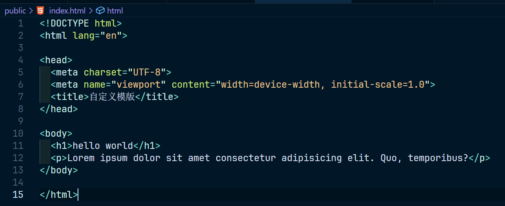

现在我们来更改一下配置，如下：

~~~js
const { CleanWebpackPlugin } = require('clean-webpack-plugin')
const HtmlWebpackPlugin = require('html-webpack-plugin')

module.exports = {
	mode: 'production',
	output: {
		path: __dirname + '/dist',
		filename: '[name].[chunkhash:5].js'
	},
	plugins: [
		new CleanWebpackPlugin(),
		new HtmlWebpackPlugin({
			template: './public/index.html'
		})
	]
}
~~~

运行 npx webpack 结果看一下，如图：

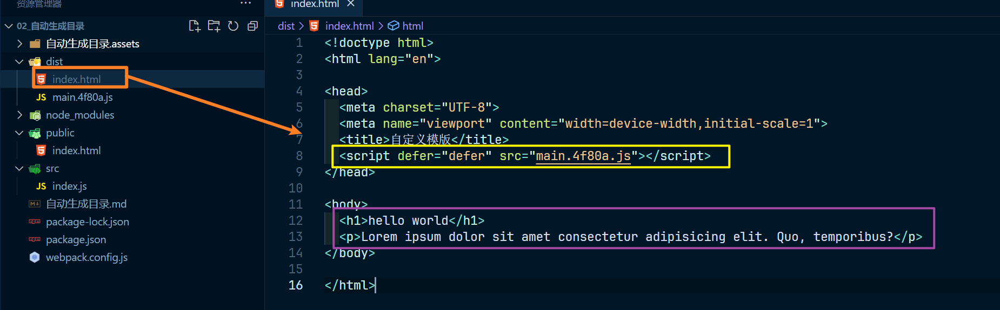

运行起来的页面效果也是没有任何问题，如图：

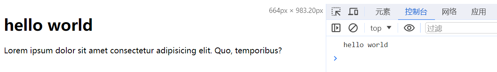

输出的也是 src/index.js 文件里面编写的 js 语句 console.log('hello world')

**目前是只有一个 入口js文件，如果是多个呢**

增加 a.js 文件，如图：

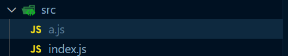

a的文件内容如图：

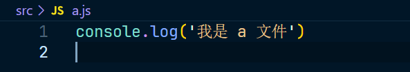

现在修改配置，如下：

~~~js
const { CleanWebpackPlugin } = require('clean-webpack-plugin')
const HtmlWebpackPlugin = require('html-webpack-plugin')

module.exports = {
	mode: 'production',
	entry: {
		home: './src/index.js',
		a: './src/a.js'
	},
	output: {
		path: __dirname + '/dist',
		filename: '[name].[chunkhash:5].js'
	},
	plugins: [
		new CleanWebpackPlugin(),
		new HtmlWebpackPlugin({
			template: './public/index.html'
		})
	]
}
~~~

现在看一下打包后的结果，如图：

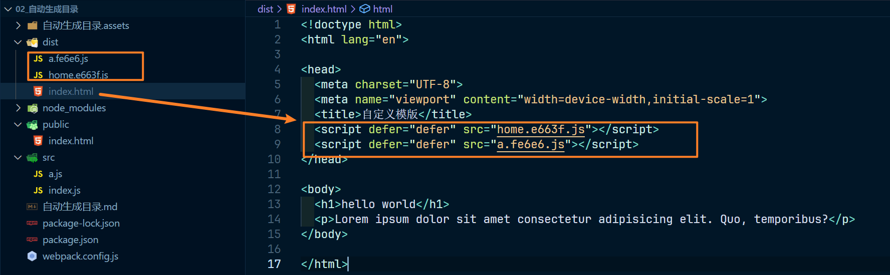

就生成了两个 js 文件，页面运行效果如图：

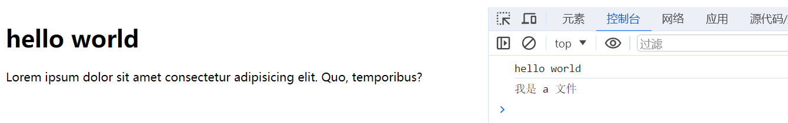

如果有多个入口文件，但是我只希望指定一些文件生成 script 标签引入js到打包后的 index.html 文件的话，可以通过配置 `chunks`，这个属性默认是 all 也就是默认所有的 chunk 都放入 index.html 文件中，通过数组配置就可以指定自己需要的，配置修改如下：

~~~js
const { CleanWebpackPlugin } = require('clean-webpack-plugin')
const HtmlWebpackPlugin = require('html-webpack-plugin')

module.exports = {
	mode: 'production',
	entry: {
		home: './src/index.js',
		a: './src/a.js'
	},
	output: {
		path: __dirname + '/dist',
		filename: '[name].[chunkhash:5].js'
	},
	plugins: [
		new CleanWebpackPlugin(),
		new HtmlWebpackPlugin({
			template: './public/index.html',
			chunks: ['home']
		})
	]
}
~~~

打包结果如图：

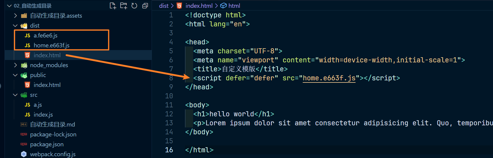

可以看到，虽然还是生成了两个 chunk 文件，但是只有我们需要的 chunk 添加进了 index.html

这个页面文件名称也可以修改的，我们一般是叫做 index，也可以修改，通过配置 `filename` 即可，如下：

~~~js
const { CleanWebpackPlugin } = require('clean-webpack-plugin')
const HtmlWebpackPlugin = require('html-webpack-plugin')

module.exports = {
	mode: 'production',
	entry: {
		home: './src/index.js',
		a: './src/a.js'
	},
	output: {
		path: __dirname + '/dist',
		filename: '[name].[chunkhash:5].js'
	},
	plugins: [
		new CleanWebpackPlugin(),
		new HtmlWebpackPlugin({
			template: './public/index.html',
			chunks: ['home'],
			filename: 'main.html'
		})
	]
}
~~~

打包结果如图：

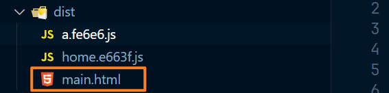

而如果想实现多个页面，一个页面使用一个js，可以多使用几次这个插件，如下：

~~~js
const { CleanWebpackPlugin } = require('clean-webpack-plugin')
const HtmlWebpackPlugin = require('html-webpack-plugin')

module.exports = {
	mode: 'production',
	entry: {
		home: './src/index.js',
		a: './src/a.js'
	},
	output: {
		path: __dirname + '/dist',
		filename: '[name].[chunkhash:5].js'
	},
	plugins: [
		new CleanWebpackPlugin(),
		new HtmlWebpackPlugin({
			template: './public/index.html',
			chunks: ['home'],
			filename: 'home.html'
		}),
		new HtmlWebpackPlugin({
			template: './public/a.html', 
			chunks: ['a'],
			filename: 'a.html'
		})
	]
}
~~~

打包结果如图：

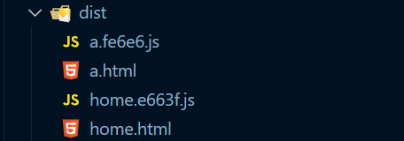

可以看看 html 文件的内容，a.html 文件内容如图：

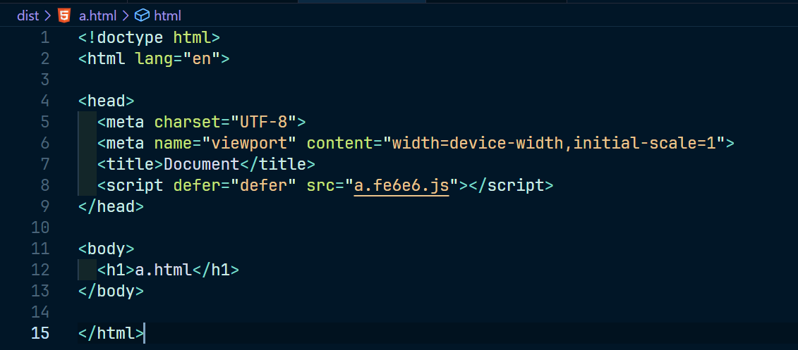

home.html 文件内容如图：

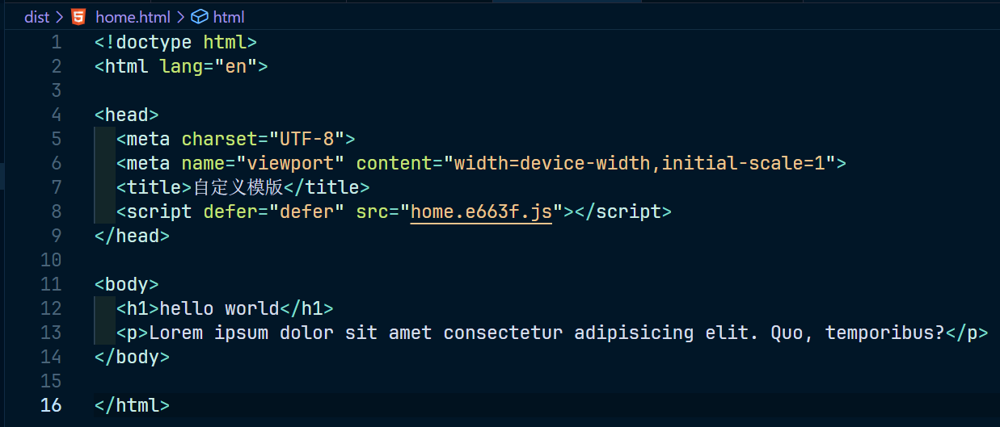

如果我们给输出的chunk文件增加一个路径呢？如下：

~~~js
const { CleanWebpackPlugin } = require('clean-webpack-plugin')
const HtmlWebpackPlugin = require('html-webpack-plugin')

module.exports = {
	mode: 'production',
	entry: {
		home: './src/index.js',
		a: './src/a.js'
	},
	output: {
		path: __dirname + '/dist',
		filename: 'js/[name].[chunkhash:5].js' // 增加 js 文件夹路径
	},
	plugins: [
		new CleanWebpackPlugin(),
		new HtmlWebpackPlugin({
			template: './public/index.html',
			chunks: ['home']
		})
	]
}
~~~

查看打包后的结果，如图：

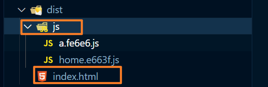

我们查看一些 index.html 文件现在引入的文件路径是否正确，如图：

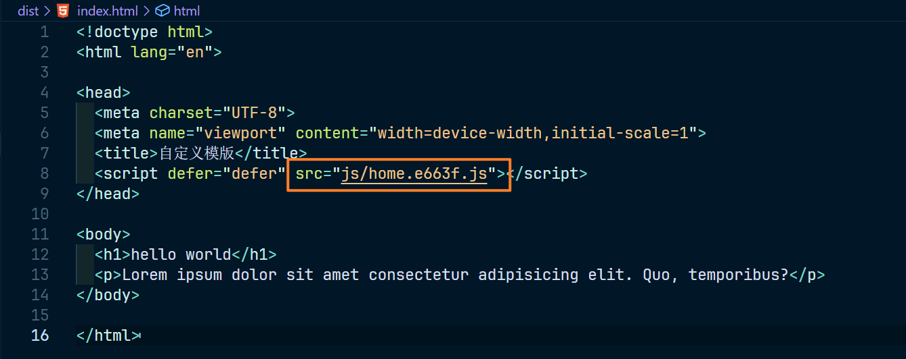

可以看到，也是没有什么问题的
