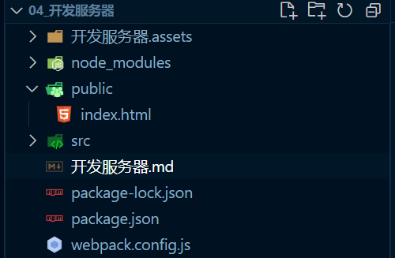
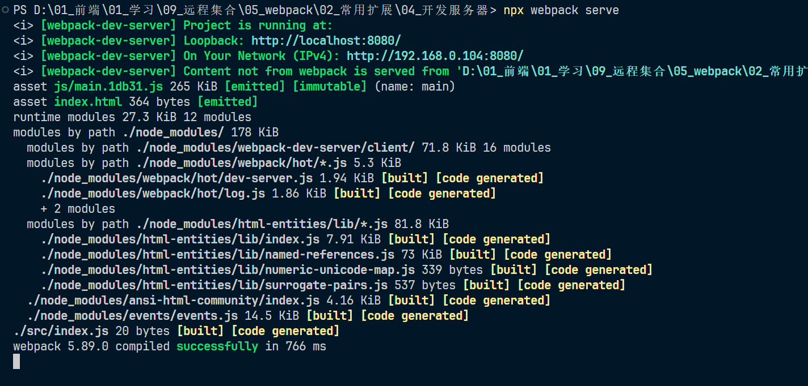
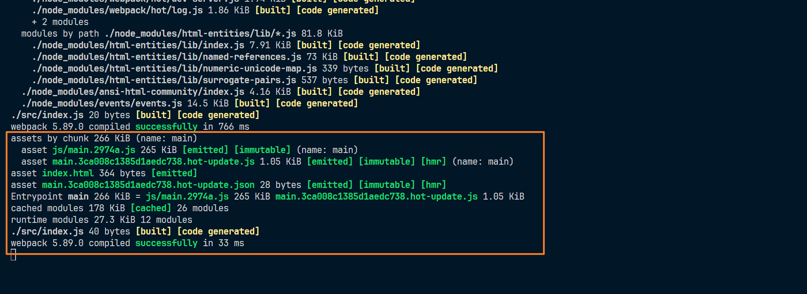
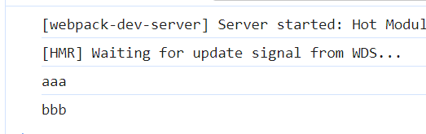
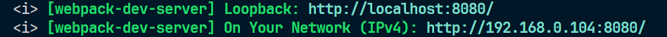
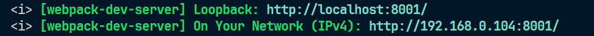
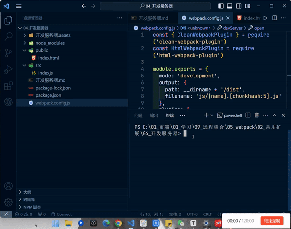

# 开发服务器

## 什么是开发服务器

1. 在**开发阶段**，目前的步骤是编写代码、打包、运行、调试这个过程过于繁琐，每次更改代码都要重新打包运行，而每次这样就会给我们开发造成非常多的时间浪费
2. 因此为了解决这些问题，webpack 官方制作了一个单独的库：**webpack-dev-server**
3. 这个库既不是 plugin 也不是 loader，安装之后会可以实现一个类似监听的效果，每当我们修改代码保存的时候，会自动进行打包，将我们的代码效果通过一个本地网址显示出来，但是不会输出这个打包目录

## webpack-dev-server 使用

1. 安装

   ~~~
   npm install webpack-dev-server --save-dev

2. 使用他最简单的方式，就是在 webpack.config.js 所在的目录下运行如下命令：

   ~~~
   npx webpack serve

3. 修改 index.js 文件内容如下：

   ~~~js
   console.log('aaa')
   ~~~

4. webpack.config.js 配置如下：

   ~~~js
   const { CleanWebpackPlugin } = require('clean-webpack-plugin')
   const HtmlWebpackPlugin = require('html-webpack-plugin')
   
   module.exports = {
   	mode: 'development',
   	output: {
   		path: __dirname + '/dist',
   		filename: 'js/[name].[chunkhash:5].js'
   	},
   	plugins: [
   		new CleanWebpackPlugin(),
   		new HtmlWebpackPlugin({
   			template: './public/index.html'
   		})
   	]
   }
   ~~~

5. 执行命令 npx webpack serve 目录结构如图：

   

6. 结果如图：

   

7. 终端如图：

   

8. 可以看到并没有退出，而是一直在监听的状态，当我们修改一下 index.js 文件保存，如下：

   ~~~js
   console.log('aaa')
   console.log('bbb')
   ~~~

9. 终端如图：

   

10. 结果如图：

    

11. 这样就省略了我们打包那些繁琐的步骤，只需要专注开发即可

## 执行 webpack-dev-server 命令，做了什么

1. 内部执行 webpack 命令，传递命令参数
2. 开启 watch
3. 注册 hooks：类似于 plugin，webpack-dev-server 会向 webpack 中注册一些钩子函数，主要功能如下：
   1. 将资源列表（assets）保存起来
   2. 禁止 webpack 输出文件
4. 用 express 开启一个服务器，监听某个端口，当请求到达后，根据请求的路径，返回对应的资源

## 修改配置

### 修改端口号 port

1. 修改端口号，默认开启占用的端口号是 8080，如图：

   

2. 修改配置如下：

   ~~~js
   const { CleanWebpackPlugin } = require('clean-webpack-plugin')
   const HtmlWebpackPlugin = require('html-webpack-plugin')
   
   module.exports = {
   	mode: 'development',
   	output: {
   		path: __dirname + '/dist',
   		filename: 'js/[name].[chunkhash:5].js'
   	},
   	plugins: [
   		new CleanWebpackPlugin(),
   		new HtmlWebpackPlugin({
   			template: './public/index.html'
   		})
   	],
   	devServer: {
   		port: 8001
   	}
   }
   ~~~

3. 如图：

   

### 启动后打开浏览器 open

1. 告诉 dev-server 在服务器已经启动后打开浏览器。设置其为 `true` 以打开你的默认浏览器

2. 配置如下：

   ~~~js
   const { CleanWebpackPlugin } = require('clean-webpack-plugin')
   const HtmlWebpackPlugin = require('html-webpack-plugin')
   
   module.exports = {
   	mode: 'development',
   	output: {
   		path: __dirname + '/dist',
   		filename: 'js/[name].[chunkhash:5].js'
   	},
   	plugins: [
   		new CleanWebpackPlugin(),
   		new HtmlWebpackPlugin({
   			template: './public/index.html'
   		})
   	],
   	devServer: {
   		port: 8001,
   		open: true
   	}
   }
   ~~~

3. 结果如图：

   

### 更多配置

> 更多配置查看文档：https://webpack.docschina.org/configuration/dev-server

