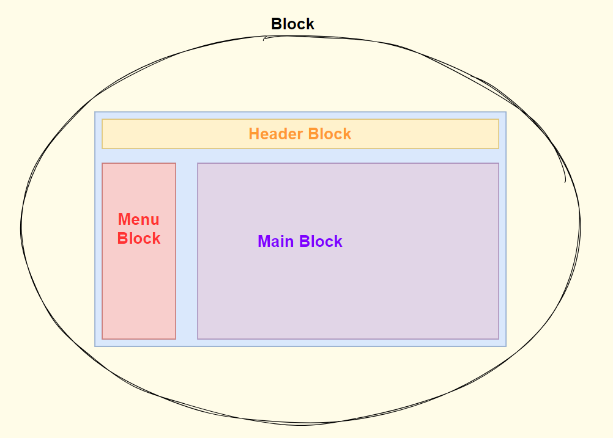

# CSS 命名规范-BEM

> 一般来说，解决 css 命名冲突的方案有三种：
>
> 1. 命名约定
> 2. css in js
> 3. css modules
>
> 这里主要介绍的是通过命名约定这种方案，这种方式，就是提供一种命名的标准，来解决冲突
>
> 常见的这些标准有：BEM OOCSS AMCSS SMACSS 其他

## BEM 介绍

> 基于组件方式的web开发方法，基本思想是将用户界面分成独立的模块

1. BEM 是一套针对 css 类样式的命名方法

2. BEM 的全称是：**B**lock **E**lement **M**odifier

3. 一个完整的 BEM 类名：block\_\_element--modifier 例如轮播图的下方的点，用于切换展示的图片，其中被选中的点可以命名为 banner__dot--selected

4. `__`通常用于连接元素，`--`通常链接不同的形态

5. BEM 具体代表什么呢？

  1. **block【块】** 代表：Block(块)，独立的一个实体，独立的意义，通俗点理解就是一个页面中的一个大区域，例如前台首页的 header、banner、news、footer等等，每个页面都可以看做是多个 Block 组成，如图：

    

  2. **element【元素】** 代表：block 的一部分，比如一个卡片，卡片的头部和底部可以被命名为 card-header 和 card-footer

  3. **modifier【修饰符】** 代表：通常表示属性或状态，类似与一种标记同一个 block 或者 element 可以拥有多个 modifier，例如一个标签，可以用于警告，标记成功等等状态，tag_warning、tag_success

6. 在某些项目中，如果使用 BEM，还可能会增加一个前缀，表示用途，例如：

  1. l：layout 表示这个样式用于布局
  2. c：component 表示这个样式是一个组件，即一个功能区域
  3. u：util 表示这个样式是一个通用的、工具性质的样式
  4. j：JavaScript 表示这个样式没有实际意义，专门提供给 js 获取元素使用的

7. 在某些公共使用的组件，团队独立封装使用的，还是增加一个标识前缀，例如熟悉的 element-ui，前缀 el

## BEM 简单使用

> 1. 如果在命名的时候，需要使用多个单词或者拼接，可以使用 `-` 连接
> 2. 在BEM中所有类名都是顶级类名，不提倡嵌套式，更倾向于组件化模式
> 3. 以一个进度条组件为例

1. block：前缀 + block

   ~~~html
   

   ~~~

2. element：具体的元素

   ~~~html
   <!-- 进度条模块 -->
   

       <!-- 进度条区域 -->
   	

           <!-- 进度条外部元素 -->
           

               <!-- 进度条的内部元素 -->
           	

       	
 
       

       <!-- 进度条信息区域 -->
       

           <!-- 进度条文本 -->
       	30%
       

   

   ~~~

3. modifier：状态，例如进度条的颜色会根据进度改变进度条的颜色，70以内表示正常，70-90之间表示警告，超过90非常危险，那就可以定义三种状态 default、waring、danger，通过三个状态定义颜色值

   ~~~html
   <!-- 进度条模块 -->
   

       <!-- 进度条区域 -->
   	

           <!-- 进度条外部元素 -->
           

               <!-- 进度条的内部元素  状态为警告 -->
           	

       	
 
       

       <!-- 进度条信息区域 -->
       

           <!-- 进度条文本 -->
       	80%
       

   

   ~~~

