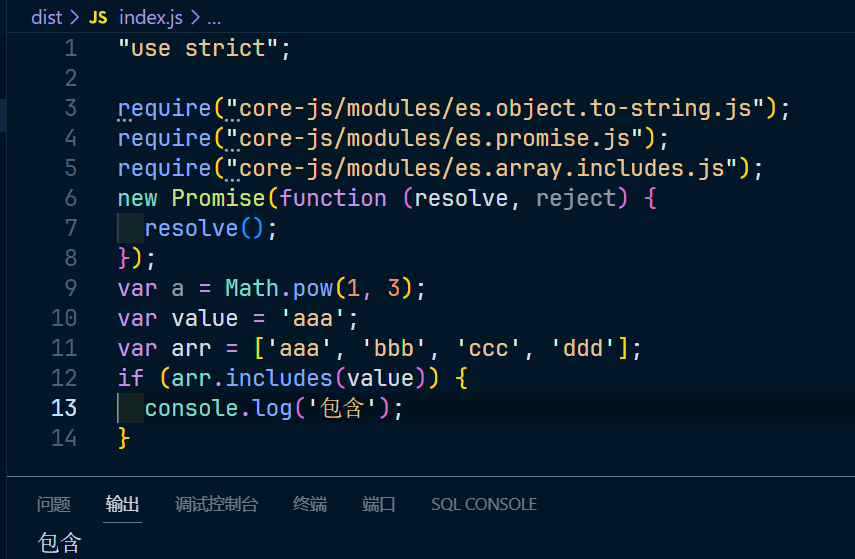

# babel 的预设

babel 有多种预设，最常见的预设是 @babel/preset-env

`@babel/preset-env` 可以让你使用最新的 js 语法，而无需针对每种语法转化设置具体的插件

## 配置

**如果配置多个预设的话，执行顺序从后向前**，配置在 .babelrc 文件内，文件内容如下：

~~~json
{
    "presets":[
        "@babel/preset-env"
    ]
}
~~~

现在查看配置执行的命令，package.json 部分内容如下：

~~~json
{
  "scripts": {
	"build": "babel src -d dist -w" // 将 src 目录下的文件进行编译到 dist文件夹下，-w 表示开启监听
  }
}
~~~

src 文件下的 index.js 文件内容如下：

~~~js
const a = 1

const b = () => {
	console.log('b')
}
~~~

查看执行 npm run build 的打包文件内容如图：

看看 js 怎么转换的，index.js 内容修改如下：

~~~js
const a = 1

const b = () => {
	console.log('b')
}

function foo() {
	const bar = () => {
		console.log(this)
	}
}
~~~

转换后的代码如下：

~~~js
"use strict";

var a = 1;
var b = function b() {
  console.log('b');
};
function foo() {
  var _this = this;
  var bar = function bar() {
    console.log(_this);
  };
}
~~~

## 兼容浏览器

`@babel/preset-env` 需要根据兼容的浏览器范围来确定如何编译，和 PostCss 一样，可以使用 `.browserslistrc`来描述浏览器的兼容范围

~~~
last 3 version
> 1%
not ie <= 8
~~~

`last 3 version`这部分规定了选择浏览器的最后三个版本

`\> 1%` 这部分规定了选择市场份额超过1%的浏览器

`not ie <= 8` 是针对 Internet Explorer 浏览器的条件选择器，表示选择不是 IE 浏览器或者是 IE 浏览器版本大于8的情况

## 自身的配置

和 `postcss-preset-env` 一样，`@babel/preset-env` 自身也有一些配置

> 具体的配置见：[https://www.babeljs.cn/docs/babel-preset-env#options](https://gitee.com/link?target=https%3A%2F%2Fwww.babeljs.cn%2Fdocs%2Fbabel-preset-env%23options)

配置的方式如下：

~~~json
{
    "presets":[
        ["@babel/preset-env", {
            "配置1": "配置值",
            "配置2": "配置值",
            "配置3": "配置值"
        }]
    ]
}
~~~

使用数组替代字符串，第一个参数是预设的名称，第二项是设置的配置

其中一个比较常见的配置项就是`useBuiltIns`，该配置的默认值是 false

这个配置有什么用？由于这个 `@babel/preset-env` 预设仅仅转换新的语法，并不对新的 api 进行任何处理，语法比如就是 const let ** 这些，而有些不属于语法而是 api，多了一些对象或者函数等等

例如：

~~~js
new Promise((resolve, reject) => {
	resolve()
})

const a = 1 ** 3
~~~

编译的结果为

~~~js
"use strict";

new Promise(function (resolve, reject) {
  resolve();
});
var a = Math.pow(1, 3);
~~~

这样转换的代码如果遇到不支持 Promise 构造函数的旧版本浏览器，这个代码就会报错

而配置`useBuiltIns`可以在编译结果中注入一些新的 api，它的默认值是 false，表示不注入任何新的 api，可以将其设置为`usage` ，表示根据 api 的使用情况，按需导入 api

修改配置如下：

~~~json
{
  "presets": [
    [
      "@babel/preset-env",
      {
        "useBuiltIns": "usage"
      }
    ]
  ]
}
~~~

编译的结果如下：

~~~js
"use strict";

require("core-js/modules/es6.object.to-string.js");
require("core-js/modules/es6.promise.js");
new Promise(function (resolve, reject) {
  resolve();
});
var a = Math.pow(1, 3);
~~~

可以看出，它是没有自己构建这个 Promise 的，而是在 core-js 里面导入的，core-js 里面就包含了所有新的 api 里面的实现，如果遇到不支持这个 Promise 构造函数或者其他 新的api 时，就会从 core-js 里面导入

比如我们在使用一个新的 api `includes`，如下：

~~~js
new Promise((resolve, reject) => {
	resolve()
})

const a = 1 ** 3

const value = 'aaa'

const arr = ['aaa', 'bbb', 'ccc', 'ddd']

if (arr.includes(value)) {
	console.log('包含')
}
~~~

查看编译后的结果，如下：

~~~js
"use strict";

require("core-js/modules/es.object.to-string.js");
require("core-js/modules/es.promise.js");
require("core-js/modules/es.array.includes.js");
new Promise(function (resolve, reject) {
  resolve();
});
var a = Math.pow(1, 3);
var value = 'aaa';
var arr = ['aaa', 'bbb', 'ccc', 'ddd'];
if (arr.includes(value)) {
  console.log('包含');
}
~~~

就多了一条导入 **require("core-js/modules/es7.array.includes.js");**

`但是我们是没有这个core-js这个库的，所以如果使用需要安装这个库`

安装 core-js 之后，我们运行这个 dist 下的 index.js 文件，报错如图：

这是因为 core-js 安装的版本是 3，如图：

而在`@babel/preset-env`的预设里 corejs 配置项默认使用是 2 的版本，如图：

所以 corejs 配置项的值需要改为 3，且此选项仅在与 或 `useBuiltIns: entry` 一起使用 `useBuiltIns: usage` 时才有效

修改如下：

~~~json
{
  "presets": [
    [
      "@babel/preset-env",
      {
        "useBuiltIns": "usage",
        "corejs": 3
      }
    ]
  ]
}
~~~

现在运行 dist下的 index.js 结果如图：

