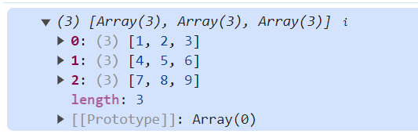
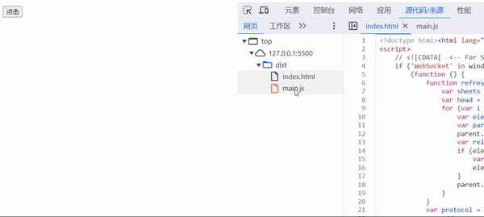
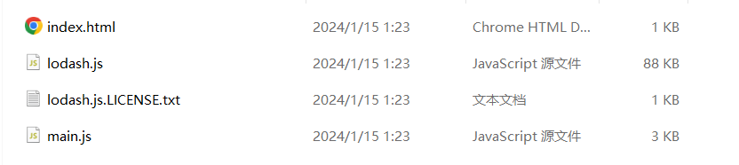
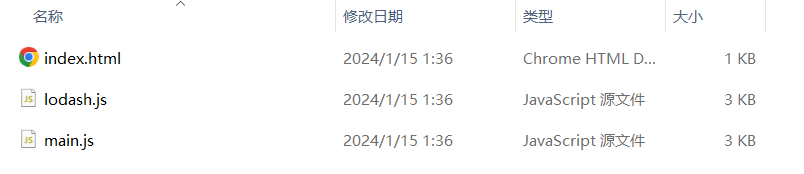

# 懒加载

现在页面上有一个 button 按钮，我希望点击这个按钮之后实现一些事情，比如将一个数组拆分，按照固定2的长度进行分组，并组成一个新的数组

按照正常的流程，就是获取这个button，绑定事件然后进行这个拆分的操作，拆分的操作可以借助 lodash 的 chunk 方法实现，在 src/index.js 文件中代码如下：

~~~js
// 引入chunk方法
import { chunk } from 'lodash-es'

const btn = document.querySelector('button')

const arr = [1, 2, 3, 4, 5, 6, 7, 8, 9]

btn.onclick = function () {
	const result = chunk(arr, 3)
	console.log(result)
}
~~~

查看结果，如图：

这样功能上是没有问题的，但是存在问题就是，这个 chunk 方法的代码一开始就被加入到我们最终的打包文件中了，但是这部分点击执行执行的代码其实一开始是不需要的，是在点击之后才需要执行的

这里因为开启了 `tree shaking` 生成的代码是不大，但是这是一个简单的案例，假设我们点击之后引入的不是 chunk 而是其他的库方法，而且这个库方法又比较大，那么一开始就没有必要引入它

所以为了实现这个需求，就不能使用 import { chunk } from 'lodash-es' 这样导入了，因为这个es6的语法不支持动态的，require()  支持动态，但是这个会被 webpack 分析的时候也进入依赖，所以要使用一个特殊的语法 `import()`，import() 会返回一个promise

~~~js
const btn = document.querySelector('button')

const arr = [1, 2, 3, 4, 5, 6, 7, 8, 9]

btn.onclick = async function () {
	// /* webpackChunkName: "lodash" */ 可以指定名称这个单独打包后的 chunk 名称
	const _ = await import(/* webpackChunkName: "lodash" */ 'lodash-es')
	const result = _.chunk(arr, 3)
	console.log(result)
}
~~~

这个流程一开始是不会加载这个 lodash 这个单独打包的chunk的，只有点击之后才会通过ajax去请求这个文件使用，如图：

可以看到一开始是没有的，后来点击之后才通过 ajax 加载出来

不过这样 tree shaking 就失效了，因为这个地方不是静态的，就分析不出来了，打包的文件就非常大了

lodash 88kb，所以可以转折一下的方法，创建一个 utils.js 文件，在这里导入 chunk，在使用 import() 导入这个 utils.js 即可，utils.js 如下：

~~~js
export { chunk } from 'lodash-es'
~~~

index.js 改动如下：

~~~js
const btn = document.querySelector('button')

const arr = [1, 2, 3, 4, 5, 6, 7, 8, 9]

btn.onclick = async function () {
	const _ = await import(/* webpackChunkName: "lodash" */ './utils')
	const result = _.chunk(arr, 3)
	console.log(result)
}
~~~

打包文件大小如图：

