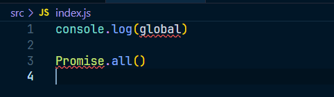
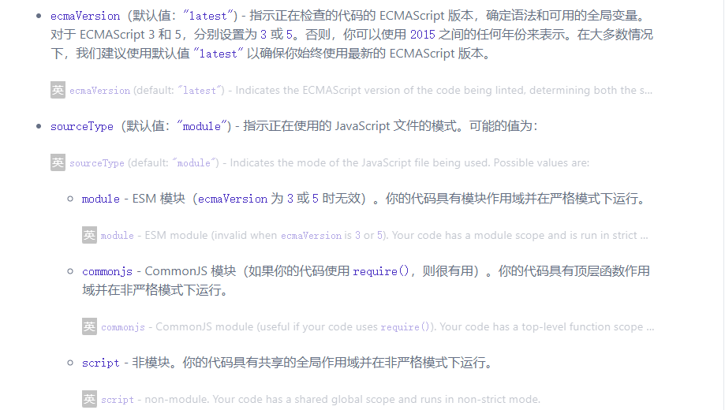

# ESLint

ESLint 是一个针对 JS 的代码风格检查工具，当不满足其要求风格的时候，会给予警告

官网：https://eslint.org/

民间中文网：https://eslint.nodejs.cn/docs/latest/use/getting-started

## 使用

ESLint通常配合编辑器使用

1. 在vscode中安装`ESLint`该工具会自动检查工程中的JS文件检查的工作交给`eslint`库，如果当前工程没有，则会去全局库中查找，如果都没有，则无法完成检查，另外，检查的依据是`eslint`的配置文件`.eslintrc`，如果找不到工程中的配置文件，也无法完成检查

2. 安装`eslint`

```
npm i [-g] eslint
```

3. 创建配置文件

4. 可以通过`eslint`交互式命令创建配置文件

   > 由于windows环境中git窗口对交互式命名支持不是很好，建议使用powershell

   ~~~
   npx eslint --init
   ~~~

   > eslint会识别工程中的`.eslintrc.*`文件，也能够识别`package.json`中的`eslintConfig`字段

## 配置

### env

配置代码的运行环境：

- browser：代码是否在浏览器环境中运行
- node：代码是否在 node 中运行

而每个 env 对应的全局变量取决于 global，这个在源码中亦有体现，[源码地址](https://github.com/eslint/eslint/blob/5.x/conf/environments.js)，具体定义参看[globals](https://link.juejin.cn/?target=https%3A%2F%2Fgithub.com%2Fsindresorhus%2Fglobals%2Fblob%2Fmain%2Fglobals.json)

现在 .eslintrc.json 文件中配置的 env 如下：

~~~json
"env": {
	"browser": true,
	"es2021": true,
	"node": true
}
~~~

编写的代码，如下：

~~~js
console.log(global)

Promise.all()
~~~

但是当我吧 es2021 和 node 设置为 false 之后，如图：



就报错了，因为环境不支持了

### languageOptions

> https://eslint.nodejs.cn/docs/latest/use/configure/language-options

如图：



### parserOptions

该配置指定`eslint`对哪些语法的支持

- ecmaVersion: 支持的ES语法版本
- sourceType
  - script：传统脚本
  - module：模块化脚本

### parser

`eslint`的工作原理是先将代码进行解析，然后按照规则进行分析

`eslint` 默认使用`Espree`作为其解析器，你可以在配置文件中指定一个不同的解析器。

### globals

配置可以使用的额外的全局变量

```
{
  "globals": {
    "var1": "readonly",
    "var2": "writable"
  }
}
```

`eslint`支持注释形式的配置，在代码中使用下面的注释也可以完成配置

```
/* global var1, var2 */
/* global var3:writable, var4:writable */
```

### extends

该配置继承自哪里

它的值可以是字符串或者数组

比如：

```
{
  "extends": "eslint:recommended"
}
```

表示，该配置缺失的位置，使用`eslint`推荐的规则

### ignoreFiles

排除掉某些不需要验证的文件

```
.eslintignore
dist/**/*.js
node_modules
```

### rules

`eslint`规则集

每条规则影响某个方面的代码风格

每条规则都有下面几个取值：

- off 或 0 或 false: 关闭该规则的检查
- warn 或 1 或 true：警告，不会导致程序退出
- error 或 2：错误，当被触发的时候，程序会退出

除了在配置文件中使用规则外，还可以在注释中使用：

```
/* eslint eqeqeq: "off", curly: "error" */
```

> [https://eslint.bootcss.com/docs/rules/](https://gitee.com/link?target=https%3A%2F%2Feslint.bootcss.com%2Fdocs%2Frules%2F)