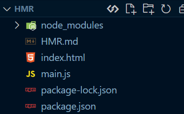
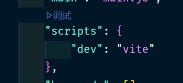
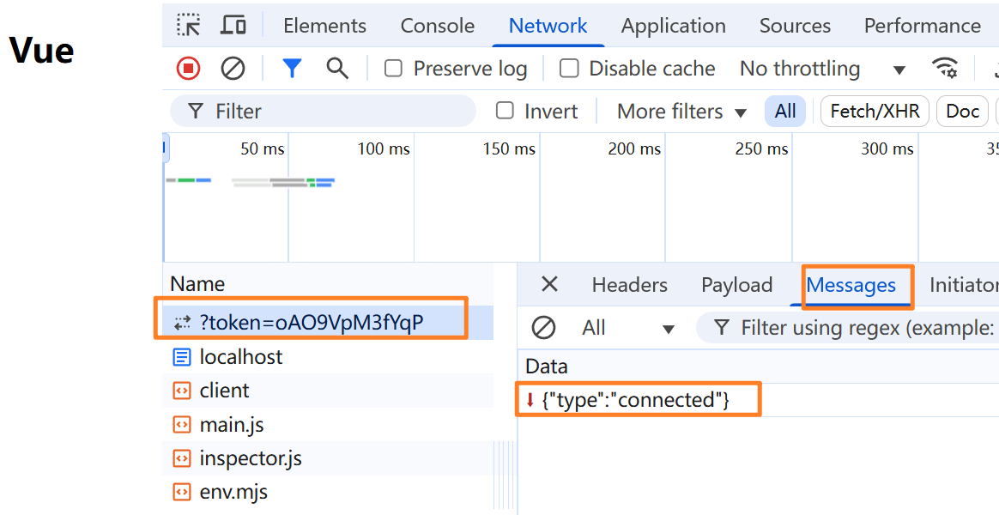
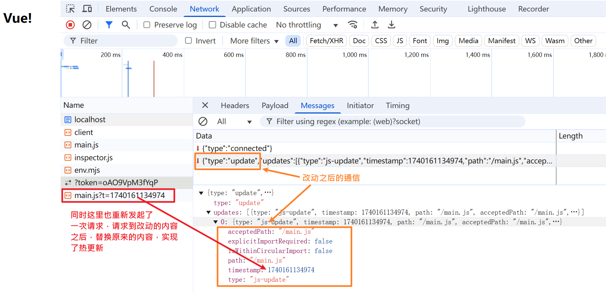

# HMR

> Vite的HMR机制允许应用程序在运行时更新模块而无需刷新整个页面。

在 ES 模块中，有一个原属性 `import.meta`。

而 Vite 对这个原属性做出了一些扩展，在使用 Vite 的 dev server 来开发项目的时候，如果是 **开发环境** 则会给这个 import.meta 原属性添加一个 `hot` 属性。

因此我们如果想要实现一个文件的热更新，通常会从这一点入手，例如：

```js
if (import.meta.hot) {
    import.meta.hot.accept(newModule => {
        // ...
    })
}
```

因为会区分开发环境和生产环境，所以会有一个约定，如果要实现 HMR 则会先判断是否存在 hot 属性。如果存在表示当前环境支持 HMR。在开发环境时，Vite会启用HMR，因此这个条件为真；而在生产环境中，`import.meta.hot`通常不存在，因此代码不会执行，避免不必要的代码被包含进生产包。

`import.meta.hot.accept` 方法用于**声明模块如何接受热更新**。这个方法会接受一个回调函数，当这个模块的 **代码** 或 **依赖项** 更新时，就会触发这个回调函数。

我们可以来看一下当前项目的目录，如图：



命令配置如图：



可以看到是利用 vite 来开发的，其中 main.js 文件内容如下：

```javascript
// 使用 export 进行导出，newModule 才会有这个属性
export function render() {
    document.querySelector('#app').innerHTML = `<h1>Vue</h1>`
}

render()

if (import.meta.hot) {
    import.meta.hot.accept(newModule => {
        newModule.render()
    })
}
```

写完这段代码之后，在编辑器中，手动修改 `Vue` 为 `Vue!!!`，就会发现，会执行 accept 方法里面的回调，重新调用 render 执行，从而实现`热更新`，如果没有使用这个 HMR 的话，单纯使用 Vite 的 dev server 服务，也会更新，但是会刷新页面，而这样开启 HMR 之后，同样会更新页面的显示结果，但是不会刷新页面。

Tips：这里值得一提的时候，必须要通过 `newModule.render()` 这样调用才行，如果直接调用 `render()` 则会因为 js 闭包的原因，导致使用的还是之前老的 render()，从而虽然重新执行了，但是内容不会发生改变。

总结一下上面这些论述：

- **HMR的工作原理**：Vite在开发服务器中监视文件变化，当文件被修改时，服务器通过WebSocket通知客户端（浏览器）。客户端接收到更新通知后，会获取新的模块代码并替换旧模块，同时触发`accept`回调，执行自定义更新逻辑。
- **`accept`的其他用法**：除了接受当前模块的更新，还可以指定接受特定依赖模块的更新，例如`import.meta.hot.accept('./dep.js', (newDep) => { ... })`，这样当`dep.js`变化时，回调会被触发。
- **为什么需要条件判断**：生产环境通常不包含HMR代码，因此通过检查`import.meta.hot`是否存在，可以避免在生产环境执行无效代码，减少体积和潜在错误。
- **实际应用场景**：例如在 Vue 或 React 组件中，使用 HMR 可以在修改组件代码后保持应用状态，无需手动刷新页面。框架的 Vite 插件通常已经集成了 HMR 处理，比如 VueJsx，用户可能不需要手动编写这段代码，除非需要自定义处理逻辑。

下面我们通过截图来描述一下具体的更新过程，当启动 dev server 之后，我们通过 network 面板来看一下最开始的 websocket 连接状态，如图：



而此时如果我们在编辑器（如vscode）中将 Vue 改为 Vue! 之后保存文件，这个连接会有什么变化，如图：

