# 临时记录

## vite 对比 webpack

webpack 的编译原理， AST 抽象语法树分析，分析出你写的这个 js 文件有些导入和导出的操作
构建工具是运行在服务端的，支持多模块，不止运行在浏览器端，更多是考虑兼容性
也是因为这点，webpack 支持多模块化，所以一开始 webpack 就要统一模块化代码，也因此它需要将所有的依赖全部读一遍
如果项目越来越大，那么这个操作就会非常的耗时

所以 vite 是不会把 webpack 替代掉的，因为 vite 是基于 es modules 规范，更加关注浏览器端的开发体验
vite 模式你就是需要用 es modules 的写法，所以不需要统一模块化，也就不需要去把所有的依赖都读一遍

这个为什么选 vite 官网有一张图可以说明
https://cn.vitejs.dev/guide/why.html#slow-server-start

## vite 脚手架和 vite 的区别

运行命令 `npm create vite` 时是安装了一个 vite 的脚手架，实际运行的是 create-vite bin 目录下的一个执行配置

所以可以说是 create-vite 内置了 vite

## 思考

### 既然我们现在 es modules 规范已经很成熟了，那为什么 es 官方在我们导入非绝对路径和非相对路径的资源的时候不帮助我们去搜寻 node_modules 目录呢

> 因为太消耗性能了，比如导入了 lodash，那么如果 lodash 也依赖了其他库，也这样去寻找的话，可想而知，这个资源的消耗是非常多的。
>
> 但是可能又会发现，CommonJS 为什么就这样做呢。好像速度也很快啊，因为 CommonJS 一般都是服务端用的，它们是在本地读取，而且本身 CommonJS 也做出了优化，所以可以这样做。
>
> 而在浏览器中，实际读取这个文件的时候是因为 vite 启动了一个开发服务器，通过网络去请求的，所以让这个性能的消耗是非常大的

### 为什么 vite 运行在 node 上，也没有在 package.json 中设置 module，为什么 node 可以识别这个 vite.config.js 上这些 es modules 语法

> 这是因为 vite 在读取这个 vite.config.js 文件的时候，如果发现是 es modules 规范，会把这个规范进行替换，变成 commonjs 规范，大概替换的原理的就是，读取文件读到的是一个字符串，然后把 export default 这个字符换成 commonjs 的导出字符

### resolve.alies 别名原理

> 本质就是做的字符串替换，搭建一个服务器，发现你访问的路径带 @ 时候，就解析配置，然后转换为对应的绝对路径

### 为什么打包后的文件需要带上 hash

> 因为内容只要改变 hash 就会不一样，而浏览器的缓存机制就是名称一样就去读取缓存，所以为了避免更新了代码内容但是浏览器还是使用旧版的缓存文件，就通过打包后的文件名带上 hash 生成不同的名称避免这一点

## vite 的依赖与预构建

在处理的过程中，如果说看到了有非绝对路径或者相对路径的引用，它就会尝试开启补全路径

~~~js
import _ from 'lodash'

// 此时就会开启补全路径
import _ from '/node_modules/.vite/deps/lodash'
~~~

为了看的更加的具体，我们可以看一下书写的引入代码

~~~js
import _ from 'lodash'

let count = 0

export function add() {
	return ++count
}
~~~

再看看编译后实际运行的时候，是否补全了路径，如图：

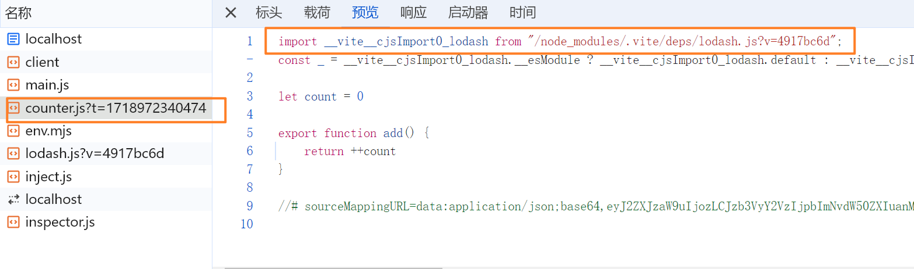

寻找依赖的过程是自当前目录一次向上查找的过程，知道搜寻到根目录或者搜寻到对应依赖为止，但是这种查找规则就会出现一个问题，假设当前工作目录为 my_project，而 my_project 的父级目录为 vue_projects，那么 my_project 下的 node_modules 没有找到对应的依赖，在 vue_projects 下面的 node_modules 下找到了，按照上面的分析，对应的绝对路径应该是 `/vue_projects/node_modules/axios`，但是实际呢？如图：

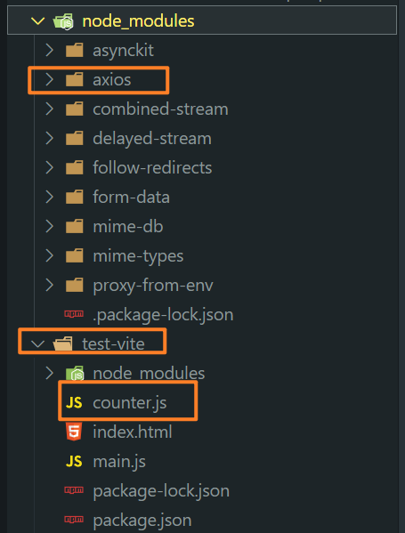

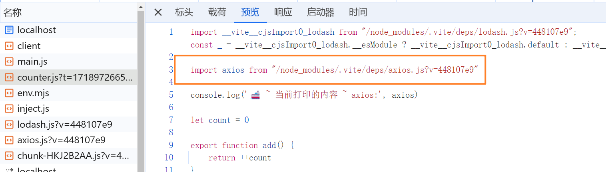

但是这个路径浏览器肯定是找不到的，所以 vite 是如何解决这个事情的呢，实际 vite 在考虑另外一个问题的时候就解决了这个问题，有些第三方库导出的时候是 commonjs 规范导出的，此时就与 es modules 规范不匹配，vite 就使用了**依赖预构建**的方式解决

什么是依赖预构建？vite 首先会找到对应依赖，然后调用 esbuild(对 js 语法进行处理的一个库，就是吧其他如 commonjs 语法的代码转换为 es modules 规范的代码)，经过 esbuild 编译之后，然后放到当前目录 node_modules/.vite/deps 里面

**esbuild 使用 Go 编写，并且比以 JavaScript 编写的打包器预构建依赖快 10-100 倍。**

这个依赖预构建解决了那些问题？

- 不同的第三方包会有不同的导出格式，解决了导出格式不是 es modules 规范的问题

- 寻找依赖向上查找路径不正确的问题

- 网络多包传输的性能问题(也是原生 es modules 规范不敢解决默认在 node_modules 目录里面查找的原因)，当一个依赖里面有依赖其他许多的依赖，那么此时就会请求非常多的模块，vite 会对这个做出一个优化，就是 vite 会对 es modules 规范进行**各个模块统一集成**

  **具体解析如下：**

  - 比如先一个模块为 my_es，那么下有一个 a.js 文件，是一个功能，还有一个 index.js 为入口文件，导出，具体如下：

    ~~~js
    // a.js
    export default function a(){}
    
    // index.js
    export { default as a } from './a.js' 
    ~~~

  - 那么此时如果在使用的时候导入这个 my_es 模块的时候，遵循 es_modules 规范，就会去加载 a.js，那么如果这样的模块有很多，加载的文件就非常多了。

  - 所以 vite 会对这个 index.js 进行一个重写，如下：

    ~~~js
    // index.js
    function a (){}
    ~~~

  - 直接重写为了一个函数，这样就不会去加载 a.js 文件了，当然这个函数只是简单的写了一下，实际会更复杂一点

  - 我们使用 lodash-es 来做一个例子，安装之后正常导入

    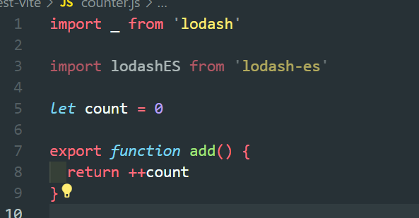

  - 看一下网络请求，请求的文件 

    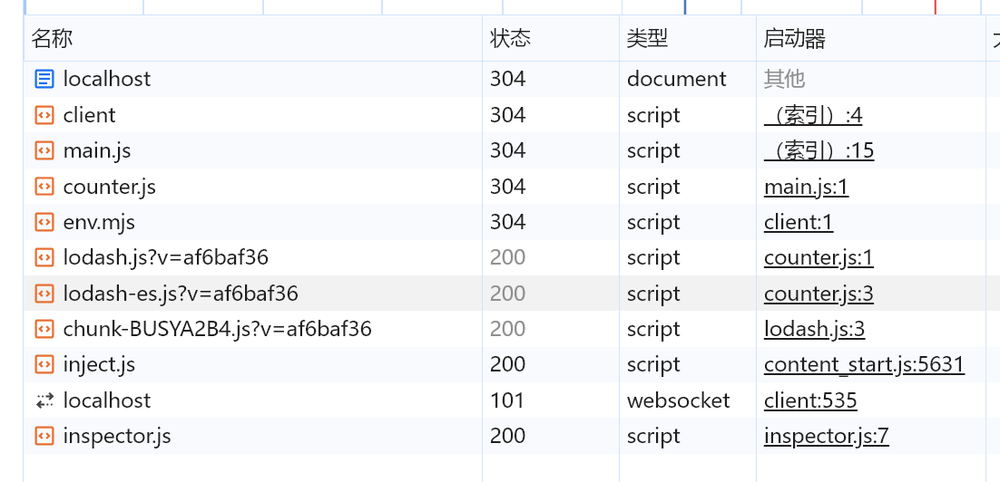

  - 非常的少，实际是有非常多的导出的，如图：

    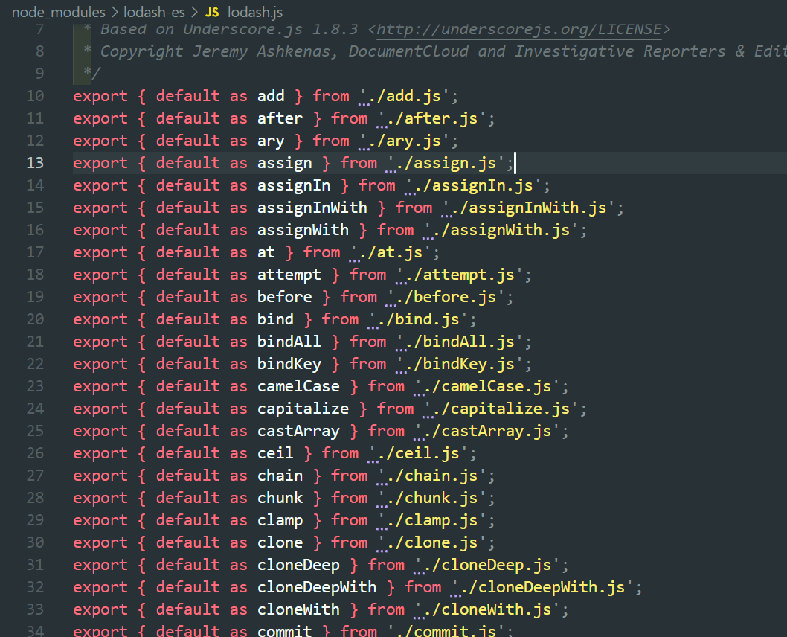

  - 那么我们把这个针对 lodash-es 的依赖预构建给关掉，vite.config.js 文件配置如下：

    ~~~js
    export default {
    	optimizeDeps: {
    		exclude: ['lodash-es'] // 遇到 lodash-es 包时，不进行依赖预构建
    	}
    }
    ~~~

  - 现在再看一下网络请求了多少文件，如图：

    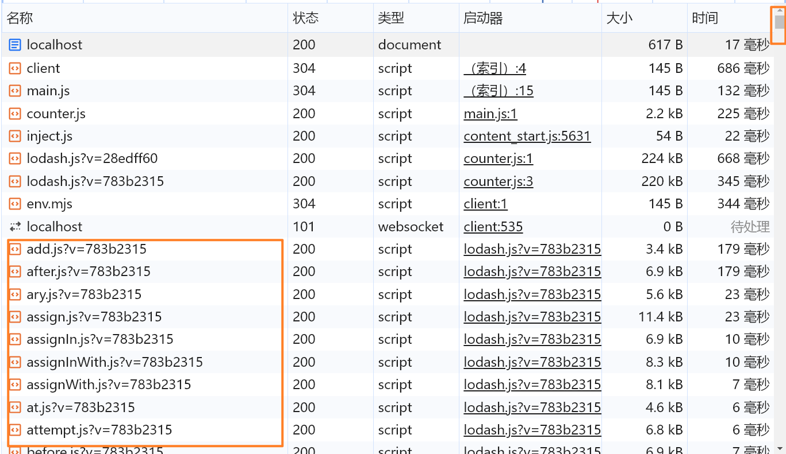

  - 现在感觉对比是不是就是很明显了，如果还有更多的依赖，那么这个性能开销是显而易见的，**所以这就是原生 es_modules 不敢支持的原因，也是 vite 解决最主要的问题**

  - Tip：在这种情况下，解决的不是文件下载大小的问题，而是多包频繁的发送网络请求，网络造成的性能问题

  - 当然，不可能保证永远只会有一个，但是 vite 会尽量往这个目标靠拢，可能是两个、三个等

vite 打包的时候会全权交给 rollup 这个库去打包，生成不止支持 ES Modules 规范的文件，还有 CommonJS、IIFE等等

## vite 配置文件中的 css 配置流程(preprocessorOptions 配置项)

主要是用来配置 css 预处理器的一些全局参数
假设没有使用构建工具，我们还想去编译 less 文件的话。就可以安装 less，安装 less 之后，就会有一个 lessc 的编译器
```r
npm install less # lessc 的编译器
```

less 的命令行参数 https://less.bootcss.com/usage/#lessjs-options

index.css 源代码，如下：

```css
.container {
    background-color: lightblue;
    padding: (100px / 2);
    margin: 100px / 2;
}
```

执行命令：`npx lessc --math="always" .\index.css`，编译结果如下：

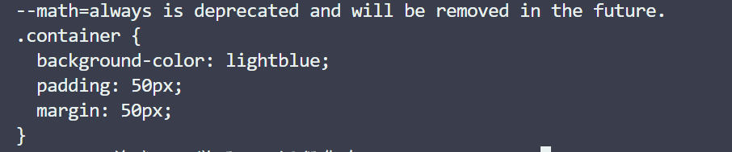

执行命令：`npx lessc .\index.css`，编译结果如下：

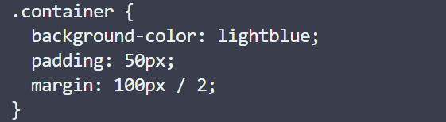

## postcss

vite 天然对 postcss 的支持就非常的好

postcss 的工作原理类似于净水系统，自来水 从 管道 先进入净水系统，这个净水系统就会做出一些处理：---> 取出砂砾 ---> 净化细菌微生物 ---> ... ---> 输送到水龙头 ---> 纯净水

换成 postcss 处理大概是：开发时写的 css 随便写 ---> 使用 less、scss 等预处理器把这些转为原生 css 属性 ---> 再次对高级的 css 语法降级 ---> 前缀补全 ---> 最后交给浏览器客户端执行

浏览器的兼容性，只是单纯的 css 预处理器可能无法解决，js 有 babel，css 呢？这个责任就落到了 postcss 身上

- 对 css 语法进行降级
- css 属性浏览器前缀兼容补全

使用 postcss：需要安装以下依赖：

~~~bash
npm i -D postcss-cli postcss 
~~~

简单的测试一下，创建 index.css 文件，内容如下：

~~~css
:root {
    --primary-color: red;
}

.container {
    width: 100px;
    height: 100px;
    background-color: var(--primary-color);
}
~~~

执行命令 `npx postcss ./index.css -o result.css`，-o 即表示 --output，结果如图：

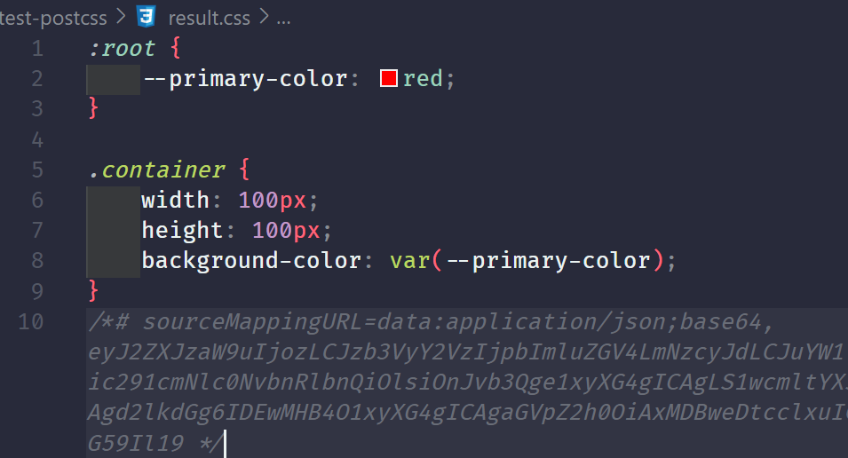

好像并没有我们期望的，有那些兼容处理，因为我没有做额外的处理，这些处理需要我们自己来配置，要实现这点，我们需要书写一个**描述文件**

创建文件 `postcss.config.js`，安装依赖 `postcss-preset-env`，配置如下：

~~~js
const postcssPresetEnv = require('postcss-preset-env')

module.exports = {
	plugins: [
		// postcssPresetEnv：预设环境 https://www.npmjs.com/package/postcss-preset-env
        //  - 在处理 css 降级，前缀添加需要一个个的安装这些插件，预设就会一开始帮助我们安装好这些必要的插件
		//  - 在没有任何配置选项的情况下，PostCSS Preset Env 启用 Stage 2 功能并支持所有浏览器
        
		postcssPresetEnv()
	]
}
~~~

此时我们再次编译测试一下，如图：

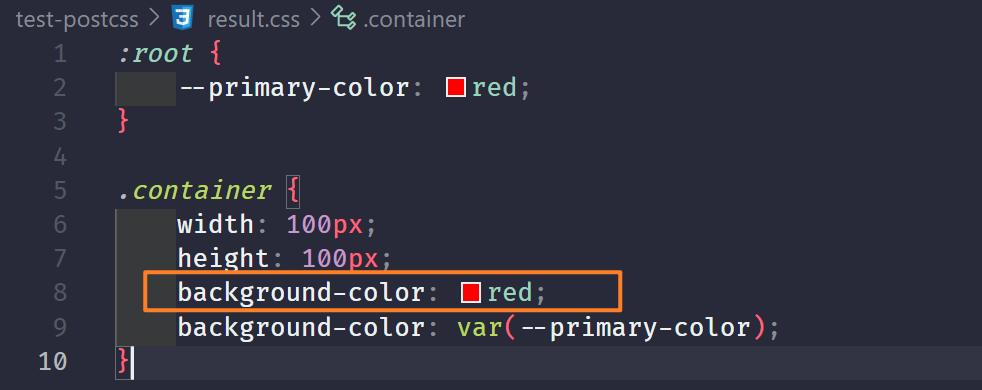

就可以看到，已经把值直接编译出来了，同时也保留了 css 变量

而针对 less 、scss 预处理器这些编译，postcss 原来是支持的，但是后面不支持了，需要 less scss 自行处理之后再交给 postcss 进行后面的处理，所以也有一个说法是 **postcss 是后处理器**，但是实际上不止是后处理器这么简单，如果它愿意，是可以把这个过程也包含进来的，只是没有必要而已

在 vite 中使用 postcss，只需要安装 postcss-preset-env，如下：

```js
import { defineConfig } from 'vite'
import postcssPresetEnv from 'postcss-preset-env'

export default defineConfig(({ command, mode }) => {
	return {
		server: {
			port: 9527
		},
		css: {
			// 得益于 vite 对 postcss 的良好支持
			// 这里可以省略 postcss.config.js 文件。直接在 postcss 配置项中配置即可
			postcss: {
				plugins: [postcssPresetEnv()]
			}
		}
	}
})
```

查看当前项目的 index.less 文件，如下：

~~~less
:root{
    --primary-color: red;
    --secondary-color: blue;
}

.container {
    background-color: lightblue;
    padding: (100px / 2);
    margin: 100px / 2;
    width: 100px;
    height: 100px;
    border: 2px solid var(--primary-color);
}
~~~

然后看看经过编译后的样式，呈现的结果，如图：

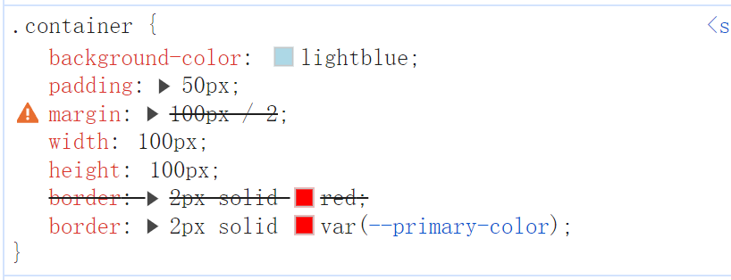

可以看到，实际上是已经做了兼容的处理，直接把 red 读取了出来设置，不过我们当前浏览器支持 --xxx 这种 css 变量，所以后面的覆盖前面的，100px / 2 没计算是 less 没配置，可以打开这个配置，如下：

~~~js
import { defineConfig } from 'vite'
import postcssPresetEnv from 'postcss-preset-env'

export default defineConfig(({ command, mode }) => {
	return {
		server: {
			port: 9527
		},
		css: {
			preprocessorOptions: {
				less: {
					math: 'always'
				}
			},
			postcss: {
				plugins: [postcssPresetEnv()]
			}
		}
	}
})
~~~

结果如图：

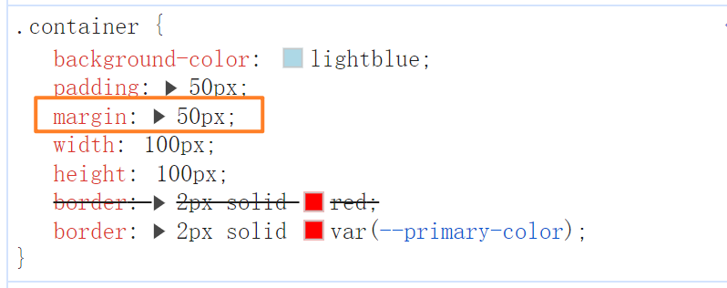

我们在使用一新一点的语法，看看会被编译成什么，index.less 如下：

~~~ls
:root{
    --primary-color: red;
    --secondary-color: blue;
}

.container {
    box-sizing: border-box;
    background-color: lightblue;
    padding: (100px / 2);
    margin: 100px / 2;
    height: 100px;
    border: 2px solid var(--primary-color);
    // 响应式布局，宽度自适应
    //  - 这里就是默认宽度为 30% 的可视窗口宽度，但是这个 30% 的值不是固定的，最小只能为 100px，最大只能为 300px
    width: clamp(100px, 30vw, 300px);
}
~~~

编译结果如图：

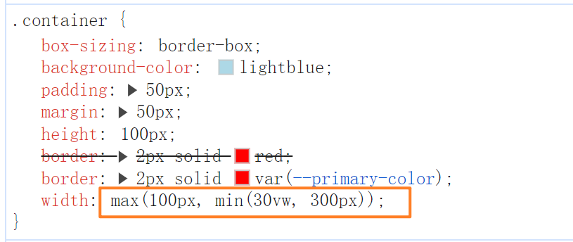

clamp 的兼容性相对差一点，如图：

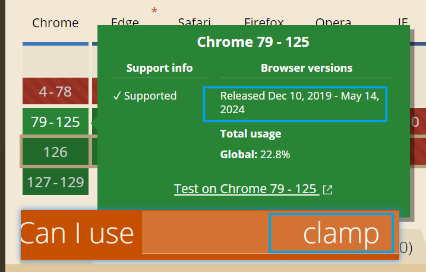

min 这个兼容性就好很多，基本都支持，如图：

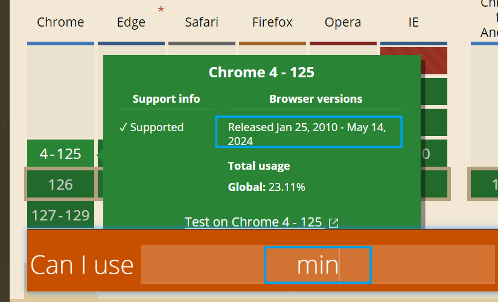

这个现象就是**语法降级**

## vite 插件

> vite 会在不同的生命周期阶段调用不同的插件已达到不同的目的

## vite 性能优化

性能优化具体指的是什么？

- 开发时的构建速度优化，即执行 npm run dev 这个从执行到完成执行所占时间是多长
- 页面性能指标：
  - 首屏渲染时：fcp(first content paint)
    - 懒加载
    - http 优化：协商缓存 强缓存
  - 页面中最大元素的一个时长：lcp(largest content paint)
- js 逻辑
- css
  - 关注继承属性，能继承就不要重写
  - 尽量避免过于深层次的嵌套
- 构建优化：vite(rollup) webpack
  - 优化体积：压缩、tree shaking、图片资源压缩、cdn加载、分包

## 分包策略

浏览器的缓存策略：只要你静态资源的文件名没变化，就不会重新去拿
