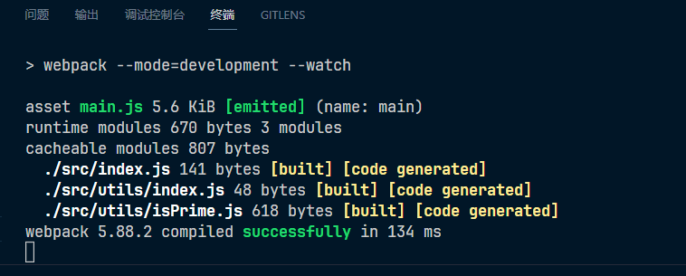

# 笔记

## 自动更新

为命令添加 --watch 之后，代码改变就会自动重新打包代码

~~~json
scripts": {
	"build": "webpack --mode=production",
	"dev": "webpack --mode=development --watch"
},
~~~

当添加这个 --watch 之后，在执行 npm run dev 命令之后，就不会回到命令行，而是启动一个服务监听代码，如图：

