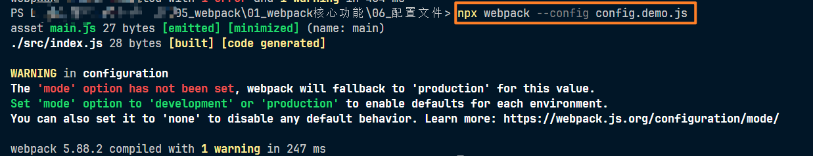

# 配置文件

- webpack提供的cli支持很多的参数，例如```--mode```，但更多的时候，我们会使用更加灵活的配置文件来控制webpack的行为，这个文件一般放在项目的根目录下面


- 默认情况下，webpack会读取```webpack.config.js```文件作为配置文件，但也可以通过CLI参数```--config```来指定某个配置文件

  - 如果直接使用 npx webpack 会默认读取 webpack.config.js 这个文件

  - 也可以指定文件，比如我们指定 `config.demo.js` 这个文件，命令如下：

    ~~~
    npx webpack --config config.demo.js
    ~~~

    如图：

    

  - 这样也可以指定其他配置文件

- 配置文件中通过CommonJS模块导出一个对象，对象中的各种属性对应不同的webpack配置，如下：

  ~~~js
  // 只需要通过 commonJS 导出一个对象即可
  module.exports = {}
  ~~~

- **注意：配置文件中的代码，必须是有效的node代码**
  - 因为 webpack 指的支持多模块是在最开始构建依赖关系的时候，而构建依赖关系的时候，并不会运行代码，只是来作为 webpack 打包时候识别依赖关系的，所以不管你什么模块规范，都可以支持，但是在构建打包的过程中，需要读取文件，所以是基于 node 环境的
  - 而在构建打包的过程中去读配置文件的时候，也就是说要运行一次`(require('./webpack.config.js'))`，就已经是在 node 的环境中了，所以要是有效的 node 代码
  - `所以综上所述，这个配置文件在编译的过程中参与运行，所以只能是 commonJS，而我们自己代码是不会在构建打包的过程中参与运行的，所以可以随便书写规范`

- 当命令行参数与配置文件中的配置出现冲突时，以命令行参数为准。


**基本配置：**

1. mode：编译模式，字符串，取值为 development 或 production ，指定编译结果代码运行的环境，会影响webpack对编译结果代码格式的处理，在配置文件中可以书写为如下格式：

   ~~~js
   module.exports = {
   	mode: 'production',
   	entry: ''
   }
   ~~~

2. entry：指定入口文件(默认为 src 目录下的 index.js 文件)，字符串（后续会详细讲解），指定入口文件，如下：

   ~~~js
   module.exports = {
   	mode: 'production',
   	entry: './src/main.js'
   }
   ~~~

3. output：指定打包的出口文件(默认为 dist 目录下的 main.js 文件)，对象（后续会详细讲解），指定编译结果文件，如下：

   ~~~js
   module.exports = {
   	mode: 'production',
   	entry: './src/main.js',
   	output: {
   		filename: 'index.js' // 文件名，默认为 main.js
   	}
   }
   ~~~

