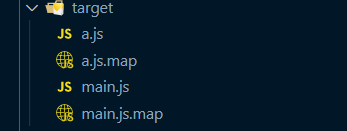
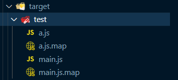
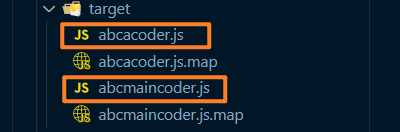
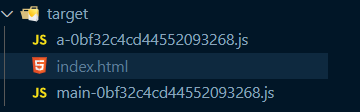
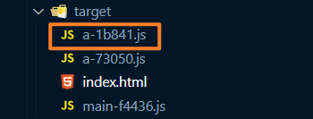
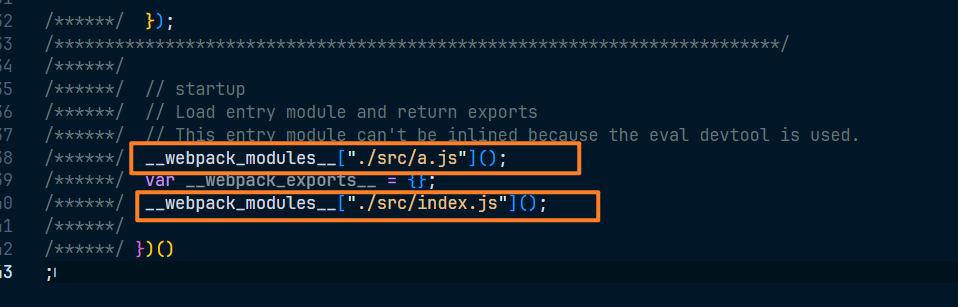
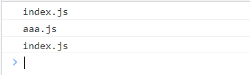
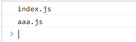

# 入口和出口

.png)

> node内置模块 - path: https://nodejs.org/dist/latest-v12.x/docs/api/path.html

## 出口

这里的出口是针对资源列表的文件名或路径的配置，即上图的 hash 最后生成的资源

出口通过output配置对象进行配置，在 webpack.config.js 文件中，如下：

~~~js
const path = require('path')

module.exports = {
	mode: 'development',
	// 配置出口
	output: {
		// 必须是一共绝对路径，表示打包后的资源放入在那个文件夹里面去, 默认是 dist(简写)，实际是一个完整的绝对路径
		path: path.resolve(__dirname, 'target'),
		// 配置的是合并的js文件的规则,即生成一个文件名
		//  - 静态写法：直接写一个文件名
		// filename: 'bundle.js',
		//  - 如果需要放入一个子文件夹里面去,可以直接写
		filename: 'script/bundle.js'
	},
	devtool: 'source-map'
}
~~~

## 入口 

**入口真正配置的是chunk**

入口通过entry进行配置

~~~js
const path = require('path')

module.exports = {
	mode: 'development',
	// 配置入口
	entry: {
		// 默认情况下的配置：
		//  - 属性名表示 chunk 的名称，属性值表示入口模块
		// 直接写 entry:'./src/index.js' 等同于 entry:{ main:'./src/index.js' }
		main: './src/index.js',

		// 这个可以配置多个
		a: './src/a.js'
	},

	// 配置出口
	output: {
		// 必须是一共绝对路径，表示打包后的资源放入在那个文件夹里面去, 默认是 dist(简写)，实际是一个完整的绝对路径
		path: path.resolve(__dirname, 'target'),
		// 配置的是合并的js文件的规则,即生成一个文件名
		//  - 静态写法：直接写一个文件名
		// filename: 'bundle.js',
		//  - 如果需要放入一个子文件夹里面去,可以直接写
		filename: 'script/bundle.js'
	},
	devtool: 'source-map'
}

~~~

但是这样多个 chunk 生成的资源，到了一个相同的文件名，这里就是这个文件就是 `'script/bundle.js'`，打包构建会冲突，这时候就不能使用静态规则了，所以要动态的配置一个规则，来适应多个 chunk

## 动态配置的规则

### name

chunk的name，在合适的地方加上一个中括号，加上这个中括号，应用到每一个 chunk 的时候，就会自动替换掉，比如 entry 里面配置的 a:'./src/a.js'，那么这个 chunk 名称就是 a 了，如下：

~~~js
const path = require('path')

module.exports = {
	mode: 'development',
	// 配置入口
	entry: {
		main: './src/index.js',
		a: './src/a.js'
	},

	// 配置出口
	output: {
		// 必须是一共绝对路径，表示打包后的资源放入在那个文件夹里面去, 默认是 dist(简写)，实际是一个完整的绝对路径
		path: path.resolve(__dirname, 'target'),
		// 动态配置
		filename: '[name].js'
	},
	devtool: 'source-map'
}
~~~

打包结果如图：

当然也可以指定文件夹，filename 改为 'test/[name].js'，结果如图

而这种也不仅仅限于这样的格式，你可以在一段字符串中间或其他位置写上成[name]，这个位置就会被替换，比如 filename 改为 'abc[name]coder.js'，结果如图：

可以看做是一个占位符

### hash

总的资源hash，通常用于解决缓存问题

比如这种情况，浏览器在打开一个网站的时候，会先请求一个 index.html 的文件，这个 index.html 会引用了其他的 js 文件，比如 main.js 和 a.js 文件，那么此时第一次请求到了这两个文件，如果第二次访问 index.html 的时候，发现还是这两个文件，就可能会使用缓存，而不是再次请求了，为什么只是可能呢，因为和浏览器和服务器的配置有关系。

基于上面这个情况，比如浏览器已经把这个网页打开了。也请求到了 a.js 和 main.js ，但是此时我们修改了这两个文件内容，重新打包发到服务器，但是此时浏览器因为已经缓存了这两个文件，就不会再次请求，那么我们更新的内容就不会被使用。

所以我们这是如果需要浏览器重新请求的话，就要把文件名称改变，名称改变之后，浏览器访问这个页面的时候就会因为发现新的文件名称重新请求了。那怎么实现这一点呢？就是哈希，哈希就是根据文件内容生成的，所以当文件内容改变的时候，hash值就会改变，就很适合这种情况。

怎么使用呢？如下：

~~~js
const path = require('path')

module.exports = {
	mode: 'development',
	// 配置入口
	entry: {
		main: './src/index.js',
		a: './src/a.js'
	},

	// 配置出口
	output: {
		// 必须是一共绝对路径，表示打包后的资源放入在那个文件夹里面去, 默认是 dist(简写)，实际是一个完整的绝对路径
		path: path.resolve(__dirname, 'target'),
		//  - hash
		//  - [name]-[hash] 即可，当然中间这个 - 符号，可以是随便其他的字母或者符号
		filename: '[name]-[hash].js'
	}
}
~~~

查看打包的结果，如图：

这样当文件内容改变之后，打包生成的文件名也会改变，如果希望哈希的值不这么长，我们可以只使用前面一部分的值即可，这个只需要通过跟上一个冒号写上数字即可，数字就表示取几位，如 [hash:8] 

~~~js
const path = require('path')

module.exports = {
	mode: 'development',
	// 配置入口
	entry: {
		main: './src/index.js',
		a: './src/a.js'
	},

	// 配置出口
	output: {
		// 必须是一共绝对路径，表示打包后的资源放入在那个文件夹里面去, 默认是 dist(简写)，实际是一个完整的绝对路径
		path: path.resolve(__dirname, 'target'),
		//  - hash
		//  - [name]-[hash] 即可，当然中间这个 - 符号，可以是随便其他的字母或者符号
		filename: '[name]-[hash:8].js'
	}
}
~~~

打包结果如图：

而这个变化是总的资源hash，什么意思呢，就是 a 文件改变了，main 没有，但是打包的时候 main 的哈希也会改变

### chunkhash

使用chunkhash，这个就可以解决，只改动一个文件，其余文件哈希也会改变的问题，这样就可以那个文件改变内容了，就改变那个文件的哈希

使用很简单，就是吧 hash 换成 chunkhash，如下：

~~~js
const path = require('path')

module.exports = {
	mode: 'development',
	// 配置入口
	entry: {
		main: './src/index.js',
		a: './src/a.js'
	},

	// 配置出口
	output: {
		// 必须是一共绝对路径，表示打包后的资源放入在那个文件夹里面去, 默认是 dist(简写)，实际是一个完整的绝对路径
		path: path.resolve(__dirname, 'target'),
		//  - chunkhash
		filename: '[name]-[chunkhash:5].js'
	}
}
~~~

a.js 文件内容如下：

~~~js
console.log('a.js')
~~~

index.js 文件内容如下：

~~~js
console.log('idnex.js')
~~~

查看打包生成结果，如图：

修改 a.js 文件的内容如下：

~~~js
console.log('aaa.js')
~~~

打包结果如图：

根据生成的文件对比就可以得出，只会重新生产被改动过文件内容的文件hash

这样的好处也是显而易见的，浏览器那端也不会重新请求全部的文件

除了在 entry 入口配置里面配置多个 chunk 之外，还可以配置一个 chunk 下的多个入口模块，如下：

~~~js
const path = require('path')

module.exports = {
	mode: 'development',
	// 配置入口
	entry: {
		// 默认情况下的配置：
		//  - 属性名表示 chunk 的名称，属性值表示入口模块
		// 直接写 entry:'./src/index.js' 等同于 entry:{ main:'./src/index.js' }
		main: './src/index.js',

		// 这个可以配置多个
		// a: './src/a.js'

		// 配置一个 chunk 下的多个入口模块
		a: ['./src/a.js', './src/index.js'] // 启动模块有两个-不会影响最终生成只有一个 chunk 文件结果
	},

	// 配置出口
	output: {
		// 必须是一共绝对路径，表示打包后的资源放入在那个文件夹里面去, 默认是 dist(简写)，实际是一个完整的绝对路径
		path: path.resolve(__dirname, 'target'),

		//  - chunkhash
		filename: '[name]-[chunkhash:5].js'
	}
}
~~~

配置之后原本可能只会从一个入口模块来找这个依赖关系，这样多个配置之后，就会从多个入口模块来找依赖关系

就算多一个入口模块，也只是多一个地方分析这个依赖关系，通过依赖关系找出一个模块列表，通过这个列表直接合并到一个模块里面，并不会影响最终只会生成一个chunk的结果

看一下打包的结果，如图：

它会先运行 a.js 在运行 index.js ，两个都会运行，顺序就和之前数组书写的顺序一致

因为两个都会运行，因为多了一个 ./scr/index.js，所以这个 index.js 文件就会运行两次，在index.html 文件引入文件，查看结果，如下：

~~~html
<!DOCTYPE html>
<html lang="en">

<head>
  <meta charset="UTF-8">
  <meta http-equiv="X-UA-Compatible" content="IE=edge">
  <meta name="viewport" content="width=device-width, initial-scale=1.0">
  <title>Document</title>
</head>

<body>
  
  
</body>

</html>
~~~

运行结果如图：

就可以清除的看到运行了两次

我们再给  **a: ['./src/a.js', './src/index.js'] 改为 a: './src/a.js'**，引入打包的结果，如下：

~~~html
<!DOCTYPE html>
<html lang="en">

<head>
  <meta charset="UTF-8">
  <meta http-equiv="X-UA-Compatible" content="IE=edge">
  <meta name="viewport" content="width=device-width, initial-scale=1.0">
  <title>Document</title>
</head>

<body>
  
  
</body>

</html>
~~~

运行结果如图：

### id

使用chunkid，不推荐，开发环境 id 是一个名称，生产环境就是一个数字了，我们看一下开发环境，如下：

~~~js
const path = require('path')

module.exports = {
    // ***** 开发 *****
	mode: 'development',
	// 配置入口
	entry: {
		// 默认情况下的配置：
		//  - 属性名表示 chunk 的名称，属性值表示入口模块
		// 直接写 entry:'./src/index.js' 等同于 entry:{ main:'./src/index.js' }
		main: './src/index.js',

		// 这个可以配置多个
		a: './src/a.js'

	},

	// 配置出口
	output: {
		// 必须是一共绝对路径，表示打包后的资源放入在那个文件夹里面去, 默认是 dist(简写)，实际是一个完整的绝对路径
		path: path.resolve(__dirname, 'target'),

		//  - id
		filename: '[id]-[chunkhash:5].js'
	}
}
~~~

打包结果如图：

换成生产环境，如下：

~~~js
const path = require('path')

module.exports = {
    // ***** 生产 *****
	mode: 'production',
	// 配置入口
	entry: {
		// 默认情况下的配置：
		//  - 属性名表示 chunk 的名称，属性值表示入口模块
		// 直接写 entry:'./src/index.js' 等同于 entry:{ main:'./src/index.js' }
		main: './src/index.js',

		// 这个可以配置多个
		a: './src/a.js'

	},

	// 配置出口
	output: {
		// 必须是一共绝对路径，表示打包后的资源放入在那个文件夹里面去, 默认是 dist(简写)，实际是一个完整的绝对路径
		path: path.resolve(__dirname, 'target'),

		//  - id
		filename: '[id]-[chunkhash:5].js'
	}
}
~~~

打包结果如图：

