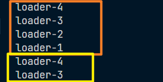
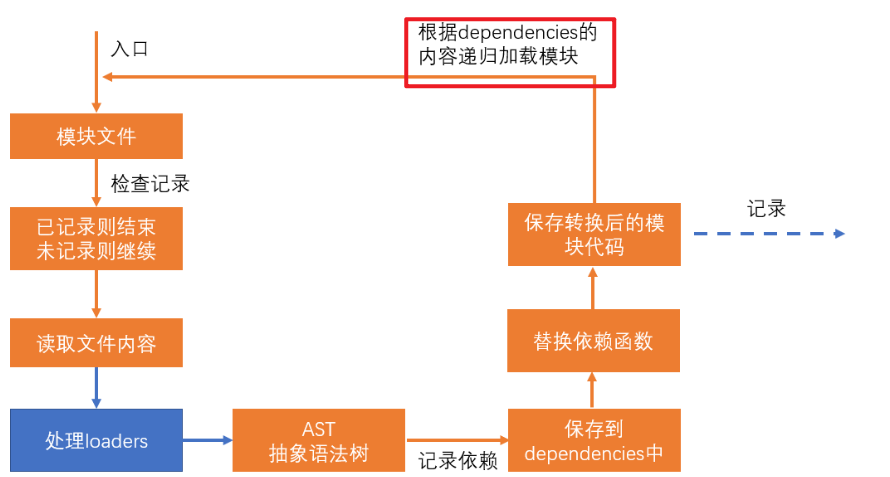

# loader

> webpack做的事情，仅仅是分析出各种模块的依赖关系，然后形成资源列表，最终打包生成到指定的文件中。
> 更多的功能需要借助webpack loaders和webpack plugins完成。

webpack loader： loader本质上是一个函数，它的作用是将某个源码字符串转换成另一个源码字符串返回。


loader函数的将在模块解析的过程中被调用，以得到最终的源码。

**全流程：**


**chunk中解析模块的流程：**


**chunk中解析模块的更详细流程：**


**处理loaders流程：**


比如，可能文件后缀为 js 的文件交给什么 loader，后缀为 css 的交给什么 loader

**loader配置：**

**完整配置**

```js
module.exports = {
    module: { //针对模块的配置，目前版本只有两个配置，rules、noParse
        rules: [ //模块匹配规则，可以存在多个规则
            { //每个规则是一个对象
                test: /\.js$/, //匹配的模块正则
                use: [ //匹配到后应用的规则模块
                    {  //其中一个规则
                        loader: "模块路径", //loader模块的路径，该字符串会被放置到require中
                        options: { //向对应loader传递的额外参数

                        }
                    }
                ]
            }
        ]
    }
}
```

**简化配置**

```js
module.exports = {
    module: { //针对模块的配置，目前版本只有两个配置，rules、noParse
        rules: [ //模块匹配规则，可以存在多个规则
            { //每个规则是一个对象
                test: /\.js$/, //匹配的模块正则
                use: ["模块路径1", "模块路径2"]//loader模块的路径，该字符串会被放置到require中
            }
        ]
    }
}
```

## 具体示例演示

### 初步定义 loader

1. loader 的本质就是一个函数，所以我们需要先有这个函数，定义 test-loader 文件，导出 loader，如下：

   ~~~js
   module.exports = function (sourceCode) {
       
   }
   ~~~

2. sourceCode解析：webpack 在打包的时候，会把源代码作为字符串传进来，然后经过 loader 函数的解析改变，返回一个新的字符串，然后webpack 在把这个新的字符串去做 AST(抽象语法树分析)

3. 使用 loader，在 webpack.config.js 文件中进行配置使用，如下：

   ~~~js
   module.exports = {
   	mode: 'development',
   	// 配置入口
   	entry: {
   		main: './src/index.js'
   	},
   	// 配置出口
   	output: {
   		filename: '[name].[chunkhash:5].js'
   	},
   	// 针对模块的配置
   	module: {
           // rules 表示模块的匹配规则
   		//  - 是一个数组可以设置多个规则
    		rules:[
               {
                	// test 是一个正则表达式，匹配模块的路径
   				//  - 比如 ./src/index.js 这个文件，他就会用这个路径来规则里面的 test 正则匹配，如果能匹配上就使用
   				test: /index\.js$/, // -- 表示匹配 index.js
               
               	// 当匹配规则成功后，就会在 use 里面查看加载器
   				//  - 就会使用这些加载器
   				//  - use 是一个数组，可存在多个加载器
               	use:[
                      {
               			loader: './loader/test-loader'
               		}, 
                   ]  
               }
           ]       
       }
   }
   ~~~

4. 上述的配置中，当你的一个规则配置的加载器是只有一个简单的 loader 字符串时，可以简写，无需完整的写成一个对象，如下：

   ~~~js
   module.exports = {
   	mode: 'development',
   	entry: {
   		main: './src/index.js'
   	},
   	output: {
   		filename: '[name].[chunkhash:5].js'
   	},
   	module: {
   		// 简写
    		rules:[{
               test: /index\.js$/,
               use:['./loader/test-loader']
           }]       
       }
   }
   ~~~

5. 上述就完成了基础的配置

### 测试 sourceCode

1. 测试之前还需要定义一个执行的文件，src/index.js，目前内部代码如下：

   ~~~js
   var a = 1
   console.log('hello world')
   ~~~

2. 只有一个变量和一句简单的输出语句，我们看看在我们写的 loader 中的传入的 sourceCode 参数中，会打印出什么值，如图：

   

3. 看一下打包之后实际生成的文件内容，如图：

   

4. 可以看到，就是一个源码字符串，并且就是我们 loader 返回的 sourceCode 既然是个字符串。我们就可以进行操作，修改，比如改为 打印 how are you，loader 函数修改如下：

   ~~~js
   module.exports = function (sourceCode) {
   	console.log(sourceCode)
   	return 'console.log(`how are you`)'
   }
   ~~~

5. 我们再看看现在的 loader 输出和打包后的文件内容，如图：

   

6. 通过这个示例就可以知道我们可以在这里对源码进行修改

### 加载器的 options

1. 在我们程序中，很多时候需要的是一个动态的执行，比如传递参数，根据传递的参数来进行一些对应的设置，比如我开发时编写的源码如下：

   ~~~js
   变量 a = 1
   ~~~

2. 当然这种定义是错误的，我们的需求是，通过 loader 把变量都替换为 var 关键字，直接在 loader 中通过 sourceCode.replace(/变量/g, 'var') 当然是可以的，不过我们需要动态的的把这个变量传入，针对于此，我们首先要在 加载器里面通过 options 传入参数，如下：

   ~~~js
   module.exports = {
   	mode: 'development',
   	entry: {
   		main: './src/index.js'
   	},
   	output: {
   		filename: '[name].[chunkhash:5].js'
   	},
   	module: {
   		// 简写
    		rules:[
               {
                   test: /index\.js$/,
               	use:[{
                       loader: './loader/test-loader'
                       // 传递参数配置
                       options: {
                       	changeVar: '变量'
                   	}
                   }]
               }
           ]       
       }
   }
   ~~~

3. 这样设置之后，又如何在 loader 中获取这个参数呢？

   1. 方法一：上下文获取

      ~~~js
      module.exports = function (sourceCode) {
          // webpack 运行的时候会有一个上下文 this，可以在这里获取
          console.log(this.loaders[0].options)
      	return sourceCode
      }
      ~~~

      结果如图：

      

   2. 方法二：通过第三方库获取`(webpack 5之前)`

      ~~~js
      // 可以借助第三方库【loader-utils】来获取这个 loader 的 options
      const options = loaderUtils.getOptions(this) || {}
      ~~~

   3. 方法三：this.getOptions()；`(webpack 5)`，[文档查看](https://www.webpackjs.com/api/loaders/#thisgetoptionsschema)

      ~~~js
      module.exports = function (sourceCode) {
        	var options = this.getOptions() || {}
      	return sourceCode
      }
      ~~~

      

4. 拿到这个之后就可以修改操作，如下：

   ~~~js
   module.exports = function (sourceCode) {
   	var reg = new RegExp(options.changeVar, 'g')
   	return sourceCode.replace(reg, 'var')
   }
   ~~~

5. 结果如图：

   

### 执行顺序

> 规则和加载器的执行顺序：`从下至上` 和 `从右至左`

1. 我们新增四个 loader，结果如图：

   

2. 这四个 loader 内容都非常简单，都是一直的，打印不同而已，下面展示 loader1，如下：

   ~~~js
   module.exports = function (sourceCode) {
   	console.log('loader-1')
   	return sourceCode
   }
   // 其余只有打印的末尾数字不同
   ~~~

3. 开发的结构如图：

   

4. index.js 文件如下：

   ~~~js
   require('./a.js')
   
   console.log('index file')
   ~~~

5. webpac.config.js 配置文件如下：

   ~~~js
   module.exports = {
   	mode: 'development',
   	entry: {
   		main: './src/index.js'
   	},
   	output: {
   		filename: '[name].[chunkhash:5].js'
   	},
   	module: {
   		// 简写
    		rules:[
               {
                   test: /index\.js$/,
               	use: ['./loader/loader1.js', './loader/loader2.js']
               },
               // 规则2
   			{
   				test: /\.js$/,
   				use: ['./loader/loader3.js', './loader/loader4.js']
   			}
           ]       
       }
   }
   ~~~

6. 看一下打印的结果，如图：

   

7. 先打印了一下 4、3、2、1，这是因为两个规则都是可以满足 index.js 这个文件的判定的，所以都执行了一次，而引入的依赖 a 文件只满足 `/\.js$/`，而不满足 `/index\.js$/` 这个条件，所以后面一次只输出了 4、3

8. 这个就符合我们一开始看到的图，如图：

   

9. 会递归的执行加载其他模块
