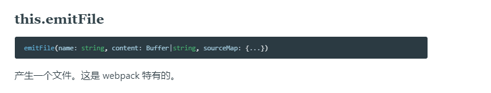

# 处理图片

## 直接使用

1. 目录结构如图：

   

2. index.js 代码如下：

   ~~~js
   const src = require('./assets/1.jpg')
   const img = document.createElement('img')
   img.src = src
   document.body.appendChild(img)
   ~~~

3. 执行结果：

   

4. 这个报错就提示我们需要一个 loader 来处理图片，虽然引入了，但是被当做 js 文件处理，而图片是一些二进制的数据，很明显当做js来解析的时候无法通 AST 语法树分析

## 使用 loader 处理图片

1. 创建 loader 文件夹，在此之下创建 img-loader 文件，loader 内容如下：

   ~~~js
   module.exports = function (source) {
   	return ``
   }
   ~~~

2. 应用 loader，webpack.js 文件如下：

   ~~~js
   module.exports = {
   	mode: 'development',
   	entry: {
   		main: './src/index.js'
   	},
   	output: {
   		filename: '[name].js'
   	},
   	module: {
   		rules: [
   			{
   				test: /\.(jpg)|(png)|(jpeg)|(webp)|(gif)$/,
   				exclude: /node_modules/,
   				use: ['./loader/img-loader.js']
   			}
   		]
   	}
   }
   ~~~

3. 现在我们执行 npx webpack 看看效果：

   

4. 这些是一些二进制的乱码数据，但是是字符串数据，如图：

   

5. 但是这些是`字符串的数据`其实我们不是很好操作，需要获取他的原始数据格式 buffer，那怎么获取呢，关于这些都是在[webpack文档](https://www.webpackjs.com/api/loaders/#raw-loader)中有相关说明的，如图：

   

6. 现在我们再查看输出的结果，如图：

   

### base64 的方法

1. 获取到这个原始的数据之后，我们就可以实现对于图片的处理，比如转成 base64，处理如下：

   ~~~js
   module.exports = function (source) {
   	const base64 = getBase64(source)
   	//  - 这样导出就等于把图片的数据放入一个js文件种，作为模块使用导出
   	return `module.exports = \`${base64}\``
   }
   
   module.exports.raw = true
   
   function getBase64(buffer) {
   	// 此处图片类型可以根据文件名称动态匹配
   	return 'data:image/jpg;base64,' + buffer.toString('base64')
   }
   ~~~

2. 现在网页图片就可以正常显示了，如下：

   

### 生成文件路径处理图片

1. 这方式最主要的就是获取一个文件路径，所以我们需要先生成，方法如下：

   ~~~js
   function getFilePath(buffer) {
       // contenthash规则 8表示长度 .[ext] 表示生成后缀
   	const filename = loaderUtils.interpolateName(this, '[contenthash:8].[ext]', {
   		content: buffer
   	})
   }
   ~~~

2. 而不用文件名的源文件名称，就是源文件的文件名可能会重复

3. 有了文件之后还不够，我们还需要有这个文件，所以我们需要在最终打包的资源列表里面提供一个这样的文件，可以使用 webpack 上下文的 this 里面的 [emitFile]() 方法，如下：

   ~~~js
   const loaderUtils = require('loader-utils')
   
   module.exports = function (source) {
   	const filename = getFilePath.call(this, source)
   	return `module.exports = \`${filename}\``
   }
   
   module.exports.raw = true
   
   function getFilePath(buffer) {
   	const filename = loaderUtils.interpolateName(this, '[contenthash:8].[ext]', {
   		content: buffer
   	})
       
       // 文件名-数据
   	this.emitFile(filename, buffer)
   	return filename
   }
   ~~~

4. 结果如图：

   

5. 打包结果：

   

