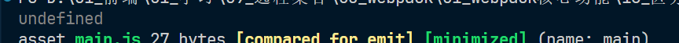
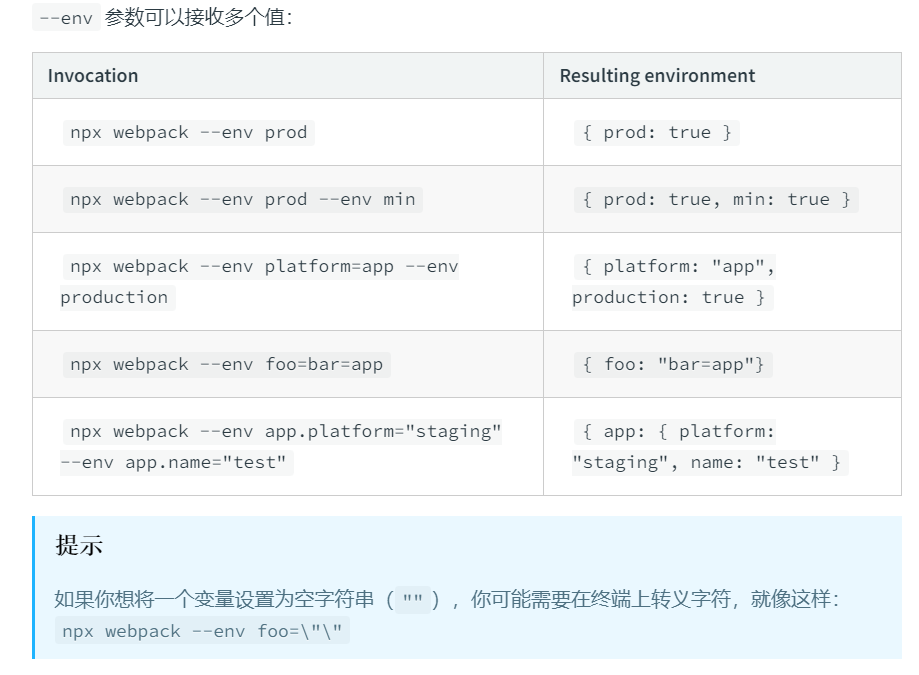

# 区分环境

## 第一种方案

1. 创建两个不同的配置文件，表示不同环境下需要的配置，并配置命令进行打包

2. npm run dev 表示开发环境命令

3. npm run build 表示生产环境命名

4. 开发环境配置文件：webpack.dev.js

   ~~~js
   module.exports = {
   	mode: 'development',
   	devtool: 'source-map'
   }
   ~~~

5. 生产换成配置文件：webpac.prod.js

   ~~~js
   module.exports = {
   	mode: 'production'
   	// devtool: 'none' -- webpack 5 中如果为生产环境需要省略此选项
   }
   ~~~

6. [使用不同的配置文件](https://webpack.docschina.org/configuration)，命令配置如下：

   ~~~json
   {
       "scripts": {
   		"dev": "webpack --config webpack.dev.js",
   		"build": "webpack --config webpack.prod.js"
   	},
   }
   ~~~

## 第二种方案 

1. 导出的是一个函数而不再是一个对象，[文档](https://webpack.docschina.org/configuration/mode/#mode-none)

2. 先看一下基础的结构，如下：

   ~~~js
   var config = {
   	entry: './src/index.js'
   }
   
   module.exports = (env, argv) => {
   	console.log(env)
   	return config
   }
   ~~~

3. 执行 npx webpack 看一下 env 的值，如下：

   ~~~
   { WEBPACK_BUNDLE: true, WEBPACK_BUILD: true }

4. 在官网中是通过 argv.mode 来判断环境的，我们执行 npx webpack 看一下 argv.mode 会输出什么，如下：

   

5. 输出的是 undefined，这是为什么呢？因为我们的命令 npx webpack 并没有给他设置值，如果没有设置，就是 undefined，那么怎么设置呢？详情请看[文档](https://webpack.docschina.org/api/cli/#environment-options)，如图：

   

6. 所以根据上述规律，我们可以来任意设置一下 abc=123 来尝试看一下，运行命令 `npx webpack --env abc=123`，打印 argv 结果如下：

   ~~~
   { env: { WEBPACK_BUNDLE: true, WEBPACK_BUILD: true, abc: '123' } }
   ~~~

7. 在运行这个命令看一下 env 的值呢？如下：

   ~~~
   { WEBPACK_BUNDLE: true, WEBPACK_BUILD: true, abc: '123' }

8. 可以看到，其实我们实际需要用到的是 env 第一个参数即可，基于此我们可以来设置一下具体的环境变量，例如命令：`npx webpack --env mode=development`，然后判断 mode 即可

9. 但是根据文档提示，我们规范的写法应该是执行 `npx webpack --env prod`，执行结果如下：

   ~~~
   { WEBPACK_BUNDLE: true, WEBPACK_BUILD: true, prod: true }

10. 所以根据这个我们只需要判断 prod 属性为 true 则表示是生产环境，否则为开发环境，改造代码如下：

    ~~~js
    var config = {
    	entry: './src/index.js'
    }
    
    module.exports = (env, argv) => {
    	if (env.prod) {
    		// 生产环境
    		config.mode = 'production'
    	} else {
    		// 开发环境
    		config.mode = 'development'
    		config.devtool = 'source-map'
    	}
    	return config
    }
    ~~~

11. 所以如果我们希望生产环境执行命令 `npx webpack --env prod` 即可，如果是希望开发环境，则执行运行 npx webpack

12. 当然我们还是可以把这个配置设置到 package.json 文件中，如下：

    ~~~json
    {
        "scripts": {
    		"dev": "webpack",
    		"build": "webpack --env prod"
    	}
    }
    ~~~

13. 如果想把配置项目分开，不让这个文件显得臃肿，就可以分开书写配置，然后区分环境使用 require() 方法导入对应的配置项即可
