# 其他补充

## context

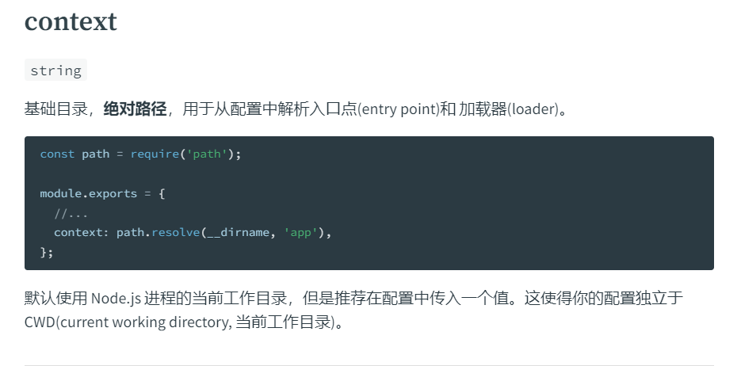

我们知道 entry 配置的默认入口文件路径是相对于当前项目的执行文件目录的，而这个 context 的意思是，当你配置了 context 的这个选项的时候，entry 配置的入口文件就是相对于 context 配置的指定的文件路径了，可以理解为是一个根路径，这个根路径不仅会影响 entry 也会影响 loader，比如目前目录如图：

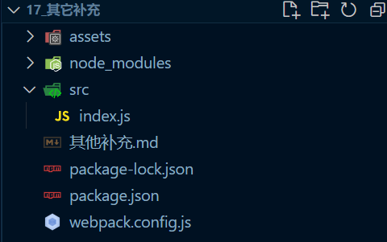

配置如下：

~~~js
module.exports = {
	mode: 'development',
	entry: {
		main: './src/index.js'
	}
}
~~~

配置 context 如下：

~~~js
const path = require('path')

module.exports = {
	mode: 'development',
	entry: {
		main: './index.js'
	},
	context: path.resolve(__dirname, 'src')
}
~~~

可以看到，此时 entry 配置的时候省略了 src 这段路径，也一样可以和上面的配置是一样的效果

## output

### library

[详情](https://webpack.docschina.org/configuration/output/#outputlibrary)

大概意思就是，你可以通过给这个配置添加一个字符串，这个字符串就会作为一个变量名，暴露出去，同时如果你在入口文件暴露了一些方法的话，可以通过变量名进行操作，配置如下：

~~~js
module.exports = {
	mode: 'development',
	entry: {
		main: './src/index.js'
	},
	output: {
		library: 'coderjc'
	}
}
~~~

入口文件代码如下：

~~~js
console.log('Hello, World!')
export function foo() {
	console.log('foo')
}
~~~

打包结果如图：

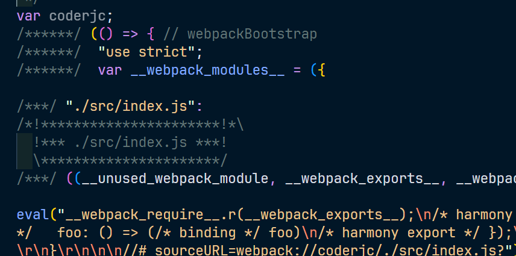

而我们将这个打包的文件引入一个 html 文件中打印看一下，如图：

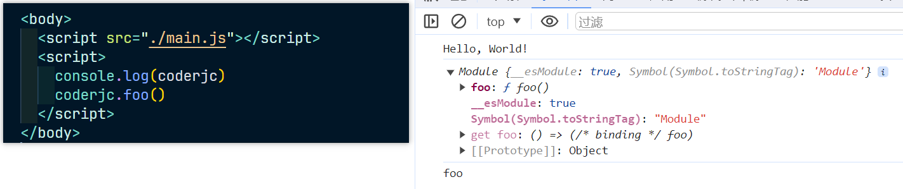

`所以说这个 coderjc 变量其实得到的结果是入口文件导出的结果`

### libraryTarget

[文档](https://webpack.docschina.org/configuration/output/#outputlibrarytarget)

但是在文档中目前的版本已经建议我不要使用这个配置，而是使用 [`output.library.type`](https://webpack.docschina.org/configuration/output/#outputlibrarytype) 

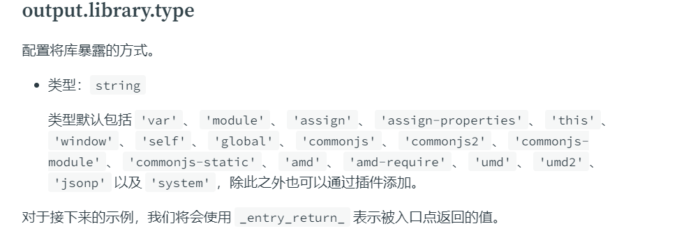

比如我们设置 window，配置如下：

~~~js
module.exports = {
	mode: 'development',
	entry: {
		main: './src/index.js'
	},
	output: {
		library: {
			name: 'coderjc',
			type: 'window'
		}
	}
}
~~~

文档的描述，如图：

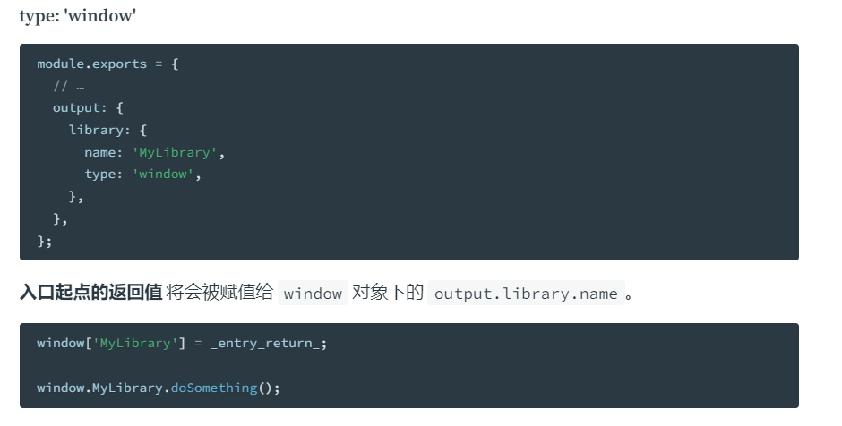

按照这个描述，在 window 上会存在我们配置的 coderjc 属性，如图：

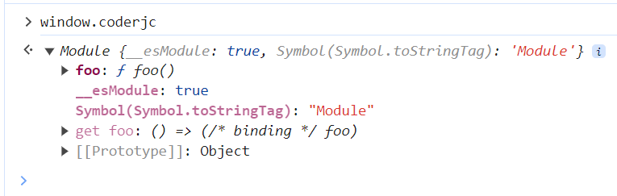

## target

[文档](https://webpack.docschina.org/configuration/target/)

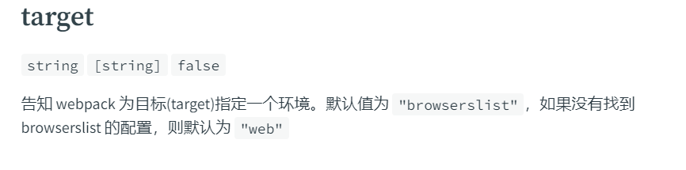

`这个则是设置打包结果最终需要运行的环境`，注意：这不是指打包完成后的打包文件，而是指这个项目在进行打包的过程时，使用的环境

## module.noParse

[文档](https://webpack.docschina.org/configuration/module/#modulenoparse)

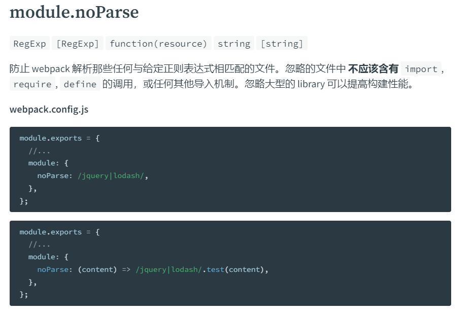

在正常的编译过程中，会读取问价内容，然后经过 ast抽象语法树分析，然后记录依赖等等操作，但是如果配置了 noParse 之后，那么如果符合这个设置的正则条件，那么那个文件就不会进行任何操作，也不会执行这个文件内部的`导入那些依赖的语句`，会直接把源代码打包到模块内容中，所以会建议我们忽略的文件中最好不要依赖其他文件，因为在忽略的文件中，不会执行这些依赖

所以当一些单模块的文件，即这个文件内容很大，而且不依赖其他文件了，那么就可以忽略这个文件，不去进行那些什么 ast抽象语法树分析，从而提升打包效率

## resolve

### modules

[文档](https://webpack.docschina.org/configuration/resolve/#resolvemodules)

这个表示是模块的查找位置，比如我们在 index.js 文件中使用 require('jquery') 的查找规则是什么。是现在当前这个 index.js 的执行目录 src 下查找 node_modules 文件夹，如果 src 文件下有 node_modules 就在这里面找，如果没有就返回上一级目录找，而为什么是 node_modules 这个文件夹下而不是其他的文件夹呢？就是`因为这个模块的查找位置(resolve.modules)默认是 node_modules`

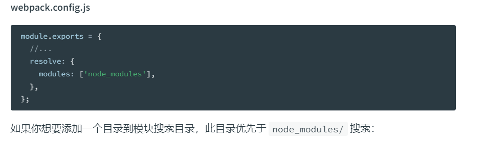

看到这个数组形式，就不难猜出是可以配置多个的，例如：

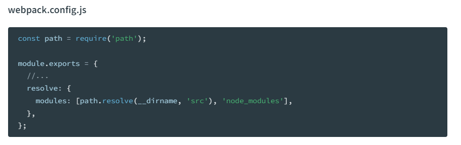

`tip：这个仅适用于当这个导入的模块前面没有使用 ./ 这种符号开头的时候`，比如：

~~~js
const $ = require('jquery')
~~~

而且这个查找是 webpack 在查找，而非 node 在查找，其实规则一样，怎么验证这点呢？我们在 index.js 中写入代码：

~~~js
const a = 1
if (a < 0) {
	require('./a')
}
~~~

目录结构如图：

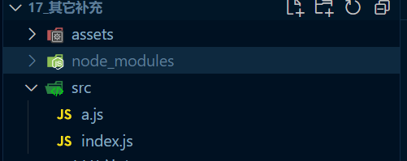

此时按照这个判断跳进是不会进入 if 执行 require 的，所以打包结果是不会存在 a 模块的，打包结果如图：

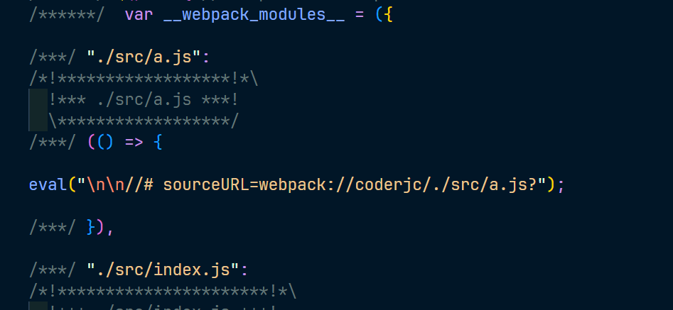

可以看到还是存在 a 这个模块的，这是为什么呢？因为在打包的时候，规则是不会执行代码的，只要扫描代码的时候遇到了 require 这个函数，就会去导入这个模块

### extensions

[文档](https://webpack.docschina.org/configuration/resolve/#resolveextensions)

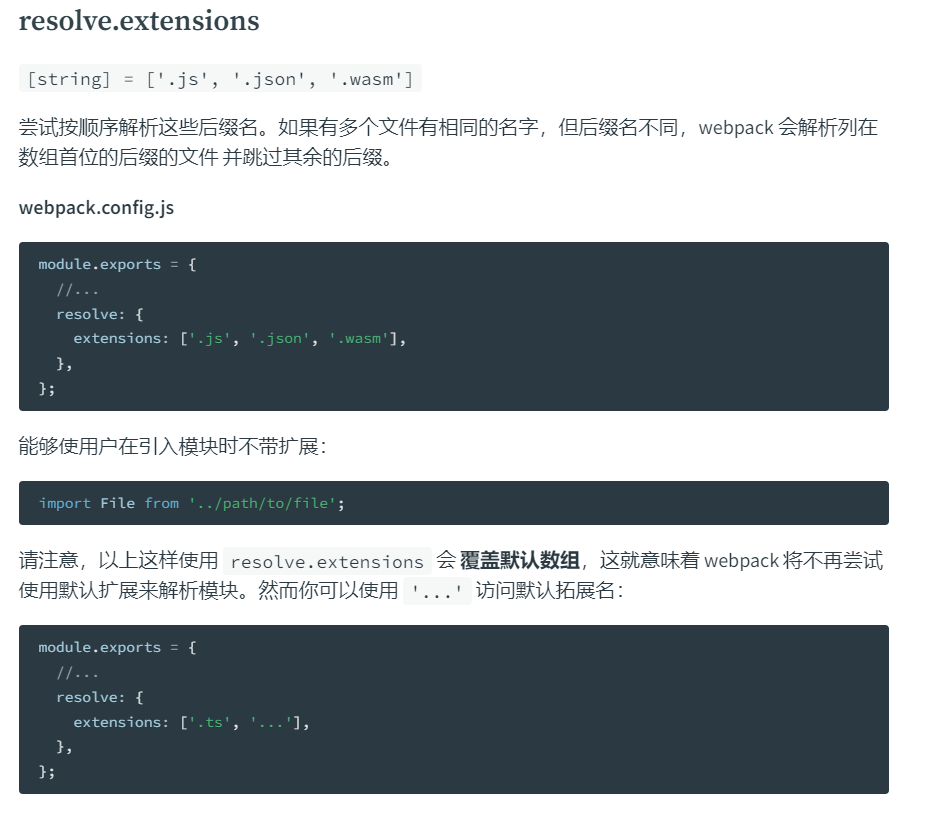

根据这个解析，我们就可以来解释一下当我们使用 require('./a') 这样导入的时候，为什么不用加上后缀名了，就是因为这个配置了，所以如果以后有需要导入的文件，想省略后缀名，就可以进行配置，例如：

~~~js
module.exports = {
    resolve: {
        extensions: ['.js', '.json', '.vue', '.jsx']
    }
}
~~~

### alias

[文档](https://webpack.docschina.org/configuration/resolve/#resolvealias)

这个就非常好理解了，比如 vue 中有个 @ 符号，表示 src 目录，就是使用了这样的别名效果，可以让其他模块使用导入的其他模块时是这个 src 目录的时候，不用自己根据当前的目录查询，只需要 @/xxx 即可

~~~js
const path = require('path')

module.exports = {
	mode: 'development',
	entry: {
		main: './src/index.js'
	},
	resolve: {
		alias: {
			'@': path.resolve(__dirname, 'src')
		}
	}
}
~~~

## externals

[文档](https://webpack.docschina.org/configuration/externals/#externals)

例如有些包我们可能开发的时候安装了依赖，但是在打包之后运行的是cdn引用的，这时候如果再把这个安装的依赖包打包进最后的文件里面，就会造成不必要的代码开支，这时候就可以使用这个配置来排除

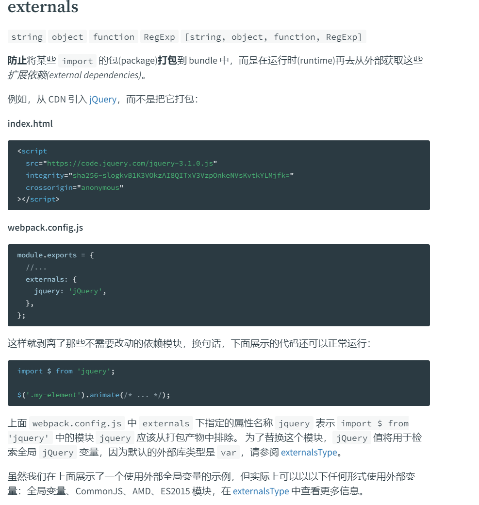
