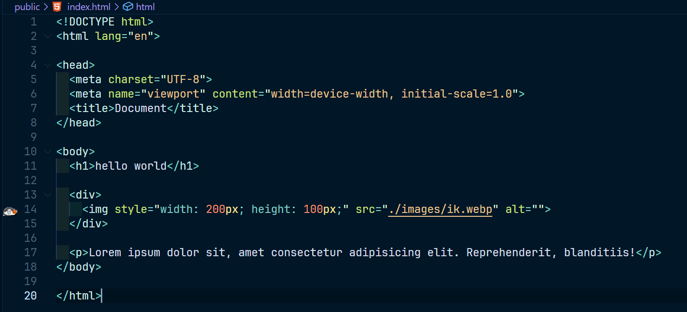
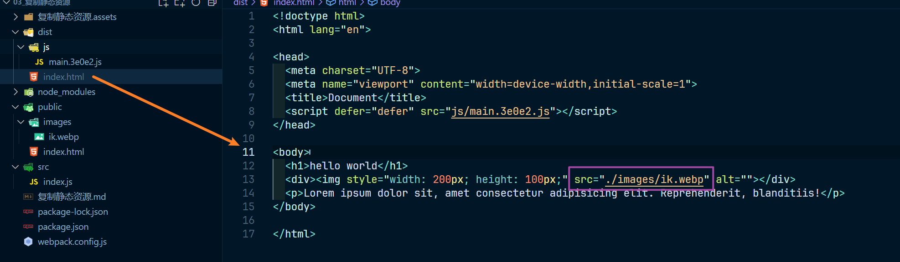
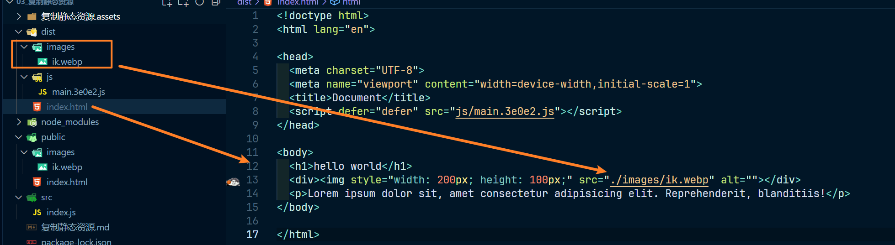

# 复制静态资源

>copy-webpack-plugin

我们调整一下 public 文件夹下的 index.html 的模板文件，如图：

那么我们看一下 webpack.config.js 文件的配置，如下：

~~~js
const { CleanWebpackPlugin } = require('clean-webpack-plugin')
const HtmlWebpackPlugin = require('html-webpack-plugin')

module.exports = {
	mode: 'production',
	output: {
		path: __dirname + '/dist',
		filename: 'js/[name].[chunkhash:5].js' // 增加 js 文件夹路径
	},
	plugins: [
		new CleanWebpackPlugin(),
		new HtmlWebpackPlugin({
			template: './public/index.html'
		})
	]
}
~~~

打包结果如图：

此时就会发现这个图片资源是没有复制过来的，此时如果运行肯定是无法显示图片的，因为这个图片在模板中不属于 js 资源也没有形成依赖，所以自然不会被打包

所以现在我们就希望有一些东西可以原封不动的放到 dist 这个打包后的输出目录下，我们就可以利用这个插件完成，使用如下：

~~~js
const { CleanWebpackPlugin } = require('clean-webpack-plugin')
const HtmlWebpackPlugin = require('html-webpack-plugin')
const CopyPlugin = require('copy-webpack-plugin')

module.exports = {
	mode: 'production',
	output: {
		path: __dirname + '/dist',
		filename: 'js/[name].[chunkhash:5].js' // 增加 js 文件夹路径
	},
	plugins: [
		new CleanWebpackPlugin(),
		new HtmlWebpackPlugin({
			template: './public/index.html'
		}),
		new CopyPlugin({
			patterns: [
                // from 复制那个文件     to 复制到哪里
				{ from: './public/images/ik.webp', to: __dirname + '/dist/images/ik.webp' } // 复制规则
				// ...这个规则可以是多个
			]
		})
	]
}
~~~

此时查看打包结果，如图：

而这时指定单一的文件，如果希望是把 public 文件夹的所有内容都复制过去，只需要写成 ./public 即可，如下：

~~~js
const { CleanWebpackPlugin } = require('clean-webpack-plugin')
const HtmlWebpackPlugin = require('html-webpack-plugin')
const CopyPlugin = require('copy-webpack-plugin')

module.exports = {
	mode: 'production',
	output: {
		path: __dirname + '/dist',
		filename: 'js/[name].[chunkhash:5].js'
	},
	plugins: [
		new CleanWebpackPlugin(),
		new HtmlWebpackPlugin({
			template: './public/index.html'
		}),
		new CopyPlugin({
			patterns: [{ from: './public', to: __dirname + '/dist/public' }]
		})
	]
}
~~~

打包结果如图：

