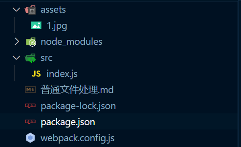
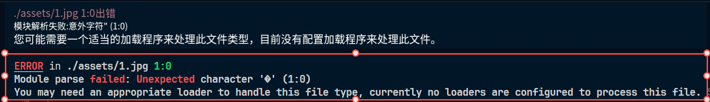
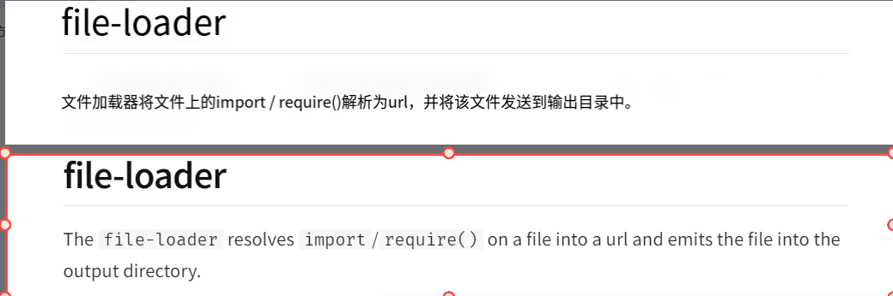
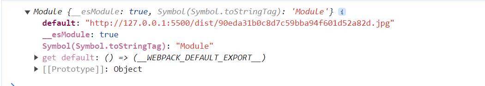
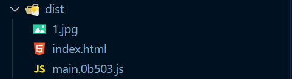
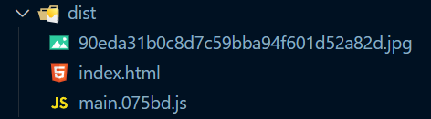
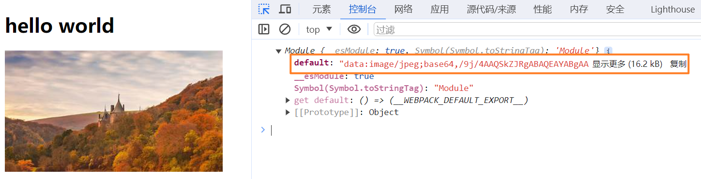

# 普通文件处理

## file-loader

> 生成一个具有相同文件内容的文件到输出目录，然后将模块文件设置为：一个路径，通过 export default 导出的一个路径

### file-loader 基本使用

1. 我们可以直接把文件进行复制，实现静态资源的使用，但是这样有点不好，太死板了，如果我们希望有些图片是动态导入的，只有满足条件才导入

2. 目录结构如图：

   

3. 代码如下：

   ~~~js
   const jpg = require('../assets/1.jpg')
   console.log(jpg)
   
   const flag = true
   
   if (flag) {
   	const img = document.createElement('img')
   	img.src = jpg
   	document.body.appendChild(img)
   }
   ~~~

4. webpack.config.js 配置如下：

   ~~~js
   const { CleanWebpackPlugin } = require('clean-webpack-plugin')
   const HtmlWebpackPlugin = require('html-webpack-plugin')
   
   module.exports = {
   	mode: 'development',
   	output: {
   		path: __dirname + '/dist',
   		filename: '[name].[chunkhash:5].js'
   	},
   	plugins: [
   		new CleanWebpackPlugin(),
   		new HtmlWebpackPlugin({
   			template: './public/index.html'
   		})
   	]
   }
   ~~~

5. 此时这个 flag 是固定位 true，但是载实际开发就不是固定为 true 了，所以这种情况下如果直接这样导入就报错，如图：

   

6. 为什么报错？此时这个图片资源通过 require 也会被导入，webpack 一切皆模块，但是图片资源在进行 ast抽象语法树分析就会出错，因为不是一个 js 代码，所以就会报错，之前我们是自己写 loader 来处理的，但是实际是可以通过一个现成的 loader 来处理的， file-loader，作用如图：

   

7. 我们看一下 jpg 输出的是什么？如图：

   

8. file-loader 是通过 export default 导出的，所以这里如果使用的是 require 获取的话，还需要 .default，因此index.js的代码需要改写一下，如下：

   ~~~js
   const jpg = require('../assets/1.jpg').default
   console.log(jpg)
   const flag = true
   
   if (flag) {
   	const img = document.createElement('img')
   	img.src = jpg
   	document.body.appendChild(img)
   }
   ~~~

9. 结果如图：

   

### file-loader 修改输出到输出目录dist下的文件名称

1. 通过这个配置可以修改文件名，如下：

   ~~~js
   const { CleanWebpackPlugin } = require('clean-webpack-plugin')
   const HtmlWebpackPlugin = require('html-webpack-plugin')
   
   module.exports = {
   	mode: 'development',
   	output: {
   		path: __dirname + '/dist',
   		filename: '[name].[chunkhash:5].js'
   	},
   	module: {
   		rules: [
   			{
   				test: /\.(png)|(jpg)|(jpeg)|(gif)$/,
   				loader: 'file-loader',
   				options: {
   					name: '[path][name].[ext]',
                       // name: 'imgs/[name].[contenthash:5].[ext]', 这样可以指定输出的到那个文件夹下
   				}
   			}
   		]
   	},
   	plugins: [
   		new CleanWebpackPlugin(),
   		new HtmlWebpackPlugin({
   			template: './public/index.html'
   		})
   	]
   }
   ~~~

2. 查看打包后的结果，如图：

   

3. 目录结构如图：

   

4. 而如果希望将所有处理的文件都直接放在 dist 目录下，去掉 [path] 即可，如下：

   ~~~js
   const { CleanWebpackPlugin } = require('clean-webpack-plugin')
   const HtmlWebpackPlugin = require('html-webpack-plugin')
   
   module.exports = {
   	mode: 'development',
   	output: {
   		path: __dirname + '/dist',
   		filename: '[name].[chunkhash:5].js'
   	},
   	module: {
   		rules: [
   			{
   				test: /\.(png)|(jpg)|(jpeg)|(gif)$/,
   				loader: 'file-loader',
   				options: {
   					name: '[name].[ext]' // 去掉 [path]
   				}
   			}
   		]
   	},
   	plugins: [
   		new CleanWebpackPlugin(),
   		new HtmlWebpackPlugin({
   			template: './public/index.html'
   		})
   	]
   }
   
   ~~~

5. 结构如图：

   

6. 当然也可以根据文件内容生成hash值来实现，也就是默认的形式，如下：

   ~~~js
   const { CleanWebpackPlugin } = require('clean-webpack-plugin')
   const HtmlWebpackPlugin = require('html-webpack-plugin')
   
   module.exports = {
   	mode: 'development',
   	output: {
   		path: __dirname + '/dist',
   		filename: '[name].[chunkhash:5].js'
   	},
   	module: {
   		rules: [
   			{
   				test: /\.(png)|(jpg)|(jpeg)|(gif)$/,
   				loader: 'file-loader',
   				options: {
   					name: '[contenthash].[ext]' // 内容哈希
   				}
   			}
   		]
   	},
   	plugins: [
   		new CleanWebpackPlugin(),
   		new HtmlWebpackPlugin({
   			template: './public/index.html'
   		})
   	]
   }
   
   ~~~

7. 如图：

   

8. 基于此，还可以使用根据需要自行配置，如下：

   ~~~js
   const { CleanWebpackPlugin } = require('clean-webpack-plugin')
   const HtmlWebpackPlugin = require('html-webpack-plugin')
   
   module.exports = {
   	mode: 'development',
   	output: {
   		path: __dirname + '/dist',
   		filename: '[name].[chunkhash:5].js'
   	},
   	module: {
   		rules: [
   			{
   				test: /\.(png)|(jpg)|(jpeg)|(gif)$/,
   				loader: 'file-loader',
   				options: {
   					name: '[name].[contenthash:5].[ext]' // 文件名.内容哈希值(长度为5).后缀
   				}
   			}
   		]
   	},
   	plugins: [
   		new CleanWebpackPlugin(),
   		new HtmlWebpackPlugin({
   			template: './public/index.html'
   		})
   	]
   }
   ~~~

9. 如图：

   

10. 如果希望区分环境来使用不同的规则，也可以使用函数来实现，如下：

    ~~~js
    const { CleanWebpackPlugin } = require('clean-webpack-plugin')
    const HtmlWebpackPlugin = require('html-webpack-plugin')
    
    // 可以直接设置这个值，也可以通过 module.exports 导出一个函数来根据命令动态决定环境值
    process.env.NODE_ENV = 'development'
    
    module.exports = {
    	mode: 'development',
    	output: {
    		path: __dirname + '/dist',
    		filename: '[name].[chunkhash:5].js'
    	},
    	module: {
    		rules: [
    			{
    				test: /\.(png)|(jpg)|(jpeg)|(gif)$/,
    				loader: 'file-loader',
    				options: {
    					name(resourcePath, resourceQuery) {
    						console.log(process.env.NODE_ENV)
    						if (process.env.NODE_ENV === 'development') {
    							return '[path][name].[ext]'
    						}
    
    						return '[name].[contenthash:5].[ext]'
    					}
    				}
    			}
    		]
    	},
    	plugins: [
    		new CleanWebpackPlugin(),
    		new HtmlWebpackPlugin({
    			template: './public/index.html'
    		})
    	]
    }
    ~~~

## url-loader

> 把一个文件转为 base64 的格式，而不是生成一个文件到输出目录，所以经过这个 loader 处理的文件会导出为一个 base64 格式

## url-loader 基本使用

1. index.js 如下：

   ~~~js
   const jpg = require('../assets/1.jpg')
   console.log(jpg)
   const flag = true
   
   if (flag) {
   	const img = document.createElement('img')
   	img.src = jpg.default
   	document.body.appendChild(img)
   }
   ~~~

2. 配置如下：

   ~~~js
   const { CleanWebpackPlugin } = require('clean-webpack-plugin')
   const HtmlWebpackPlugin = require('html-webpack-plugin')
   
   module.exports = {
   	mode: 'development',
   	output: {
   		path: __dirname + '/dist',
   		filename: '[name].[chunkhash:5].js'
   	},
   	module: {
   		rules: [
   			{
   				test: /\.(png)|(jpg)|(jpeg)|(gif)$/,
   				use: [
   					{
   						loader: 'url-loader',
   						options: {
   							limit: 819200 // 设置大小 超出这个大小就不处理
   						}
   					}
   				]
   			}
   		]
   	},
   	plugins: [
   		new CleanWebpackPlugin(),
   		new HtmlWebpackPlugin({
   			template: './public/index.html'
   		})
   	]
   }
   ~~~

3. 打包目录如图：

   

4. 可以看到是没有图片文件的，看一下实际的输出，如图：

   

5. 设置 limit 为 false 表示不限制大小

