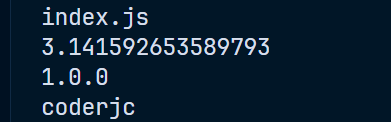
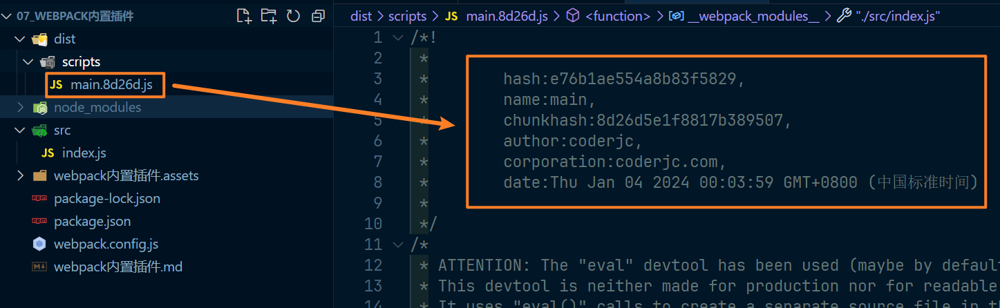
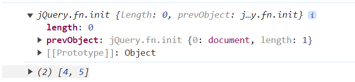

# webpack 内置插件

> 所有的 webpack 内置插件都作为 webpack 的静态属性存在，使用方法基本都是类似于引入 webpack，实例化 new webpack.插件名

## DefinePlugin

全局常量定义插件，使用该插件通常定义一些常量值，例如：

~~~js
const webpack = require('webpack')

module.exports = {
	mode: 'development',
	output: {
		path: __dirname + '/dist',
		filename: 'scripts/[name].[chunkhash:5].js'
	},
	plugins: [
		// 这个是等于字符串里面的值
		new webpack.DefinePlugin({
			PI: `Math.PI`, // 是 const PI = Math.PI，而不是 const PI = "Math.PI"
			VERSION: `"1.0.0"`, // 使用 `` 包裹一下，就表示 VERSION 是字符串 "1.0.0"，如果不加这个 ``，里面的就是一个值 1.0.0
			DOMAIN: '"coderjc"'
		})
	]
}
~~~

是 const PI = Math.PI，而不是 const PI = "Math.PI" 这句话的意思是等于 Math.PI 而不是 字符串"Math.PI"

其他同理，当这样写了之后，就可以直接在代码中使用，如下：

~~~js
console.log('index.js')
console.log(PI)
console.log(VERSION)
console.log(DOMAIN)
~~~

打包之后直接运行js文件结果如图：

## BannerPlugin

这个非常简单，就是在每个 chunk 文件上添加一些注释，配置如下：

~~~js
const webpack = require('webpack')

module.exports = {
	mode: 'development',
	output: {
		path: __dirname + '/dist',
		filename: 'scripts/[name].[chunkhash:5].js'
	},
	plugins: [
		new webpack.BannerPlugin({
			banner: `
				hash:[hash],
				name:[name],
				chunkhash:[chunkhash],
				author:coderjc,
				corporation:coderjc.com,
				date:${new Date()}
			`
		})
	]
}
~~~

打包后的结果如图：

## ProvidePlugin

自动加载模块，而不需要每当使用就需要 import 或者 require

~~~js
const webpack = require('webpack')

module.exports = {
	mode: 'development',
	output: {
		path: __dirname + '/dist',
		filename: 'scripts/[name].[chunkhash:5].js'
	},
	plugins: [
		new webpack.ProvidePlugin({
			$: 'jquery', // 将 jquery 导入放入变量 $ 里面
			_: 'lodash' // 同理
		})
	]
}
~~~

然后在我们任意源码中使用即可，如下：

~~~js
const dom = $('.box')
console.log(dom)
const res = _.drop([1, 2, 3, 4, 5], 3)
console.log(res)
~~~

是没有进行导入的，打包运行在页面中，结果如图：

