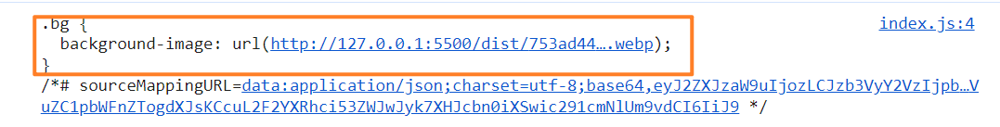
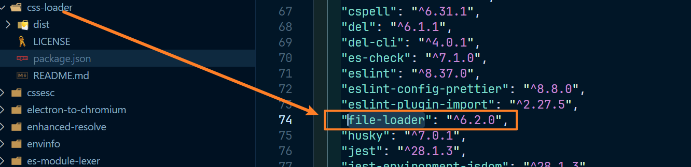
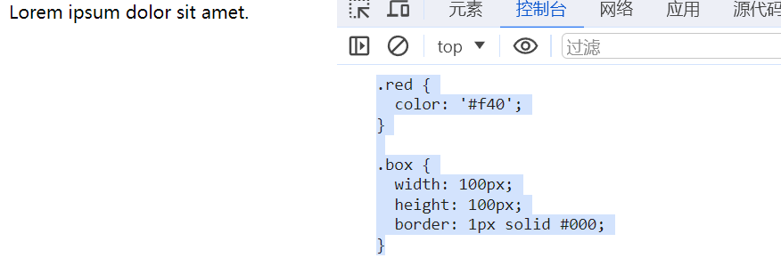
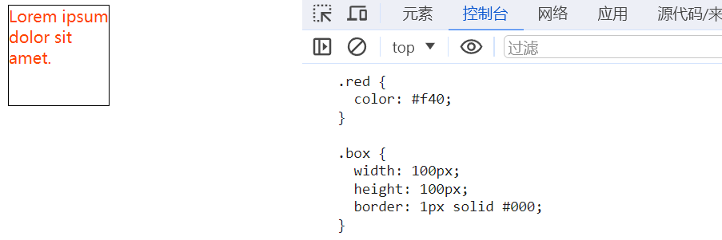
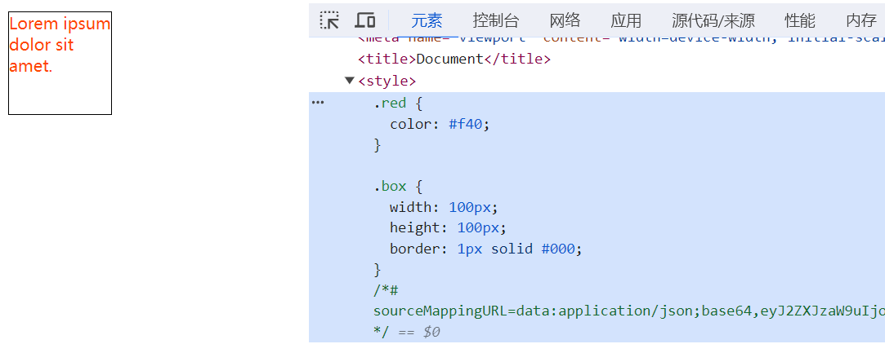

# 利用 webpack 拆分 css

> 像处理图片这些文件一样，需要一个专门处理css的loader来处理css文件。否则无法通过 ast抽象语法树分析

## css-loader

1. css-loader 的作用非常简单，就是将 css代码转为 js代码

2. 处理方式也比较简单：将 css 作为字符串导出，例如：

   ~~~css
   .red{
       color: #f40;
   }
   ~~~

3. 经过 css-loader 处理之后转为 js 代码，如下：

   ~~~js
   module.exports = `.red{
   	color:'#f40';
   }`
   ~~~

4. 这些只是表示，不表示真正经过 css-loader 处理之后的代码，真正处理完成的代码还存在其他信息

5. 但是如果css依赖了其他文件的话，比如图片，转化又稍显不同，bbb.css 文件如下：

   ~~~css
   .bg {
     background-image: url('./avatar.webp');
   }
   ~~~

6. index.js 文件如下：

   ~~~js
   const r1 = require('./assets/aaa.css')
   const r2 = require('./assets/bbb.css')
   console.log(r2.default.toString())
   ~~~

7. 结果如图：

   

8. 当然也可单独写一个loader来处理这些图片，比如这里 css-loader 的处理就是把依赖分析出来，交给其他模块处理，这里处理结果就是通过 file-loader 处理的，也是把这个文件放入了打包的资源中，css-loader内部是引用了这个 file-loader 的，如图：

   

9. dist 文件如图：

   

10. 如果是 css 里面导入其他的 css，则会把导入的 css 文件转为字符串放入使用这个导入 css 文件中，合并起来

## style-loader

1. 上面的 css-loader 完成了 css 的处理，我们在 index.html 文件下设置一个元素使用一下样式，内容如下：

   ~~~html
   <!DOCTYPE html>
   <html lang="en">
   
   <head>
     <meta charset="UTF-8">
     <meta name="viewport" content="width=device-width, initial-scale=1.0">
     <title>Document</title>
   </head>
   
   <body>
     

       Lorem ipsum dolor sit amet.
     

     
   </body>
   
   </html>
   ~~~

2. aaa.css 文件内容如下：

   ~~~css
   .red {
     color: #f40;
   }
   
   .box {
     width: 100px;
     height: 100px;
     border: 1px solid #000;
   }

3. 结果如图：

   

4. 可以看到，并没有生效，这是因为 css-loader 只是把这个 css 的处理的字符串结果导出来了，没有使用，具体怎么使用不在 css-loader 的处理范围，需要其他 loader 或者 plugin 来处理，或者我们可以自己创建并使用，index.js 代码改写如下：

   ~~~js
   const r1 = require('./assets/aaa.css')
   const r1Css = r1.default[0][1].toString()
   console.log(r1Css)
   
   const style = document.createElement('style')
   style.innerHTML = r1Css
   document.head.appendChild(style)
   ~~~

5. 结果如图：

   

6. style-loader 可以将 css-loader 转换后的代码进一步进行处理，将 css-loader 导出的字符串加入到页面的 style 元素中

7. css-loader 的代码转化后得到如下代码：

   ~~~js
   module.exports = `.red{
   	color:'#f40';
   }`
   ~~~

8. 而 style-loader 又会把这些处理为如下代码：

   ~~~js
   module.exports = `.red{
   	color:'#f40';
   }`
   
   var style = module.exports
   var styleElem = document.createElement('style')
   styleElem.innerHTML = style
   document.head.appendChild(styleElem)
   module.exports = {}
   ~~~

9. 此处也仅表示简化的代码

10. 根据 loader 的处理的顺序从下至上，从右至左，可以在添加 style-loader 来处理

11. index.js 的代码仅留下导入，如下：

    ~~~js
    const r1 = require('./assets/aaa.css')
    ~~~

12. webpack.config.js 文件如下：

    ~~~js
    module.exports = {
    	mode: 'development',
    	devtool: 'source-map',
    	watch: true,
    	module: {
    		rules: [
    			{
    				test: /\.css$/,
    				use: ['style-loader', 'css-loader']
    			}
    		]
    	}
    }
    ~~~

13. 结果如图：

    

14. 可以看到，和我们的猜想没有太大的区别，style-loader 还可以避免同一个css样式文件多次导入而造成多次插入到页面中使用

