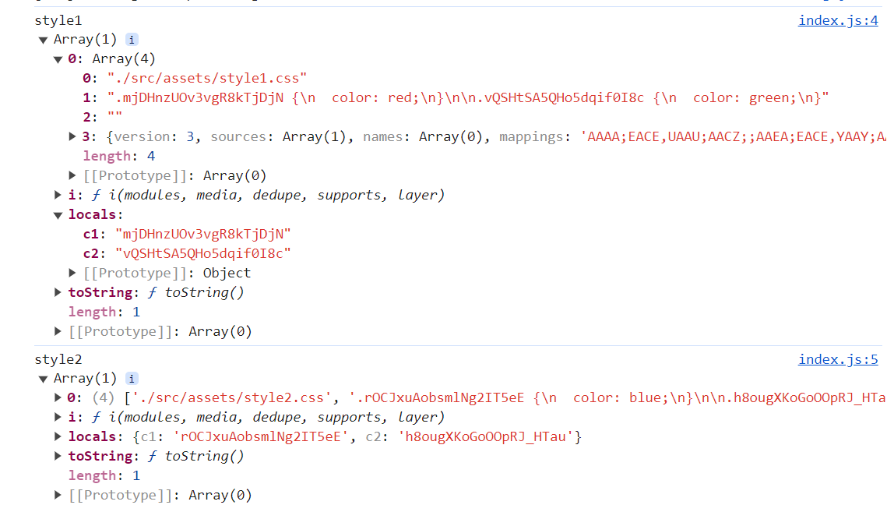

# css module

> 通过命名规范来限制类名太过死板，而 css-in-js 虽然灵活，但是书写就不方便，css module 开辟一种全新的的思路来解决类名冲突的问题

## 思路

css module 遵循以下思路解决类名冲突问题：

1. css 的类名冲突往往发生在大型项目中
2. 大型项目往往会使用构建工具（webpack 等）搭建工程
3. 构建工具允许将 css 样式切分为更加细致精致的模块
4. 同 js 的变量一样，每个 css 模块文件中难以出现类名冲突，冲突的类名往往发生在不同的 css 模块文件中
5. 只需要保证构建工具在合并样式代码后不会出现类名冲突即可

## 实现原理

在 webpack 中，作为处理 css 的 css-loader，它实现了 css module 的思想，要启用 css module，需要将 css-loader 的配置 modules 设置为 true

css-loader 的实现如下：

原理也非常简单，开启了 css module 后，css-loader 会将样式中类名进行转换，转换为一个唯一的 hash 值

这个 hash 值是根据模块路径和类名生成的，因此，不同的 css 模块，哪怕具有相同的类名，转换后的 hash 值也不一样

webpack.config.js 如下：

~~~js
const HtmlWebpackPlugin = require('html-webpack-plugin')

module.exports = {
	mode: 'development',
	watch: true,
	devtool: 'source-map',
	module: {
		rules: [
			{
				test: /\.css$/,
				use: [
					'style-loader',
					{
						loader: 'css-loader',
						options: {
							modules: true
						}
					}
				]
			}
		]
	},
	plugins: [
		new HtmlWebpackPlugin({
			template: './public/index.html'
		})
	],
	devServer: {
		open: true
	}
}
~~~

结果如图：

这样开发是时候在源代码之后，不同模块存在类名冲突，但是最后的结果不会存在类名冲突

## 如何应用样式

css module 带来了一个新的问题：源代码的类名和最终生成的类名是不一样的，而开发者只知道自己写的源代码中的类名，并不知道最终的类名是什么，那么如何应用类名到元素上呢？

为了解决这个问题，css-loader会导出`最终的类名`和`原类名`，该关系通过一个对象描述

具体是什么样子的，我们导入的时候接受一下，看看是什么，index.js 代码如下：

~~~js
import style1 from './assets/style1.css'
import style2 from './assets/style2.css'

console.log('style1', style1)
console.log('style2', style2)
~~~

先不使用 style-loader，输出结果如图：

但是现在导出的东西太多了，如果配合 style-loader 的话，会只有最终的类名关键信息

结果如图：

这样就比较方便我们操作了，index.js 如下：

~~~js
import style1 from './assets/style1.css'
import style2 from './assets/style2.css'

console.log('style1', style1)
console.log('style2', style2)

const title = document.querySelector('.title')

// 添加类名-应用样式
title.classList.add(style1.c1)
~~~

index.html 模板文件内容如下：

~~~html
<!DOCTYPE html>
<html lang="en">

<head>
  <meta charset="UTF-8">
  <meta name="viewport" content="width=device-width, initial-scale=1.0">
  <title>Document</title>
</head>

<body>
  <h1 class="title">hello world</h1>
  
Lorem ipsum dolor sit amet consectetur adipisicing elit.

</body>

</html>
~~~

结果如图：

## 其他操作

### 全局类名

某些类名是全局的，静态的，不需要进行转换，仅需在类名位置使用一个特殊的语法即可，如下：

~~~css
:global(.fontSize) {
  font-size: 16px;
}

.c1 {
  color: red;
}

.c2 {
  color: green;
}
~~~

查看打包后的结果，如图：

使用了 global 的类名不会进行转换，相反的，没有这个 global 类名的，就表示默认使用 local

~~~css
// 默认就是转换的，所以一般不会使用下面这种写法
:local(.main){
    ...
}
~~~

使用 local 的类名表示局部类名，是可能会造成冲突的类名，会被 css module 转换

### 如何控制最终的类名

绝大部分情况下，我们不需要控制最终的类名，控制也没有什么意义

如果需要控制最终的类名，比如不喜欢这种 hash 的格式，需要配置 css-loader 的 localIdentName，如下：

~~~js
const HtmlWebpackPlugin = require('html-webpack-plugin')

module.exports = {
	mode: 'development',
	watch: true,
	devtool: 'source-map',
	module: {
		rules: [
			{
				test: /\.css$/,
				use: [
					'style-loader',
					{
						loader: 'css-loader',
						options: {
							// 需要改为配置对象的方式了
							modules: {
								mode: 'local',
								localIdentName: '[name]__[hash:5]'
							}
						}
					}
				]
			}
		]
	},
	plugins: [
		new HtmlWebpackPlugin({
			template: './public/index.html'
		})
	],
	devServer: {
		open: true
	}
}
~~~

结果如图：

## 其他注意事项

- css module 往往配合构建工具使用
- css module 仅处理顶级类名，尽量不要书写嵌套的类名，也没有这个必要
- css module 仅处理类名，不处理其他选择器
- css module 还会处理 id 选择器，不过任何使用都没有使用 id 选择器的理由
- 使用了 css module 后，只要能做让让类名望文知意即可，不需要遵守其他任何的命名规范

