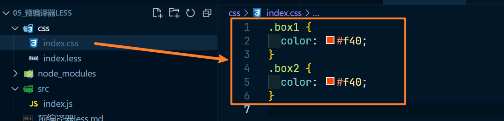

# 预编译器 less

> 通过这个可以解决一些重复样式的问题和其他问题，这种方式支持变量、函数等高级语法，然后经过编译器转为正常的 css，常见的有 less 和 sass

## 基本原理

编写 css 时，受限于 css 语言本身，常常难以处理一些问题：

- 重复的样式值：例如的颜色、尺寸、文字大小等信息

- 重复的代码段：例如绝对定位居中、清除浮动、单行文本省略等等

- 重复的嵌套书写：例如 box 下的 inner 下的 item-left 和 item-right，对比如下

  - 正常书写如下：

    ~~~css
    .box .inner .item-left{
        ...
    }
    
    .box .inner .item-right{
        ...
    }
    ~~~

  - less 书写如下：

    ~~~less
    .box{
        .inner{
            .item-left{
                ...
            }
            .item-right{
                ...
            }
        }
    }
    ~~~

由于官方目前看来都没有对 css 语言本身做出改进，一些第三方机构就开始想办法来解决这些问题

其中一种方案就是预编译器

预编译器的原理也非常简单，即使用一种更加优雅的方式来书写代码，通过一个编译器，将其转换为可以被浏览器识别的 css

## less 的安装和使用

从原理可知，要使用 less，必须要安装 less 编译器

less 编译器是基于 node 开发的，可以通过 npm 下载安装

~~~
npm i -D less
~~~

安装好了 less 之后，它提供了一个 cli 工具 `lessc`(这个 c 表示是compile)，通过该工具即可完成编译，命令如下

~~~
lessc less代码文件路径 编译后的文件名称
~~~

试一试：

新建一个 index.less 文件，编写内容如下：

~~~less
// less 代码
@red: #f40;

.box1{
  color: @red;
}

.box2{
  color: @red;
}
~~~

现在进入  index.less 文件的运行文件夹下，执行命令 npx lessc  index.less index.css，打包后的 index.css 文件内容如图：

## less 的基本使用

官网：https://lesscss.org

中文网（非官方）：https://lesscss.cn/
