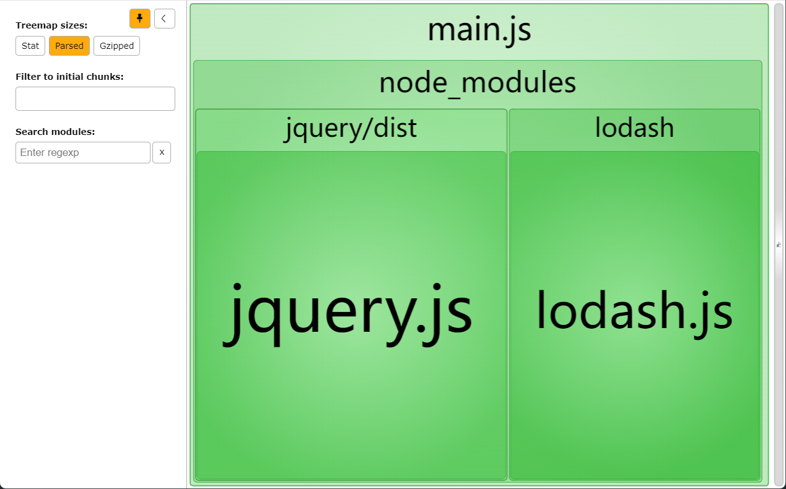

# bundle analyzer

> 用这个进行打包的结果分析，可以打开一个html文件分析打包的大小

webpack.config.js 内容如下：

~~~js
const { CleanWebpackPlugin } = require('clean-webpack-plugin')
const WebpackBundleAnalyzer = require('webpack-bundle-analyzer').BundleAnalyzerPlugin

module.exports = {
	mode: 'production',
	output: {
		path: __dirname + '/dist'
	},
	plugins: [new CleanWebpackPlugin(), new WebpackBundleAnalyzer()]
}
~~~

src/index.js 内容如下：

~~~js
import lodash from 'lodash'
import jQuery from 'jquery'
console.log(jQuery)
;(function () {
	const arr = [1, 2, 3, 4, 5, 6, 7, 8, 9, 10]
	const result = lodash.chunk(arr, 3)
	console.log(result)
})()
~~~

执行 npm run build 命令打包

结果如图：

