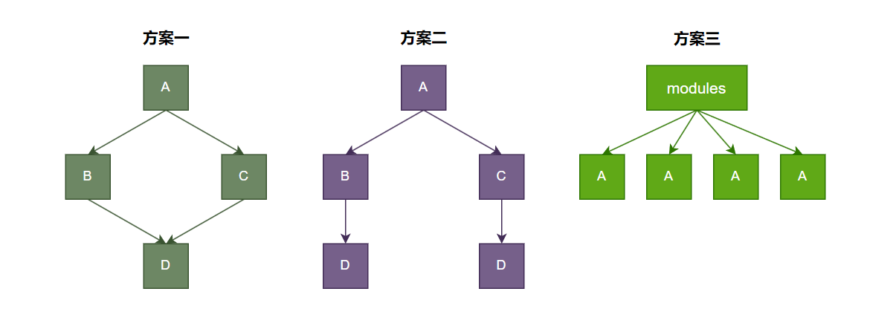

# pnpm

> `pnpm` 作为当前比较流行的包管理器之一，主要特点是速度快、节省磁盘空间。
>
> `pnpm` 的含义是 `Performant Node Package Manager`，意味着**高性能Node包管理工具**。
>
> https://pnpm.io/zh/

## 为什么需要 pnpm

**对于依赖的三种处理方案**，如图：



第一种方案，只从依赖的角度看，是没有问题的，避免了 D 的冗余，但是如果按照目录来看的话，是无法实现这个结构的，比如 A 这个包依赖了 B 和 C，同时 B 和 C 又依赖了 D 的话，那么使用 npm 安装的目录结构如下：

```bash
mode_moudules/
└── A
		└── node_modules 
				└── B		
				│		└── node_modules 
				│				└── D
				└── C		
						└── node_modules 
								└── D
```

可以看到这个结构是一个在 node_modules 下安装了 A，而 A 里面还有一个 node_moudules 文件夹，里面存储了 B，而同理 B 下面也有一个 node_modules，存储了 D，C 同理，所以按照依赖的按照目录来看，是无法实现第一种方案的，对应的是方案二。

而方案二有一个非常明显的缺点就是对磁盘的浪费，D 始终都是保存了两次，而如果一个项目逐渐增加的时候，这个浪费还会进一步的扩大，当然这种模式实在以前的旧版本中使用的，也就是 2015 年之前的时候(即在 `npm@2` 的早期版本中，对应 `Node.js 4.x` 及以前的版本)，npm 采用的是这种嵌套的方式保存依赖。

而现在的 npm 采用的是另外一种解决方案，即**扁平化依赖存储**。

即当前项目的 node_modules 这个目录下，保存这 A B C D，这四个包是同级的。这样就解决了磁盘空间的浪费。

而扁平化又会导致另外一个问题，**Phantom Dependences - 幽灵依赖**。

例如当前项目安装了 A 依赖，但是因为 A 的依赖原因还会导致安装了 B C D 这三个依赖，而又因为扁平化的处理，四个依赖是同级的，这样我们就可以直接导入 B C D 这三个依赖，但是这三个依赖在我们的 package.json 文件中缺没有记录，如下：

```javascript
import A from 'A'
import B from 'B'
```

即在项目中我们是可以直接引用 B 的，这样看着没什么问题，但是如果我们把 A 依赖进行了**卸载**，也会导致 B 被删除，那么如果项目在某个地方引用了 B，就会导致工程缺少依赖而出错。即项目的**根依赖 A 被删除之后，A  这个依赖树下面的子依赖也会被删除**。

还有情况是依赖 A 引用的 B 依赖版本是 v1，而如果后面升级了 A，且升级后的 A 引用的 B 也升级了，B 升级到了 V2，那么你原来在项目中使用的是 B(v1)版本的 api，而经过更新之后的 B(v2)中把这个 api 废弃了，就会导致项目执行错误。这也是一种幽灵依赖。

总结一下，幽灵依赖会存在哪些问题：

1. **隐式依赖**：幽灵依赖通常不是直接声明的依赖，而是通过其他依赖间接引入。
2. **潜在问题**：由于这些依赖没有在项目中明确列出，可能会导致版本冲突、不可预测的行为或其他兼容性问题。
3. **维护困难**：当项目更新或迁移时，幽灵依赖可能会导致意想不到的错误，因为开发者可能并不知道这些依赖的存在。

而造成这个原因就是扁平化管理依赖的方式导致的。

而解决这个问题除了直接显示的安装这个依赖之外，我们就可以利用 pnpm 来解决。

## pnpm 具体做了什么

如果有使用过 npm 的经验，在安装了 element-plus 之后，还会安装很多子依赖，比如 lodash、dayjs 等等。我们使用 pnpm 来安装 element-plus 来看一下，目录的结构，如图：


可以看到，是很简洁的，没有其他子依赖显示在 node_modules 下面。而这个项目根目录下的 node_modules 下面第一级展示的包也叫做**直接依赖项**，也就是可以通过类似 `import { ElButton } from 'element-plus'` 这种方式直接导入的。

仔细观察一下不难发现，有一个陌生的目录 `.pnpm`，这个目录就是存储着对应依赖关系，即项目安装的直接依赖都在 node_modules 下面，而安装的这些直接依赖的依赖关系都在 .pnpm 下面。

我们可以打开这个 .pnpm 目录，找到 element-plus 对应的依赖关系，如图：


通过这个图片我们不难发现这就是我们在前文提到的**方案二**的目录结构，但是其实不是完全是，在 .pnpm 还是进行了拍平，如图：


可以看到 dayjs、element-plus、lodash 也都是平级的。经过这一步我们可以初步画出一个关系，如图：


**.pnpm_store 可以看做是一个全局的存储位置，即你开发的所有项目都可以从这里面共享依赖。**

通过这个图，我们可以知道，当前项目下的 node_modules 下的 element-plus 只是一个类似快捷方式一样的东西，它指向 .pnpm 下存储的实体依赖关系 element-plus，而 .pnpm 下的 element-plus 又通过硬链接(HL) 指向最终存储在磁盘中(.pnpm_store)的依赖包，而 .pnpm 下面的 element-plus 下的子依赖 lodash 也是通过符号连接(SL/软连接) 指向 .pnpm 扁平化处理记录的实体关系 lodash。而 .pnpm 下的 lodash 也通过 HL 指向最终磁盘中的 lodash 依赖包。

而基于这种链接的关系，如果删除了 element-plus 只是吧从 .pnpm 中通过 HL 指向 .pnpm_store 的这个指针关系删除掉了而已，实际 element-plus 还存在于 .pnpm_store 中。

而这种不删除的好处也是显而易见的，如果下次再次安装 element-plus 这种同一个依赖的话，就会直接从 .pnpm_store 中获取，而不会在走一次网络下载。


通过上面这张图，我们可以发现有一个符号，这个符号就是表示是软连接，只要有这个符号，就一定可以在 .pnpm 目录下找到对应的实体。实体在通过硬链接关联到 .pnpm_store 目录，.pnpm_store 是一个固定的位置。比如 `D:\.pnpm_store`

**硬连接（hard link）**：硬链接（英语：hard link）是电脑文件系统中的**多个文件平等地共享同一个文件存储单元**；删除一个文件名字后，还可以用其它名字继续访问该文件。

**软连接（soft link，也叫符号链接Symbolic link）**： 符号链接（软链接、Symbolic link）是一类特殊的文件；（可以理解成快捷方式），其包含有一条以绝对路径或者相对路径的形式指向其它文件或者目录的引用。

因此，pnpm 是通过符号连接来完成依赖关系的建立，通过硬链接共享 .pnpm_store 中全局存储的包，来节省磁盘空间。

## pnpm 常用指令与 npm 对比

| **npm 命令**           | **pnpm 命令**       | **描述**                                   |
| ---------------------- | ------------------- | ------------------------------------------ |
| `npm -v`               | `pnpm -v`           | 查看版本                                   |
| `npm init`             | `pnpm init`         | 初始化                                     |
| `npm install`          | `pnpm install`      | 安装所有依赖包                             |
| `npm install <pak>`    | `pnpm add <pkg>`    | 安装指定的包                               |
| `npm install <pak> -D` | `pnpm add <pkg> -D` | 安装指定的包-开发环境                      |
| `npm uninstall <pkg>`  | `pnpm remove <pkg>` | 删除指定的包                               |
| `npm run <cmd>`        | `pnpm <cmd>`        | 执行 package.json 中 script 属性定义的命令 |

## pnpm 其他配置

**获取下载依赖的源**

```bash
pnpm config get registry
```

**设置下载依赖的源**

```bash
pnpm config set registry <源地址>
```

**查看某个依赖版本**

```bash
pnpm view <pkg> version
```

**设置 pnpm 的磁盘目录**

```bash
pnpm config set store-dir <路径地址>
```

**查看 pnpm 的安装目录**

```bash
pnpm store path
```

**从全局存储包的 .pnpm_store 中删除未被引用的包来释放存储空间**

```bash
pnpm store prune
```


