# 浏览器渲染流程

## 浏览器渲染整体流程

> 这个渲染的流程，不包含 CDN 那些工作，整个大的部分可以分为两个，
> 即`网络`和`渲染`，这里我们主要说一下渲染这一部分的流程

浏览器的网络线程会发送 http 请求，和服务器之间进行一个通信，之后吧拿到的 html 文件封装成一个渲染任务，并把这个渲染任务交给渲染主线程的消息队列，在事件循环机制的作用下，渲染主线程取出消息队列中的渲染任务，开启渲染流程。

网络抛开不谈，我们单独要弄明白的就是，浏览器如何把一个密密麻麻的 html 字符串渲染成最终的页面的整体的渲染流程被分为多个阶段，如下：

```
（HTML字符串）、HTML解析 、样式计算 、布局 、分层 、生成绘制指令 、分块 、光栅化 、绘制
```

具体如图：

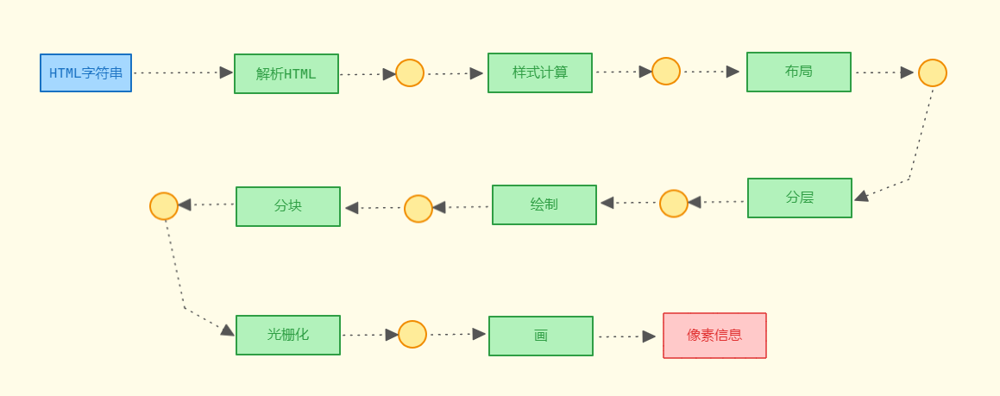

每一步执行之后会生成一个新的东西，然后继续到下一步，即上一个阶段的输出会成为下一个阶段的输入

## 解析 HTML

首先第一步就是解析 HTML 生成 DOM 树

当我们打开一个网页时候，浏览器就会请求对应的 HTML 文件，虽然平时开发中，我们会编写不同的文件 HTML、css、js 文件，即字符串，但是计算器硬件是无法识别这些字符串的，因此在网络的传输中，实际都是 0 和 1 这些字符串。

当浏览器接收到这些字节数据以后，它会将这些字节数据转为字符串，即我们写的代码。

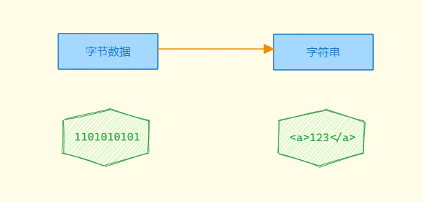

当数据转换为字符串以后，浏览器会将这些字符串通过词法分析转换为标记(token)，这一过程在词法分析中叫标记化（tokenization）

为什么需要标记化呢？因为现在浏览器虽然将字节数据转为了字符串，但是此时的字符串就如同一篇标题段落全部写在同一行的文章一样，浏览器此时任然是无法理解的，例如：

```html
<!DOCTYPE html><html lang="en"><head><meta charset="UTF-8"><meta http-equiv="X-UA-Compatible".....
```

因此标记化，本质就是将这些非常长的字符串拆分成一块一块的，即拆词，并给这些内容打上标记

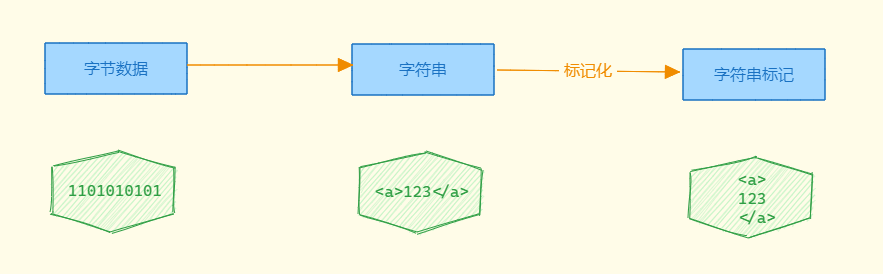

将这个字符串进行标记化之后，就能在这个基础上构建出对应的 DOM 树出来，如图：

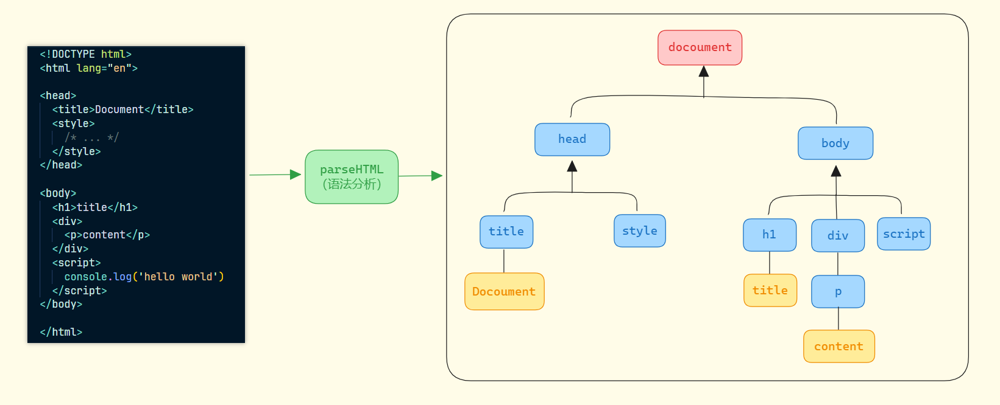

上面的步骤，我们就称之为解析 HTML，流程如图所示：

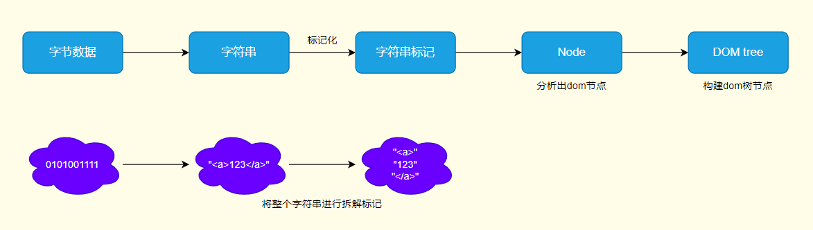

在解析 HTML 的过程中，可能会遇到诸如 style、link 这些标签，这些一般是和我们网页样式相关的内容，此时就会涉及到 css 的解析。

为了提高这个解析的效率，浏览器会在开始解析前，就会自动启动一个预解析的线程，率先下载 HTML 中的外部 css 文件和 js 文件。

如果主线程解析到 link 的位置，此时外部的 css 文件还没有下载解析好，主线程不会等待，继续解析后续的 HTML，这是因为下载和解析 css 的工作实在预解析线程中进行的，这就是 css 不会阻塞 HTML 解析的根本原因。

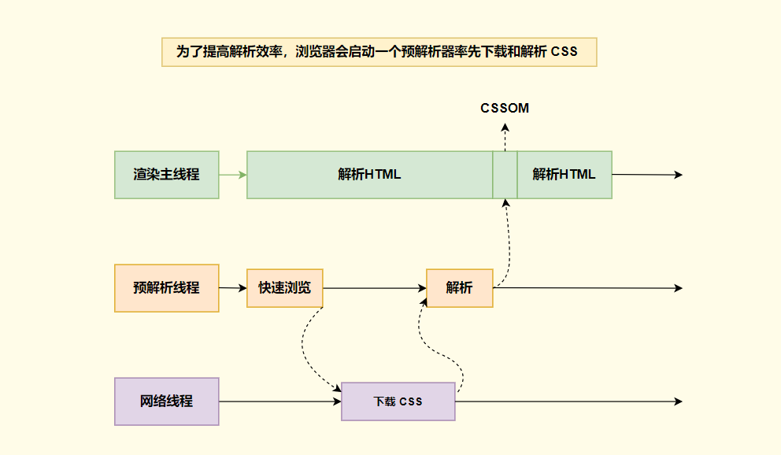

在预解析的时候会快速的浏览一次文档，但是不会检查的非常彻底，比如什么行内样式，他检测的是有没有外部链接的文件，比如 link 或者 script(存在 src 属性的)，浏览到发现这些外部文件之后，会直接和网络线程通信，提前下载下来，下载完成之后，再去预解析线程上去解析。

最终，css 解析经历了从字节数据、字符串、标记化之后，也会形成一个 CSSOM 树，然后将这个 CSSOM 树的结果返回给主线程

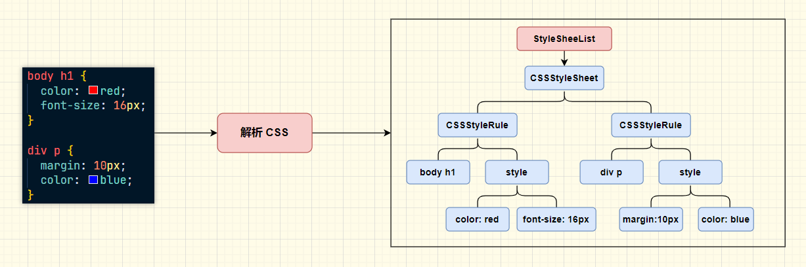

解析 CSS，从最开始的 StyleSheetList(css 样式表) => CSSStyleSheet(对应的就是左侧的代码 css 样式表)，如果有内联就会还有一个内联的样式表，以及还有浏览器内置的样式表等 => CSSStyleRule(css 样式规则)，通过这个就会生成一条条的样式规则，这里有两条
样式规则 => body h1 和 div p 表示的 css 选择器，style => 就是实际的样式，这样的结构也形成看一个颗树，所以称之为 CSSOM 树。

除了 css 文件之外，我们还有说到 js 文件，预解析线程不仅会下载外部的 css 文件，也会下载外部 js 的文件，那么浏览器是如何处理 js 代码的？

如果主线程解析到 script 的位置，会停止解析 HTML，转而等待 js 文件下载好，并将`全局代码解析执行完毕`后，才会继续解析 HTML，这是为什么呢？

这是因为 js 代码中可能会修改当前的 DOM 树，所以当前 DOM 树的生成就必须暂停，这就是 js 会阻塞 HTML 解析的原因，且如果当前的 js 脚本文件中涉及访问和使用 CSSOM，那么必须等待 CSS 文件被下载、解析并且 CSSOM 可用，如果 CSSOM 不可用就会阻塞 js 代码的执行，也因此我们都会有一个习惯，顶部引入 css 文件，底部书写 js文件，就是为了避免 js 中使用 CSSOM，但是 CSSOM 没有生成，从而造成渲染阻塞；所以说 CSS 不会阻塞 DOM 树的构建，但是可能会阻塞渲染的流程。

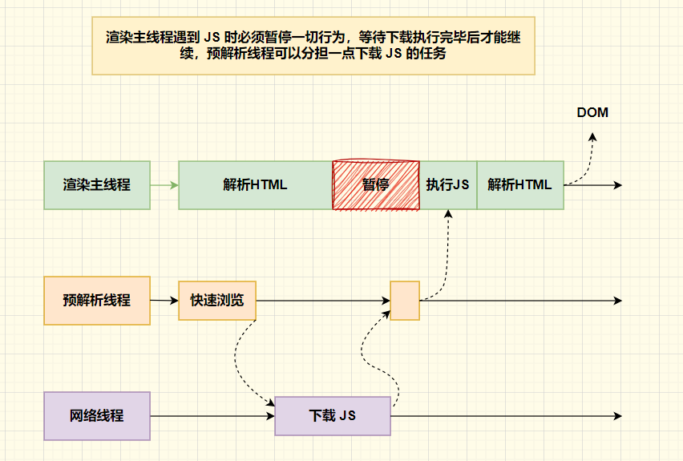

预解析线程一开始就会快速浏览一遍，和网络线程通信，提前下载 js 文件，当主线程执行到这个 script 标签的时候，就会下载好的 js 文件进行执行。

因此，通常如果我们想提高首屏渲染的速度，都会尽量不在首屏就加载 JS 文件，这也都是建议将 script 标签放在 body 底部的原因。

另外，在现代浏览器中，为我们提供了新的方式来避免 JS 代码阻塞渲染的情况，如下：

- async
- defer
- prefetch
- preload

这几种独特的方式，这里暂时不做讲解，可以观看另一篇文章：

最后当这个 `解析HTML` 阶段完成之后，会得到 DOM 树和 CSSOM 树，浏览器的默认样式、内部样式、行内样式均会包含在 CSSOM 树中。

## 样式计算

当解析 HTML 完成之后，就会计入样式计算的阶段

有了 DOM 树之后，我们此时还不足以知道页面的外貌，因为我们通常会为页面的元素设置一些样式，主线程会遍历得到的 DOM 树，依次为树中的每个节点计算出他的最终样式，称之为 Computed Style。

在这个过程中，很多预设值会变成绝对值，比如 red 会变成 rgb(255,0,0)，想对单位会变成绝对单位，如图：

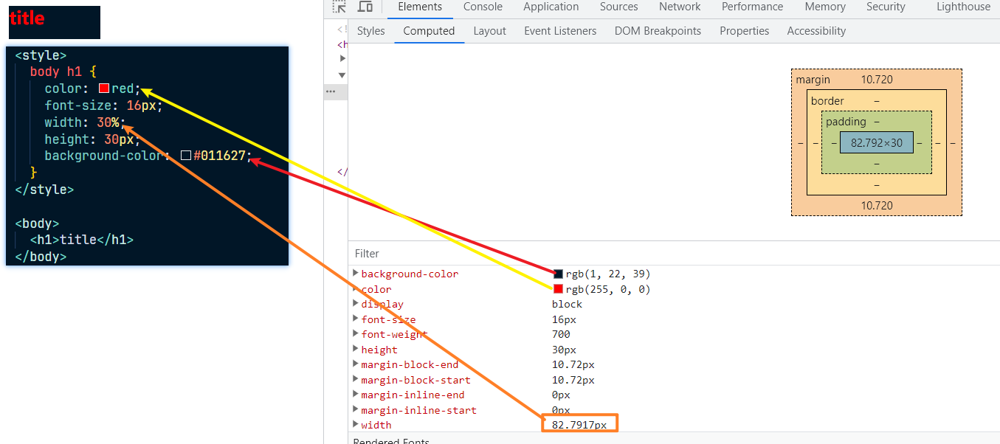

赋值的过程就类似于下图：

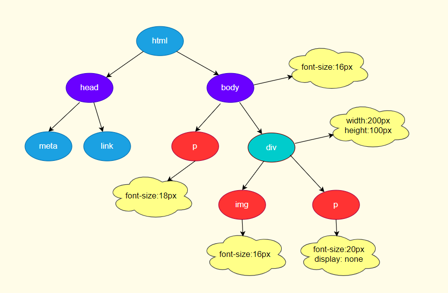

浏览器会确定每一个节点的样式到底是什么，并最终生成一颗样式规则树，这颗树上记录了每一个 DOM 节点的样式。

而在这个样式的计算过程中，p 元素不仅会计算 font-size:18px 这个样式，会计算所有的样式，还有很多默认样式，如果这些样式没有被我们重新设置，那么一般就会使用这个属性的默认值，为什么是一般呢，因为还有其他的计算过程，比如继承，如图：

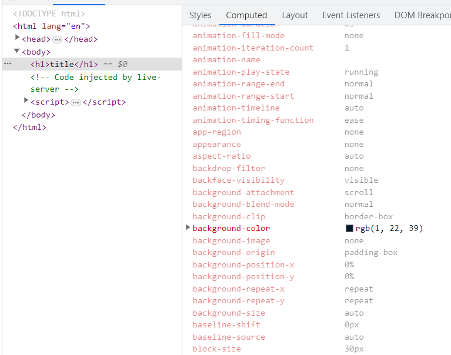

这一步完成之后，我们就会得到一颗带有样式的 DOM 树，即经过样式计算之后，DOM 树 和CSSOM 树合并为了一颗带有样式的 DOM 树

## 布局

当前面这些步骤完成之后，渲染进程就知道页面的具体文档结构和每个节点拥有的样式信息了，但是这些信息也无法确定最终的界面样式。

为什么呢？因为知道是什么样子但是无法知道具体的位置，例如，描述一个画布上有一个红色的圆和蓝色的正方形，听到这段描述，你可以想象出一些基本样式，但是无法最终确定，因为你无法得到这个圆和这个正方形具体在画布上的那个位置，是左侧还是右侧，两个图形是否层叠等等。

所以在这个渲染网页中，只知道网站的文档流以及每个节点的样式还是无法绘制出最终的页面，还需要通过布局 (Layout) 来计算出每个节点的几何信息 (geometry)。

生成布局树的具体过程为：主线程会先遍历刚刚构建的 DOM 树(带有样式的 DOM 树)，根据这颗 DOM 树 的节点计算样式计算出一个布局树(layout tree)；布局树上每个节点都会有它在页面上的 x, y 坐标以及盒子的大小 (bounding box sizes) 等具体信息。

`布局树 大部分时候和 DOM树 并非一一对应`，虽然长的和之前构建的 DOM 树差不多，但是不同的是这颗 布局树 只有那些可见的(visible) 的节点信息，比如那些通过样式隐藏的都不会在这颗 布局树 上。

比如通过 display: none 这样的属性设置之后节点，就没有几何信息，也就不会生成到 布局树 上，如下：

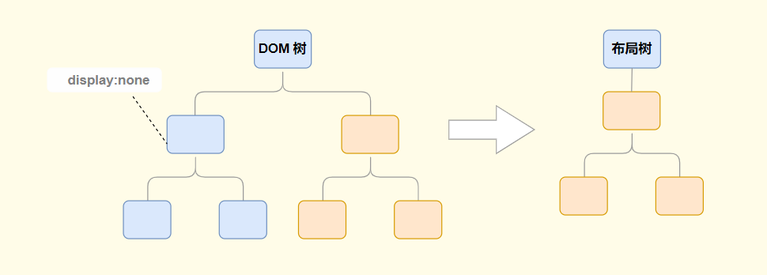

又比如使用了`伪元素选择器`，虽然 DOM 树中不存在这些伪元素节点，但是它拥有几何信息，所以会生成到 布局树 上，如下：

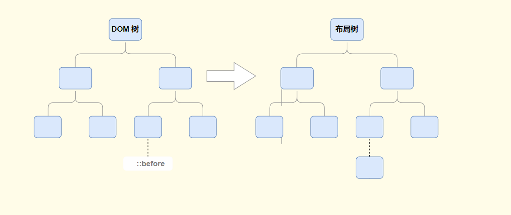

还有`匿名行盒、匿名块等等`都会导致 DOM 树 和布局树 无法一一对应，如下：

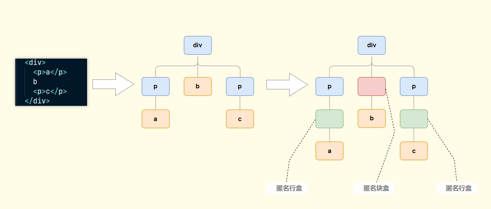

在这个 html 结构中，我们直接写了一个 <p>a</p>，虽然没有用 span 包裹 a，但是实际上是有一个匿名行盒的，只是没有在 DOM 树 中呈现，但是在 布局树 中会进行呈现，而两个 p 元素中的 b，上下都是块元素，就会导致 b 独占一行，就会存在一个匿名块，而匿名块盒里面又有一个匿名行盒包裹 b，但是上图中进行了省略，也是只有在布局树中呈现。

当然也可以手动的给 a 包裹一个 sapn 标签，就不会生成匿名行盒，可以避免因为匿名行盒或者块盒导致 DOM 树 和 布局树 没有对应。

## 分层

布局完成之后，我们还需要经历一个步骤，分层。

分层的好处在于，当将来某一层发生改变之后，仅对某一层进行处理，提升渲染效率。

为了确定是那些元素需要放置在那一层，主线程需要遍历整颗 布局树 来创建一颗 层次树(Layer Tree)。

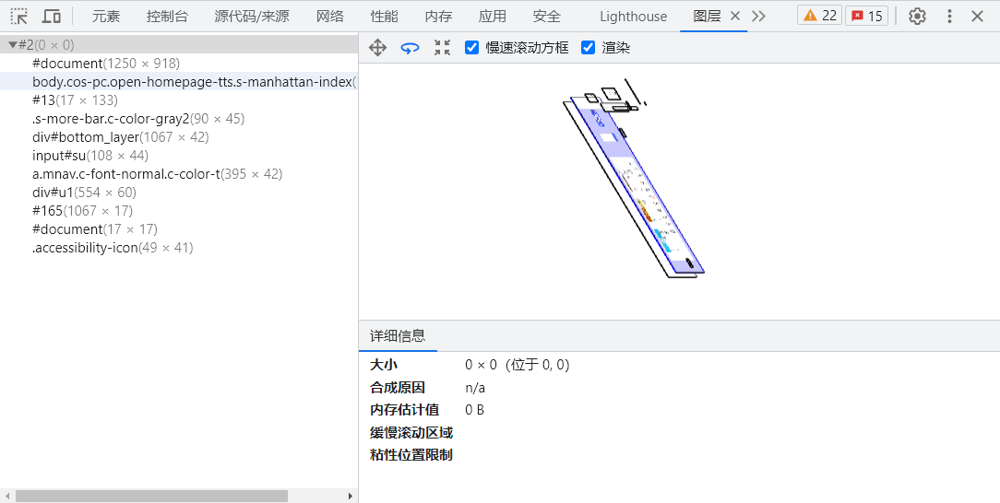

滚动条、堆叠上下文、transform、opacity 等样式都会或多或少的影响分层结果，也可以通过使用 `will-change` 属性来告诉浏览器对其分层。

## 生成绘制指令

当分层结束之后，就会生成绘制指令。

主线程会为每个层单独产生绘制的指令集，用于描述这一层的内容该如何画出来。

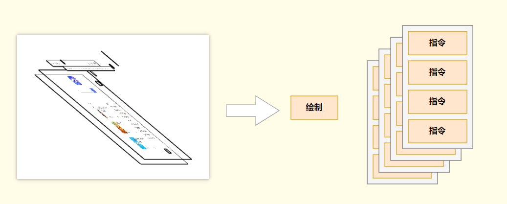

这里的绘制指令，类似于“将笔移动到 xx 位置，放下画笔，绘制一条 xx 像素长度的线”，我们在浏览中所看到的各种画面，实际就是通过上面这样一条条的绘制指令所执行绘制出来的。

这样的指令有点类似于 canvas，如下：

```js
context.beginPath() // 开始路径
context.moveTo(10, 10) // 移动画笔
context.lineTo(100, 100) // 绘画出一条直线
context.closePath() // 闭合路径
context.stroke() // 进行勾勒
```

需要注意的是，这一步只是生成这样的绘制指令，但是不会去执行。

另外，还有一个重要的点，生成绘制指令后，渲染主线程的工程就暂时告一段落了，接下来主线程将每个图层的绘制信息交给合成线程，剩余工作将会由`合成线程`完成。

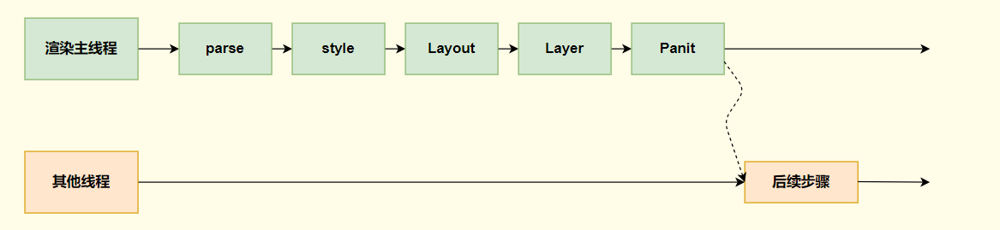

## 分块

合成线程首先会对每个图层进行分块，将其划为更多的小区域。

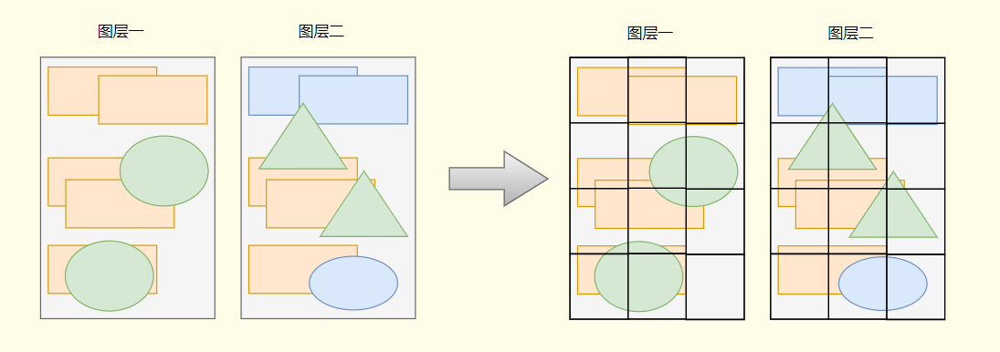

此时，就不会再像是主线程那样一个线程在执行，会从线程池中拿取多个线程来完成分块的工作；所以分块的工作实际上是`由多个线程来同时进行的`。

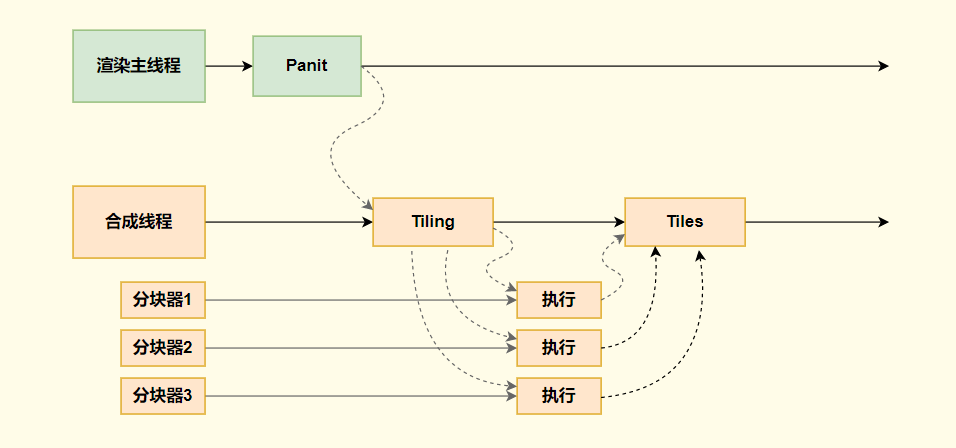

进入合成线程之后，调用其他线程来完成分块，分块完成之后，最后汇总到合成线程。

## 光栅化

分块完成后，进入光栅化，也是绘制前的最后一步，所谓光栅化，就是将每个块变成位图，通俗一点说就是确认每一个像素点的 rgb 信息。

光栅化的操作，并不由合成线程来完成，而是会由合成线程将块信息交给 GPU 进程，以极高的速度完成光栅化。

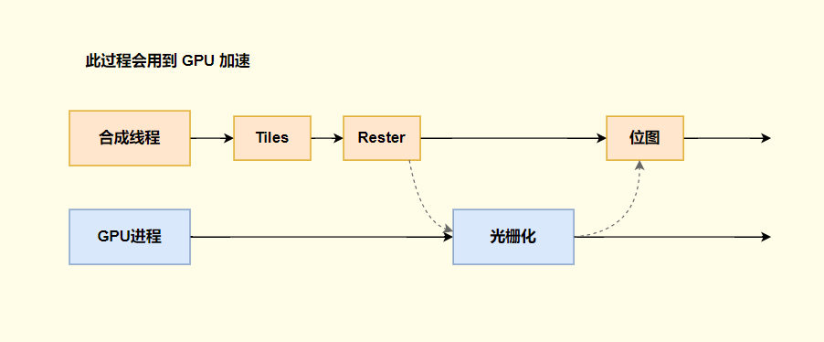

GPU 进程回开启多个线程来完成光栅化，并且优先处理靠近视口区域的块。

## 绘制

当所有的图块都被栅格化之后，合成线程回拿到每个层的、每个块的位图，从而生成一个 [指引 (quad)] 信息

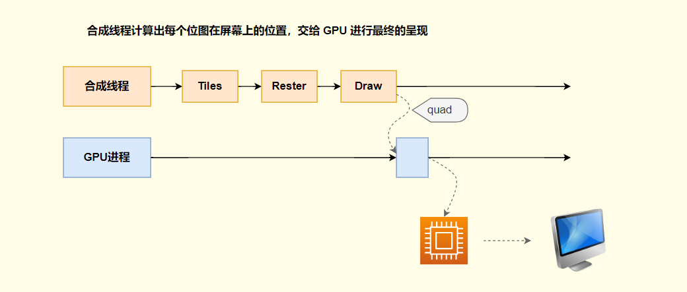

指引会标识每个位图应该画到屏幕的那个位置，以及会考虑到旋转，、缩放等变形。

变形发生在合成线程，与主线程无关，这也是 transform 效率高的本质原因。

合成线程会通过 IPC 向浏览器进程 (browser process) 提交 (commit) 一个渲染帧。这个时候可能有另外一个合成帧被浏览器进程的 UI 线程(UI thread) 提交改变浏览器的 UI，这些合成帧都会被发送给 GPU 完成最终的屏幕成像。

如果合成线程收到页面滚动的滚动事件，合成线程会创建另外一个合成帧发送给 GPU 来更新页面。

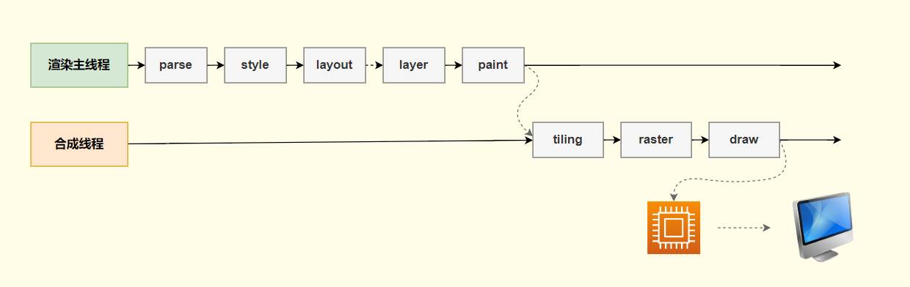

## 常见面试题

### 什么是 reflow

1. reflow 叫做重排也叫做回流

2. `reflow 的本质就算重新计算 layout 树`。

3. 当进行了会影响布局树的操作后，需要重新计算布局树，就会引发 layout。

4. 为了避免连续多次的操作导致布局树反复计算，浏览器会合并这些操作，当 js 代码全部完成后在进行统一的计算。所以，改动属性造成的 reflow 是异步完成的。

   ```js
   // 比如对一个属性的连续赋值，就不会执行一次就重新计算一次
   dom.style.width = '100px'
   dom.style.width = '200px'
   dom.style.width = '300px'
   // 比如这样，都是会等 js 代码代码执行完毕之后在进行统一计算
   ```

5. 也同样因为如此，当 js 获取布局属性时，就可能造成无法获取到最新的布局信息，如下：

   ```js
   dom.style.marginLeft = '100px'
   dom.style.marginLeft = '200px'
   // 获取 marginLeft 属性值，此时获取必须执行 reflow 才能给我们正确的值，所以获取布局属性就会重排
   dom.style.marginLeft
   dom.style.marginLeft = '300px'
   ```

6. 浏览器在反复权衡之下，最终决定获取和位置相关的属性之后立即 reflow。

### 什么是 repaint

1. repaint 的本质就是重新根据分层信息计算了绘制指令。
2. 当改动了可见样式后，就需要重新计算，会引发 repaint。
3. 且由于元素的布局信息也属于可见样式，`所以 reflow 一定会引发 repaint`。

### 为什么 transform 的效率高

1. 因为 transform 既不会引发布局也不会影响绘制指令，影响的只有最后一个 draw 阶段。
2. 并且 draw 阶段在合成线程，并没有在渲染主线程，所以 transform 的变化几乎不会影响渲染主线程，所以效率会很高；反之，渲染主线程无论如何的忙碌，也不会影响 transform 的变化。
3. 也因为这个原因，如果我们使用 transform 来让元素动起来，那么就算渲染主线程被阻塞(比如写一段代码让主线程阻塞三秒)也不会影响 transform 的变化。
