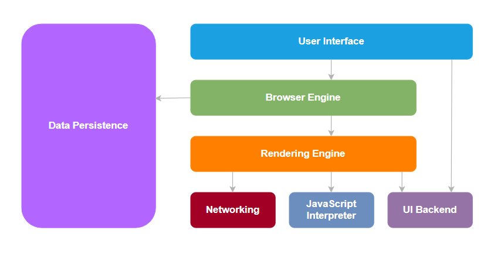

# 浏览器的组成部分

## 什么是浏览器

- Web 浏览器简称为 浏览器，是一种用于访问互联网上信息的应用软件，浏览器的主要功能是从服务器检索 Web 资源并将其显示在 Web 浏览器的窗口中

- Web 资源通常是 Html 文档，但也可能是 PDF、图像、音频、视频或其他类型的内容，资源的位置是通过使用 URL(统一资源标识符) 指定的

- 浏览器包含结构良好的组件，这些组件执行一系列任务让浏览器窗口能显示 Web 资源

- 下图是关于浏览器的架构图：

  

- 主要的组件就上面的 7 个：

  1. 用户界面（**User Interface**）
  2. 浏览器引擎（**Browser Engine**）
  3. 渲染引擎（**Rendering Engine**）
  4. 网络（**Networking**）
  5. JS 解释器（**JavaScript Interpreter**）
  6. 用户界面后端（**UI Backend**）
  7. 数据存储（**Data Persistence**）

- 后续我们来解释一下每个部分的作用

## 用户界面（User Interface）

- 用于呈现浏览器窗口部件，比如地址栏、前进后退按钮、书签、顶部菜单等等

## 浏览器引擎（Browser Engine）

- 它是 UI 和 渲染引擎 之间的桥梁，接收来自 UI 的输入，然后通过操作渲染引擎将网页或者其他资源显示在浏览器中

## 渲染引擎（Rendering Engine）

- 负责浏览器窗口上显示请求的内容，例如：用户请求一个 HTML 页面，则它负责解析 HTML 文档和 CSS，并将解析和格式化的内容显示在屏幕上。我们平常说的浏览器内核指的就是这部分
- 现代网络的浏览器的渲染引擎：
  1. Firefox：Gecko Software
  2. Safari：WebKit
  3. Chrome、Opera(15 版本之后)：Blink
  4. Internet Explorer：Trident
- 我们知道，为了在屏幕上绘制出像素(第一次渲染)，浏览器在从网络接收数据(HTML、css、JavaScript) 后必须经过一系列成为关键渲染路径的过程/技术，这包括 DOM、CSSOM、渲染树、布局树和绘制
- 具体的可以查看浏览器的渲染原理文章

## 网络（Networking）

- 该模块处理浏览器内的各种网络通信，它使用一组通信协议，如：http 、https、FTP，同时通过 URL 获取请求的资源

## JS解释器（JavaScript Interpreter）

- JavaScript 是一种脚本语言，允许我们动态更新 Web 内容，控制由浏览器的 JS 引擎执行的多媒体的动画图像
- DOM 和 CSSOM 为 JS 提供了一个接口，可以改变 DOM 和 CSSOM ，由于浏览器不确定特定的 JS 会做什么，它会在遇到 script 标签后立即暂停 DOM 树的构建
- 每个脚本都是一个解析拦截器，会让 DOM 树的构建停止
- JS 引擎在从服务器获取并输入 JS 解析器后立即开始解析代码，它将它们转换为机器理解的代表性对象，在抽象语法结构的树表示存储所有解析器信息的对象称为**对象语法树（AST）**，这些对象被送入一个解释器，该解释器将这些对象翻译成字节码
- 这些事即时（JIT） 编译器，这意味着从服务器下载的 JavaScript 文件在客户端的计算机上实时编译，解释器和编译器是结合在一起的，解释器几乎立即执行源代码，编译器生成客户端系统直接执行机器代码
- 不同的浏览器使用不同的 JS 引擎：
  - Chrome：V8(JavaScript引擎)(Node JS 建议在此之上)
  - Mozilla：SpiderMonkey(旧称“松鼠鱼”)
  - Microsoft Edge：Chakra
  - Safari：JavaScript / Nitro Webkit

## 用户界面后端（UI backend）

- 用户绘制基本的窗口小组件，比如下拉列表、文本框、按钮等，向上提供公开的接口，向下调用操作系统的用户界面，所以网页这些表单啊这些组件是操作系统提供的，也等于是一个中间商，向上对应用户接口，向下调用操作系统

## 数据存储（Data Persistence）

- 这是一个持久层，浏览器可能需要在本地保存各种数据，例如 cookie，浏览器还支持 localStorage、IndexdDB、WebSQL 和 FileSystem 等存储机制

