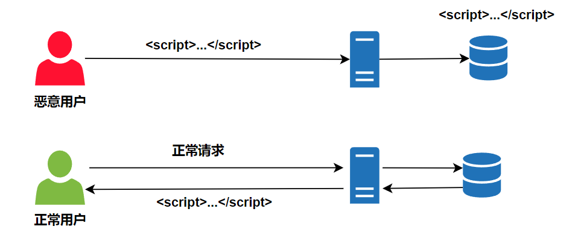

# XSS攻击

## 什么是XSS

XSS（Cross Site Scripting，**跨站脚本攻击**），是指攻击者利用站点的漏洞，在表单提交时，在表单内容中加入一些恶意脚本，当其他用户正常浏览器页面时，而页面中刚好出现攻击者的恶意脚本时，脚本被执行，从而使得页面遭到破坏，或者用户信息被窃取

这种被恶意用户编辑了一段脚本或者标签，服务器不做处理就存储的话，其他正常获取可能就会把渲染成真标签或者执行脚本，从而破坏页面

## 防御方式

服务器端对用户提交的内容进行过滤或编码

- 过滤：去掉一些危险的标签，去掉一些危险的属性
- 编码：对危险的标签进行 HTML 实体编码

