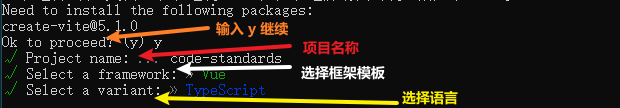

# 前端项目代码规范（一）

## 什么是前端项目代码规范

1. 是一组定义了代码编写风格的指南和规则
2. 这些规范可以保护一个项目代码的一致性、可读性和可维护性

## 为什么需要前端项目代码规范

1. **一致性**：如历史上的书同文、车同轨，看似简单的6个字却是中华文化得以源远流长、生生不息的本质，设想如果全国各地仅仅只有方言的话，那交流的限制将会无限的增长，而一个字如果有几十上百种写法，文明真的可以流传吗？管中窥豹，一个项目代码的风格和结构的一致性是非常重要的
2. **可读性**：当一个多人协作的项目存在统一的风格，在此一直的前提之下，在有一个好的编程规范，如见名知意，那么阅读的难度一定是好过“百花齐放”的，而具备可读性的代码不仅可以让人快读理解代码，也能够降低一些引入错误的风险
3. **可维护性**：一个好的代码规范不仅可以增加可读性，也会增加可维护性，可维护性会让日常工作的交流、代码审查、工作交接、后续需求迭代都会变得事半功倍，同时也可以降低项目中的技术债务

## 使用 vite 搭建 vue3 + ts 项目

> tips：Vite 需要 [Node.js](https://nodejs.org/en/) 版本 18+，20+。然而，有些模板需要依赖更高的 Node 版本才能正常运行，当你的包管理器发出警告时，请注意升级你的 Node 版本。

命令指令：

~~~bash
# npm
$ npm create vite@latest
 
# yarn
$ yarn create vite
 
# pnpm
$ yarn create vite
 
# bunx
$ bunx create-vite 
~~~

执行命令 **npm create vite@latest**，如图：

## 其他补充

> 好的代码规范，如果都是依靠自觉和手动的操作的话，那么这个规范可以维护下去的可能性估计是微乎其微的，所以在此期间我们需要借助一些工具、插件等来帮助我们完成

**eslint + prettier + husky + commitlint**

具体如何搭建，会有新的文章讲解，可以直接点击此分栏进入查看后续
