# 项目搭建规范

## 集成 editorconfig 配置

参考文章：https://www.jianshu.com/p/4392b52b6e21

editorconfig 官网：https://editorconfig.org/

### editorconfig 介绍

> editorconfig 可以为不同的 IDE 编辑器上处理同一个项目时的多个开发人员保持一致的编码风格

1. vscode：安装 editorconfig 插件，如图：

   

2. 创建 `.editorconfig` 自定义文件，.editorconfig 文件可以来配置编辑器的编码格式规范，编辑器的行为会与 .editorconfig 文件中定义的一致，因为 .editorconfig 文件优先级比编辑器本身的高

3. EditorConfig 插件会读取 **.**editorconfig 文件中定义的内容，应用于编辑器

   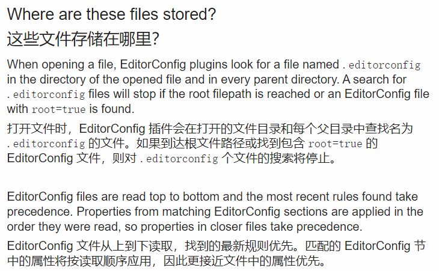

   

4. EditorConfig 主要用于不同的编辑器保持相同的编码风格，比如缩进

### editorconfig 常用文件名匹配

1. EditorConfig 通过以下通配符来匹配特殊文件：

   

### editorconfig 常用属性配置

1. root<boolean>：是否是顶级配置文件，设置为true的时候才会停止搜索.editorconfig文件
2. charset<"latin" | "utf-8" | "utf-8-bom" | "utf-16be" | "utf-16le">：编码格式
3. indent_style<"tab" | "space">：缩进方式
4. indent_size<number>：缩进大小
5. end_of_line<"lf" | "cr" | "crlf">： 换行符类型
6. insert_final_newline<boolean>：是否让文件以空行结束
7. trim_trailing_whitespace<boolean>：是否删除行尾空格
8. max_line_length<number>：最大行宽

### 具体使用

1. 配置代码如下：

   ~~~bash
   # http://editorconfig.org/
   
   root = true
   
   [*] # 表示所有文件适用
   charset = utf-8 # 文件字符串编码
   indent_style = space # 缩进风格
   indent_size = 2 # 缩进大小
   end_of_line = lf # 控制换行符类型
   trim_trailing_whitespace = true # 去除行首的任意空白字符
   insert_final_newline = true # 始终在文件末尾插入一个新行
   
   [*.md] # 表示仅 md 文件适用一下规则
   max_line_length = off # 关闭最大行长度检查
   trim_trailing_whitespace = false # 关闭去除行末多余空格
   ~~~

2. 如需要配置其他文件也是一样的写法

## prettier 工具

> 此工具可以进行代码的格式化，使其自动改为我们需要的格式

### 安装

1. 插件

   

2. 第三方包：`npm install prettier -D`，安装完成之后可以在 node_modules 下的 bin 目录下面找到这个 prettier 的命令行工具

### 配置

1. 创建 .prettierrc 文件，配置如下：

   ~~~json
   {
     "useTabs": false,
     "tabWidth": 2,
     "printWidth":120,
     "singleQuote": true,
     "trailingComma": "none",
     "semi": false
   }
   ~~~

2. 配置详解：

   - useTabs：使用 tab 缩进还是空格缩进
   - tabWidth：tab是空格的情况下，是几个空格，选择两个
   - printWidth：限制每行字符长度最大值，一般80、100、120
   - singleQuote：使用单引号还是双引号，true 表示单引号
   - trailingComma：在多行输入的尾部逗号是否添加，设置为 'none'
   - semi：语句末尾是否添加分号，默认 true，选择 false 表示不加

3. 配置忽略文件，表示那斜文件不用格式化，.prettieringnore 配置如下：

   ~~~
   /dist/*
   /html/*
   .local
   /node_modules/**
   **/*.svg
   **/*.sh
   /public/*

4. 配置脚本命令，package.json 中如下：

   ~~~json
   "prettier" : "prettier --write ."
   ~~~

5. 表示格式化所有除 .prettieringnore 配置文件里面排除的文件之外，都进行格式化

6. 或者针对配置，如下：

   ~~~json
   "prettier" : "prettier --write --loglevel warn src/**/*.{js,ts,json,css,less,scss,vue}"

7. 配置详解：

   - `"prettier --write"`: 这部分指定了运行 Prettier 时的命令。`--write` 选项告诉 Prettier 直接修改文件，而不仅仅是输出格式化后的代码到控制台。这会直接将格式化后的代码写回到源文件中。
   - `"--loglevel warn"`: 这是 Prettier 的一个可选配置，用于设置日志级别。在这里，将日志级别设置为警告 (warn)，表示只输出警告及以上级别的信息。这有助于保持控制台输出的清晰度。
   - `"src/**/*.{js,ts,json,css,less,scss,vue}"`: 这是指定要格式化的文件的匹配模式。在这个例子中，`src` 文件夹下的所有子文件夹中的所有以 `.js`, `.ts`, `.json`, `.css`, `.less`, `.scss`, `.vue` 结尾的文件都会被格式化。

## eslint

参考资料：https://www.bilibili.com/video/BV1Xh411V7b5?p=15

> 代码检查工具，通过和 prettier 配合有着不错的效果
>
> eslint 负责的是语法的问题，而 prettier 负责的则是代码格式化，美观与否
>
> 中文网：https://eslint.cn/
>
> 官网：https://eslint.org/

### 安装

1. 插件

   

2. 安装 eslint

   ~~~bash
   npm install eslint -D
   ~~~

3. 生成配置文件 .eslintrc.cjs

   ~~~bash
   npx eslint --init
   ~~~

4. 安装 eslint 校验插件和解析器

   ~~~bash
   npm install eslint-plugin-vue@latest @typescript-eslint/eslint-plugin@latest @typescript-eslint/parser@latest -D  
   ~~~

5. 安装 vue3 环境代码校验插件：

   - 插件列表：

     ~~~bash
     #让所有与prettier规侧存在冲突的Eslint rules失效，并使用prettieri进行代码检查
     "eslint-config-prettier":"^8.6.0",
     "eslint-plugin-import":"^2.27.5",
     "eslint-plugin-node":"^11.1.0",
     
     #运行更漂亮的Eslint,使prettier规贝则优先级更高，Eslint优先级低
     "eslint-plugin-prettier":"^4.2.1",
     
     #vue.js的Es1int插件（查找vue语法错误，发现错误指令，查找违规风格指南
     "eslint-plugin-vue":"^9.9.0",
     
     #该解析器允许使用Es1int校验所有babel code
     "@babel/eslint-parser":"^7.19.1",
     ~~~

   - 安装指令:

     ~~~bash
     npm install eslint-config-prettier eslint-plugin-import eslint-plugin-node eslint-plugin-prettier eslint-plugin-vue @babel/eslint-parser -D
     ~~~

6. **eslint-config-prettier 和 eslint-plugin-prettier 一般也用于解决 eslint 和 prettier 的冲突问题**

7. 安装补丁，给 eslint 提供更强大的支持

   ~~~bash
   npm install --save-dev @rushstack/eslint-patch
   ~~~

8. 安装语法规则，如果没有安装的话：

   ~~~bash
   npm i @vue/eslint-config-typescript -D
   ~~~

9. 

### .eslintrc.cjs配置文件 和 .eslintignore忽略文件

1. .eslintrc.cjs 具体示例：

   ~~~js
   /* eslint-env node */
   require('@rushstack/eslint-patch/modern-module-resolution')
   
   module.exports = {
     root: true,
     env: {
       // 运行环境-浏览器中
       browser: true,
       // 语法 es2021
       es2021: true,
       node: true,
       jest: true
     },
     /* 指定如何解析语法 */
     parser: 'vue-eslint-parser',
     /** 优先级低于 parse 的语法解析配置 */
     // 指定解析器选项
     parserOptions: {
       ecmaVersion: 'latest', // 校验 ECMA 最新版本
       sourceType: 'module',
       parser: '@typescript-eslint/parser',
       jsxPragma: 'React',
       ecmaFeatures: {
         jsx: true
       }
     },
     extends: [
       // 全部规则默认关闭
       //  - 下面是开启的规则
       'plugin:vue/vue3-essential', // vue3 语法规则
       'eslint:recommended', // 表示开启推荐规则
       '@vue/eslint-config-typescript' // ts 语法规则
     ],
     /*
      * "off" 或 0    ==>  关闭规则
      * "warn" 或 1   ==>  打开的规则作为警告（不影响代码执行）
      * "error" 或 2  ==>  规则作为一个错误（代码不能执行，界面报错）
      */
     rules: {
       // eslint（https://eslint.bootcss.com/docs/rules/）
       'no-var': 'error', // 要求使用 let 或 const 而不是 var
       'no-multiple-empty-lines': ['warn', { max: 1 }], // 不允许多个空行
       'no-console': process.env.NODE_ENV === 'production' ? 'error' : 'off',
       'no-debugger': process.env.NODE_ENV === 'production' ? 'error' : 'off',
       'no-unexpected-multiline': 'error', // 禁止空余的多行
       'no-useless-escape': 'off', // 禁止不必要的转义字符
   
       // typeScript (https://typescript-eslint.io/rules)
       '@typescript-eslint/no-unused-vars': 'error', // 禁止定义未使用的变量
       '@typescript-eslint/prefer-ts-expect-error': 'error', // 禁止使用 @ts-ignore
       '@typescript-eslint/no-explicit-any': 'off', // 禁止使用 any 类型
       '@typescript-eslint/no-non-null-assertion': 'off',
       '@typescript-eslint/no-namespace': 'off', // 禁止使用自定义 TypeScript 模块和命名空间。
       '@typescript-eslint/semi': 'off',
   
       // eslint-plugin-vue (https://eslint.vuejs.org/rules/)
       'vue/multi-word-component-names': 'off', // 要求组件名称始终为 “-” 链接的单词
       'vue/script-setup-uses-vars': 'error', // 防止<script setup>使用的变量<template>被标记为未使用
       'vue/no-mutating-props': 'off', // 不允许组件 prop 的改变
       'vue/attribute-hyphenation': 'off' // 对模板中的自定义组件强制执行属性命名样式
     }
   }
   ~~~

2. .eslintignore 忽略文件：

   ~~~
   dist
   node_modules
   public

### 新增运行脚本

1. 在 package.json 中新增脚本：

   ~~~json
   "scripts": {
       "eslint": "eslint src",
       "fix": "eslint src --fix"
   }
   ~~~

2. 脚本解析：

   - **eslint src**: 校验 src 文件下的文件语法
   - **eslint src --fix**: 纠正 src 下的不符合规则的语法

### 测试

1. 在 main.ts 文件中输入 var a = 100，代码如下：

   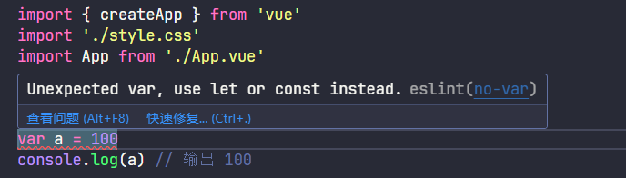

2. 运行 `npm run eslint`，看看是否会触发 eslint 规则检测，如图：

   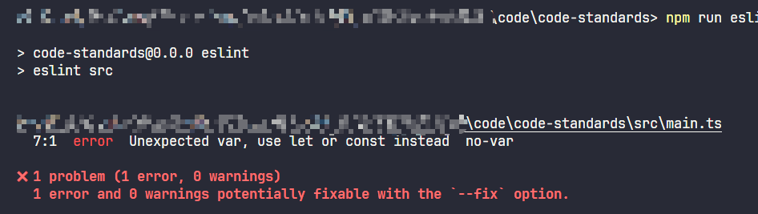

3. 成功触发错误，在运行 `npm run fix`，看看能否修复错误，如图：

   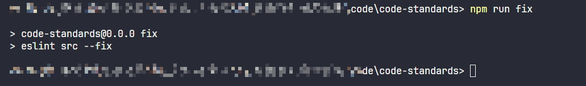

4. 运行完成，没有发现错误，改动的代码如下：

   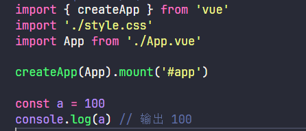

## git husky 和 lint-staged

参考文章：https://zhuanlan.zhihu.com/p/626127959

> Husky 是一个 Git Hook 工具，可以帮助我们在 Git 事件发生时自动运行脚本。Git Hook 是一种机制，它允许在 Git 执行操作时自动运行特定脚本，以执行自定义操作。
>
> 
>
> lint-staged 是一个工具，可以在 Git 暂存区的文件上运行指定的 lint 工具，以便于仅在需要时执行 lint 检查。它通常与 Husky 配合使用，以在提交代码前运行 lint-staged。使用 lint-staged 可以大大提高 lint 检查的效率，因为只需要针对本次提交的文件执行 lint 检查，而不是所有的文件。
>

### 为什么需要 husky 和配置

1. 虽然已经要求项目使用 prettier + eslint 了，但是不能保证在多人协作开发时，在每个人员提交代码之前都进行了格式化

   - 即我们希望保证代码仓库中的代码都是符合 prettier 和 eslint 规范的
   - 那么我们就需要在所有人员执行 `git commit` 命令的时候对齐进行校验，如果不符合规范，那么自动进行格式化

2. 那么如何做到这一点呢？可以通过 husky 工具

   - husky 是一个 git hook 工具，hook也就是回调，即在特定的时机执行这些回调的钩子函数，可以帮助我们触发 git 提交的各个阶段： pre-commit commit-msg pre-push
   - pre-commit：即执行 git commit 时
   - commit-msg：即提交时的信息作出检查，检查信息是否符合规范，比如 git commit -m "xxx"
   - pre-push：推送到远程仓库时之前，git push

3. husky v9 版本和之前有了一些区别，具体可以查阅文档：https://github.com/typicode/husky/releases/tag/v9.0.1

4. 安装 **husky**，执行命令：

   ~~~bash
   npm install husky -D
   ~~~

5. 还需要在根目录下创建一个 .husky 文件夹，在这个文件夹下会有一个 pre-commit 文件。这个文件里面的命令在我们执行 commit 的时候就会执行，类似 vue 生命周期的钩子函数，当然不需要我们手动创建，执行命令即可，命令如下：

   ~~~bash
   # 以往版本
   npx husky-init
   
   # v9 版本
   npx husky init
   ~~~

6. 根据之前的实现逻辑就是要在 git commit 之前就做一次检测，检测代码规范和格式是否正确，我们之前已经配置过了 npm run prettier 格式化代码和 npm run fix 修复不符合规范的代码，所以只需要在 commit 之前运行这两个命令即可

7. **tip：**husky 会默认增加一个脚本命令，如下：

   ~~~json
   "prepare": "husky"
   ~~~

8. 所以如果需要添加新钩子函数，可以执行命令，v9 如下

   ~~~bash
   echo "npm test" > .husky/pre-commit
   ~~~

9. "npm test" 表示增加的命令，.husky/pre-commit 表示在 .husky 文件夹下增加/pre-commit 的钩子，结果如图：

   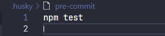

### 测试-单独使用 husky

1. 现在更换为需要的命令即可，如下：

   ~~~
   npm run prettier
   npm run fix 
   ~~~

2. 如果在运行 fix 的时候，遇到没有修复的 eslint 代码则会导致本次 git commit 提交失败，并提示那些操作失败，去让你进行修复

3. 测试代码如下：

   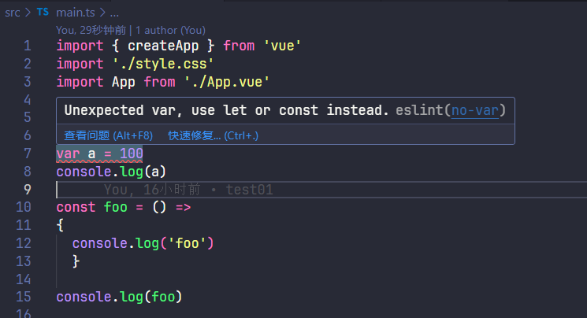

4. 关于 git 的操作这里不做赘述，直接运行 commit 操作，看看效果，控制台打印，如图：

   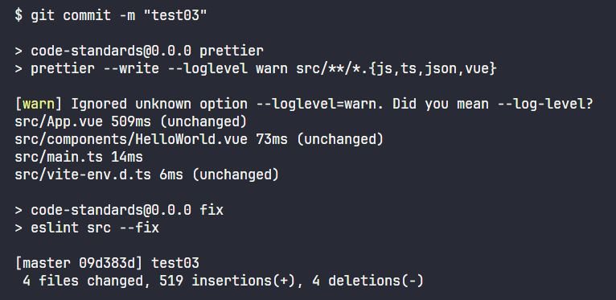

5. 是可以看到先后运行了我们配置  prettier 和 fix 脚本，查看修复后的代码，如图：

   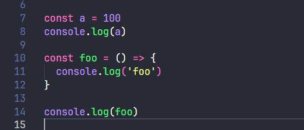

6. 此时就已经符合我们定义的规范了，当然，我们的文件经过修改之后自然也需要重新提交，git status 查看文件状态，如图：

   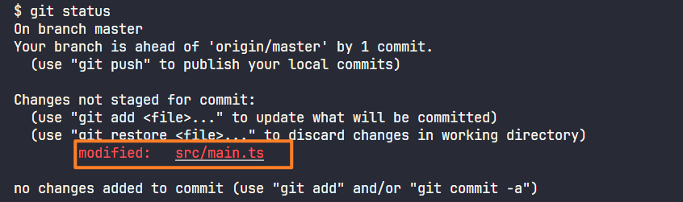

7. 再次重复 `git add . ` 和 `git commit xxxx` 最后推送即可，如果怕忘记再次提交，可以进行错误级别的输出，知道所有错误修改完成，才会完成真正的 commit，保证强约束，我这里使用的就是警告级别了，结果如图：

   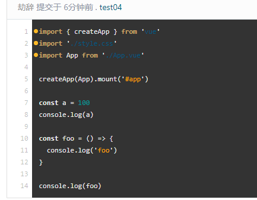

8. 此时在远程仓库中的代码就是符合规范的

9. 当然此时是还没用上 **lint-staged**，这个等会再后面补充

### husky + lint-staged

1. 为什么有了 husky 还需要 lint=staged 呢？

   1. 因为使用 `husky` 后，`ESLint`会在项目中的每个文件上都运行，这是个非常糟糕的主意。因为在未更改的代码上运行`ESLint`可能会导致出乎预料的错误
   2. 对于大型项目，在每个文件上运行`ESLint`可能会消耗大量的时间。同样，在旧项目中消耗时间解决`ESLint`抛出的问题而不是研发新功能，是没意义的事

2. 而如果仅仅只需要在我们修改的代码上进行这些操作，我们就需要使用 lint-staged，这一点，在文档中也有对应的秒数，如下：

   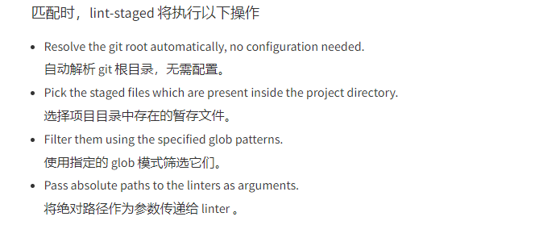

3. 安装 lint-staged，命令如下：

   ~~~bash
   npm run lint-staged -D
   ~~~

4. package.json 中配置脚本，如下：

   ~~~json
   "script": {
       "lint:lint-staged": "lint-staged"
   }
   ~~~

5. **新增 `lint-staged.config.mjs` 文件**，至于具体是 mjs 还是 cjs 取决于项目的package.json是否包含 `"type": "module"` 选项，内容如下：

   ~~~js
   export default {
     '*.{js,jsx,ts,tsx}': ['eslint --fix', 'prettier --write'],
     '*.vue': ['eslint --fix', 'prettier --write']
   }
   ~~~

6. 可以根据不同的文件设置不同的配置执行，当然还有更多的其他用法，可以查看[lint-staged](https://www.npmjs.com/package/lint-staged)的文档

### Tips

1. git 的初始化需要提交完成，并和远程仓库建立一次链接
2. 如果遇到错误 .husky/pre-commit: .husky/pre-commit: cannot execute binary file 可能需要把这个 husky 和 刚刚完成初始化的 init 文件删除，重新创建
3. 如果完成了运行 git commit 执行了修复命令，导致文件改动，需要重新执行 `git add .` 然后在执行 `git commit -m "xxx"`

## commitlint

参考资料：https://commitlint.js.org/#/guides-local-setup?id=install-commitlint

参考资料：https://www.bilibili.com/video/BV1Xh411V7b5?p=19&vd_source=973ddc598c46b0814ea7387827348ee1

### 为什么需要 commitlint

1. 在前面的提交中，提交的信息都是 test01 这种自定义的，这种没有规范的写法也会降低可读性，所以我们可以对这个 commit-msg 也来进行规范的约束，这个属于一种 git 的规范

2. 比如新增了一些代码我们一般会以 feat 开头，然后跟上英文冒号在加空格，如：

   ~~~bash
   git commit -m "feat: 新增了一些代码"
   ~~~

3. 而如果手动来写这些信息，一个容易出错，二个是就算没有这样写前缀，也能提交成功，所以我们需要使用 commitlint 约束

4. 前缀类型：

   - feat：新特性、新功能
   - fix：修复bug
   - docs：文档修改
   - style：代码格式修改，而非 css 修改
   - refactor：代码重构
   - perf：优化相关
   - test：测试用力修改
   - chore：其他修改，例如改变构建流程、或者增加依赖库、工具等
   - revert：回滚到上一个版本
   - build：编译相关的修改，例如发布版本、对项目构建或者依赖的改动

5. 也可也查看[社区规范文档](https://www.conventionalcommits.org/zh-hans/v1.0.0/)

### 简单配置

1. 安装提示，如图：

   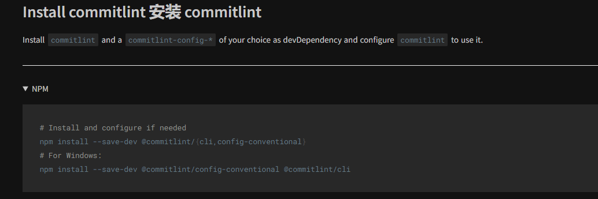

2. 安装包：

   ~~~bash
   npm install @commitlint/cli @commitlint/config-conventional -D
   ~~~

3. 创建配置文件，**.commitlintrc.cjs**，内容如下：

   ~~~js
   module.exports = {
     // 引入一些常规配置
     extends: ['@commitlint/config-conventional'],
     // 校验规则
     rules: {
       'type-enum': [
         2,
         'always',
         ['feat', 'fix', 'docs', 'style', 'refactor', 'perf', 'test', 'chore', 'revert', 'build']
       ],
       'type-case': [0],
       'type-empty': [0],
       'scope-empty': [0],
       'scope-case': [0],
       'subject-full-stop': [0, 'never'],
       'subject-case': [0, 'never'],
       'header-max-length': [0, 'always', 72]
     }
   }
   ~~~

4. 具体配置可以参考[配置文档](https://commitlint.js.org/#/reference-configuration)

5. 配置脚本，如下：

   ~~~json
   {
       "scripts": {
           "commitlint": "commitlint --config .commitlintrc.js -e -V"
       }
   }
   ~~~

6. 在 husky 下的 commit-msg 文件下，输入脚本，如下：

   ~~~
   npm run commitlint
   ~~~

### 测试-简单配置

1. 此时我们来看一下测试的代码，在 src/utils/index.ts 下增加代码，如下：

   ~~~js
   // 相乘
   export function multiply(n1: number, n2: number): number {
     return n1 * n2
   }
   ~~~

2. 试试简单的提交信息，如图：

   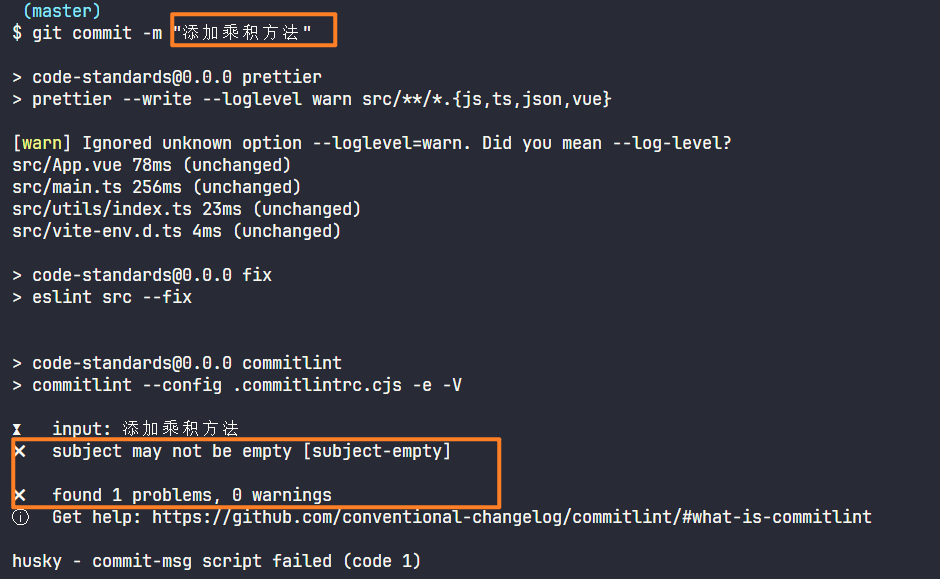

3. 换成配置好的格式，如图：

   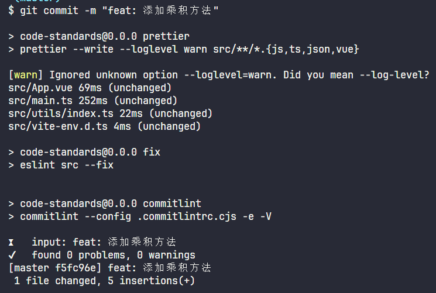

4. 远程仓库推送的结果，如图：

   

### 配置交互式窗口

> 此操作和原来的配置的 commitlint 操作测试中是互斥的，我没有进行太多的实验，所以我把 commit-msg 下的执行脚本的命令清空了
>
> 文档地址：https://commitlint.js.org/#/guides-use-prompt?id=provide-a-shortcut

1. 安装插件

   ~~~bash
   npm install @commitlint/prompt-cli -D

2. 配置脚本命令

   ~~~json
   {
       "script": {
           "commit": "commit"
       }
   }
   ~~~

3. 执行 git add . 在执行 npm run commit 

4. 结果如图：

   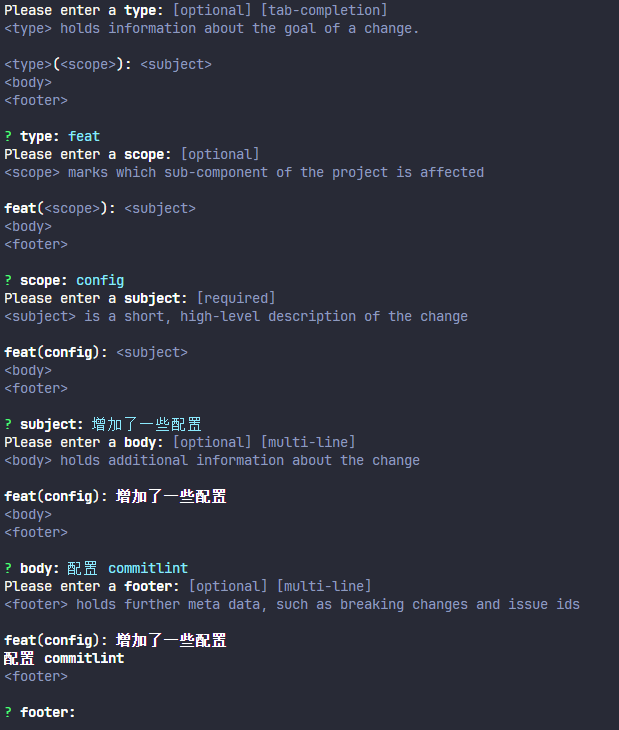

5. 最终上传到仓库的结果如图：

   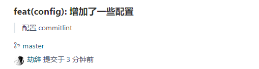

6. 具体对应的部分根据提交的信息对比一下即可，当然还有其他配置方式，比如增加提示和描述，可以自行尝试

